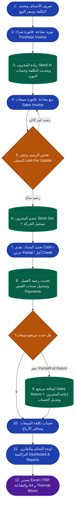

# نظرة عامة على المشروع (Project Overview)

وثيقة تعريفية شاملة لنظام إدارة الفواتير والمخزون والمبيعات، توضح الأهداف، التقنيات المستخدمة، الهيكل المعماري، والمستخدم المستهدف.

---

## 1. نبذة عن المشروع وهدفه

**نظام إدارة الفواتير والمخزون والمبيعات** هو تطبيق ويب متكامل، سريع، وسهل الاستخدام، صُمم كمنتج قابل للتطبيق بالحد الأدنى (**MVP**) عملي وقابل للتوسع والنمو، وليس نظام تخطيط موارد مؤسسات ضخم ومعقد (**ERP**).

يهدف النظام إلى حل المشاكل اليومية لإدارة الأنشطة التجارية الصغيرة والمتوسطة عبر توفير:
* إدارة دقيقة للأصناف وتكاليفها وأسعار بيعها ورصيدها المخزني.
* إدارة فواتير الشراء والتعامل مع الموردين ومتابعة حساباتهم.
* إدارة فواتير البيع الفورية والآجلة والتعامل مع العملاء ومتابعة ديونهم ومدفوعاتهم.
* تتبع حركات المخزون بدقة تامة ومنع البيع السالب أو تعارض البيانات أثناء التزامن.
* حساب الأرباح الحقيقية بالاعتماد على التكلفة الفعلية أو متوسط التكلفة المرجح.
* إصدار تقارير تفصيلية مع إمكانية التصدير والطباعة بقياسين (A4 و Thermal 80mm).
* واجهة سريعة الاستجابة تعمل بسلاسة على أجهزة سطح المكتب والموبايل كـ PWA.

---

## 2. جدول حزمة التقنيات (Tech Stack Summary)

تم اختيار الـ Tech Stack بعناية لتقديم تجربة مستخدم سريعة وفائقة التفاعلية مع الحفاظ على بساطة الـ Monolith وتجنب تعقيدات الـ API المستقل أو أطر عمل JavaScript الثقيلة.

| التقنية / الأداة | الإصدار / الدور | الغرض والاستخدام في المشروع |
| :--- | :--- | :--- |
| **PHP / Laravel** | Laravel 11.x / 12.x | إطار العمل الأساسي للـ Backend، معالجة الـ Business Logic، والتعامل مع قاعدة البيانات |
| **Laravel Livewire** | Livewire 4.x | بناء واجهات تفاعلية ديناميكية بالكامل بدون كتابة JavaScript منفصل (Single-page feel) |
| **Blade** | Laravel Engine | القوالب وهيكلة صفحات HTML والـ Layouts |
| **Alpine.js** | الإصدار المدمج مع Livewire | التفاعلات الخفيفة جدًا على مستوى المتصفح (فتح وإغلاق القوائم، الـ Modals، التبديل) |
| **Tailwind CSS** | الإصدار الأحدث | بناء وتنسيق الواجهات بأنماط Utility-first مع دعم الوضع الليلي و RTL |
| **Flowbite Admin** | Flowbite UI Components | مكونات الواجهة الجاهزة (الجداول، النماذج، البطاقات، الأزرار، التنبيهات) |
| **MySQL** | 8.x+ | قاعدة البيانات العلائقية، مع دعم المعاملات (Transactions) والقفل السطري (Row Locking) |
| **Laravel Breeze** | Authentication Scaffolding | إدارة تسجيل الدخول، وتأمين الجلسات وتغيير كلمات المرور |
| **Spatie Permission** | spatie/laravel-permission | إدارة الأدوار (Roles) والصلاحيات الدقيقة (Permissions) للمستخدمين |
| **PWA** | Service Worker + Manifest | إمكانية تثبيت النظام على أجهزة Android والـ Desktop وتشغيله كتطبيق مستقل |
| **Print CSS** | مخصص (A4 & Thermal 80mm) | تنسيق وطباعة الفواتير والإيصالات والتقارير بدقة متناهية |
| **Export Tools** | Excel & PDF Generators | تصدير التقارير المالية والمخزنية بصيغ PDF و XLSX |

### ما لا يتضمنه المشروع (Exclusions):
* لا يوجد **Vue.js** أو **React**.
* لا يوجد **Frontend منفصل** (No Decoupled SPA).
* لا توجد **طبقة API Layer منفصلة** غير ضرورية، فالاعتماد كلي على قوة وتكامل Livewire 4 مع Blade.

---

## 3. المخطط المعماري العام (Monolith Architecture)

يعتمد النظام على نمط **Laravel Monolithic Architecture** متماسك، يجمع بين واجهة المستخدم والمنطق البرمجي وقاعدة البيانات في بيئة عمل واحدة موحدة:

```text
+-----------------------------------------------------------------------------------+
|                                 Client Browser / PWA                              |
|          (Desktop, Tablet, Mobile - Android Installable - Dark / Light / RTL)     |
+-----------------------------------------------------------------------------------+
                                         │
                                         │ HTTP / Livewire 4 Fetch Requests
                                         ▼
+-----------------------------------------------------------------------------------+
|                                Laravel Monolith App                               |
|                                                                                   |
|  [ Presentation Layer ]                                                           |
|  ├── Blade Layouts (App, Guest, Print A4, Print Thermal 80mm)                     |
|  ├── Livewire 4 Components (InvoiceForm, ItemSearch, StockAlert, etc.)             |
|  ├── Alpine.js Micro-interactions                                                 |
|  └── Tailwind CSS + Flowbite UI Components                                        |
|                                                                                   |
|  [ Security & Middleware ]                                                        |
|  ├── Authentication (Laravel Breeze)                                              |
|  └── Authorization & Roles (Spatie Laravel Permission)                            |
|                                                                                   |
|  [ Application & Business Logic Services ]                                        |
|  ├── InvoiceService (Sales Creation, Locking, Stock Out, Calculations)            |
|  ├── PurchaseService (Stock In, Supplier Balance, Cost Updating)                  |
|  ├── StockService (Movements, Adjustments, Valuations, Low Stock Alerts)          |
|  ├── PaymentService (Cash/Partial Collections, Customer/Supplier Ledgers)         |
|  ├── ReturnService (Sales/Purchase Returns, Partial Returns)                      |
|  ├── ProfitService (Cost of Goods Sold, Profit Margins, Periodic Analysis)        |
|  └── AuditLogService (Tracking Critical User Operations)                          |
|                                                                                   |
|  [ Data Access Layer (Eloquent Models) ]                                          |
|  ├── Item, Customer, Supplier, Invoice, InvoiceItem, Purchase, PurchaseItem       |
|  └── StockMovement, Payment, ReturnDocument, AuditLog, User                       |
+-----------------------------------------------------------------------------------+
                                         │
                                         │ PDO / Transactions & lockForUpdate()
                                         ▼
+-----------------------------------------------------------------------------------+
|                                 MySQL Database                                    |
|   ├── Strict Constraints & Foreign Keys                                           |
|   ├── DECIMAL(12,3) Precision for all Financials & Quantities                     |
|   └── Indexed Searches & Full Audit Trails                                        |
+-----------------------------------------------------------------------------------+
```

---

## 4. مسار العمل الأساسي للنظام (Core System Workflow)

يوضح المخطط التالي تدفق العمليات من مرحلة تعريف الأصناف وحتى استخراج الأرباح والتقارير:



---

## 5. المستخدم المستهدف (Target Audience)

صُمم هذا النظام خصيصًا لتلبية احتياجات:

1. **أصحاب المحلات والأنشطة التجارية الصغيرة والمتوسطة:**
   * محلات التجزئة والجملة، محلات قطع الغيار، معارض الأدوات الكهربائية والمنزلية، محلات الملابس والمواد الغذائية والمستلزمات.
2. **التجار الذين يحتاجون إلى سرعة في الكاشير وإصدار الفواتير:**
   * تجار يتعاملون مع فواتير فورية ونقدية وآجلة، ويبحثون عن إدخال سريع للفاتورة بأقل عدد نقرات ممكن ومن خلال الكيبورد أو قارئ الباركود.
3. **أصحاب الأنشطة التجارية ذات الحركة السريعة للديون والتحصيل:**
   * من يحتاجون إلى متابعة دقيقة لحسابات العملاء، الفواتير الآجلة، مبالغ التحصيل اليومية، وتنبيهات الديون المتأخرة.
4. **المستخدم الذي يحتاج للعمل عبر أجهزة متعددة:**
   * إدارة المحل عبر جهاز الكمبيوتر أو التابلت، ومتابعة النشاط أو إنشاء الفواتير أثناء التنقل عبر الهاتف الذكي (Mobile PWA).
