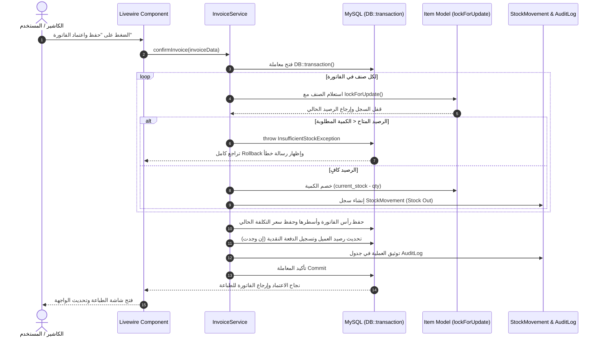

# بنية المعالجة الخلفية (Backend Architecture)

توثيق تفصيلي ومعماري للبنية البرمجية الخلفية لنظام إدارة الفواتير والمخزون، يوضح النماذج، الطبقات البرمجية المقترحة، مسار المعاملات المصرفية والمخزنية، وإدارة الأقفال والحركات.

---

## 1. نظرة عامة على البنية البرمجية (Layered Architecture Pattern)

يعتمد التطبيق على هيكل **Service-Action Layer Pattern** داخل إطار عمل Laravel Monolith. يهدف هذا النمط إلى عزل منطق الأعمال المعقد (Business Logic) وحسابات المخزون والعمليات المالية عن متحكمات الواجهة ومكونات Livewire، مما يضمن قابلية الاختبار العالية وإعادة استخدام الكود بسهولة.

```text
┌─────────────────────────────────────────────────────────────┐
│                 Livewire 4 Components                       │
│    (Handles UI State, Form Binding, Validation, Events)     │
└──────────────────────────────┬──────────────────────────────┘
                               │ Calls methods
                               ▼
┌─────────────────────────────────────────────────────────────┐
│                 Dedicated Service Classes                   │
│   (Business Logic, Transactions, Locking, Calculations)    │
│  ├── InvoiceService         ├── StockService                │
│  ├── PurchaseService        ├── PaymentService              │
│  ├── CustomerBalanceService ├── ProfitService               │
│  └── AuditLogService                                        │
└──────────────────────────────┬──────────────────────────────┘
                               │ Interacts with
                               ▼
┌─────────────────────────────────────────────────────────────┐
│                 Eloquent Models & DB Layer                  │
│    (Scopes, Relationships, Mutators, Events, Decimal casts) │
└──────────────────────────────┬──────────────────────────────┘
                               │ Executes queries
                               ▼
┌─────────────────────────────────────────────────────────────┐
│                    MySQL Database Engine                    │
│      (Foreign Keys, Strict Constraints, DECIMAL 12,3)       │
└─────────────────────────────────────────────────────────────┘
```

---

## 2. النماذج والكيانات الأساسية (Core Eloquent Models)

| الموديل (Model) | الجداول المرتبطة | المسؤولية والعلاقات |
| :--- | :--- | :--- |
| `Item` | `items` | يمثل بيانات الصنف، سعري التكلفة والبيع، الرصيد، وله علاقات مع `InvoiceItem`, `PurchaseItem`, `StockMovement`. |
| `Customer` | `customers` | بيانات العميل الأساسية، وله علاقات مع `Invoice`, `Payment`, `ReturnDocument`. |
| `Supplier` | `suppliers` | بيانات المورد الأساسية، وله علاقات مع `Purchase`, `Payment`. |
| `Invoice` | `invoices` | رأس فاتورة البيع (الحالة، الإجماليات، الخصم، المدفوع، المتبقي)، وله علاقات مع `InvoiceItem`, `Payment`, `ReturnDocument`, `StockMovement`. |
| `InvoiceItem` | `invoice_items` | أسطر الأصناف داخل فاتورة البيع (الكمية، سعر التكلفة المحفوظ، سعر البيع، الخصم، الإجمالي). |
| `Purchase` | `purchases` | رأس فاتورة الشراء والتوريد، وله علاقات مع `PurchaseItem`, `StockMovement`. |
| `PurchaseItem` | `purchase_items` | أسطر فواتير الشراء وأسعار التكلفة الموردة والكميات. |
| `StockMovement` | `stock_movements` | السجل الموحد لكافة حركات الدخول والخروج المخزنية مع توثيق المصدر والتكلفة. |
| `StockDeposit` | `stock_deposits` | عمليات الإيداع والتسوية المخزنية المباشرة والافتتاحية. |
| `Payment` | `payments` | سندات القبض والدفع المالية المجزأة والكاملة المرتبطة بالفواتير والعملاء والموردين. |
| `ReturnDocument` | `returns`, `return_items` | مستندات مرتجعات المبيعات والمرتجعات الجزئية. |
| `AuditLog` | `audit_logs` | سجل تتبع وتدقيق العمليات والتعديلات الحساسة في النظام. |

---

## 3. تنظيم طبقة الخدمات (Proposed Service Classes)

يتم تقسيم منطق الأعمال إلى الفئات الخدمية (Services) التالية، بحيث تنفرد كل خدمة بمسؤولية محددة (Single Responsibility Principle):

### 3.1 `InvoiceService`
* إنشاء وحفظ مسودات فواتير البيع.
* احتساب الإجماليات، والخصومات المزدوجة (على مستوى السطر والفاتورة)، وصافي الفاتورة.
* اعتماد الفاتورة النهائي داخل `DB::transaction()` وتفعيل القفل السطري `lockForUpdate()`.
* إلغاء الفاتورة وعكس تأثيرها المخزني والمالي.

### 3.2 `PurchaseService`
* إنشاء واعتماد فواتير الشراء من الموردين.
* زيادة أرصدة المخزون (Stock In) عبر استدعاء `StockService`.
* تحديث تكلفة الأصناف وتطبيق معادلة متوسط التكلفة المرجح (Weighted Average Cost).
* قيد المبالغ المستحقة على حساب المورد وتسجيل المدفوعات الفورية للمشتريات.

### 3.3 `StockService`
* فحص رصيد الصنف المتاح وحجزه.
* تنفيذ عمليات الصرف المخزني (Stock Out) والإيداع المخزني (Stock In).
* إنشاء وتدوين قيود جدول `stock_movements` بدقة تامة.
* معالجة التسويات المخزنية (Stock Adjustments) والأرصدة الافتتاحية.
* رصد الأصناف التي وصلت للحد الأدنى (Low Stock Level).

### 3.4 `PaymentService`
* تسجيل سندات القبض والدفعات الموجهة لفاتورة بيع معينة.
* تسجيل سندات الصرف وسداد فواتير المشتريات للموردين.
* تحديث المبالغ المدفوعة والمتبقية في رأس الفاتورة وتعديل حالتها (`Paid`, `Partially Paid`, `Unpaid`).

### 3.5 `CustomerBalanceService`
* إعادة احتساب وتحديث الرصيد التراكمي للعميل (`current_balance`).
* استخراج بيانات كشف الحساب (Statement of Account) بتسلسل زمني دقيق يشمل الفواتير والسندات والمرتجعات.
* تصنيف الفواتير الآجلة وتحديد المتأخرات والديون المستحقة.

### 3.6 `ProfitService`
* احتساب تكلفة البضاعة المباعة (COGS) لكل فاتورة بيع بناءً على تكلفة بنودها المسجلة وقت البيع.
* احتساب صافي الأرباح، وهامش الربح للفاتورة، وللصنف، وللعميل، ولفترات زمنية مخصصة.

### 3.7 `AuditLogService`
* التقاط وتسجيل الأحداث الحساسة، مع تسجيل بيانات المستخدم، ونوع العملية، والبيانات قبل وبعد التعديل.

---

## 4. مسار اعتماد الفاتورة البرمجي (Invoice Confirmation Workflow & Pseudocode)

يمثل اعتماد الفاتورة العملية الأكثر حساسية في النظام، حيث تتقاطع معالجة المخزون، الحسابات المالية، والتدقيق الرقابي. لذلك يتم تنفيذها داخل معاملة برمجية صارمة مدعومة بالقفل السطري.

### 4.1 خطوات سير المعاملة (Step-by-Step Flow)



### 4.2 كود توضيحي للمعالجة البرمجية (PHP / Laravel Pseudocode)

```php
namespace App\Services;

use App\Models\Invoice;
use App\Models\Item;
use App\Models\StockMovement;
use App\Models\Payment;
use App\Models\AuditLog;
use Illuminate\Support\Facades\DB;
use Illuminate\Support\Facades\Auth;
use Exception;

class InvoiceService
{
    /**
     * اعتماد فاتورة المبيعات مع حماية التزامن وحركات المخزون
     */
    public function confirmInvoice(array $data): Invoice
    {
        return DB::transaction(function () use ($data) {
            $totalCostAmount = '0.000';
            $subtotal = '0.000';

            // 1. إنشاء رأس الفاتورة بحالة مسودة مؤقتة
            $invoice = Invoice::create([
                'invoice_number' => $this->generateUniqueInvoiceNumber(),
                'customer_id'    => $data['customer_id'],
                'user_id'        => Auth::id(),
                'invoice_date'   => $data['invoice_date'] ?? now(),
                'payment_type'   => $data['payment_type'], // cash, credit, partial
                'status'         => 'confirmed',
                'subtotal'       => '0.000',
                'discount_type'  => $data['discount_type'] ?? 'fixed',
                'discount_value' => $data['discount_value'] ?? '0.000',
                'discount_amount'=> '0.000',
                'net_total'      => '0.000',
                'paid_amount'    => '0.000',
                'remaining_amount'=> '0.000',
                'total_cost'     => '0.000',
            ]);

            // 2. معالجة بنود الفاتورة مع القفل السطري الصارم
            foreach ($data['items'] as $line) {
                // قفل صف الصنف لمنع أي تعديل متزامن من جلسة أخرى
                $item = Item::where('id', $line['item_id'])->lockForUpdate()->firstOrFail();

                // التحقق من توفر الرصيد الكافي
                if (bccomp($item->current_stock, $line['quantity'], 3) < 0) {
                    throw new Exception("رصيد الصنف [{$item->name}] غير كافٍ. المتوفر: {$item->current_stock}");
                }

                $quantity     = $line['quantity'];
                $unitPrice    = $line['unit_price'];
                $costPrice    = $item->cost_price; // تثبيت سعر التكلفة الحالي وقت البيع
                $lineDiscount = $line['discount_amount'] ?? '0.000';
                $lineTotal    = bcsub(bcmul($quantity, $unitPrice, 3), $lineDiscount, 3);

                // حفظ سطر الفاتورة
                $invoice->items()->create([
                    'item_id'         => $item->id,
                    'quantity'        => $quantity,
                    'cost_price'      => $costPrice,
                    'unit_price'      => $unitPrice,
                    'discount_amount' => $lineDiscount,
                    'total_price'     => $lineTotal,
                ]);

                // تحديث رصيد الصنف بالمخزن
                $stockBefore = $item->current_stock;
                $stockAfter  = bcsub($stockBefore, $quantity, 3);
                $item->current_stock = $stockAfter;
                $item->save();

                // تسجيل حركة المخزون
                StockMovement::create([
                    'item_id'          => $item->id,
                    'movement_type'    => 'sales_out',
                    'quantity'         => $quantity,
                    'stock_before'     => $stockBefore,
                    'stock_after'      => $stockAfter,
                    'unit_cost'        => $costPrice,
                    'source_type'      => Invoice::class,
                    'source_id'        => $invoice->id,
                    'document_number'  => $invoice->invoice_number,
                    'user_id'          => Auth::id(),
                    'notes'            => "صرف مبيعات للفاتورة رقم {$invoice->invoice_number}",
                ]);

                // تجميع الإجماليات والتكاليف
                $subtotal = bcadd($subtotal, $lineTotal, 3);
                $lineCost = bcmul($quantity, $costPrice, 3);
                $totalCostAmount = bcadd($totalCostAmount, $lineCost, 3);
            }

            // 3. احتساب خصم الفاتورة والصافي النهائي
            $invoiceDiscount = $this->calculateInvoiceDiscount($subtotal, $data['discount_type'] ?? 'fixed', $data['discount_value'] ?? '0.000');
            $netTotal = bcsub($subtotal, $invoiceDiscount, 3);

            // 4. معالجة المدفوعات والمتبقي
            $paidAmount = $data['paid_amount'] ?? '0.000';
            if ($data['payment_type'] === 'cash') {
                $paidAmount = $netTotal;
            }
            $remainingAmount = bcsub($netTotal, $paidAmount, 3);

            $invoice->update([
                'subtotal'        => $subtotal,
                'discount_amount' => $invoiceDiscount,
                'net_total'       => $netTotal,
                'paid_amount'     => $paidAmount,
                'remaining_amount'=> $remainingAmount,
                'total_cost'      => $totalCostAmount,
                'payment_status'  => $this->resolvePaymentStatus($netTotal, $paidAmount),
            ]);

            // 5. تسجيل سند القبض المالي إن وجد مدفوع
            if (bccomp($paidAmount, '0.000', 3) > 0) {
                Payment::create([
                    'customer_id'    => $invoice->customer_id,
                    'invoice_id'     => $invoice->id,
                    'amount'         => $paidAmount,
                    'payment_date'   => now(),
                    'payment_method' => $data['payment_method'] ?? 'cash',
                    'user_id'        => Auth::id(),
                    'notes'          => "تحصيل دفعة مبيعات للفاتورة رقم {$invoice->invoice_number}",
                ]);
            }

            // 6. تحديث رصيد العميل التراكمي
            app(CustomerBalanceService::class)->updateBalance($invoice->customer_id);

            // 7. توثيق العملية في سجل الرقابة
            app(AuditLogService::class)->log(
                action: 'invoice_confirmed',
                auditable: $invoice,
                oldValues: null,
                newValues: $invoice->toArray()
            );

            return $invoice;
        });
    }

    private function resolvePaymentStatus(string $netTotal, string $paidAmount): string
    {
        if (bccomp($paidAmount, '0.000', 3) <= 0) {
            return 'unpaid';
        }
        if (bccomp($paidAmount, $netTotal, 3) >= 0) {
            return 'paid';
        }
        return 'partially_paid';
    }
}
```

---

## 5. منطق إلغاء الفاتورة والتعامل مع المرتجعات (Invoice Cancellation & Returns)

### 5.1 إلغاء الفاتورة بالكامل (Full Cancellation)
1. **تغيير الحالة:** تعديل حالة الفاتورة من `confirmed` إلى `cancelled`.
2. **عكس المخزون (Stock Reversal):** استرجاع الأصناف المحجوزة بقفل سطري، وإضافة الكميات مجددًا لرصيد الصنف، وإنشاء سجل `StockMovement` بنوع `cancellation_in`.
3. **عكس الأثر المالي:** خصم المبالغ من مبيعات العميل وإعادة احتساب رصيده عبر `CustomerBalanceService`.
4. **المدفوعات:** تسجيل قيد تسوية للمبالغ المحصلة إن وجدت وفق اللوائح الإدارية للمتجر.
5. **التوثيق:** تسجيل عملية الإلغاء مع سبب الإلغاء واسم المستخدم في `audit_logs` دون حذف سجل الفاتورة.

### 5.2 المرتجع الجزئي والكامل (Partial & Full Returns)
* لا يتم إلغاء الفاتورة الأصلية عند إرجاع صنف واحد، بل يتم إنشاء مستند `ReturnDocument` منفصل يرتبط بالفاتورة الأصلية.
* يتم تسجيل الصنف المعين والكمية المرتجعة وسعر البيع الذي تم إرجاعه به.
* تُعاد كمية الصنف المرتجع إلى المخزن بإنشاء حركة `sales_return_in`.
* يُعدل رصيد العميل الدائن أو يُرد له المبلغ نقدًا.

---

## 6. سجل حركة المخزون الموحد (Unified Stock Movements Ledger)

جدول `stock_movements` هو المصدر الوحيد للحقيقة (Single Source of Truth) لكافة التغيرات المخزنية:

| نوع الحركة (`movement_type`) | التأثير على المخزون | المستند المصدر (`source_type`) | الهدف التشغيلي |
| :--- | :--- | :--- | :--- |
| `purchase_in` | **+ إضافة** | `Purchase` | توريد بضاعة جديدة من مورد |
| `sales_out` | **- خصم** | `Invoice` | صرف مبيعات لعميل عند اعتماد الفاتورة |
| `sales_return_in` | **+ إضافة** | `ReturnDocument` | إرجاع بضاعة مباعة من عميل |
| `purchase_return_out` | **- خصم** | `ReturnDocument` | إرجاع بضاعة معيبة إلى مورد |
| `stock_deposit_in` | **+ إضافة** | `StockDeposit` | إدخال رصيد افتتاحي أو بضاعة بدون شراء |
| `adjustment_plus` | **+ إضافة** | `StockAdjustment` | تسوية جردية بالزيادة |
| `adjustment_minus` | **- خصم** | `StockAdjustment` | تسوية جردية بالعجز أو التالف |
| `cancellation_in` | **+ إضافة** | `Invoice` | إعادة المخزون نتيجة إلغاء فاتورة بيع |
