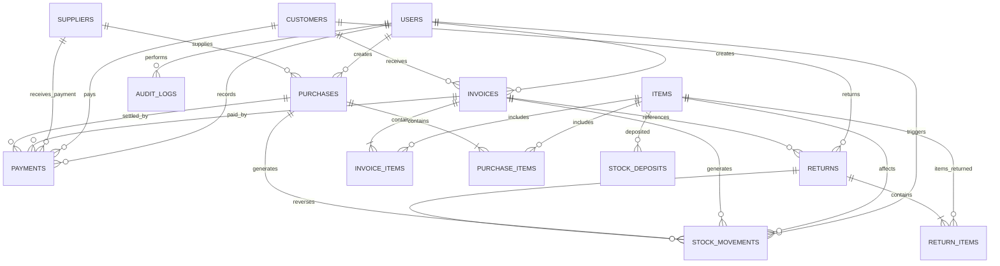

# هيكل قاعدة البيانات ومخطط الكيانات (Database Schema & ERD)

توثيق مرجعي دقيق لكافة جداول قاعدة البيانات، الأعمدة، أنواع الحقول (مع الالتزام الصارم بـ `DECIMAL(12,3)` لكافة القيم المالية والكميات)، القيود الأجنبية، الفهارس، ومخطط العلاقات (Mermaid ERD).

---

## 1. مخطط العلاقات الشامل (Mermaid ERD Diagram)

---

## 2. توثيق الجداول والحقول بالتفصيل

### 2.1 جدول الأصناف (`items`)
الجدول المركزي للبضائع وتتبع الأسعار والمخزون.

| اسم العمود (Column) | نوع البيانات (Data Type) | القيود والفهارس (Constraints & Indexes) | الوصف |
| :--- | :--- | :--- | :--- |
| `id` | `BIGINT UNSIGNED` | Primary Key, Auto Increment | المعرف الفريد للصنف |
| `code` | `VARCHAR(50)` | `UNIQUE`, `INDEX` | كود الصنف أو الباركود الفريد |
| `name` | `VARCHAR(255)` | `INDEX` | اسم الصنف التجاري |
| `unit` | `VARCHAR(50)` | Nullable | وحدة القياس (قطعة، كجم، كرتونة، متر) |
| `current_stock` | `DECIMAL(12,3)` | Default: `0.000` | الرصيد الحالي الفعلي في المخزن |
| `cost_price` | `DECIMAL(12,3)` | Default: `0.000` | سعر التكلفة الحالي المحفوظ |
| `weighted_avg_cost`| `DECIMAL(12,3)` | Default: `0.000` | متوسط التكلفة المرجح التراكمي |
| `selling_price` | `DECIMAL(12,3)` | Default: `0.000` | سعر البيع الافتراضي للمستهلك |
| `min_stock_level` | `DECIMAL(12,3)` | Default: `5.000` | حد الأمان لتنبيهات انخفاض المخزون |
| `is_active` | `BOOLEAN` | Default: `true`, `INDEX` | حالة الصنف (مفعل للبيع / معطل) |
| `notes` | `TEXT` | Nullable | ملاحظات وتفاصيل إضافية |
| `created_at` | `TIMESTAMP` | Nullable | تاريخ ووقت الإضافة |
| `updated_at` | `TIMESTAMP` | Nullable | تاريخ ووقت آخر تعديل |

---

### 2.2 جدول العملاء (`customers`)

| اسم العمود (Column) | نوع البيانات (Data Type) | القيود والفهارس (Constraints & Indexes) | الوصف |
| :--- | :--- | :--- | :--- |
| `id` | `BIGINT UNSIGNED` | Primary Key, Auto Increment | المعرف الفريد للعميل |
| `name` | `VARCHAR(255)` | `INDEX` | اسم العميل أو اسم المؤسسة |
| `phone` | `VARCHAR(50)` | Nullable, `INDEX` | رقم الهاتف الأساسي للعميل |
| `address` | `VARCHAR(255)` | Nullable | العنوان الجغرافي |
| `tax_number` | `VARCHAR(50)` | Nullable | الرقم الضريبي أو السجل التجاري |
| `current_balance` | `DECIMAL(12,3)` | Default: `0.000` | رصيد العميل التراكمي (+ مدين / - دائن) |
| `is_active` | `BOOLEAN` | Default: `true` | حالة العميل (نشط / موقوف) |
| `notes` | `TEXT` | Nullable | ملاحظات ائتمانية أو عامة |
| `created_at` | `TIMESTAMP` | Nullable | تاريخ الإضافة |
| `updated_at` | `TIMESTAMP` | Nullable | تاريخ التعديل |

---

### 2.3 جدول الموردين (`suppliers`)

| اسم العمود (Column) | نوع البيانات (Data Type) | القيود والفهارس (Constraints & Indexes) | الوصف |
| :--- | :--- | :--- | :--- |
| `id` | `BIGINT UNSIGNED` | Primary Key, Auto Increment | المعرف الفريد للمورد |
| `name` | `VARCHAR(255)` | `INDEX` | اسم المورد أو الشركة الموردة |
| `company_name` | `VARCHAR(255)` | Nullable | اسم الشركة أو المؤسسة التجارية |
| `phone` | `VARCHAR(50)` | Nullable, `INDEX` | رقم الهاتف والتواصل |
| `address` | `VARCHAR(255)` | Nullable | عنوان المورد |
| `current_balance` | `DECIMAL(12,3)` | Default: `0.000` | رصيد المورد المستحق له |
| `is_active` | `BOOLEAN` | Default: `true` | حالة المورد |
| `notes` | `TEXT` | Nullable | ملاحظات وتفاصيل التوريد |
| `created_at` | `TIMESTAMP` | Nullable | تاريخ الإضافة |
| `updated_at` | `TIMESTAMP` | Nullable | تاريخ التعديل |

---

### 2.4 جدول فواتير المبيعات (`invoices`)

| اسم العمود (Column) | نوع البيانات (Data Type) | القيود والفهارس (Constraints & Indexes) | الوصف |
| :--- | :--- | :--- | :--- |
| `id` | `BIGINT UNSIGNED` | Primary Key, Auto Increment | المعرف الفريد للفاتورة |
| `invoice_number` | `VARCHAR(50)` | `UNIQUE`, `INDEX` | رقم الفاتورة التسلسلي الآلي الفريد |
| `customer_id` | `BIGINT UNSIGNED` | `FOREIGN KEY` -> `customers(id)` | العميل المرتبط بالفاتورة |
| `user_id` | `BIGINT UNSIGNED` | `FOREIGN KEY` -> `users(id)` | المستخدم / الكاشير منشئ الفاتورة |
| `invoice_date` | `DATE` | `INDEX` | تاريخ إصدار الفاتورة |
| `payment_type` | `ENUM('cash','credit','partial')` | Default: `'cash'` | نوع السداد |
| `status` | `ENUM('draft','confirmed','cancelled')`| Default: `'draft'`, `INDEX` | حالة الفاتورة التشغيلية |
| `payment_status`| `ENUM('unpaid','partially_paid','paid')`| Default: `'unpaid'`, `INDEX` | حالة اكتمال السداد المالي |
| `subtotal` | `DECIMAL(12,3)` | Default: `0.000` | مجموع البنود قبل خصم الفاتورة |
| `discount_type` | `ENUM('fixed','percentage')`| Default: `'fixed'` | نوع الخصم المطبق على الفاتورة |
| `discount_value`| `DECIMAL(12,3)` | Default: `0.000` | قيمة أو نسبة الخصم المدخلة |
| `discount_amount`| `DECIMAL(12,3)` | Default: `0.000` | القيمة النقدية الفعلية لخصم الفاتورة |
| `net_total` | `DECIMAL(12,3)` | Default: `0.000`, `INDEX` | صافي القيمة النهائية للفاتورة |
| `paid_amount` | `DECIMAL(12,3)` | Default: `0.000` | إجمالي المبالغ المدفوعة والمحصلة |
| `remaining_amount`| `DECIMAL(12,3)` | Default: `0.000` | المبلغ المتبقي على العميل |
| `total_cost` | `DECIMAL(12,3)` | Default: `0.000` | إجمالي تكلفة البضاعة المباعة في الفاتورة |
| `notes` | `TEXT` | Nullable | شروط أو ملاحظات الفاتورة |
| `created_at` | `TIMESTAMP` | Nullable | تاريخ ووقت الإنشاء |
| `updated_at` | `TIMESTAMP` | Nullable | تاريخ ووقت التعديل |

---

### 2.5 جدول بنود فواتير المبيعات (`invoice_items`)

| اسم العمود (Column) | نوع البيانات (Data Type) | القيود والفهارس (Constraints & Indexes) | الوصف |
| :--- | :--- | :--- | :--- |
| `id` | `BIGINT UNSIGNED` | Primary Key, Auto Increment | المعرف الفريد للسطر |
| `invoice_id` | `BIGINT UNSIGNED` | `FOREIGN KEY` -> `invoices(id)` ON DELETE CASCADE | الفاتورة التابع لها |
| `item_id` | `BIGINT UNSIGNED` | `FOREIGN KEY` -> `items(id)` | الصنف المباع |
| `quantity` | `DECIMAL(12,3)` | | الكمية أو الوزن المباع |
| `cost_price` | `DECIMAL(12,3)` | | سعر تكلفة الصنف الثابت وقت البيع |
| `unit_price` | `DECIMAL(12,3)` | | سعر بيع الوحدة للعميل |
| `discount_amount`| `DECIMAL(12,3)` | Default: `0.000` | الخصم المباشر على هذا السطر |
| `total_price` | `DECIMAL(12,3)` | | الإجمالي الصافي لسطر الصنف |
| `created_at` | `TIMESTAMP` | Nullable | تاريخ الإنشاء |
| `updated_at` | `TIMESTAMP` | Nullable | تاريخ التعديل |

---

### 2.6 جدول فواتير الشراء والتوريد (`purchases`)

| اسم العمود (Column) | نوع البيانات (Data Type) | القيود والفهارس (Constraints & Indexes) | الوصف |
| :--- | :--- | :--- | :--- |
| `id` | `BIGINT UNSIGNED` | Primary Key, Auto Increment | المعرف الفريد لفاتورة الشراء |
| `purchase_number`| `VARCHAR(50)` | `UNIQUE`, `INDEX` | رقم فاتورة الشراء الداخلي |
| `supplier_id` | `BIGINT UNSIGNED` | `FOREIGN KEY` -> `suppliers(id)` | المورد صاحب البضاعة |
| `user_id` | `BIGINT UNSIGNED` | `FOREIGN KEY` -> `users(id)` | المستخدم المستلم للشحنة |
| `purchase_date` | `DATE` | `INDEX` | تاريخ التوريد والشراء |
| `status` | `ENUM('draft','confirmed','cancelled')`| Default: `'draft'` | حالة فاتورة الشراء |
| `payment_status`| `ENUM('unpaid','partially_paid','paid')`| Default: `'unpaid'` | حالة سداد مستحقات المورد |
| `subtotal` | `DECIMAL(12,3)` | Default: `0.000` | إجمالي بنود المشتريات |
| `discount_amount`| `DECIMAL(12,3)` | Default: `0.000` | الخصم الممنوح من المورد |
| `net_total` | `DECIMAL(12,3)` | Default: `0.000` | صافي المطلوب سداده للمورد |
| `paid_amount` | `DECIMAL(12,3)` | Default: `0.000` | المبلغ المسدد للمورد |
| `remaining_amount`| `DECIMAL(12,3)` | Default: `0.000` | المتبقي للمورد |
| `supplier_invoice_ref` | `VARCHAR(100)` | Nullable | رقم فاتورة المورد الورقية الأصلية |
| `notes` | `TEXT` | Nullable | ملاحظات الشراء والتوريد |
| `created_at` | `TIMESTAMP` | Nullable | تاريخ الإنشاء |
| `updated_at` | `TIMESTAMP` | Nullable | تاريخ التعديل |

---

### 2.7 جدول بنود فواتير الشراء (`purchase_items`)

| اسم العمود (Column) | نوع البيانات (Data Type) | القيود والفهارس (Constraints & Indexes) | الوصف |
| :--- | :--- | :--- | :--- |
| `id` | `BIGINT UNSIGNED` | Primary Key, Auto Increment | المعرف الفريد للسطر |
| `purchase_id` | `BIGINT UNSIGNED` | `FOREIGN KEY` -> `purchases(id)` ON DELETE CASCADE | فاتورة الشراء التابع لها |
| `item_id` | `BIGINT UNSIGNED` | `FOREIGN KEY` -> `items(id)` | الصنف المورد |
| `quantity` | `DECIMAL(12,3)` | | الكمية أو الوزن المورد |
| `cost_price` | `DECIMAL(12,3)` | | سعر التكلفة المشتري به |
| `total_price` | `DECIMAL(12,3)` | | إجمالي تكلفة السطر |
| `created_at` | `TIMESTAMP` | Nullable | تاريخ الإنشاء |
| `updated_at` | `TIMESTAMP` | Nullable | تاريخ التعديل |

---

### 2.8 جدول حركة المخزون الشامل (`stock_movements`)

| اسم العمود (Column) | نوع البيانات (Data Type) | القيود والفهارس (Constraints & Indexes) | الوصف |
| :--- | :--- | :--- | :--- |
| `id` | `BIGINT UNSIGNED` | Primary Key, Auto Increment | المعرف الفريد للحركة |
| `item_id` | `BIGINT UNSIGNED` | `FOREIGN KEY` -> `items(id)`, `INDEX` | الصنف المتأثر بالحركة |
| `movement_type` | `VARCHAR(50)` | `INDEX` | نوع الحركة (`sales_out`, `purchase_in`, إلخ) |
| `quantity` | `DECIMAL(12,3)` | | الكمية التي تحركت في العملية |
| `stock_before` | `DECIMAL(12,3)` | | الرصيد المخزني قبل الحركة |
| `stock_after` | `DECIMAL(12,3)` | | الرصيد المخزني بعد اكتمال الحركة |
| `unit_cost` | `DECIMAL(12,3)` | | تكلفة الصنف وقت تسجيل الحركة |
| `source_type` | `VARCHAR(255)` | `INDEX` | اسم فئة الموديل المصدر (Morph Polymorphic) |
| `source_id` | `BIGINT UNSIGNED` | `INDEX` | المعرف الفريد للمستند المصدر |
| `document_number`| `VARCHAR(100)` | Nullable | رقم المستند التوضيحي (رقم الفاتورة/المرتجع) |
| `user_id` | `BIGINT UNSIGNED` | `FOREIGN KEY` -> `users(id)` | المستخدم منفذ العملية |
| `notes` | `VARCHAR(255)` | Nullable | سبب الحركة أو ملاحظات |
| `created_at` | `TIMESTAMP` | Nullable, `INDEX` | توقيت الحركة الدقيق |
| `updated_at` | `TIMESTAMP` | Nullable | توقيت التعديل |

---

### 2.9 جدول المدفوعات والمقبوضات (`payments`)

| اسم العمود (Column) | نوع البيانات (Data Type) | القيود والفهارس (Constraints & Indexes) | الوصف |
| :--- | :--- | :--- | :--- |
| `id` | `BIGINT UNSIGNED` | Primary Key, Auto Increment | المعرف الفريد لسند الدفع/القبض |
| `payment_number`| `VARCHAR(50)` | `UNIQUE`, `INDEX` | رقم السند الفريد |
| `customer_id` | `BIGINT UNSIGNED` | Nullable, `FOREIGN KEY` -> `customers(id)` | العميل المرتبط (لسندات القبض) |
| `supplier_id` | `BIGINT UNSIGNED` | Nullable, `FOREIGN KEY` -> `suppliers(id)` | المورد المرتبط (لسندات الصرف) |
| `invoice_id` | `BIGINT UNSIGNED` | Nullable, `FOREIGN KEY` -> `invoices(id)` | فاتورة البيع المحددة (إن وجدت) |
| `purchase_id` | `BIGINT UNSIGNED` | Nullable, `FOREIGN KEY` -> `purchases(id)` | فاتورة الشراء المحددة (إن وجدت) |
| `user_id` | `BIGINT UNSIGNED` | `FOREIGN KEY` -> `users(id)` | المستخدم مستلم/صارف الدفعة |
| `amount` | `DECIMAL(12,3)` | `INDEX` | المبلغ النقدي المسدد |
| `payment_date` | `DATE` | `INDEX` | تاريخ استلام المبلغ |
| `payment_method`| `ENUM('cash','bank_transfer','check','other')`| Default: `'cash'` | طريقة التحصيل والدفع |
| `notes` | `TEXT` | Nullable | بيان أو تفاصيل السند |
| `created_at` | `TIMESTAMP` | Nullable | تاريخ ووقت التسجيل |
| `updated_at` | `TIMESTAMP` | Nullable | تاريخ ووقت التعديل |

---

### 2.10 جدول مستندات المرتجعات (`returns`)

| اسم العمود (Column) | نوع البيانات (Data Type) | القيود والفهارس (Constraints & Indexes) | الوصف |
| :--- | :--- | :--- | :--- |
| `id` | `BIGINT UNSIGNED` | Primary Key, Auto Increment | المعرف الفريد لمستند المرتجع |
| `return_number` | `VARCHAR(50)` | `UNIQUE`, `INDEX` | رقم إشعار المرتجع الفريد |
| `return_type` | `ENUM('sales_return','purchase_return')`| Default: `'sales_return'` | نوع المرتجع (مبيعات أو مشتريات) |
| `invoice_id` | `BIGINT UNSIGNED` | Nullable, `FOREIGN KEY` -> `invoices(id)` | فاتورة المبيعات الأصلية |
| `purchase_id` | `BIGINT UNSIGNED` | Nullable, `FOREIGN KEY` -> `purchases(id)` | فاتورة الشراء الأصلية |
| `customer_id` | `BIGINT UNSIGNED` | Nullable, `FOREIGN KEY` -> `customers(id)` | العميل صاحب المرتجع |
| `supplier_id` | `BIGINT UNSIGNED` | Nullable, `FOREIGN KEY` -> `suppliers(id)` | المورد المرتجع إليه البضاعة |
| `user_id` | `BIGINT UNSIGNED` | `FOREIGN KEY` -> `users(id)` | الموظف مسجل المرتجع |
| `total_amount` | `DECIMAL(12,3)` | Default: `0.000` | القيمة الإجمالية للمرتجع |
| `return_date` | `DATE` | `INDEX` | تاريخ المرتجع |
| `reason` | `VARCHAR(255)` | Nullable | سبب الإرجاع |
| `created_at` | `TIMESTAMP` | Nullable | تاريخ الإنشاء |
| `updated_at` | `TIMESTAMP` | Nullable | تاريخ التعديل |

---

### 2.11 جدول بنود المرتجعات (`return_items`)

| اسم العمود (Column) | نوع البيانات (Data Type) | القيود والفهارس (Constraints & Indexes) | الوصف |
| :--- | :--- | :--- | :--- |
| `id` | `BIGINT UNSIGNED` | Primary Key, Auto Increment | المعرف الفريد لسطر المرتجع |
| `return_id` | `BIGINT UNSIGNED` | `FOREIGN KEY` -> `returns(id)` ON DELETE CASCADE | مستند المرتجع التابع له |
| `item_id` | `BIGINT UNSIGNED` | `FOREIGN KEY` -> `items(id)` | الصنف المرتجع |
| `quantity` | `DECIMAL(12,3)` | | الكمية المرتجعة للمخزن |
| `unit_price` | `DECIMAL(12,3)` | | سعر الوحدة المرتجع بها |
| `total_price` | `DECIMAL(12,3)` | | إجمالي قيمة السطر المرتجع |
| `created_at` | `TIMESTAMP` | Nullable | تاريخ الإنشاء |
| `updated_at` | `TIMESTAMP` | Nullable | تاريخ التعديل |

---

### 2.12 جدول إيداعات وتسويات المخزون اليدوية (`stock_deposits`)

| اسم العمود (Column) | نوع البيانات (Data Type) | القيود والفهارس (Constraints & Indexes) | الوصف |
| :--- | :--- | :--- | :--- |
| `id` | `BIGINT UNSIGNED` | Primary Key, Auto Increment | المعرف الفريد للإيداع |
| `item_id` | `BIGINT UNSIGNED` | `FOREIGN KEY` -> `items(id)` | الصنف المودع |
| `user_id` | `BIGINT UNSIGNED` | `FOREIGN KEY` -> `users(id)` | المستخدم المسؤول |
| `deposit_type` | `ENUM('opening_balance','manual_deposit','adjustment')`| | نوع الإيداع والتسوية |
| `quantity` | `DECIMAL(12,3)` | | الكمية المضافة أو المعدلة |
| `cost_price` | `DECIMAL(12,3)` | | تكلفة الصنف المحسوبة |
| `reason` | `VARCHAR(255)` | Nullable | تبرير الإيداع أو التسوية |
| `deposit_date` | `DATE` | `INDEX` | تاريخ العملية |
| `created_at` | `TIMESTAMP` | Nullable | تاريخ الإنشاء |
| `updated_at` | `TIMESTAMP` | Nullable | تاريخ التعديل |

---

### 2.13 جدول المستخدمين والمصادقة (`users`)

| اسم العمود (Column) | نوع البيانات (Data Type) | القيود والفهارس (Constraints & Indexes) | الوصف |
| :--- | :--- | :--- | :--- |
| `id` | `BIGINT UNSIGNED` | Primary Key, Auto Increment | المعرف الفريد للمستخدم |
| `name` | `VARCHAR(255)` | | اسم الموظف / المستخدم |
| `email` | `VARCHAR(255)` | `UNIQUE`, `INDEX` | البريد الإلكتروني لتسجيل الدخول |
| `password` | `VARCHAR(255)` | | كلمة المرور المشفرة (Bcrypt) |
| `is_active` | `BOOLEAN` | Default: `true` | حالة الحساب (نشط / موقف) |
| `remember_token` | `VARCHAR(100)` | Nullable | رمز تذكر الجلسة |
| `created_at` | `TIMESTAMP` | Nullable | تاريخ إنشاء الحساب |
| `updated_at` | `TIMESTAMP` | Nullable | تاريخ التحديث |

---

### 2.14 جدول سجل الرقابة والتدقيق (`audit_logs`)

| اسم العمود (Column) | نوع البيانات (Data Type) | القيود والفهارس (Constraints & Indexes) | الوصف |
| :--- | :--- | :--- | :--- |
| `id` | `BIGINT UNSIGNED` | Primary Key, Auto Increment | المعرف الفريد للسجل |
| `user_id` | `BIGINT UNSIGNED` | Nullable, `FOREIGN KEY` -> `users(id)` | المستخدم الفاعل |
| `action_type` | `VARCHAR(100)` | `INDEX` | نوع الإجراء (`invoice_created`, `cancelled`, إلخ) |
| `auditable_type`| `VARCHAR(255)` | `INDEX` | الموديل المتأثر (Morph) |
| `auditable_id` | `BIGINT UNSIGNED` | `INDEX` | معرف السجل المتأثر |
| `old_values` | `JSON` | Nullable | البيانات القديمة قبل التعديل |
| `new_values` | `JSON` | Nullable | البيانات الجديدة بعد الحفظ |
| `ip_address` | `VARCHAR(45)` | Nullable | عنوان IP المستخدم |
| `user_agent` | `TEXT` | Nullable | بيانات المتصفح والجهاز |
| `created_at` | `TIMESTAMP` | Nullable, `INDEX` | توقيت حدوث العملية |

---

### 2.15 جداول الصلاحيات والأدوار (Spatie Laravel Permission Tables)
* `roles` (id, name, guard_name, created_at, updated_at).
* `permissions` (id, name, guard_name, created_at, updated_at).
* `model_has_roles` (role_id, model_type, model_id).
* `model_has_permissions` (permission_id, model_type, model_id).
* `role_has_permissions` (permission_id, role_id).

---

### 2.16 جدول سجلات النسخ الاحتياطي وإعدادات النظام (`system_settings` & `backups_meta`)

| اسم العمود (Column) | نوع البيانات (Data Type) | القيود والفهارس (Constraints & Indexes) | الوصف |
| :--- | :--- | :--- | :--- |
| `id` | `BIGINT UNSIGNED` | Primary Key, Auto Increment | المعرف الفريد |
| `key` | `VARCHAR(100)` | `UNIQUE`, `INDEX` | مفتاح الإعداد (مثل `store_name`, `default_printer`) |
| `value` | `TEXT` | Nullable | القيمة المخزنة |
| `updated_at` | `TIMESTAMP` | Nullable | توقيت آخر تحديث للإعداد |
