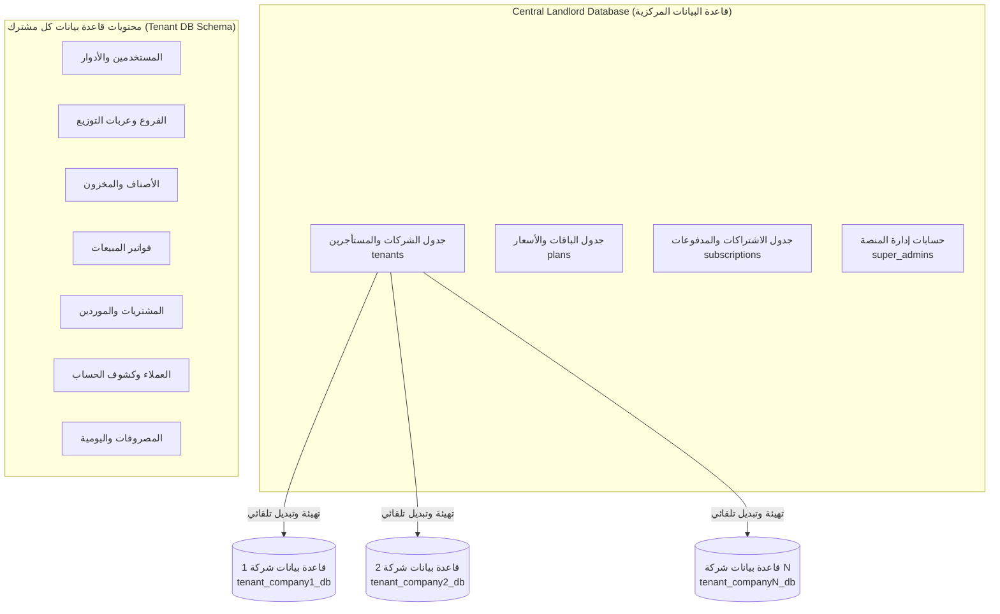
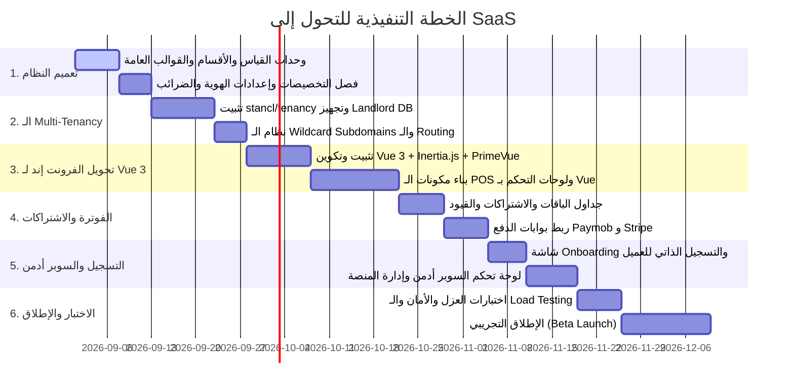

# 🚀 الدليل المعماري الشامل وخطة التحول لمنصة سحابية (SaaS Multi-Tenant ERP)

> **وثيقة معمارية واستراتيجية شاملة:** تحدد هذه الوثيقة معمارية قواعد البيانات، نموذج عزل المستأجرين (Multi-Tenancy)، الانتقال من Livewire إلى **Vue 3 + Inertia.js** مع التحليل الأمني الشامل، استراتيجية وجداول التسعير للأسواق المحلية والدولية، وخطة التنفيذ المرحلية.

---

## 1. مقارنة الوضع الحالي والوضع المستهدف (Current vs SaaS Architecture)

```text
┌───────────────────────────────────────────────────┐          ┌────────────────────────────────────────────────────┐
│              الوضع الحالي (Current ERP)           │          │             الوضع المستهدف (SaaS Platform)         │
├───────────────────────────────────────────────────┤          ├────────────────────────────────────────────────────┤
│ • Single Tenant (شركة واحدة وسيرفر واحد)          │   ───►   │ • Multi-Tenant (آلاف المشتركين والشركات المستقلة)  │
│ • مخصص لنشاط تجارة البن (شكارة/بن/توليفات)        │   ───►   │ • نظام ديناميكي عام لأي نشاط تجاري (تجزئة وجملة)   │
│ • فرونت إند: Livewire 4 + Alpine                  │   ───►   │ • فرونت إند: Vue 3 + Inertia.js + Tailwind (SPA)   │
│ • نطاق واحد مخصص                                  │   ───►   │ • Wildcard Subdomains (e.g. company.yourdomain.com)│
│ • لا يوجد نظام خطط ودفع واشتراكات                │   ───►   │ • باقات شهرية/سنوية وبوابات دفع إلكتروني مدمجة     │
│ • إدخال يدوي للمستخدمين                           │   ───►   │ • Onboarding وتسجيل فوري ذاتي وتجربة مجانية 14 يوم │
└───────────────────────────────────────────────────┘          └────────────────────────────────────────────────────┘
```

---

## 2. معمارية قواعد البيانات وعزل المستأجرين (Database Architecture)

### 🏆 الاستراتيجية المعتمدة: قاعدة بيانات لكل مشترك (Database per Tenant via `stancl/tenancy`)



### أسباب اختيار معمارية (Database per Tenant):
1. **عزل أمني وفيزيائي 100%:** بيانات كل شركة في قاعدة بيانات مستقلة؛ استحالة تداخل البيانات بين المشتركين.
2. **الحفاظ على الكود الحالي (99% Code Reusability):** الحفاظ على كافة العلاقات والاستعلامات الحسابية بـ `DECIMAL(12,3)` و `bcmath` و `lockForUpdate` دون الحاجة لحشر `tenant_id` في مئات الاستعلامات.
3. **النسخ الاحتياطي والاستقلالية:** إمكانية أخذ نسخة احتياطية لأي شركة وتصديرها بضغطة زر واحدة دون التأثير على بقية المشتركين.

---

## 3. الانتقال المعماري للواجهات: Vue 3 + Inertia.js (بديل Livewire)

### 3.1 لماذا الانتقال إلى `Vue 3 + Inertia.js`؟
1. **تجربة مستخدم SPA فائقة السرعة:** التنقل بين الصفحات لحظي 0ms بدون إعادة تحميل الصفحة، وسلاسة غير مسبوقة على شاشات اللمس وأجهزة الكاشير POS والتابلت.
2. **فصل طبقة العرض مع الحفاظ على قوة Laravel Monolith:** لا حاجة لبناء REST API منفصل وإدارة Tokens؛ Inertia يعمل كـ Modern Monolith.
3. **مكتبات مكونات متقدمة للـ Enterprise:** إمكانية استخدام مكتبات UI عالمية جاهزة مثل **PrimeVue** أو **Shadcn-Vue** لجداول الفلاتر المتطورة، شاشات POS باللمس، والرسوم البيانية التفاعلية.

### 3.2 التحليل الأمني الشامل لـ Inertia.js (Security Analysis)

> **⚠️ الرد على شبهة "هل Inertia غير آمن؟":**
> Inertia.js يُعد من **أكثر المعماريات أماناً في تطبيقات الويب عالمياً** ويتفوق أمنياً على الـ REST API المنفصل والـ Livewire للأسباب التالية:

```text
┌────────────────────────────────────────┬────────────────────────────────────────────────────────┐
│ معيار الأمان                          │ كيف يتعامل معه Inertia.js في Laravel؟                  │
├────────────────────────────────────────┼────────────────────────────────────────────────────────┤
│ 1. أمان جلسة المستخدم (Auth Session)  │ يستخدم HttpOnly Encrypted Session Cookies المحمية من   │
│                                        │ سرقة XSS، بدلاً من حفظ Tokens في localStorage المعرض للسرقة. │
├────────────────────────────────────────┼────────────────────────────────────────────────────────┤
│ 2. الحماية من التزوير (CSRF Protection)│ مدمج وتلقائي مع كل طلب (X-XSRF-TOKEN).                 │
├────────────────────────────────────────┼────────────────────────────────────────────────────────┤
│ 3. التحكم في البيانات المرسلة (Payload)│ السيرفر يرسل حصراً ما يتم تعريفه في الـ Controller عبر  │
│                                        │ API Resources/DTOs، مستحيل تسريب بيانات غير مقصودة.   │
├────────────────────────────────────────┼────────────────────────────────────────────────────────┤
│ 4. فحص الصلاحيات (Authorization)      │ يتم في الـ Backend عبر Laravel Policies & Gates قبل   │
│                                        │ وصول أي رد للمتصفح؛ لا يمكن تجاوزه من الـ Client.     │
└────────────────────────────────────────┴────────────────────────────────────────────────────────┘
```

---

## 4. استراتيجية وجداول التسعير المقترحة (SaaS Pricing & Monetization)

تم تحديد أسعار تنافسية ومدروسة تناسب السوق المصري وأسواق الخليج والدول العربية:

### 4.1 جدول الباقات والميزات:

| المعيار | 1. باقة البداية (Starter) | 2. باقة النمو (Pro) ⭐ الأكثر مبيعاً | 3. باقة الشركات (Enterprise) |
| :--- | :---: | :---: | :---: |
| **الفئة المستهدفة** | المحلات الفردية والمشاريع الناشئة | المتاجر المتوسطة وتجار الجملة | الشركات الكبرى وسلاسل الفروع |
| **الفروع وعربات التوزيع** | 1 فرع فقط | حتى 3 فروع / عربيات | فروع وعربات غير محدودة |
| **عدد المستخدمين** | 2 مستخدم (أدمن + كاشير) | 5 مستخدمين | غير محدود |
| **الحد الشهري للفواتير** | 500 فاتورة / شهر | غير محدود | غير محدود |
| **نقاط البيع والمخزون** | ✅ متوفر | ✅ متوفر | ✅ متوفر |
| **التحويلات بين الفروع** | ❌ غير متوفر | ✅ متوفر | ✅ متوفر |
| **تقارير الأرباح المتقدمة** | ❌ تقارير أساسية | ✅ تقارير وهوامش تفصيلية | ✅ تقارير مخصصة وتنبؤية |
| **النطاق الخاص (Custom Domain)**| ❌ غير متوفر | ❌ غير متوفر | ✅ متوفر (erp.client.com) |
| **الربط الخارجي (API Access)** | ❌ غير متوفر | ❌ غير متوفر | ✅ متاح للربط مع أنظمة أخرى |
| **النسخ الاحتياطي اليومي** | أسبوعي | يومي سحابي | لحظي متعدد المناطق |
| **الدعم الفني** | تذاكر ودعم قياسي | واتساب وأولوية دعم | مدير حساب خاص 24/7 |

---

### 4.2 خطة الأسعار المالية (مصر والخليج/العالم):

```text
┌────────────────────────────────────┬────────────────────────────────────┬────────────────────────────────────┐
│         الباقة (Starter)           │            الباقة (Pro)            │        الباقة (Enterprise)         │
├────────────────────────────────────┼────────────────────────────────────┼────────────────────────────────────┤
│ 🇪🇬 مصر: 350 ج.م / شهرياً           │ 🇪🇬 مصر: 850 ج.م / شهرياً           │ 🇪🇬 مصر: 2,200 ج.م / شهرياً         │
│ (أو 3,500 ج.م سنوياً - توفير شهرين)│ (أو 8,500 ج.م سنوياً - توفير شهرين)│ (أو 22,000 ج.م سنوياً - توفير شهرين)│
│                                    │                                    │                                    │
│ 🌍 دولي/الخليج: $29 / شهرياً        │ 🌍 دولي/الخليج: $79 / شهرياً        │ 🌍 دولي/الخليج: $199 / شهرياً       │
│ (أو $290 سنوياً - توفير شهرين)     │ (أو $790 سنوياً - توفير شهرين)     │ (أو $1,990 سنوياً - توفير شهرين)   │
└────────────────────────────────────┴────────────────────────────────────┴────────────────────────────────────┘
```

### 4.3 الخدمات الإضافية التوسعية (Add-ons):
* **إضافة فرع أو عربية توزيع إضافية:** +150 ج.م شهرياً (أو +$15 دولياً).
* **إضافة مستخدم إضافي:** +50 ج.م شهرياً (أو +$5 دولياً).
* **باقة رسائل WhatsApp وفواتير إلكترونية:** 500 رسالة = 150 ج.م.

---

## 5. تعميم النظام وإلغاء تخصيص البن (Domain Generalization)

لجعل النظام قابلاً للعمل مع أي نشاط تجاري (سوبرماركت، ملابس، مطاعم، قطع غيار، عطارة، إلكترونيات، جملة وتوزيع):

### 5.1 وحدات القياس الديناميكية (Dynamic Measurement Units)
* إضافة جدول وشاشة لإدارة وحدات القياس (`units`):
  * قطعة (Piece)، كرتونة (Carton)، دستة (Dozen)، كجم (Kg)، جرام (Gram)، لتر (Liter)، متر (Meter)، شكارة (Sack)، علبة (Box).
* **معاملات التحويل (Unit Conversions):** مثلاً (1 كرتونة = 24 قطعة) لتمكين البيع بالقطعة أو الكرتونة مع خصم المخزون بدقة.

### 5.2 قوالب الأنشطة التجارية المسبقة (Industry Presets)
عند تسجيل العميل لأول مرة، يختار نوع نشاطه، ويقوم النظام بتفعيل التهيئات التلقائية:
* **سوبرماركت / بقالة:** تفعيل قراءة الباركود السريع، الميزان الإلكتروني، وحدات (قطعة، كرتونة، كجم).
* **محلات ملابس وأحذية:** تفعيل متغيرات الألوان والمقاسات (Variants / Matrix).
* **عطارة ومحامص:** تفعيل الأوزان بالجرام والكيلو والتعبئة والشوال.
* **مطاعم وكافيهات:** تفعيل شاشة طلبات الكاشير السريع وطباعة بون المطبخ.
* **قطع غيار ومواد بناء:** تفعيل أرقام القطع والماركات والموديلات.

### 5.3 الهوية المخصصة للشركات (White-Labeling)
* رفع شعار الشركة واسمها التجاري وبيانات السجل والبطاقة الضريبية.
* تخصيص ترويسة وتذييل الفاتورة الحرارية (80mm / 57mm) وفواتير A4/A5.
* ضبط العملة المحلية ونسب الضريبة (ضريبة القيمة المضافة أو معفي).

---

## 6. بوابات الدفع وإدارة دورة حياة المشترك (Billing & Lifecycle)

* **بوابات الدفع:**
  * **مصر:** فوري (Fawry)، باي موب (Paymob)، بطاقات ميزة، محافظ إلكترونية (فودافون كاش، إنستاباي).
  * **الخليج والعالم:** Stripe, Moyasar, MyFatoorah, Tap Payments.
* **فترة تجريبية مجانية (14 Days Free Trial):** تبدأ فور التسجيل الذاتي دون طلب بطاقة دفع.
* **التنبيهات التلقائية:** رسائل تذكير قبل انتهاء الاشتراك بـ 7 أيام و 3 أيام ويوم واحد عبر WhatsApp والبريد.
* **وضع القراءة فقط (Read-Only Mode):** عند انتهاء الاشتراك لحماية البيانات دون حذفها، مع إمكانية التجديد الفوري.

---

## 7. لوحة تحكم السوبر أدمن (Super Admin SaaS Dashboard)

* **لوحة المؤشرات المركزية:** متابعة الإيرادات المتكررة (MRR / ARR)، معدل إلغاء الاشتراكات (Churn Rate)، وعدد المشتركين النشطين.
* **إدارة المستأجرين (Tenant Management):** تفعيل، إيقاف، تمديد الفترات التجريبية، وتعديل الباقات.
* **الدخول كعميل (Impersonation):** إمكانية دخول السوبر أدمن للوحة أي مشترك لحل مشاكل الدعم الفني دون طلب كلمة المرور.

---

## 8. خطة التنفيذ المرحلية (Implementation Roadmap)



---

> 📝 **ملاحظة للمناقشة والتطوير المستقبلي:**
> تم حفظ وتحديث هذه الوثيقة كمرجع استراتيجي وهندسي موحد للمنصة، وجاهزة للتنفيذ خطوة بخطوة عند اتخاذ قرار البدء.
