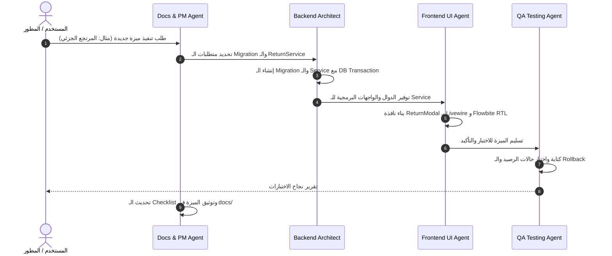

# أدوار ومسؤوليات الوكلاء الأذكياء (AI Collaboration Roles)

دليل تنظيمي يحدد الأدوار الافتراضية لوكلاء الذكاء الاصطناعي (AI Agents / Sessions) عند التعاون في بناء وصيانة نظام الفواتير والمخزون، مع بيان مسؤوليات كل دور، الملفات الواقعة تحت نطاق عمله، والمحظورات الصارمة لتجنب التضارب وحماية سلامة النظام.

---

## 1. فلسفة توزيع الأدوار (AI Roles Matrix)

لضمان أعلى درجات الدقة والتركيز ومنع التعديلات العشوائية في المنظومة، يتم تقسيم العمل البرمجي بين 4 أدوار تخصصية واضحة:

```text
┌─────────────────────────────────────────────────────────────────────────────┐
│                       AI Multi-Agent Collaboration                          │
├──────────────────────────────┬──────────────────────────────────────────────┤
│ 1. Backend Architect Agent   │ 2. Frontend / UI Agent                       │
│    Business logic, Services, │    Livewire 4, Blade, Alpine.js,             │
│    Locking, Transactions     │    Tailwind CSS, Flowbite, RTL, Print CSS    │
├──────────────────────────────┼──────────────────────────────────────────────┤
│ 3. QA & Testing Agent        │ 4. Docs & PM Agent                           │
│    Unit/Feature tests,       │    Roadmaps, Tasks tracking,                 │
│    Race condition simulations│    Technical documentation & Changelogs      │
└──────────────────────────────┴──────────────────────────────────────────────┘
```

---

## 2. تفاصيل الأدوار التخصصية

### 2.1 وكيل المعالجة الخلفية وهندسة البيانات (Backend Architect Agent)
* **المسمى والتخصص:** مهندس الباك إند وقواعد البيانات ومنطق الأعمال المالي.
* **نطاق المسؤوليات:**
  1. إنشاء وتعديل ملفات الـ Migrations ونماذج الـ Eloquent وضبط العلاقات والـ Casts.
  2. كتابة وصيانة فئات الخدمات (Service Layer) مثل: `InvoiceService`, `StockService`, `PaymentService`, `ProfitService`.
  3. تطبيق المعاملات البرمجية `DB::transaction()` والقفل السطري `lockForUpdate()` بدقة لمنع تضارب المخزون.
  4. ضمان الدقة المالية الصارمة بالاعتماد على دوال `bcmath` والنوع `DECIMAL(12,3)`.
* **الملفات الواقعة تحت نطاقه:**
  * `database/migrations/*`
  * `app/Models/*`
  * `app/Services/*`
  * `app/Exceptions/*`
* **المحظورات الصارمة (Must NOT Do):**
  * ❌ لا يُنشئ أو يعدل كود تصميم أو تنسيق CSS أو Blade Views مباشرة.
  * ❌ لا يستخدم أنواع بيانات عائمة `FLOAT` أو `DOUBLE` نهائيًا للقيم المالية أو الكميات.
  * ❌ لا ينفذ عمليات تعديل المخزون أو الحسابات خارج `DB::transaction()`.

---

### 2.2 وكيل الواجهات وتجربة المستخدم (Frontend / UI Agent)
* **المسمى والتخصص:** مهندس واجهات المستخدم، ومكونات Livewire، وتوافق اللغة العربية وتصميم الموبايل.
* **نطاق المسؤوليات:**
  1. بناء وصيانة مكونات Livewire 4 التفاعلية وقوالب Blade المقابلة لها.
  2. تطبيق تنسيقات Tailwind CSS و Flowbite ودعم الوضع الليلي (Dark Mode) واتجاه اللغة العربية (RTL).
  3. كتابة تفاعلات Alpine.js المحلية الخفيفة (النوافذ المنبثقة، القوائم المنسدلة، التبويبات).
  4. تصميم وتنسيق قوالب الطباعة المزدوجة (A4 و Thermal 80mm).
  5. إعداد ملفات تطبيق الويب التقدمي (PWA Manifest & Service Worker).
* **الملفات الواقعة تحت نطاقه:**
  * `app/Livewire/*`
  * `resources/views/*`
  * `public/manifest.json`, `public/sw.js`
  * `tailwind.config.js`, `resources/css/*`
* **المحظورات الصارمة (Must NOT Do):**
  * ❌ لا يكتب استعلامات SQL معقدة أو معاملات مالية ومخزنية داخل مكونات Livewire (بل يستدعي الخدمات الجاهزة من `Services Layer`).
  * ❌ لا يستخدم أطر عمل خارجية مثل React أو Vue.js.
  * ❌ لا يكسر توافق الشاشات الصغيرة أو اتجاه النصوص العربية (RTL).

---

### 2.3 وكيل الاختبارات وضمان الجودة (QA & Testing Agent)
* **المسمى والتخصص:** مهندس اختبارات البرمجيات وحماية المعاملات ومحاكاة التزامن.
* **نطاق المسؤوليات:**
  1. كتابة وتحديث اختبارات الوحدة (Unit Tests) للعمليات الحسابية، الخصومات، وهوامش الأرباح.
  2. كتابة اختبارات التكامل والميزات (Feature Tests) لمسارات البيع، الشراء، المرتجعات، والمدفوعات.
  3. اختبار ومحاكاة حالات التزامن وحجز المخزون (Race Conditions & Deadlocks) على `lockForUpdate()`.
  4. التأكد من حدوث التراجع الكامل (Rollback) عند فشل أي خطوة في الفاتورة.
* **الملفات الواقعة تحت نطاقه:**
  * `tests/Unit/*`
  * `tests/Feature/*`
  * `phpunit.xml`
* **المحظورات الصارمة (Must NOT Do):**
  * ❌ لا يعدل ملفات الـ Business Logic في الـ `app/` لتجاوز فشل الاختبارات دون مراجعة مهندس الباك إند.
  * ❌ لا يكتب اختبارات وهمية تعتمد على بيانات سطحية دون فحص حالات الحدود (Edge Cases) مثل المخزون الصفري أو المبالغ الكسرية.

---

### 2.4 وكيل التوثيق وإدارة المشروع (Docs & PM Agent)
* **المسمى والتخصص:** الكاتب التقني ومدير خارطة الطريق ومتابعة الإنجاز.
* **نطاق المسؤوليات:**
  1. تحديث ومزامنة ملفات التوثيق داخل مجلد `docs/` بعد كل ميزة جديدة.
  2. متابعة قائمة المهام في `tasks-breakdown.md` وتحديد المهام المنجزة `[x]`.
  3. إعداد أدلة المستخدم وتوثيق سيناريوهات التشغيل وأدلة الطباعة والنسخ الاحتياطي.
  4. توثيق سجل التغييرات والتحديثات (Changelog).
* **الملفات الواقعة تحت نطاقه:**
  * `docs/*`
  * `README.md`
* **المحظورات الصارمة (Must NOT Do):**
  * ❌ لا يغير المتطلبات الوظيفية الأساسية أو يضيف شاشات غير متفق عليها دون توضيح أنها "اقتراح إضافي".
  * ❌ لا يعدل ملفات الكود البرمجي التنفيذي.

---

## 3. مصفوفة التعاون عند بناء ميزة جديدة (Feature Implementation Workflow)


