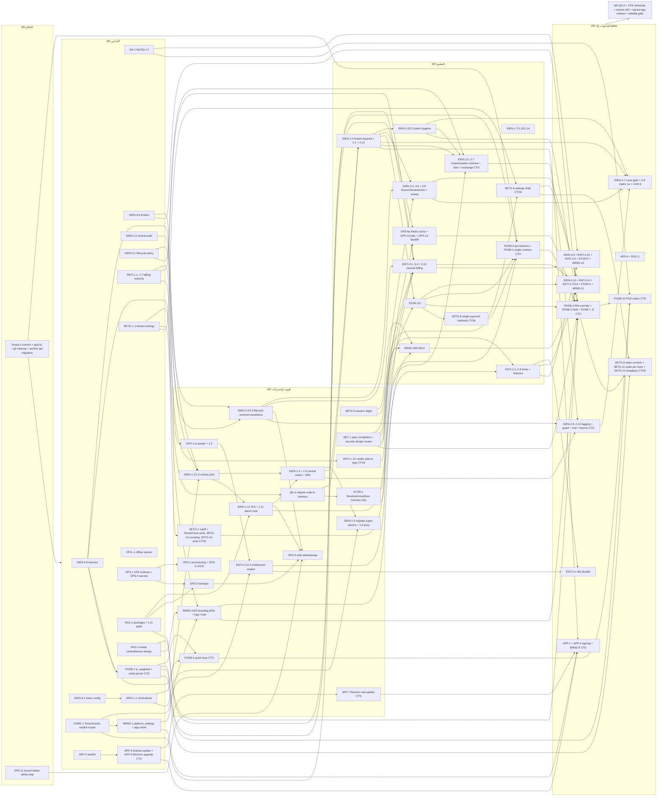

# خطة Phase 1 — أساس الـ SaaS

> **الحالة:** خطة معتمدة النطاق — **مراجعة 3** (دمج أجوبة الـ CTO على كل أسئلة W0، معلَّمة **[CTO-2026-10-08]**؛ تعديلات المراجعة 2 معلَّمة **[REV]**) · **التاريخ:** 2026-10-08 · **البرنش:** `feature/multi-tenant`
> **المدخلات:** [`product-overview.md`](../01-overview/product-overview.md) (المرجع الحاكم) · [`pricing-model-recommendation-2026-10.md`](../03-architecture/pricing-model-recommendation-2026-10.md) (§4 الحدود، §5 الـ features، §7 الـ add-ons، §8 الفوترة، §9 الـ DB، §10 البوابات) · [`package-adoption-plan.md`](../03-architecture/package-adoption-plan.md) · [`pos-competitive-study.md`](../04-ux-ui/pos-competitive-study.md) (§6، و§8 قرارات الـ POS) · [`00-REPORT.md`](../reviews/2026-10-07-saas-analysis/00-REPORT.md) (§3، §5، §7) · مواصفات الـ tracks ومراجعات الأمان التي أنتجها التخطيط متعدد الوكلاء.
> **[CTO-2026-10-08] ملخص التغيير في المراجعة 3:** كل أسئلة W0 مُجابة (§6.2)؛ الـ impersonation المدققة انتقلت إلى 1a؛ تطبيقا Android وDesktop (التحديث الحقيقي والتوقيع وAuthenticode) انتقلا إلى 1a؛ أُضيف track جديد **POSB** (عقود الـ backend التي تحتاجها واجهة الـ POS الجديدة في Phase 2)؛ ربط كل باكدج معتمد بمهمة التثبيت والمهام المستهلكة (§4.15)؛ إعادة حساب الـ waves والجهد (1a ≈ **223 يوم-مطور**).
> **[CTO-2026-10-09] ملخص التغيير في المراجعة 4 (قرارات الإعدادات Q1…Q12 في [`tenant-settings-catalog.md`](../02-requirements/tenant-settings-catalog.md) §7):** SETG-5 (شاشة الإعدادات الكاملة) انتقل من 1b إلى 1a؛ ضُمّ SETG-7 (منفَّذ في W1)؛ أُضيفت SETG-8…13؛ `business_day_cutoff` وتوحيد جانب الكتابة على `TenantClock` امتداد لـ SETG-2 في W2؛ وضع حد الائتمان داخل POSB-1؛ بوت Telegram واحد للمنصة بدل التوكن لكل مستأجر (امتداد OPS-10)؛ أوضاع `account.support_access` ودخول الـ super-admin الصامت المسجَّل مركزيًا فقط (IDEN-2.5/2.6/2.8/2.12)؛ `powered_by` حسب الباقة (BRND-12)؛ نوع add-on `credits` في schema الفوترة (ENTI-1.10 جديدة). إعادة الحساب: 1a ≈ **248 يوم-مطور** (كان 223)، و1b ≈ **19** (كان 20.5). كل تعديل معلَّم **[CTO-2026-10-09]**.
> **[CTO-2026-10-09] ملخص التغيير في المراجعة 5 (قرارات W1 الـ 32، و15 قرار ترحيل المحل):** كل قرارات W1 مُجابة (§9). المهام اللي اترتبت عليها: حد `tenant-resolve` 30/دقيقة + قفل الحساب مع فك القفل من المالك (IDEN-4.6، IDEN-4.12 جديدة)، `CentralAuditLog` على spatie + صلاحيات DB append-only (IDEN-1.15 جديدة + OPS-1)، قواعد الأرشفة والإيقاف (IDEN-3.x)، بنود الفوترة (ENTI-1.x)، 6 عملات (SETG-1)، PHP 8.4 + MySQL 8.4 + SMTP إلزامي (OPS-1)، offsets الـ harness (IDEN-4.8)، شيل الـ APKs العامة (APP-3)، توكن جهاز للبصمة (APP-8 جديدة) و`items.min_price.default_mode` (SETG-9). ومن قرارات الترحيل: عروض الأسعار ومستند الرصيد الافتتاحي وإصلاح `PAY-EXP` في Phase 2 قبل الترحيل (§9.4). إعادة الحساب: 1a ≈ **262.5 يوم-مطور** (كان 248)، و1b ≈ **19** بدون تغيير. كل تعديل معلَّم **[CTO-2026-10-09]** ومعاه «W1 Qn».
> **ملاحظة:** هذه الوثيقة خطة فقط، ولم يُعدَّل بسببها أي كود. لا تحتوي أسرارًا أو أرقام هواتف أو عناوين خوادم.

---

## 1. الهدف، ومعيار الخروج، والمدة

### 1.1 الهدف
تحويل البرنش من «تطبيق متعدد المستأجرين آمن بالكاد بعد Phase 0» إلى **منصة SaaS يمكن بيعها لأول عميل مدفوع** على الـ VPS الجديد:
- هوية مركزية منفصلة تمامًا عن هوية المستأجر.
- دورة حياة مستأجر مطبَّقة على كل request (تجربة → قراءة فقط → إيقاف → أرشفة).
- باقات وحدود وAdd-ons مطبَّقة فعليًا، وفوترة يدوية (InstaPay / Vodafone Cash) جاهزة لـ Paymob/Fawry.
- عزل الفروع داخل المستأجر.
- **Branding قابل للتغيير من مكان واحد:** اسم المنصة ولوجوها والـ favicon من إعدادات الـ super-admin، واسم ولوجو وألوان وترويسة إيصال لكل محل.
- تشغيل احترافي: VPS، وCI/CD، وإنشاء DB المستأجر تلقائيًا، وbackup مشفّر على Google Drive.
- **[CTO-2026-10-08]** دعم فني مدقق (impersonation) بدل المفتاح المركزي، وتطبيقا Android وWindows موقّعان ويتحدثان فعليًا، وعقود backend جاهزة لواجهة الـ POS الجديدة.

### 1.2 معيار الخروج (Exit criteria)

هناك مجموعتان: **1a = «قابل للبيع»** (بوابة أول عميل مدفوع، كل البنود إلزامية)، و**1b** (تكتمل مع بداية Phase 2). كل بند مربوط بالمهام التي تحققه؛ البند لا يُعتبر محققًا إلا إذا كانت كل مهامه مدموجة واختباراتها خضراء.

**1a — بوابة البيع (Sellable gate):**

| # | المعيار | المهام التي تحققه |
|---|---|---|
| A1 | **الهوية:** لا مسار يجعل مستخدم مستأجر super-admin. الـ super-admin `CentralUser` على guard `central` بـ 2FA إلزامي، والـ routes في `routes/central.php` فقط، على admin host فقط. الـ fallbacks المركزية (login/token) محذوفة، وصفوف الـ crossover في الـ matrix خضراء. واجهة الـ super-admin غير موجودة في Android/Electron | IDEN-1.1…1.12، 1.14، IDEN-2.1، 2.2، 2.3، IDEN-4.9 (صفوف الـ crossover والـ lifecycle؛ صفوف الـ impersonation في A13)، APP-6 |
| A2 | **العزل:** كل route تحت `api/v1` إما في allowlist عام صريح (بسبب + throttle)، أو `tenant.required` + auth، أو central guard. الـ **route-security gate** أخضر. **كل** الـ Feature suite تعمل على الـ harness (قاعدتا مستأجرين) وعدد الاختبارات ≥ 479، وjob **MySQL 8** إلزامي في الـ CI. الكاش معزول على Redis في الـ VPS | IDEN-4.6، 4.7، 4.8، QA-4، QA-1، IDEN-2.4، 2.13، CORE-1، OPS-6a |
| A3 | **الـ lifecycle:** تجربة منتهية = قراءة فقط (423 على أي كتابة خارج الـ allowlist)، والموقوف = 403 على كل شيء مع إلغاء الـ tokens. الـ sweep اليومي idempotent ومُجرَّب بـ `--dry-run`، والمستأجرون الحاليون مُرحَّلون لتواريخ واقعية قبل أول sweep | IDEN-3.1…3.6، 3.8، 3.9، 3.10، OPS-12 |
| A4 | **الباقات:** إنشاء فرع/مخزن/سيارة/مستخدم/صنف فوق الحد = 403 `subscription.limit_reached` بلا سباق على MySQL. الـ features المغلقة = 403 من الـ backend وتختفي من الواجهة (default-deny). الأسعار والحدود والـ add-ons (ومنها الخدمات) المعتمدة في الـ seeder، و`null` = غير محدود. تغيير الـ super-admin يصل للمستأجر في نفس الطلب التالي | ENTI-1.1…1.9، ENTI-2.1…2.10، ENTI-4.1…4.3 |
| A5 | **الفوترة:** دورة كاملة على بيئة الـ rehearsal (Q-O5): فاتورة اشتراك (ترقية أو **تجديد** أو خدمات) برقم مرجعي → رفع إيصال → مراجعة super-admin → تفعيل عبر `ActivateSubscriptionAction` → تحديث الحالة والحدود، مع audit | ENTI-3.1…3.4، 3.7، 3.8، 3.9، 3.10، PKG-2 |
| A6 | **الفروع:** كاشير فرع (أ) لا يقرأ ولا يبيع ولا يلغي في فرع (ب)، و`payments.store_id` موجود ومستخدم في إقفال الوردية | STOR-1…5 |
| A7 | **Branding:** تغيير اسم المنصة من شاشة super-admin يظهر في الـ SPA والـ title والـ manifest والإيميلات و`/system/context` داخل سياق مستأجر **في الطلب التالي** (لا انتظار TTL) بلا build جديد. لوجو/ترويسة محل تظهر في إيصالاته (Blade **و** طباعة الـ SPA/Electron) فقط. تست «لا brand strings hardcoded» أخضر | BRND-1…7، 9…12، CORE-1، SETG-6 |
| A8 | **التشغيل:** deploy من GitHub Actions إلى الـ VPS (releases + symlink + `tenants:migrate` + health check + rollback) مُجرَّب على بيئة الـ rehearsal. Telescope معطّل في production. إنشاء مستأجر = DB + مستخدم DB بأقل صلاحية تلقائيًا بحساب provisioner غير root. backup يومي مشفّر لكل مستأجر على Google Drive، و**restore drill** موثَّق. حذف المستأجر لا يُسقط DB بلا backup حديث. الـ jobs المجدولة واعية بالمستأجر | OPS-1…5، OPS-9، OPS-10، OPS-11، QA-3 |
| A9 | **الجودة:** `php artisan test` كامل أخضر (≥ 479)، `composer analyse` بصفر أخطاء جديدة، ESLint/Prettier نظيفة، `npm run build` ناجح، مراجعة تصميم أمنية قبل W3 (SEC-1) ومراجعة `code-reviewer` + `security-auditor` على كل track 1a بلا blockers | SEC-1، QA-2، QA-3، OPS-4، PKG-1 |
| A10 | **quick-login:** لا route quick-login في 1a إطلاقًا (حالة Phase 0 = محذوف) | — (يتحقق منه IDEN-4.7) |
| A11 | **إعدادات المستأجر والتوطين:** عملة ومنطقة زمنية ولغة افتراضية لكل مستأجر؛ أرقام غربية في كل عرض/طباعة؛ شريط offline يمنع البيع. **[CTO-2026-10-09]** + نهاية اليوم التجاري على كل التقارير والورديات؛ شاشة إعدادات كاملة (تابات، بحث، override للفرع)؛ قائمة طرق دفع واحدة؛ قواعد البيع الرقابية (السالب بثلاث حالات، سقف الخصم، أرضية السعر، الوردية الإلزامية حسب القالب، نافذة الإلغاء) خلف `settings.controls.manage`؛ وحدات حقيقية؛ باركود ميزان لكل فرع من الشاشة؛ قالب نشاط عند التسجيل؛ تقريب half-up واحد في PHP وJS | SETG-1…3، SETG-5…13، OFFL-1، OFFL-2 |
| A12 | **التوثيق:** ADR الهوية + docs الوحدات (الفوترة، الاشتراك، الـ branding، الهوية المركزية، **وعقد الـ POS backend في `docs/modules/pos.md`** [CTO-2026-10-08]) + تحديث `tasks-breakdown.md` | IDEN-1.10، DOC-1 |
| A13 | **[CTO-2026-10-08] (كان B1) الدعم المدقق (impersonation):** بدء من `routes/central.php` فقط بـ step-up 2FA وسبب إلزامي؛ exchange لمرة واحدة؛ الجلسة محدودة بـ **30 دقيقة** (لا تجديد)؛ تظهر لأدمن المحل كـ «دعم المنصة» بلا هوية الموظف؛ banner دائم بعدّاد وزر خروج؛ العمليات الخطرة = 403 `impersonation_blocked` إلا بـ `allow_destructive` لكل جلسة بسبب مكتوب؛ إنهاء من المركز والإيقاف يُنهيان الجلسة فورًا؛ audit مركزي + وسم سجل نشاط المستأجر؛ صفوف الـ impersonation في الـ matrix خضراء. **[CTO-2026-10-09] (Q9):** `account.support_access` = `allowed` أو `on_request` (موافقة المالك صالحة ≈ ساعة)؛ جلسات موظفي الدعم وحدها تظهر للمالك ولسجل نشاطه؛ جلسات الـ super-admin صامتة للمستأجر (لا موافقة ولا إشعار ولا أثر في سجله) لكن **كل جلسة** في `CentralAuditLog` بلا استثناء | IDEN-2.5…2.12، IDEN-2.2b، IDEN-4.9 (كاملة) |
| A14 | **[CTO-2026-10-08] (كان B7) التطبيقات:** APK واحد لكل المستأجرين برمز المحل؛ تحديث حقيقي لـ Android وElectron بـ checksum (والتحقق من التوقيع)؛ APK موقّع (`apksigner verify`) وEXE موقّع Authenticode عبر cloud signing (`signtool verify /pa`)؛ لا مواد توقيع ولا webhook token في الريبو أو الـ APK؛ Electron مُرقّى بلا ثغرات high، والـ biometric مُصلح، وfallback للطباعة والدرج؛ اسم التطبيق من `branding.build.json`؛ الـ super-admin غير موجود في التطبيقين | APP-1…APP-7، BRND-8 |
| A15 | **[CTO-2026-10-08] عقود الـ POS backend:** عقد checkout واحد بالآجل كـ tender داخل `payments[]` ولا `partial` في العقد؛ **[CTO-2026-10-09]** حد ائتمان بوضع `none`/`warn`/`block` على مستوى المستأجر؛ `items.is_weighted` + parser ملصقات الميزان لكل فرع؛ الصلاحيات الست الجديدة مطبّقة server-side + موافقة المدير بالـ PIN على نفس الجهاز (grant لمرة واحدة مربوط بالـ token والفرع)؛ فواتير معلّقة على السيرفر تُستأنف من جهاز آخر بلا تكرار؛ quick keys لكل فرع؛ عقد بيانات شاشة العميل؛ إيداع/سحب نقدية الوردية؛ أصناف الفاتورة القابلة للإرجاع. كل endpoint بتستات 200/401/403/422/عزل المستأجر والفرع | POSB-1…POSB-10 |

**1b — الإكمال:**

| # | المعيار | المهام |
|---|---|---|
| B1 | **[CTO-2026-10-08]** الـ impersonation نفسها انتقلت إلى A13 (1a). يبقى هنا: تنبيهات Telegram للأحداث المركزية الحساسة (دخول من IP جديد، بدء/إنهاء impersonation، حذف مستأجر). **[CTO-2026-10-09]** عبر بوت المنصة (OPS-10) إلى chat الـ CTO المنفصل فقط، ولا تصل أي محل (بما فيها جلسات الـ super-admin الصامتة) | IDEN-1.13 |
| B2 | إشعارات الـ lifecycle (database + mail) بلا تسرب | IDEN-3.7 |
| B3 | quick-login للاختبار فقط: غير موجود إلا مع `QUICK_LOGIN_ENABLED=true` في `local/testing`، ويرفض الإقلاع في production | IDEN-4.2، 4.10، 4.11 |
| B4 | تجديد آلي للفواتير وطلب add-ons ذاتي | ENTI-3.5، 3.6 |
| B5 | VAT/ETA fields + قسم الضريبة داخل شاشة الإعدادات (**[CTO-2026-10-09]** الشاشة نفسها SETG-5 انتقلت إلى 1a) | SETG-4 |
| B6 | Sentry/Nightwatch + health، تقاعد سكريبتات الـ root، hardening إضافي للكاش | OPS-6b، OPS-7، OPS-8 |
| ~~B7~~ | **[CTO-2026-10-08] نُقل بالكامل إلى A14 (1a)** بقرار Q-A1 | — |
| B8 | UX audit + quick wins | UX-1، UX-2 |

### 1.3 المدة التقديرية (صريحة)
**[CTO-2026-10-08]** مجموع مهام هذه الخطة ≈ **243.5 يوم-مطور** (التفصيل في §4.19)، منها **≈223 لـ 1a** و**≈20.5 لـ 1b**. (المراجعة 2 كانت 216 = 169.5 + 46.5.) الزيادة +27.5 يومًا في المجموع و+53.5 في 1a سببها قرارات الـ CTO: نقل الـ impersonation كاملة إلى 1a (+12.5)، ونقل تطبيقي Android وDesktop إلى 1a مع مهمة تحديث Electron الجديدة APP-7 وAuthenticode بالـ cloud signing (+16)، وtrack الـ POSB الجديد (+24)، واسترجاع كلمة سر الـ super-admin عبر Fortify في IDEN-1.12 (+0.5)، وتوثيق عقد الـ POS في DOC-1 (+0.5). كل ذلك **أكبر بكثير** من تقدير الـ 4–6 أسابيع في `00-REPORT.md`.

**افتراضات السعة (تقدير مطور بشري):** 3 مطورين × ≈4 أيام فعلية/أسبوع = **12 يوم-مطور/أسبوع**. يُضاف **buffer 18%** للمراجعة (`code-reviewer` + `security-auditor` على كل track) وإعادة العمل، فتصبح السعة المخططة ≈ **10 أيام-مهام/أسبوع**.

| السيناريو | الحجم (مهام) | + buffer 18% | 3 مطورين | مطوران |
|---|---|---|---|---|
| **Phase 1a — النواة القابلة للبيع** (W0–W5، §3.2) | ≈ ~~223~~ ~~248~~ **262.5** يومًا [CTO-2026-10-09 W1] | ≈ ~~263~~ ~~293~~ **310** يومًا | **≈ 28–29 أسبوعًا** (W0 أسبوع + ≈ 26.3 حسابيًا) (كان 26–27) | ≈ 39–40 أسبوعًا (كان 37–38) |
| **Phase 1b — بالتوازي مع بداية Phase 2** (W6–W7، §3.2) | ≈ ~~20.5~~ **19** يومًا [CTO-2026-10-09] | ≈ 22.5 يومًا | ≈ 2 أسبوع إضافي | ≈ 3 أسابيع |

**[CTO-2026-10-09] إعادة الحساب بعد قرارات الإعدادات:** المجموع ≈ **267 يوم-مطور** (+23.5)، منها **≈ 248 لـ 1a** (+25: SETG-2 امتداد 2، SETG-5 بعد التوسيع 5، SETG-7 0.5، SETG-8 2، SETG-9 4، SETG-10 1، SETG-11 1، SETG-12 1.5، SETG-13 1.5، ENTI-1.10 1، POSB-1 +0.5، OPS-10 +2، IDEN-2.5/2.6/2.8/2.12 +2.5، BRND-12 +0.5) و**≈ 19 لـ 1b** (−2 بخروج SETG-5، +0.5 لقسم الضريبة في SETG-4). بالسعة نفسها: 1a ≈ 248 + 18% ≈ 293 يومًا ← **≈ 26–27 أسبوعًا** بثلاثة مطورين (حسابيًا 248 ÷ 10 + W0 ≈ 25.8، وجدول الـ waves المقرَّب = 27)، و≈ 37–38 أسبوعًا بمطورَين؛ و1b ≈ 2 أسبوع. وبالوكلاء: ≈ 8–12 أسبوعًا السابقة + ≈ 10–12 يوم عمل للإعدادات (Q10) ≈ **10–14 أسبوعًا** لـ 1a (تقدير، لم يُقَس). الأرقام في الجدول التالي وفي §3.2 و§4.19 محدَّثة؛ النص التاريخي فوق ده يبقى كما هو.

**[CTO-2026-10-09] إعادة الحساب بعد قرارات W1 (§9):** المجموع ≈ **281.5 يوم-مطور** (+14.5)، منها **≈ 262.5 لـ 1a** (+14.5) و**≈ 19 لـ 1b** (بدون تغيير). التفصيل في §9.3. بالسعة نفسها: 262.5 + 18% ≈ 310 يومًا ← **≈ 28–29 أسبوعًا** بثلاثة مطورين (حسابيًا 262.5 ÷ 10 + W0 ≈ 27.3، وجدول الـ waves بعد التوزيع ≈ 28.5)، و≈ 39–40 أسبوعًا بمطورَين. وبالوكلاء: ≈ **11–15 أسبوعًا** لـ 1a (تقدير، لم يُقَس). عروض الأسعار ومستند الرصيد الافتتاحي وإصلاح `PAY-EXP` في Phase 2، ومش محسوبين هنا.

**[CTO-2026-10-08] التقدير الواقعي بالعمل عبر الوكلاء:** ≈ **8–12 أسبوعًا** لـ 1a، بشرط أن ينفذ الوكلاء (`backend-architect`، `frontend-vue`، `qa-tester`…) المهام بالتوازي حسب جدول الملكية §3.1، وأن **يراجع الـ CTO نتائج كل wave قبل بدء التالية** (Q-P2). هذا التقدير لا يحل محل التقدير البشري أعلاه، والفرق هو المخاطرة: المراجعات والبروفات (VPS، الـ restore drill، التوقيع، شراء شهادة Authenticode) لها زمن تقويمي لا يختصره الوكلاء.

**[CTO-2026-10-08] النطاق (Q-P2):** الـ CTO قبل نطاق 1a كاملًا، والتنفيذ wave بعد wave مع عرض النتيجة بعد كل wave. القص يُقرَّر **عند مراجعة الـ wave** لا مسبقًا. قائمة المرشحين للقص إن احتجنا (بالترتيب): SETG-2/SETG-3 (العربية فقط في أول إصدار، −2.5)، BRND-4 الـ manifest الديناميكي لكل host (−1.5)، الألوان في BRND-11 (−1)، IDEN-1.7 (يبقى Telescope/Pulse مغلقين في production حتى 1b، −1)، شاشة الاستخدام والـ nudge في ENTI-2.9 (−1.5)، ENTI-3.8 بقائمة بسيطة (−1)، POSB-7 شاشة العميل (تبقى عقدًا موثقًا بلا إعدادات per-store، −1)، POSB-8 إيداع/سحب الوردية (يُكتفى بالمصروفات الموجودة، −2.5). المجموع ≈ 12 يومًا؛ أي تقليص أكبر يمس معايير البيع A1–A8 أو A13–A15. **[CTO-2026-10-09]** مرشحون إضافيون من الإعدادات (ترتيب الكتالوج §6.2): SETG-12 القوالب ← P2 (−1.5)، البحث داخل SETG-5 ← 1b (≈ −1، تقدير)، SETG-11 لو أول عميل مش بيبيع بالوزن (−1).

**توصية:** اعتماد التقسيم 1a / 1b بالمدد أعلاه. أول عميل مدفوع بعد بوابة 1a (§1.2)، والـ 1b يكمل مع إصلاحات `main` المالية في بداية Phase 2.

---

## 2. القرارات المعتمدة التي يعتمد عليها التخطيط

| القرار | المصدر |
|---|---|
| منصة SaaS عامة (تجزئة، جملة/سيارات، بالوزن)، ليست للبن | product-overview §1 |
| Production جديد = VPS (Redis، supervisor، cron، `CREATE DATABASE` آلي)، والسيرفر الحالي staging + محل حقيقي على `main` لا يُمس | §2، §3 |
| Telescope مغلق في production، Pulse للـ super-admin فقط، `config:cache` + `route:cache` | §3 |
| Backup يومي مشفّر لكل مستأجر على Google Drive (OAuth refresh token لحساب Gmail شخصي)، retention 7/4/3، restore drill | §3 + الذاكرة |
| الباقات والأسعار والحدود (free/basic/pro/enterprise)، `null` = غير محدود، founder pricing لأول 50 | §4 + pricing §4 |
| توزيع الـ features والـ add-ons وأسعارها، و`api.access` = Public API فقط | §5، §6 + pricing §5، §7 |
| تجربة 14 يومًا → +7 مرة واحدة → read-only 30 يومًا → suspended → احتفاظ 90 يومًا → أرشفة؛ `past_due` سماح 7 أيام | §7 + pricing §8 |
| الدفع يدوي أولًا، ثم Paymob ثم Fawry، كلها عبر `ActivateSubscriptionAction` خلف `PaymentGateway` | §8 + pricing §10 |
| `blender.access` ← `mixes.manage` (Mix Builder) مع alias مؤقت | §14 + pricing §6 |
| عملة/منطقة زمنية/لغة افتراضية لكل مستأجر، العربية فقط في أول إصدار لكن كل نص في ar+en، أرقام غربية | §10 |
| VAT مُعطَّل افتراضيًا + حقول ETA-ready | §11 |
| Offline: الآن شريط + منع البيع فقط؛ البيع offline في نهاية Phase 2 | §12 |
| quick-login للاختبار فقط خلف env flag | §13 |
| الباكدجات المعتمدة لـ Phase 1: pennant، fortify، horizon، laravel-backup، activitylog، medialibrary، sentry أو nightwatch، laravel-health، `@vueuse/core` — **غير مثبتة بعد؛ التثبيت وفحص L13 في PKG-1، وربط كل باكدج بالمهام المستهلكة في جدول §4.15** | package-adoption-plan |
| **Branding:** اسم المنصة واللوجو والـ favicon من مكان واحد، وbranding لكل محل، وصفر brand strings hardcoded | قرار CTO 2026-10-08 (الذاكرة) |
| **[CTO-2026-10-08]** كل أسئلة W0 مُجابة (§6.2): الاسم محايد والـ brand لم يُحدَّد، والدومين `baraa-solutions.com` مع subdomain لكل محل، وcustom domain في Phase 3؛ الـ impersonation في 1a؛ VPS على Hetzner؛ التطبيقان في 1a؛ قبول النطاق كاملًا wave بعد wave | §6.2 + الذاكرة |
| **[CTO-2026-10-08]** قرارات الـ POS العشرة (عقد واحد بالآجل كـ tender، `is_weighted`، parser ملصقات لكل فرع، الصلاحيات الست + PIN المدير، المعلّق على السيرفر، شاشة العميل وquick keys في v1، Ctrl+H / Ctrl+Space في المتصفح) — جزء الـ backend منها في track **POSB** (§4.17)، والواجهة في Phase 2 | pos-competitive-study §8 |
| **[CTO-2026-10-09]** قرارات الإعدادات Q1…Q12: الوردية الإلزامية حسب القالب، السالب بثلاث حالات في P1، حد الائتمان في 1a، half-up موحّد للفواتير الجديدة، بوت Telegram واحد للمنصة، `business_day_cutoff` في P1، مصفوفة الصلاحيات + `settings.controls.manage` مستقلة، `powered_by` حسب الباقة، `support_access` (`allowed`/`on_request`) ودخول super-admin صامت مسجَّل مركزيًا، SETG-5 + SETG-8…13 في 1a، ثلاث قوالب فقط، الرسائل المدفوعة add-on + رصيد `credits` | [`tenant-settings-catalog.md`](../02-requirements/tenant-settings-catalog.md) §7 + الذاكرة |
| **[CTO-2026-10-09]** قرارات W1 الـ 32 (حدود الدخول وقفل الحساب، `CentralAuditLog` على spatie، قواعد الأرشفة، الفوترة، 6 عملات، PHP/MySQL 8.4 + Sentry + SMTP، التطبيقات، توكن جهاز للبصمة) و15 قرار ترحيل المحل | §9 هنا + [`live-shop-migration-analysis.md`](live-shop-migration-analysis.md) §8 |
| **[CTO-2026-10-08]** الدفع المقسم (الخيار A): الكاش قد يتجاوز الصافي ويحسب السيرفر الباقي ويخفض سطر الكاش ليساوي المسجَّل الصافي تمامًا؛ الكارت/المحفظة/الآجل لا تتجاوز المستحق | الذاكرة (عقد الدفع المقسم) |

---

## 3. ترتيب التنفيذ (Waves)

### 3.1 قواعد العمل المتوازي في نفس الشجرة
الوكلاء يعملون في نفس الـ working tree، لذا:
1. **مالك واحد لكل ملف ساخن في كل wave** (الجدول التالي). أي track آخر يحتاج تعديله يرسل الـ diff المطلوب للمالك أو ينتظر الـ wave التالي.
2. **تخصيص أرقام الـ migrations** (حل تعارض فعلي في المواصفات: `IDEN-1.1` و`ENTI-1.2` استخدما نفس الرقم `2026_10_10_000100`، و`IDEN-2.3`/`IDEN-3.2` استخدما `000001`، و`IDEN-2.5`/`IDEN-3.2` استخدما `000002`):

| Track | central `database/migrations/` | tenant `database/migrations/tenant/` |
|---|---|---|
| IDEN (هوية + impersonation + tokens) | `2026_10_10_100000`–`109999` | `2026_10_10_100000`–`109999` |
| LIFE (IDEN-3.x) | `2026_10_10_110000`–`119999` | `2026_10_10_110000`–`119999` |
| ENTI (باقات + فوترة) | `2026_10_10_200000`–`229999` | `2026_10_10_230000`–`239999` (**[REV]** `tenant_usage_locks` لـ ENTI-2.4) |
| STOR | — | `2026_10_10_300000`–`309999` |
| SETG (**[CTO-2026-10-09]** يشمل SETG-8 `payment_methods`، SETG-10 الوحدات، SETG-12 القوالب) | `2026_10_10_310000`–`319999` | `2026_10_10_310000`–`319999` |
| BRND | `2026_10_10_400000`–`409999` | `2026_10_10_400000`–`409999` |
| PKG (جداول `media`/`activity_log`/… للباكدجات، PKG-1/PKG-2) | `2026_10_10_050000`–`059999` | `2026_10_10_050000`–`059999` |
| OPS (provisioning status، backfill OPS-12) | `2026_10_10_500000`–`509999` | — |
| **[CTO-2026-10-08]** POSB (`items.is_weighted`، `customers.is_walk_in`/`credit_limit`، `store_pos_settings`، `pos_quick_keys`، `pos_held_invoices`، `users.pos_pin_*`، `pos_override_approvals`، `shift_cash_movements`، grants الصلاحيات الجديدة) | — | `2026_10_10_600000`–`609999` |

   **[CTO-2026-10-08]** جداول الـ impersonation (IDEN-2.5) تبقى في نطاق IDEN (`1000xx`) في القاعدتين.

   **[CTO-2026-10-09]** جدول طلبات دخول الدعم (`support_access_requests`، IDEN-2.5/2.6) مركزي في نطاق IDEN (`1000xx`). جداول ربط Telegram ببوت المنصة (أكواد الربط و chat ids لكل مستأجر/مستخدم، امتداد OPS-10) مركزية في نطاق OPS (`5000xx`)، لأن الـ webhook بيوصل للمنصة قبل حل أي مستأجر. نوع add-on `credits` ودفتر الرصيد (ENTI-1.10) مركزيان في نطاق ENTI (`2000xx`–`2299xx`). وضع حد الائتمان إعداد في جدول `settings` بلا migration، والعمود `customers.credit_limit` في نطاق POSB (`6000xx`) كما هو.

   الترتيب الرقمي يضمن أن `central_users` (IDEN) يُنشأ قبل أي FK يشير إليه، وأن تعديل `tenants.status` (LIFE) يسبق جداول الفوترة.
3. **ملفات lang المشتركة:** `lang/{ar,en}/subscription.php` ينشئه `IDEN-3.1` في Wave 1، والباقي يُلحق. `auth.php` و`super.php` و`settings.php`: الإلحاق فقط في نهاية الملف، ولا إعادة ترتيب.
4. كل مهمة تنتهي بـ quality gate (`php -l`، Pint على الملفات المتغيرة، Larastan، الاختبارات المعنية)، والكامل عند لمس middleware/auth/tenancy.

| الملف الساخن | W0 | W1 | W2 | W3 | W4 | 1b (W6–W7) |
|---|---|---|---|---|---|---|
| `routes/api.php` | — | IDEN-4.6 (throttle على الـ public routes فقط) ثم POSB-2 **[CTO]** | IDEN-1.4 (إزالة super-admin) ثم POSB-6 **[CTO]** | IDEN-2.4 (إعادة هيكلة المجموعات + alias `tenant.active` no-op) ثم ENTI-2.6 ثم STOR-2 ثم ENTI-3.3 ثم IDEN-2.7 **[CTO]** ثم IDEN-2.6 (route موافقة المالك على طلب الدعم) ثم SETG-8 ثم OPS-10 (webhook بوت المنصة، عام في الـ allowlist) **[CTO-2026-10-09]** | ENTI-4.1 ثم IDEN-2.9 ثم POSB-4 ثم POSB-5 ثم POSB-8 ثم POSB-9 **[CTO]** | IDEN-4.2 |
| `routes/central.php` (جديد) | — | — | IDEN-1.4 ثم IDEN-1.12 ثم BRND-2 | IDEN-3.4، ENTI-2.8، ENTI-3.4، ENTI-3.10، IDEN-1.7، IDEN-2.6 **[CTO]** (بالترتيب) | IDEN-2.10 **[CTO]** | — |
| `routes/tenant.php` | — | — | — | IDEN-2.7 (حذف routes الـ impersonation القديمة) **[CTO]** | — | — |
| `routes/web.php` | — | — | BRND-5 (route اللوجو العام) | BRND-4، IDEN-1.7 | — | — |
| `bootstrap/app.php` | — | IDEN-4.6 (renderer 429) | IDEN-1.4 ثم IDEN-3.3 (renderers) ثم ENTI-2.1 ثم STOR-1 (alias فقط) | IDEN-2.4 (aliases + order + حجز `tenant.active`) ثم IDEN-3.5 (يملأ `tenant.active`) | IDEN-2.9 (`impersonation.safe`) **[CTO]** | — |
| `app/Providers/AppServiceProvider.php` | — | IDEN-4.1 ثم IDEN-4.6 (limiters) ثم BRND-1 (override `app.name`/mail from) | IDEN-1.2/1.3 ثم ENTI-2.2 (binding) | — | IDEN-2.9 (Gate::before deny) ثم POSB-4 (limiter الـ PIN) **[CTO]** | — |
| `app/Providers/TenancyServiceProvider.php` | OPS-11 (إزالة `DeleteDatabase`) | — | OPS-2 ثم OPS-9 | — | — | — |
| `config/tenancy.php` | — | — | OPS-2 | IDEN-2.4 ثم OPS-6a | — | — |
| `config/filesystems.php` | — | PKG-2 (disk مركزي) | BRND-5 | — | — | — |
| `app/Support/TenantCache.php` | — | CORE-1 | — | OPS-6a | — | — |
| `ApiTokenAuth.php` | — | — | IDEN-1.3 (حذف فرع central) | IDEN-2.2 (token hygiene + التجديد المنزلق) ثم IDEN-2.2b (مع IDEN-2.5) **[CTO]** | — | — |
| `ApiLoginAction.php` | — | — | — | IDEN-2.1 ثم IDEN-3.5 | — | IDEN-4.2 |
| `GetSystemContextAction.php` | — | — | BRND-3 (كتلة `branding`) | IDEN-3.8 ثم ENTI-2.7 ثم ENTI-2.5 ثم BRND-6 | IDEN-2.8 **[CTO]** | — |
| `Tenant.php` | — | ENTI-1.2 | IDEN-3.2 | ENTI-2.3 | — | — |
| **[CTO-2026-10-09]** `TenantProvisionerService.php`، شاشة/Action التسجيل | — | ENTI-1.3 | IDEN-3.2 ثم OPS-2 | — | SETG-12 (قالب النشاط) | — |
| **[CTO-2026-10-09]** `Components/Settings/*`، `Composables/useSettings.js`، `SettingController.php`، `UpdateSettingsRequest.php` | — | SETG-1 ثم SETG-7 | — | SETG-5 (الـ shell) ثم SETG-8 (قسم طرق الدفع) | BRND-11 ثم SETG-9 ثم SETG-11 ثم SETG-12 (كل واحد يضيف قسمه) | SETG-4 (قسم الضريبة) |
| **[CTO-2026-10-09]** `Services/InvoiceService.php`، `Services/StockService.php`، Actions التقارير/الـ dashboard | — | SETG-2 (القراءة) | SETG-2 (امتداد: `TenantClock` للكتابة + `business_day_cutoff`) | — | SETG-9 (السالب، الوردية الإلزامية) | — |
| **[CTO-2026-10-09]** `helpers/decimal.js`، `Composables/useFormatters.js`، helper الـ bcmath في PHP | — | — | SETG-13 | — | — | — |
| **[CTO-2026-10-09]** `TelegramService.php`، `routes/console.php` | — | — | — | BRND-6 (النصوص) ثم OPS-10 (بوت المنصة + jobs واعية بالمستأجر) | — | — |
| `SuperAdminApiController.php` | OPS-11 (`destroyTenant`) | — | IDEN-1.4 (routes فقط) ثم BRND-2 (استخراج `PlatformSettingsController`) | IDEN-3.4 | — | — |
| `stores/appConfig.js`, `router/index.js`, `Services/api.js` | — | OFFL-1 (`api.js` فقط) | IDEN-1.9 (**مع** IDEN-1.4 في نفس الدمج) | BRND-7 | IDEN-3.10 ثم ENTI-2.9 ثم ENTI-4.2 ثم IDEN-2.12 **[CTO]** ثم APP-6 ثم APP-1 **[CTO]** | IDEN-4.11 |
| `PosView.vue`، `InvoicePrintView.vue`، `InvoiceShowA4Document.vue`، `DesktopPrinterSettingsModal.vue` | — | OFFL-1 (`PosView` فقط) | SETG-6 | BRND-12 | STOR-4 (`PosView`) | — |
| `config/auth.php`, `config/sanctum.php`, `.env.example` | — | IDEN-4.1 ثم IDEN-1.1 ثم PKG-1 | OPS-* (إلحاق فقط) | — | — | — |
| `composer.json`, `package.json` (+ locks) في `backend/` | — | **PKG-1 فقط** | — | — | — | — |
| `PlansAndFeaturesSeeder.php` | — | — | ENTI-1.8 ثم ENTI-1.10 (نوع `credits`، بلا add-on معروض للبيع) **[CTO-2026-10-09]** | BRND-12 (مفتاح إزالة `powered_by` في Pro/Enterprise) **[CTO-2026-10-09]** | ENTI-4.1 | — |
| **[CTO]** `PermissionsSeeder.php` (tenant) | — | — | QA-2 (الـ 14 الناقصة) | POSB-3 ثم ENTI-3.3 (`billing.manage`) — إلحاق فقط | ENTI-4.1 (`mixes.manage`) ثم SETG-9 (`settings.controls.manage`، `pos.sell_negative_stock`) **[CTO-2026-10-09]** | — |
| **[CTO]** `StorePOSInvoiceRequest.php`، `Concerns/ValidatesCheckoutPayments.php`، `ProcessPOSInvoiceAction.php`، `DTOs/POSInvoiceDTO.php`، `PosController.php` | blocker الـ cash split (Phase 0) | — | — | STOR-2 (حذف `store_id` من الـ body) ثم SETG-8 (الثابت الموحَّد لطرق الدفع) **[CTO-2026-10-09]** ثم POSB-1 (+ وضع حد الائتمان) | POSB-4 (`approvals[]`) ثم SETG-9 (قواعد البيع تستهلك `approvals[]`) **[CTO-2026-10-09]** | — |
| **[CTO]** `GetPOSBootstrapDataAction.php`، `POSCustomerResource.php` | — | POSB-2 (إعدادات الميزان) | POSB-6 (quick keys) | SETG-8 (طرق الدفع المفعّلة) **[CTO-2026-10-09]** ثم POSB-1 (رصيد العميل والحد + `credit_limit_mode`) | POSB-7 (إعدادات شاشة العميل) ثم SETG-9 (قواعد البيع) **[CTO-2026-10-09]** | — |
| **[CTO]** `Models/Item.php`، `Requests/*Item*` | — | POSB-2 (`is_weighted`) | — | — | — | SETG-4 |
| **[CTO]** `ShiftService.php`، `TreasuryService.php` | — | — | SETG-2 (امتداد: حدود يوم الوردية من `TenantClock`) **[CTO-2026-10-09]** | STOR-3 (`payments.store_id`) | POSB-8 (حركات نقدية الوردية) ثم SETG-9 (`shift.required_to_sell`) **[CTO-2026-10-09]** | — |
| **[CTO]** `ReturnController.php`، `ReturnService.php`، `Requests/*Return*` | — | — | — | — | POSB-9 | — |
| **[CTO]** `desktop/**` (و`desktop/package.json` ليس ضمن ملكية PKG-1) | — | APP-5 (ترقية Electron + الطباعة) | APP-7 (التحديث الحقيقي) | — | APP-4 (التوقيع) ثم BRND-8 | — |
| **[CTO]** `Composables/useAppUpdate.js`، `useBiometricAuth.js`، `useNativeBridge.js` | — | APP-3 ثم APP-5 | — | BRND-7 (النصوص ومفاتيح `sroor_*`) | APP-6 ثم APP-1 | — |
| **[CTO]** `capacitor.config.json`، `android/**` | — | APP-2 (`webDir`) ثم APP-3 | — | — | APP-4 ثم BRND-8 | — |
| **[CTO]** `.github/workflows/*` | — | QA-1 ثم OPS-4 (`ci.yml`) | OPS-3 (`release.yml`) | OPS-6a (job Redis) | APP-4 (`release-apps.yml`) | — |
| `tests/TestCase.php`، `tests/Feature/**` القائمة | — | IDEN-4.8 (ملفات جديدة فقط) | **QA-4 مالك حصري** لترحيل الملفات القائمة؛ باقي الـ tracks تكتب تستات **جديدة** على `TenantTestCase` فقط | — | — | — |

### 3.2 الـ Waves

السعة المخططة لكل wave = أسابيع × ≈10 أيام-مهام (§1.3، بعد الـ buffer). **كل مهمة في §4 لها wave واحدة** (العمود «Wave» في الجدول التالي هو المرجع، والرسم في §3.4 يطابقه).

**Phase 1a**

| Wave | المدة (3 مطورين) | المهام (الجهد) | المجموع | شرط البدء |
|---|---|---|---|---|
| **W0 — الإغلاق والتجهيز** | ≈ 1 أسبوع | OPS-11 (0.5). وبلا جهد مطور: إغلاق blocker الـ Phase 0 (الـ cash split 422، حسب الخيار A)، commit لـ Phase 0 per track، **بيد الـ CTO:** تنظيف `76f32ce0`، وأرشفة `feature/api-migration` (tag `archive/api-migration`، حذف الفرع، تعديل سكريبت النشر بحيث يرفض نشره — product-overview §15)؛ CI gates خضراء؛ ~~الرد على كل أسئلة §6.2 «المانعة»~~ **[CTO-2026-10-08] تم**؛ إعادة التحقق من §7؛ **[CTO]** بدء إجراءات شراء شهادة Authenticode (مطلوبة قبل W4) | 0.5 | — |
| **W1 — الأساس المستقل** | ≈ 4 أسابيع **[CTO]** (كانت 3) | IDEN-4.8 (2)، QA-1 (1.5)، IDEN-4.1 (0.5)، IDEN-4.6 (1)، IDEN-1.1 (1)، IDEN-1.5 (0.5)، IDEN-3.1 (1)، ENTI-1.1…1.7 (8)، CORE-1 (0.5)، BRND-1 (2)، SETG-1…3 (4)، OFFL-1 (1.5)، OPS-1 (3)، OPS-4 (1)، PKG-1 (2)، PKG-2 (1)، APP-2 (0.5)، **[CTO]** APP-3 (3)، APP-5 (5)، POSB-2 (3)، **[CTO-2026-10-09]** SETG-7 (0.5، منفَّذ) | ~~42~~ **42.5** | W0 |
| **W2 — الهوية والمحركات + ترحيل الـ suite** | ≈ 6 أسابيع **[CTO-2026-10-09]** (كانت 5.5) | IDEN-1.2 (1)، 1.3 (1.5)، 1.4 + 1.9 (3، دمج واحد)، 1.6 (1.5)، 1.8 (1.5)، 1.11 (1.5)، 1.12 (**3** [CTO])، IDEN-3.2 (1.5)، 3.3 (2)، ENTI-1.8 (2)، 1.9 (1)، ENTI-2.1 (0.5)، 2.2 (1.5)، STOR-1 (2)، BRND-2 (2)، BRND-3 (1)، BRND-5 (3.5)، OPS-2 (3)، OPS-3 (4)، OPS-5 (4)، OPS-9 (2)، **QA-4 (5)**، QA-2 (1)، SETG-6 (1)، OFFL-2 (0.5)، **[CTO]** APP-7 (2)، POSB-6 (2)، **[CTO-2026-10-09]** SETG-2 امتداد (2)، SETG-13 (1.5)، SETG-10 (1)، ENTI-1.10 (1)، **SEC-1 (2، آخر الـ wave)** | ~~56.5~~ **62** | W1 (حسب الرسم) |
| **W3 — التطبيق (Enforcement)** | ≈ 7.5 أسابيع **[CTO-2026-10-09]** (كانت 6) | IDEN-2.1 (0.5)، 2.2 (1.5)، 2.3 (0.5)، 2.4 (1.5)، 2.13 (1)، IDEN-3.4 (2)، 3.5 (2)، 3.6 (2)، 3.8 (0.5)، IDEN-1.7 (1)، 1.10 (0.5)، 1.14 (0.5)، ENTI-2.3 (1.5)، 2.4 (2.5)، 2.5 (1)، 2.6 (1.5)، 2.7 (1)، 2.8 (2)، ENTI-3.1 (1)، 3.2 (2.5)، 3.3 (2)، 3.4 (2.5)، 3.10 (1.5)، STOR-2 (3)، STOR-3 (2)، BRND-4 (1.5)، BRND-6 (3.5)، BRND-7 (3)، BRND-9 (0.5)، BRND-12 (~~2~~ **2.5** [CTO-2026-10-09])، OPS-6a (1.5)، OPS-10 (~~1.5~~ **3.5** [CTO-2026-10-09])، OPS-12 (1)، **[CTO]** IDEN-2.5 (~~1~~ **1.5**، + 2.2b)، 2.6 (~~1.5~~ **2.5**)، 2.7 (2)، POSB-3 (2)، POSB-1 (~~3~~ **3.5**)، **[CTO-2026-10-09]** SETG-5 (5)، SETG-8 (2) | ~~61.5~~ **73** | W2 + **SEC-1** + QA-4 |
| **W4 — الواجهات والـ gates والتطبيقات** | ≈ 7 أسابيع **[CTO-2026-10-09]** (كانت 6، وقبلها 3) | IDEN-3.9 (1.5)، 3.10 (2)، IDEN-4.4 (1)، 4.5 (1)، 4.7 (1)، **4.9 (3، كاملة [CTO])**، ENTI-2.9 (3)، 2.10 (1.5)، ENTI-3.7 (2.5)، 3.8 (2)، 3.9 (2)، ENTI-4.1 (2)، 4.2 (1)، 4.3 (0.5)، STOR-4 (1.5)، STOR-5 (2)، BRND-10 (1)، BRND-11 (2.5)، APP-6 (0.5)، DOC-1 (**2.5** [CTO])، **[CTO]** IDEN-2.8 (~~1~~ **1.5** [CTO-2026-10-09])، 2.9 (1.5)، 2.10 (1)، 2.11 (1.5)، 2.12 (~~1.5~~ **2**)، APP-1 (1.5)، APP-4 (2.5)، BRND-8 (2)، POSB-4 (3.5)، POSB-5 (2.5)، POSB-7 (1.5)، POSB-8 (2.5)، POSB-9 (2)، POSB-10 (2)، **[CTO-2026-10-09]** SETG-9 (4)، SETG-11 (1)، SETG-12 (1.5) | ~~60.5~~ **68** | W3. **[CTO-2026-10-08b]** مفيش شهادة Authenticode دلوقتي: APP-4 = توقيع APK فقط، والـ installer بتاع Windows بيتشحن من غير توقيع (تحذير SmartScreen مقبول) |
| **W5 — التصلب وبوابة البيع** | 1.5 أسبوع | QA-3 (2) + إصلاح ما تكشفه المراجعات (الـ buffer) + بروفة deploy/rollback + restore drill + **[CTO]** بروفة release موقّعة للتطبيقين وتحديث فعلي من إصدار سابق + مراجعة معايير A1–A15 | 2 | W4 |
| **مجموع 1a** | ~~≈ 27 أسبوعًا~~ **≈ 28.5 أسبوعًا** [CTO-2026-10-09 W1] (حسابيًا 262.5 ÷ 10 + W0 ≈ 27.3؛ كان 27 لـ 248) | | ~~223~~ ~~248~~ **262.5** (0.5 + 42.5 + **70.5** + **75.5** + **71.5** + 2) | |

> **[CTO-2026-10-09] توزيع إضافات قرارات W1 على الـ waves (§9.3):** **W2 +8.5** (62 ← 70.5، ≈ 6.85 أسبوع): IDEN-4.6 امتداد (0.5)، IDEN-1.15 (1)، IDEN-4.8 امتداد (1)، IDEN-3.1/3.2 امتداد (0.5)، ENTI-1.x امتداد (2)، SETG-1 امتداد (0.5)، OPS-1 امتداد (1)، APP-3 امتداد (1.5)، APP-5 امتداد (0.5). **W3 +2.5** (73 ← 75.5، ≈ 7.75 أسبوع): IDEN-3.3/3.4/3.6 امتداد (1)، IDEN-4.12 (1.5، بعد OPS-10 عشان تنبيه المالك). **W4 +3.5** (68 ← 71.5، ≈ 7.35 أسبوع): SETG-9 امتداد `items.min_price.default_mode` (1)، APP-8 (2.5، مع شغل الأجهزة والـ PIN في POSB-4). الأعمدة فوق متعدلتش واحدة واحدة؛ الملاحظة دي هي المرجع.

> **[CTO-2026-10-08] مراجعة الـ CTO بعد كل wave (Q-P2):** في نهاية كل wave يُعرض على الـ CTO: المهام المدموجة، نتائج الـ quality gate الحقيقية، تقارير `code-reviewer`/`security-auditor`، وما تأخر. لا تبدأ الـ wave التالية قبل موافقته، وأي قص للنطاق يُقرَّر هنا (قائمة §1.3).

**Phase 1b** (خط زمني منفصل، يبدأ بعد بوابة البيع، بالتوازي مع بداية Phase 2)

| Wave | المدة | المهام (الجهد) | المجموع |
|---|---|---|---|
| **W6 — الدعم والمراقبة** | ≈ 1 أسبوع | IDEN-1.13 (0.5)، IDEN-3.7 (1.5)، ENTI-3.5 (1)، ENTI-3.6 (1)، OPS-6b (0.5)، OPS-7 (1.5) | 6 |
| **W7 — الأدوات والـ UX** | ≈ 1.5 أسبوع | IDEN-4.2 (1.5)، 4.10 (1)، 4.11 (1)، SETG-4 (~~2~~ **2.5** + قسم الضريبة في الشاشة [CTO-2026-10-09])، ~~SETG-5 (2)~~ (انتقل إلى W3 [CTO-2026-10-09])، OPS-8 (1)، UX-1 (3)، UX-2 (3) | ~~14.5~~ **13** |
| **مجموع 1b** | **≈ 2 أسبوع** [CTO-2026-10-09] | | ~~20.5~~ **19** |

> **[CTO-2026-10-08b]** قرار: مش هنشتري شهادة توقيع Windows دلوقتي. APP-4 بقى يشمل توقيع الـ APK (keystore، ببلاش) بس، و`release-apps.yml` بيبني الـ installer من غير توقيع. سلامة التحديث نفسها مضمونة بـ SHA-256 manifest + https allow-list (APP-7)، ودي مش محتاجة شهادة. توقيع Authenticode متأجل لحد ما الـ CTO يقرر يشتري.

> **[CTO-2026-10-08]** خرج من 1b إلى 1a: IDEN-2.5…2.12 + الجزء 1b من IDEN-4.9 (Q-B1)، وAPP-1، APP-3، APP-4، APP-5، BRND-8 (Q-A1)، والمهمة الجديدة APP-7.

### 3.3 Phase 1a مقابل 1b
- **1b (يمكن تأجيله دون منع أول بيع):** إشعارات البريد (IDEN-3.7)، تنبيهات Telegram (IDEN-1.13)، IDEN-4.2/4.10/4.11، ENTI-3.5/3.6 (التجديد **الآلي** فقط؛ الإصدار اليدوي للتجديد في 1a عبر ENTI-3.10)، SETG-4 (~~SETG-5~~ انتقل إلى 1a [CTO-2026-10-09])، OPS-6b/7/8، كل UX.
- **[CTO-2026-10-09] نُقلت/أُضيفت إلى 1a بقرارات الإعدادات:** SETG-5 (W3)، SETG-7 (W1، منفَّذ)، SETG-8 (W3)، SETG-9 (W4)، SETG-10 (W2)، SETG-11 (W4)، SETG-12 (W4)، SETG-13 (W2)، امتداد SETG-2 (W2)، ENTI-1.10 (W2)، وتوسيع POSB-1 وOPS-10 وIDEN-2.5/2.6/2.8/2.12 وBRND-12. الترتيب داخل الـ waves محكوم بجدول الملفات الساخنة §3.1: SETG-13 في W2 قبل ENTI-3.2 (W3) ليستخدم نفس helper التقريب؛ SETG-8 بعد STOR-2 وقبل POSB-1 على ملفات الـ checkout؛ SETG-5 (الـ shell) في W3 قبل BRND-11 (W4) لأن تبويب الـ Branding بيتركّب جواه؛ SETG-9 بعد POSB-4 لأنه بيستهلك `approvals[]`؛ SETG-12 آخر W4 بعد ما مفاتيح SETG-9/10/11 تبقى موجودة.
- **نُقلت إلى 1a بسبب المراجعة:** ENTI-3.10 (إصدار فاتورة تجديد/خدمات يدويًا)، OPS-6a (Redis + `CacheTenancyBootstrapper` + `ScopedCacheKeysTest`)، OPS-10 (jobs واعية بالمستأجر)، BRND-9 (البريد)، SETG-6 (الأرقام الغربية).
- **[CTO-2026-10-08] نُقلت إلى 1a بقرار الـ CTO:** الـ impersonation المدققة كاملة IDEN-2.5…2.12 + IDEN-4.9 كاملة (Q-B1) — فلا توجد نافذة يفقد فيها الدعم الوصول بعد حذف الـ central fallback (IDEN-2.1، W3): الـ fallback يُحذف في W3، وIDEN-2.6/2.7 في W3 أيضًا، والباقي (الحارس، الـ banner، الإنهاء) في W4 **قبل** بوابة البيع. حتى دمج IDEN-2.7 يكون الدعم عبر مشاركة الشاشة على بيئة التطوير/الـ rehearsal فقط (لا عملاء حقيقيون قبل W5). والتطبيقات APP-1/3/4/5/7 + BRND-8 (Q-A1).
- **[CTO-2026-10-08] الجديد في 1a:** track **POSB** (§4.17) — عقود الـ backend لواجهة الـ POS الجديدة. الواجهة نفسها (إعادة تصميم الـ POS) تبقى في Phase 2؛ عملاء 1a يستخدمون شاشة الـ POS الحالية، وتبقى متوافقة لأن POSB-1 يقبل `payment_type` القديم كـ alias لإصدار واحد.
- **[CTO-2026-10-08] العملاء في 1a:** الـ web SPA، **وتطبيق Android متعدد المستأجرين برمز المحل، وتطبيق Windows موقّع** (Q-A1). الاسم التجاري لم يُحدَّد بعد (Q-R1)، فيجب ضبطه في `config/branding.php`/الـ super-admin **قبل** أي تسويق أو نشر على Play Store؛ إلى ذلك الحين يبني BRND-8 التطبيق بالاسم المحايد.

### 3.4 رسم الاعتماديات



**ما لا يمكن تنفيذه بالتوازي:**
- `IDEN-2.4` (`tenant.required`) يكسر كل اختبارات الـ API الحالية (تعمل بلا tenancy)، فلا يُدمج قبل **QA-4** (ترحيل الـ suite كاملة إلى `TenantTestCase`، ≈479 تستًا)، ولا قبل `IDEN-1.3/1.4` (وإلا يتعطل دخول الـ super-admin الحالي عبر `/auth/login`). IDEN-2.4 **يحجز** alias `tenant.active` كـ middleware no-op في ترتيب الـ stack، وIDEN-3.5 يملؤه لاحقًا — لا اعتماد دائري.
- `IDEN-1.4` (تحويل `/super-admin` إلى `auth.central`) و`IDEN-1.9` (SPA الـ super-admin الجديد) **يُدمجان معًا في دمج واحد** بعد IDEN-1.12؛ لا توجد نافذة يكون فيها الـ SPA القديم مكسورًا. إن تعذّر ذلك، تبقى مجموعة Phase 0 القديمة (`[EnsureCentralContext, ApiTokenAuth, can:super_admin.access]`) مسجلة بالتوازي حتى دمج IDEN-1.9، وتُحذف في نفس PR الـ 1.9، وتُوثَّق النافذة في الـ runbook (IDEN-1.10).
- `IDEN-3.3` (إلغاء الـ tokens عند الإيقاف) لا يُختبر بشكل صحيح على sqlite المشترك، لأنه سيحذف tokens الـ super-admin أيضًا. يحتاج الـ harness.
- `ENTI-3.4` (`ActivateSubscriptionAction`) يحتاج `IDEN-3.3` (`TransitionTenantStatusAction`)، وبذلك لا حاجة لتفعيل يدوي مؤقت عبر toggle-status.
- `IDEN-2.6+` (impersonation) يحتاج الـ central guard والـ 2FA (`IDEN-1.12`)، حسب مراجعة الأمان.
- `BRND-6/7/12` (إزالة الـ hardcoded) بعد `BRND-1/3/5`، وإلا لا يوجد مصدر بديل للاسم.
- **كل مهام W3 في tracks IDEN-3، ENTI-2/3، BRND، OPS تعتمد اعتمادًا صلبًا على SEC-1** (مراجعة التصميم الأمني في نهاية W2). **[CTO-2026-10-08]** ويُضاف إلى نطاق SEC-1 تصميم POSB-4 (PIN المدير) وPOSB-5 (الفواتير المعلّقة) وPOSB-8 (حركات الخزينة)، فهي اعتماد صلب لها.
- **[CTO-2026-10-08]** `IDEN-2.7` (exchange) لا يُدمج قبل `IDEN-2.2` و`IDEN-2.4` (W3)، و`IDEN-2.9` (الحارس) يُدمج **قبل** إتاحة الـ impersonation على أي بيئة بها بيانات حقيقية؛ لذلك لا يُفعَّل route البدء (`IDEN-2.6`) خارج الاختبارات حتى يُدمج `IDEN-2.9` (flag `IMPERSONATION_ENABLED=false` افتراضيًا حتى W4).
- **[CTO-2026-10-08]** `POSB-1` (العقد الموحّد) بعد `STOR-2` (نفس الملفات)، وبعد إغلاق blocker الـ cash split في W0. و`POSB-4` يضيف `approvals[]` على نفس الملفات في W4.
- **[CTO-2026-10-08]** `APP-4` (التوقيع) يحتاج شهادة Authenticode **مشتراة قبل W4** (Q-O3/Q-A1)، و`BRND-8` بعده. إن تأخرت الشهادة: يُشحن Android الموقّع وحده، وWindows يبقى خلف بوابة A14 (لا بيع لتطبيق Windows غير موقّع).

---

## 4. جدول المهام

**الرموز:** الجهد بالأيام. **[SEC]** = تعديل مدمج من مراجعة الأمان. **[MERGED]** = دمج مهام مكررة. **[NEW]** = مهمة أضافتها المراجعة أو التخطيط. **[1b]** = قابل للتأجيل. **[REV]** = تعديل/إضافة من مراجعة الـ critic الثانية (2026-10-08). **[CTO-2026-10-08]** (أو **[CTO]** اختصارًا) = تعديل/نقل/إضافة بسبب أجوبة الـ CTO (المراجعة 3). عمود «الجهد» هو المرجع لجدول الـ waves في §3.2. الوكلاء: `BA` = backend-architect، `FE` = frontend-vue، `QA` = qa-tester، `DH` = docs-historian، `I18N` = i18n-guardian. أي مهمة `BA` تُسلَّم مع عقد API لـ `FE` عند الحاجة.

### 4.1 Track IDEN-1 — الهوية المركزية (central DB)

| id | المهمة | الوكيل | الملفات الأساسية | يعتمد على | الجهد | معايير القبول | الاختبارات |
|---|---|---|---|---|---|---|---|
| IDEN-1.1 | `CentralUser` مستقل (لا يرث `User`) + جدولا `central_users` و`central_personal_access_tokens` + guards `central` (sanctum) و`central_web` (session). حذف guard `super_admin`. **[SEC]** حقول 2FA ليست «محجوزة» بل تُستخدم في IDEN-1.12. **[MERGED]** `config/sanctum.php` ينشره IDEN-4.1. TTL افتراضي **240 دقيقة** بدل 720 **[SEC]** | BA | `Models/CentralUser.php`، `Models/CentralPersonalAccessToken.php`، migrations `1000xx`، `config/auth.php`، `config/central.php`، factory | IDEN-4.1 | 1 | `CentralUser` ليس `instanceof User`؛ connection مركزي حتى مع tenancy؛ `createToken` يكتب في الجدول المركزي فقط؛ rollback نظيف | `Unit/CentralUserModelTest`، smoke للـ migrations |
| IDEN-1.2 | صلاحيات مركزية على guard `central` (`CentralPermission` enum)، و`PlatformSuperAdmin::check/can` على `CentralUser` فقط، و`Gate::before` يمنع الـ central user من أي ability مستأجر. Seeder يرفض العمل داخل tenant context. **[SEC]** `can()` بتوقيع `mixed` ويرجع false لغير `CentralUser` أو null (لا TypeError/500) | BA | `Enums/CentralPermission.php`، `CentralPermissionsSeeder.php`، `Support/PlatformSuperAdmin.php`، `AppServiceProvider.php`، `UserResource.php` | IDEN-1.1 | 1 | دور `super_admin` على guard `central` فقط وبلا صلاحيات ERP؛ مصفوفة الـ Gate صحيحة؛ `can(tenantUser)` و`can(null)` = false | `PlatformSuperAdminTest` (مُعاد كتابته)، `CentralPermissionsSeederTest`، `GateBeforeCentralTest` |
| IDEN-1.3 | `AuthenticateCentral` (Bearer فقط، ability `central:*`، expiry إلزامي) + `CentralAuthController` login/me/logout + Actions/DTO/Resource. حذف فرع الـ central من `ApiTokenAuth`. **[MERGED]** الـ limiters من IDEN-4.6. **[SEC]** limiter إضافي per-email يتجاهل الـ IP (20/ساعة)؛ login يرجع `two_factor_required` عند تفعيل 2FA | BA | `Middleware/AuthenticateCentral.php`، `Controllers/Api/Central/CentralAuthController.php`، `Actions/Central/*`، `lang/*/central_auth.php` | IDEN-1.1، 1.2، 1.5، 4.6 | 1.5 | 200/422/429/401 حسب العقد؛ token مستأجر على central = 401 والعكس؛ لا قبول لـ token من query/header غير Bearer | `Central/CentralAuthApiTest`، `CentralTokenIsolationApiTest` |
| IDEN-1.4 | فصل `routes/central.php` (prefix `/api/v1/super-admin` كما هو)، `EnsureCentralContext` → `auth.central` → `can:` granular. الـ FormRequests الثمانية على `PlatformSuperAdmin::can`. **[SEC]** كل route control-plane (impersonation، الفوترة، الـ branding) في هذا الملف فقط، وحذف bypass `api/v1/central/*` من `ResolveApiTenancy` مع إبقاء resolver العام كاستثناء صريح | BA | `routes/central.php`، `routes/api.php`، `bootstrap/app.php`، 8 FormRequests، `ResolveApiTenancy.php` | IDEN-1.3، 1.12 (**[REV]** يُدمج مع IDEN-1.9 في دمج واحد، W2) | 1 | `route:list --path=api/v1/super-admin` بلا `ResolveApiTenancy` أو `ApiTokenAuth`؛ `support` يقرأ ولا يعدّل؛ لا ذكر لـ super-admin في `api.php` | `SuperAdminCentralContextApiTest` (موسَّع)، `CentralRouteSecurityGateTest` |
| IDEN-1.5 | سجل audit مركزي append-only للمشغّلين. **قرار:** يُنفَّذ بـ `spatie/laravel-activitylog` (معتمد) بـ model مخصص `CentralAuditLog` مثبَّت على الاتصال المركزي، يمنع update/delete ويحذف مفاتيح `password/token/secret`. Fallback للتصميم المخصص إذا لم يدعم L13. **[CTO-2026-10-09] W1 Q2:** spatie هو القرار النهائي، والـ fallback المنفَّذ في W1 يتنقل عليه في IDEN-1.15 | BA | `Models/CentralAuditLog.php`، `Services/CentralAuditLogger.php`، `Enums/CentralAuditEvent.php`، migration `1000xx` | IDEN-1.1 | 0.5 | redaction؛ append-only؛ connection مركزي | `Unit/CentralAuditLoggerTest` |
| IDEN-1.6 | `central:migrate-super-admins` (dry-run افتراضي) + `central:create-super-admin` (كلمة سر عبر `secret()`، 12 حرفًا كحد أدنى). **[SEC]** لا ترقية تلقائية: `--email=` إلزامي (allowlist صريح) أو تأكيد تفاعلي لكل مرشح، وبدونه لا يُرقَّى أحد؛ تأكيد بعد التنفيذ أنه لا يوجد دور `super_admin` على أي guard في `users` المركزي | BA | `Console/Commands/*SuperAdmin*`، `Actions/Central/MigrateLegacySuperAdminsAction.php`، `lang/*/console.php` | IDEN-1.1، 1.2، 1.5 | 1.5 | dry-run لا يكتب؛ الـ hash يُنسخ حرفيًا؛ idempotent؛ لا hash/token في المخرجات | `MigrateSuperAdminsCommandTest`، `CreateCentralSuperAdminCommandTest` |
| IDEN-1.7 | **[CTO]** Pulse/Telescope **ولوحة Horizon** (`laravel/horizon`، PKG-1؛ `Horizon::auth` على نفس الـ gate) على guard `central_web` بـ ticket لمرة واحدة (60 ثانية، hash في الكاش). **[MERGED]** يحذف كل مسارات `?token=` و`api_token` من بوابة Telescope و`/telescope-access` (كانت مكررة في IDEN-2.2 وIDEN-4.3). **[SEC]** `EnsureCentralContext` (admin hosts) على middleware الـ Pulse/Telescope، وcookie host-only (`Secure`، `HttpOnly`، `SameSite=strict`) | BA | `routes/central.php`، `routes/web.php`، `Middleware/UseCentralWebGuard.php`، `config/pulse.php`، `config/telescope.php`، `TelescopeServiceProvider.php` | IDEN-1.3، 1.4، 1.11 | 1 | `/telescope-access` = 404؛ ticket مرة واحدة؛ `/pulse` على host مستأجر = 404 | `Central/MonitoringAccessTest` |
| IDEN-1.8 | ترحيل اختبارات `SuperAdmin*` إلى `CentralUser` + تستات العزل في الاتجاهين. تغيير 403→401 لـ token مستأجر على central موثَّق، ليس إضعافًا | QA | `tests/Feature/Api/SuperAdmin*`، `AuthApiTest.php`، `tests/Concerns/SeedsCentralPlatformRoles.php` | IDEN-1.4، 1.6 | 1.5 | الـ suite كاملة خضراء؛ لا تست محذوف أو skipped | `--filter=SuperAdmin`، `--filter=Central`، الكامل |
| IDEN-1.9 | SPA للـ super-admin: `centralApi` (لا `X-Tenant`/`X-Store-Id`)، store `centralAuth` بمفاتيح تخزين منفصلة، شاشة دخول + خطوة 2FA، router guard. **[SEC]** idle logout (**[CTO]** بـ `useIdle` من `@vueuse/core`، PKG-1؛ الجلسة 4 ساعات حسب Q-B4)، ولا `v-html` لبيانات المستأجر في شاشات super-admin (قاعدة تُضاف لـ `.claude/rules/frontend-vue.md`) | FE | `Services/centralApi.js`، `stores/centralAuth.js`، `views/SuperAdmin/SuperAdminLoginView.vue`، `Components/SuperAdmin/*`، `router/index.js`، `stores/auth.js` | IDEN-1.4، 1.12 (**[REV]** دمج واحد مع IDEN-1.4 في W2؛ أو إبقاء مجموعة Phase 0 القديمة حتى دمجه — §3.4) | 2 | دخول/خروج يعمل؛ login مستأجر لا يفتح `/super-admin`؛ لا headers مستأجر في الطلبات | Playwright: login/tenants/logout + redirect |
| IDEN-1.10 | ADR الهوية المركزية + runbook ترحيل الـ super-admin + قاعدة «routes الـ control plane في `routes/central.php` فقط» في `.claude/rules/multi-tenancy.md` و`AGENTS.md` | DH | `docs/03-architecture/adr-central-identity-2026-10.md`، history log | IDEN-1.6 | 0.5 | الـ ADR مرتبط من product-overview؛ القاعدة موجودة في الملفين | — |
| IDEN-1.11 | **[NEW][SEC]** host مخصص للإدارة `config('central.admin_domains')` (**[CTO-2026-10-08]** Q-B2: `admin.<دومين المنصة>`، أي `admin.baraa-solutions.com` حاليًا، **من env فقط** لا hardcoded): `EnsureCentralContext` لـ `routes/central.php` يقبل admin hosts فقط، والـ SPA المستأجر و`X-Tenant` ممنوعان عليه. Security headers على الـ admin host (CSP صارم، `frame-ancestors 'none'`، Referrer-Policy، HSTS) | BA (+FE للـ bundle) | `config/central.php`، `EnsureCentralContext.php`، `Middleware/AdminSecurityHeaders.php`، `routes/web.php` | IDEN-1.4 | 1.5 | `/api/v1/super-admin/*` على host غير الإدارة = 404؛ الـ headers موجودة | `AdminHostIsolationTest` |
| IDEN-1.12 | **[NEW][SEC]** 2FA (TOTP) إلزامي لـ `CentralUser` عبر `laravel/fortify` headless (معتمد) على guard `central`: enable/confirm/recovery codes، و**step-up حديث** (≤15 دقيقة) للـ impersonate وحذف المستأجر وتعديل DB config. **[CTO-2026-10-08]** (Q-B3) + **استرجاع كلمة السر** لـ `CentralUser` عبر Fortify (password broker مركزي `central_users`، رابط بالإيميل فقط من admin host، throttle، رد موحّد لا يكشف وجود الإيميل، إلغاء كل tokens المستخدم بعد التغيير) | BA | `config/fortify.php`، `Actions/Central/TwoFactor/*`، `Actions/Central/ResetCentralPassword*`، `Middleware/RequireRecentTwoFactor.php`، `routes/central.php`، `config/auth.php` (broker `central_users`) | IDEN-1.3، PKG-1 (Fortify) | **3** [CTO] (كان 2.5) | لا token مركزي بلا 2FA مؤكد (عدا خطوة الإعداد الأولى)؛ step-up مطلوب على العمليات الحساسة؛ reset لا يعمل من host مستأجر ولا يكشف وجود الحساب | `Central/CentralTwoFactorApiTest`، `Central/CentralPasswordResetApiTest` |
| IDEN-1.13 | **[NEW][SEC][1b]** تنبيهات Telegram لـ: دخول مركزي من IP جديد، موجة إخفاقات، بدء/إنهاء impersonation، حذف مستأجر. المصدر `central audit`، وبعد الـ commit | BA | `Listeners/Central/*`، `config/central.php` | IDEN-1.5 | 0.5 | تنبيه واحد لكل حدث؛ بلا أسرار | `CentralSecurityAlertsTest` (Notification fake) |
| IDEN-1.14 | **[NEW][SEC]** تعطيل/حذف `CentralUser` يحذف tokens المركزية وينهي كل جلسات الـ impersonation النشطة (`revoked_by_admin`) مع audit | BA | `Actions/Central/DeactivateCentralUserAction.php` | IDEN-1.5 (+IDEN-2.10 إن وُجد) | 0.5 | بعد التعطيل: tokens المركزية والـ impersonation = 401 | `DeactivateCentralUserTest` |
| IDEN-1.15 | **[NEW][CTO-2026-10-09] 1a · W2** (W1 Q2، متابعة IDEN-1.5) نقل `CentralAuditLog` من الـ fallback اليدوي إلى `spatie/laravel-activitylog` (المثبَّت في PKG-1) على الاتصال المركزي، بنفس أسماء الأعمدة فمن غير data migration. **retention سنتين** (prune مجدول للأقدم بس). **append-only على مستوى الـ DB:** مستخدم `app` في production مالوش `UPDATE`/`DELETE` على جدول الـ audit (الـ grants في runbook الـ OPS-1)، والـ prune بيشتغل بمستخدم منفصل محدود. سجل نشاط المستأجر يفضل custom في Phase 1 (W1 Q6)، والنقل لـ spatie في Phase 2 | BA (+ ops للـ grants) | `Models/CentralAuditLog.php`، `Services/CentralAuditLogger.php`، `config/activitylog.php`، `routes/console.php`، `docs/07-operations/vps-runbook.md` | IDEN-1.5، PKG-1، OPS-1 | 1 (تقدير) | الكتابة على الاتصال المركزي حتى من سياق مستأجر؛ redaction زي ما هو؛ prune بيمسح الأقدم من سنتين بس؛ `SHOW GRANTS` لمستخدم `app` مفيهوش `UPDATE`/`DELETE` على الجدول | `Unit/CentralAuditLoggerTest` (محدَّث)، `CentralAuditRetentionTest`، checklist الـ grants في الـ runbook |

### 4.2 Track IDEN-2 — إزالة الـ fallbacks، الـ tokens، الـ impersonation

| id | المهمة | الوكيل | الملفات الأساسية | يعتمد على | الجهد | معايير القبول | الاختبارات |
|---|---|---|---|---|---|---|---|
| IDEN-2.1 | حذف الـ central fallback من `ApiLoginAction` و`LoginAction` (لا إنشاء/ترقية مستخدم في DB المستأجر)، وترجمة أوصاف الـ log `auth.log.*`. **[MERGED]** استخراج `BuildAuthPayloadAction` (كان مكررًا في IDEN-2.7 وIDEN-4.2) يُستخدم في login/me/exchange/quick-login، ويأخذ اسم الشركة من `TenantBranding` (BRND-5) بدل `'مؤسسة تجارية'` | BA | `Actions/Auth/ApiLoginAction.php`، `LoginAction.php`، `ApiLogoutAction.php`، `Actions/Auth/BuildAuthPayloadAction.php`، `lang/*/auth.php` | BRND-1، **BRND-5 [REV]** | 0.5 | لا `tenancy()->central` في `Actions/Auth`؛ login غير موجود = 422 بلا كتابة | `AuthApiTest::test_login_with_unknown_identifier_does_not_create_user_or_assign_role` |
| IDEN-2.2 | **[MERGED IDEN-2.2 + IDEN-4.3]** token hygiene في `ApiTokenAuth`: Bearer فقط (حذف `X-API-TOKEN` و`?api_token=`)، حذف lookup الـ `users.api_token` والـ fallback بالموبايل، فرض `expires_at` (وحذف المنتهي)، tokenable `User` ونشط فقط، تحديث `last_used_at` مرة/دقيقة. `IssueTenantTokenAction` يعطي كل login TTL (`TENANT_TOKEN_TTL_MINUTES`). **[SEC]** حذف فرع الـ else (guards central/super_admin) نهائيًا، وصفر إشارات لـ central في الملف. **[CTO-2026-10-08]** (Q-B10) TTL = **30 يومًا مع تجديد منزلق عند الاستخدام**: يُمدَّد `expires_at` إلى `now + 30d` مع تحديث `last_used_at` (مرة/يوم كحد أقصى للكتابة)، وtokens الـ impersonation **مستثناة** من التجديد (سقف 30 دقيقة ثابت). (Q-B12) لا تطبيقات في الميدان ترسل `?api_token=`/`X-API-TOKEN` حسب الـ grep؛ يُتحقق من الإصدارات المثبتة قبل الدمج | BA | `Middleware/ApiTokenAuth.php`، `Actions/Auth/IssueTenantTokenAction.php`، `Models/User.php` | IDEN-1.3، 4.1 | 1.5 | الحالات الثماني المرفوضة = 401؛ كل login يعطي token بـ `expires_at`؛ استخدام بعد 29 يومًا يمدد الصلاحية، وعدم الاستخدام 30 يومًا = 401 | `AuthTokenHygieneApiTest` (expired، query، header، plaintext، inactive، throttle last_used، **sliding renewal** [CTO]، impersonation token لا يتجدد) |
| IDEN-2.2b | `ImpersonationContext` (scoped) يُملأ من أعمدة الـ PAT. **[SEC]** للـ tokens الخاصة بالـ impersonation فقط: فحص `ended_at` للجلسة المركزية (استعلام مفهرس واحد) حتى لا يعيش token إذا فشل الحذف في DB المستأجر | BA | `Support/ImpersonationContext.php`، `ApiTokenAuth.php` | IDEN-2.2، 2.5 | (ضمن 2.5) | context فارغ للـ tokens العادية؛ جلسة منتهية = 401 | ضمن `ImpersonationExchangeApiTest` |
| IDEN-2.3 | migration (central + tenant) تُفرغ `users.api_token` (idempotent، `down()` no-op موثق). حذف العمود نفسه في الإصدار التالي (IDEN-4.5) | BA | migrations `1000xx` (central + tenant) | IDEN-2.2 | 0.5 | صفر قيم غير null في كل DB | `NullLegacyApiTokensMigrationTest` |
| IDEN-2.4 | `RequireTenantContext` (`tenant.required`): أي route مستأجر بلا tenancy = 404 قبل الـ auth. إعادة هيكلة `routes/api.php`: public central-safe خارج، والباقي تحت `[ResolveApiTenancy, tenant.required, tenant.active, auth, store, feature]`. **[REV]** `tenant.active` يُسجَّل هنا كـ alias لـ middleware no-op في مكانه من الترتيب، وIDEN-3.5 يستبدل الـ class فقط (لا اعتماد دائري). حذف الدومينات الـ hardcoded من `ResolveApiTenancy`، وsubdomain غير معروف = 404. **[SEC]** لا fallback config في phpunit: يُدمج **بعد** QA-4 (ترحيل الـ suite كاملة إلى الـ harness)؛ إن احتجنا الـ flag مؤقتًا فتست الـ gate يفرضه true، وboot assertion يرفض false في production | BA | `Middleware/RequireTenantContext.php`، `routes/api.php`، `bootstrap/app.php`، `ResolveApiTenancy.php`، `config/tenancy.php` | IDEN-1.4، IDEN-4.8، **QA-4 [REV]** | 1.5 | `/auth/me` و`/auth/login` على host مركزي = 404؛ ping/resolve/version/translations متاحة | `TenantContextRequiredApiTest` |
| IDEN-2.13 | **[NEW][SEC]** host binding في `ResolveApiTenancy`: إذا حدّد الـ Host مستأجرًا يُتجاهل `X-Tenant`، أو 404 عند التعارض؛ `X-Tenant` مقبول فقط على hosts التطبيق المركزية (Android/Electron)؛ حذف `?tenant=` و`input('tenant')` نهائيًا. يحل أيضًا مشكلة Android المربوط بـ `2m` (صف 28) | BA | `ResolveApiTenancy.php`، (+ تنسيق APP-1) | IDEN-2.4 | 1 | host A + `X-Tenant: B` = 404؛ حقل body اسمه `tenant` لا يغيّر الـ DB | `TenantHostBindingApiTest` |
| IDEN-2.5 | **[CTO-2026-10-08] 1a · W3** (كان 1b) schema الـ impersonation: جدول مركزي `impersonation_sessions` (hash فقط للـ token، `reason`، `allow_destructive` + `destructive_reason`، `expires_at` = البدء + **30 دقيقة** من `config('impersonation.session_ttl_minutes')`، `ended_at`، `end_reason`)، وأعمدة tenant على `personal_access_tokens` و`activity_logs` (أو جدول activitylog حسب قرار PKG-1). **[SEC]** لا FK cascade على `tenant_id` (السجل يبقى بعد حذف المستأجر)، و`central_user_id` nullable. يشمل IDEN-2.2b. **[CTO-2026-10-09] (Q9):** عمود `actor_kind` (`support`/`super_admin`، يُشتق من دور الـ `CentralUser` وقت البدء) على `impersonation_sessions`، وجدول مركزي `support_access_requests` (`tenant_id`، `requested_by`، `reason`، `status` `pending`/`approved`/`rejected`/`expired`، `approved_by_user_id` (مستخدم المستأجر)، `approved_at`، `expires_at` = الموافقة + ≈ 60 دقيقة من config). الإعداد `account.support_access` (`allowed` افتراضي / `on_request`، **لا** وضع منع) في `settings` المستأجر عبر registry الـ SETG-1 | BA | migrations `1000xx`، `Models/ImpersonationSession.php`، `Models/SupportAccessRequest.php` **[CTO-2026-10-09]**، `Enums/ImpersonationEndReason.php`، `Enums/ImpersonationActorKind.php` | IDEN-1.1 | ~~1~~ **1.5** [CTO-2026-10-09] | connection مركزي؛ لا عمود plaintext | `ImpersonationSessionConnectionTest`، round-trip |
| IDEN-2.6 | **[CTO-2026-10-08] 1a · W3** بدء الـ impersonation: `POST /api/v1/super-admin/tenants/{tenant}/impersonate` (**[SEC]** في `routes/central.php` فقط) بـ `can:super_admin.impersonate` + step-up 2FA + سبب إلزامي + throttle. **[CTO]** body: `reason` (إلزامي، 10–500)، `allow_destructive` (bool، افتراضي false) + `destructive_reason` (إلزامي إن كان true)؛ الجلسة **30 دقيقة** بلا تمديد (جلسة جديدة = سبب جديد)؛ خلف `IMPERSONATION_ENABLED` حتى دمج IDEN-2.9. منع المستأجر الموقوف/المؤرشف، والسماح بالـ read-only (Q-L7 مفتوح للتأكيد). **[SEC]** الاستجابة `redirect_url` (token في الـ fragment) و`session_id` فقط، **بدون `exchange_token`**. يحل محل الـ central fallback / «المفتاح المركزي». **[CTO-2026-10-09] (Q9) بوابة الموافقة:** لو `actor_kind = support` والمستأجر على `on_request` ← البدء يتطلب طلبًا `approved` غير منتهٍ (وإلا 403 `impersonation.consent_required`)؛ الدعم يرسل الطلب من `routes/central.php` (`POST …/tenants/{tenant}/support-access-requests` بسبب)، والمالك (أو من يملك `settings.account.manage`) يوافق/يرفض من الـ tenant (`POST /api/v1/support-access-requests/{id}/approve|reject`)، والموافقة لجلسة واحدة. في `allowed` لا حاجة لموافقة. لو `actor_kind = super_admin` ← **لا موافقة ولا إشعار للمستأجر في أي وضع**، لكن البدء نفسه يفشل (500 مسجَّل، لا جلسة) إذا تعذّر كتابة صف `CentralAuditLog` — لا جلسة super-admin بلا تسجيل | BA | `Actions/SuperAdmin/StartImpersonationAction.php`، `Controllers/Api/Central/TenantImpersonationController.php`، `config/impersonation.php`، **[CTO-2026-10-09]** `Actions/Support/{Request,Approve,Reject}SupportAccessAction.php`، `Controllers/Api/SupportAccessRequestController.php` | IDEN-2.5، 1.12، 3.1 | ~~1.5~~ **2.5** [CTO-2026-10-09] | 201؛ 422 بلا سبب؛ 403 بلا صلاحية؛ 404 من host مستأجر؛ الـ URL من config لا من الـ Host header؛ 429. **[CTO-2026-10-09]** support + `on_request` بلا موافقة = 403؛ موافقة منتهية = 403؛ موافقة مستخدمة مرة = 403 في الثانية؛ super-admin + `on_request` = 201 بلا طلب موافقة ومعه صف في `CentralAuditLog`؛ فشل كتابة الـ audit = لا جلسة | `SuperAdminImpersonationApiTest` (8 حالات + **[CTO-2026-10-09]** حالات الموافقة)، `SupportAccessRequestApiTest` |
| IDEN-2.7 | **[CTO-2026-10-08] 1a · W3** exchange/leave على الـ tenant. **[CTO]** الـ PAT الناتج `expires_at` = `impersonation_sessions.expires_at` (≤ 30 دقيقة، لا تجديد منزلق). حذف routes الـ impersonation القديمة في `tenant.php` وميزة stancl. **[SEC]** المطالبة بالجلسة بـ update شرطي ذري (`WHERE exchanged_at IS NULL AND exchange_expires_at > now`، يجب صف واحد) بدل الاعتماد على `lockForUpdate` (sqlite يتجاهله)، مع compensating delete للـ PAT | BA | `Actions/Auth/ExchangeImpersonationTokenAction.php`، `LeaveImpersonationAction.php`، `routes/api.php`، `routes/tenant.php` | IDEN-2.2، 2.4، 2.5، 2.6 | 2 | مرة واحدة؛ 60 ثانية؛ مستأجر آخر = 401؛ leave يلغي | `ImpersonationExchangeApiTest` (+ concurrency على MySQL CI) |
| IDEN-2.8 | **[CTO-2026-10-08] 1a · W4** (audit) وسم سجل نشاط المستأجر بالـ impersonation عبر `ActivityLogService` (المدعوم بـ `spatie/laravel-activitylog` حسب قرار PKG-1)، وتسجيل البدء/الـ exchange/الإنهاء في الـ central audit (IDEN-1.5)، وكتلة `impersonation` في `/auth/me` و`/system/context`. **[SEC]** يظهر للمستأجر label «دعم المنصة» + `session_id` فقط، لا اسم الموظف ولا الـ id المركزي. **[CTO-2026-10-09] (Q9، يعدّل Q-L8):** الوسم والظهور للمالك (سجل النشاط + قائمة «جلسات الدعم» بالسبب والمدة) لجلسات `actor_kind = support` **فقط**. جلسات `super_admin`: لا وسم ولا صف في سجل نشاط المستأجر ولا ظهور في أي قائمة للمالك؛ بدلها كل البدء/الـ exchange/الإنهاء **وكل عملية كتابة** أثناء الجلسة تُسجَّل في `CentralAuditLog` (IDEN-1.5)، المرئي للـ CTO فقط (صلاحية مركزية مستقلة)، والسجل append-only | BA | `Services/ActivityLogService.php`، `ApiMeAction.php`، `GetSystemContextAction.php`، Resources | IDEN-2.2b، 2.7 | ~~1~~ **1.5** [CTO-2026-10-09] | الصفوف موسومة؛ null للـ token العادي. **[CTO-2026-10-09]** جلسة super-admin تكتب فاتورة ← 0 صفوف جديدة موسومة في سجل المستأجر و≥ 1 صف في `CentralAuditLog`؛ جلسة support ← تظهر للمالك | ضمن `ImpersonationExchangeApiTest` + **[CTO-2026-10-09]** `ImpersonationVisibilityApiTest` |
| IDEN-2.9 | **[CTO-2026-10-08] 1a · W4** منع العمليات الخطرة أثناء الـ impersonation. **[SEC]** في طبقة الصلاحيات: `Gate::before` يرفض قائمة abilities ثابتة (`users.*`، `roles.*`، `settings.*`، `invoices.delete/cancel`، `trash.*`، `backups.*`، `stores.delete`، تغيير كلمة السر/الملف الشخصي، التصدير الكامل، **[CTO]** إصدار موافقات PIN `POST /pos/approvals` وتعيين الـ PIN — POSB-4) **إلا** إذا كانت الجلسة `allow_destructive=true` (بسبب مسجّل؛ يُسجَّل كل استخدام لها في الـ audit)؛ إصدار الموافقات وتغيير كلمة السر ممنوعان **دائمًا** حتى مع `allow_destructive`. بعد الدمج يُرفع flag `IMPERSONATION_ENABLED` + middleware `impersonation.safe` كطبقة ثانية + تست gate يفشل عند route خطر الاسم غير محمي | BA | `AppServiceProvider.php`، `Middleware/BlockDestructiveWhileImpersonating.php`، `routes/api.php` | IDEN-2.2b، 2.7 | 1.5 | 403 `impersonation_blocked` والبيانات لم تتغير؛ الـ token العادي غير متأثر؛ **[CTO]** جلسة `allow_destructive` تنجح في العملية وتُسجَّل في الـ audit، لكن الموافقات PIN وتغيير كلمة السر = 403 دائمًا | `ImpersonationGuardApiTest` (+ حالات `allow_destructive`) |
| IDEN-2.10 | **[CTO-2026-10-08] 1a · W4** (الحد الزمني) إنهاء الجلسة من المركز + `impersonation:prune` كل 15 دقيقة (ينهي ما تجاوز 30 دقيقة ويحذف الـ PAT في DB المستأجر عبر `ForEachActiveTenant`، OPS-10) + hook يستدعيه الإيقاف (IDEN-3.3) وتعطيل الـ `CentralUser` (IDEN-1.14). routes في `central.php` تحت `/super-admin/impersonation-sessions` | BA | `Actions/SuperAdmin/EndImpersonationSessionAction.php`، `ListImpersonationSessionsAction.php`، `Filters/ImpersonationSessions/*`، `routes/console.php` | IDEN-2.6، 2.7 | 1 | إنهاء فوري = 401؛ مرتان = 409؛ pagination مقيدة | `SuperAdminImpersonationApiTest`، `PruneImpersonationSessionsCommandTest` |
| IDEN-2.11 | **[CTO-2026-10-08] 1a · W4** suite العزل وإزالة الـ fallback على قاعدتي بيانات (11 سيناريو) | QA | `CentralFallbackRemovalApiTest`، `ImpersonationIsolationApiTest` | IDEN-2.1…2.10، 4.8 | 1.5 | خضراء على sqlite وMySQL | كما في الوصف |
| IDEN-2.12 | **[CTO-2026-10-08] 1a · W4** واجهة الـ impersonation: dialog السبب (+ خيار `allow_destructive` بسبب منفصل وتحذير)، صفحة `/impersonate` على أصل المستأجر (تقرأ الـ fragment ثم `history.replaceState` ثم exchange، وتخزين منفصل)، banner دائم مع عدّاد تنازلي للـ 30 دقيقة (`useIntervalFn` من `@vueuse/core`) وزر خروج، وخروج تلقائي عند الانتهاء، toast للـ 403. **[CTO-2026-10-09] (Q9):** في الـ super-admin: زر «طلب دخول» للدعم لما المستأجر `on_request` وحالة الطلب؛ في المستأجر: إشعار/بطاقة «طلب دعم» بالسبب مع موافقة/رفض للمالك، وقائمة «جلسات الدعم» (support فقط). الـ banner يظهر للمشغّل نفسه فقط ولا شيء يظهر لمستخدمي المحل في جلسات super-admin | FE | `Components/SuperAdmin/ImpersonateDialog.vue`، `views/Auth/ImpersonateExchangeView.vue`، `Components/Layout/ImpersonationBanner.vue`، **[CTO-2026-10-09]** `Components/Settings/SupportAccess*.vue` | IDEN-2.6، 2.7، 2.8، 1.9 | ~~1.5~~ **2** [CTO-2026-10-09] | الـ token لا يبقى في الـ URL؛ لا يدهس جلسة مستأجر حقيقية | Playwright flow كامل |

### 4.3 Track IDEN-3 (LIFE) — دورة حياة المستأجر (central)

> **[SEC]** مراجعة الأمان لم تغطِّ مواصفات هذا الـ track (انقطعت). **[REV] تُغطّى بمهمة SEC-1 (نهاية W2)، وهي اعتماد صلب لكل مهام W3 في هذا الـ track.** الشروط الأمنية الدنيا مدمجة: read-only مطبَّق server-side على كل write route، والإيقاف يلغي tokens المستأجر وجلسات الـ impersonation.
> **[CTO-2026-10-09] W1 Q2 — قواعد الأرشفة والإيقاف (+1.5 يوم على IDEN-3.1/3.2/3.3/3.4/3.6، تقدير):** (1) `archived` **قابلة للرجوع** من الـ super-admin لحد الـ purge الصريح (OPS-9)؛ (2) الأرشفة من `suspended` أو `cancelled` بس؛ (3) سبب الإيقاف يتخزن بكود: `non_payment` / `violation` / `customer_request` / `other` (عمود على `tenants` + `tenant_lifecycle_events`)؛ (4) الإيقاف بسبب `violation` **عمره ما يتأرشف تلقائيًا**؛ (5) `cancelled` يتأرشف تلقائيًا بعد 90 يوم زي `non_payment`. وW1 Q4: مستأجر `trial_days = 0` يبدأ `pending_payment` (read-only) لحد الدفع، إلا لو الـ super-admin فعّله. التوزيع: IDEN-3.1/3.2 في W2 (+0.5)، وIDEN-3.3/3.4/3.6 في W3 (+1). معايير قبول إضافية: unarchive يرجّع الحالة السابقة مع audit؛ archive من `active` = 409؛ الـ sweep مايأرشفش `violation`.
> **[MERGED]** تواريخ الـ lifecycle (`grace_ends_at`، `trial_extended_at`) تعيش على `tenants` فقط. حُذفت من `ENTI-1.3` (`subscriptions`) لتجنب مصدرين للحقيقة. **`tenants.status` = مصدر الحقيقة للوصول، و`subscriptions.status` = سجل الفوترة.**

| id | المهمة | الوكيل | الملفات الأساسية | يعتمد على | الجهد | معايير القبول | الاختبارات |
|---|---|---|---|---|---|---|---|
| IDEN-3.1 | `TenantStatus` (7 حالات + state machine)، `TenantLifecycleActor`، `config/tenant_lifecycle.php`، و`TenantLifecyclePolicy` نقية (الساعة تُمرَّر، لا I/O). **ينشئ `lang/*/subscription.php`** | BA | `Enums/TenantStatus.php`، `Support/Tenancy/TenantLifecyclePolicy.php`، `LifecycleDecision.php` | **[REV]** Q-L1، Q-L2، Q-L4 — **[CTO-2026-10-08] مُجابة:** `past_due` = نفس مسار التجربة (سماح 7 أيام يعمل مع تنبيهات ← read-only 30 يومًا ← suspended، احتفاظ 90 يومًا)، read-only = **423**، وتمديد تجربة read-only لم تدفع أبدًا مسموح مرة واحدة | 1 | الجدول مطابق؛ لا `now()` داخل الـ policy | `Unit/Tenancy/TenantLifecyclePolicyTest` |
| IDEN-3.2 | migrations: `tenants.status` من ENUM إلى string(20)، أعمدة الـ lifecycle + indexes، جدول `tenant_lifecycle_events` (بلا FK cascade). `getCustomColumns()` إلزامي. الـ provisioner: `subscription_ends_at = null` للتجربة | BA | migrations `1100xx`، `Models/Tenant.php`، `TenantLifecycleEvent.php`، `TenantProvisionerService.php` | IDEN-3.1، ENTI-1.2 | 1.5 | الأعمدة أعمدة حقيقية لا داخل `data`؛ rollback يعيد الـ ENUM | migration test، `SuperAdminApiTest` موسَّع |
| IDEN-3.3 | `TransitionTenantStatusAction` (lock + `expectFrom` + audit + event بعد الـ commit) + `RevokeTenantTokensAction` (tokens المستأجر + جلسات الـ impersonation عبر IDEN-2.10 إن وُجد) + exceptions مرسومة 403/423 | BA | `Actions/Tenants/TransitionTenantStatusAction.php`، `RevokeTenantTokensAction.php`، `Exceptions/TenantLifecycleException.php`، `bootstrap/app.php` | IDEN-3.2، 4.8 | 2 | `to=active` بـ actor `Billing` فقط؛ الانتقال غير الصالح = 409؛ الإيقاف يحذف الـ PATs | `TransitionTenantStatusActionTest` (على الـ harness) |
| IDEN-3.4 | endpoints الـ super-admin: toggle-status (suspended/cancelled/read_only + سبب إلزامي، `extend_days` ممنوع)، extend-trial (+7 مرة واحدة)، lifecycle-events. **[SEC]** في `routes/central.php` و`Api/Central/TenantLifecycleController.php` (لا تضخيم للـ god controller). تغيير عقد للـ SPA | BA | `Actions/Tenants/*`، `Requests/*`، `TenantResource.php` | IDEN-3.3، IDEN-1.4 | 2 | 200/409/422/401/403/404؛ لا عربي hardcoded | `SuperAdminTenantLifecycleApiTest` |
| IDEN-3.5 | `EnsureTenantActive` (`tenant.active`) على الحالة **المشتقة**: موقوف/ملغي/مؤرشف = 403 (حتى الـ login، والاستجابة نفسها بكلمة سر صحيحة أو خاطئة)، read-only = 423 على أي non-GET خارج allowlist (logout، stores.switch، رفع إيصال الدفع ENTI-3.3). headers `X-Tenant-Status`/`X-Tenant-Days-Left`. الـ resolver يرجع حالة الـ lifecycle. **[REV]** يستبدل الـ no-op المحجوز في IDEN-2.4 | BA | `Middleware/EnsureTenantActive.php`، `routes/api.php`، `routes/tenant.php`، `ApiLoginAction.php`، `ResolveTenantWorkspaceAction.php` | IDEN-3.3، IDEN-2.4، QA-4، SEC-1 | 2 | مصفوفة read-only/past_due/suspended كما في المواصفة؛ تحقق يدوي من كل POST «قراءة» (تقارير) | `TenantLifecycleEnforcementApiTest` |
| IDEN-3.6 | `tenants:lifecycle-sweep` يوميًا 01:00 (idempotent، chunked، catch-up حتى 4 خطوات، `--dry-run`، `--tenant=`، فشل مستأجر لا يوقف الباقي). **أول تشغيل على أي بيئة بـ `--dry-run` إلزاميًا** | BA | `Console/Commands/TenantLifecycleSweepCommand.php`، `Actions/Tenants/SweepTenantLifecycleAction.php`، `routes/console.php` | IDEN-3.3، OPS-10، OPS-12 (قبل أول sweep على أي بيئة بها بيانات) | 2 | تشغيلان = نفس الحالة؛ dry-run لا يكتب | `TenantLifecycleSweepCommandTest` |
| IDEN-3.7 | **[1b]** إشعارات: جدول `notifications` في الـ tenant، وتذكيرات 7/3/1، وإشعارات read-only/suspended (database + mail، dedupe). layout البريد من `PlatformBranding` (BRND-9) | BA | migration tenant `1100xx`، `Notifications/Tenancy/*`، `Actions/Tenants/SendTenantLifecycleNotificationAction.php` | IDEN-3.6، BRND-1 | 1.5 | إشعار واحد ليوم التذكير؛ لا تسرب بين المستأجرين | `TenantLifecycleNotificationsTest` |
| IDEN-3.8 | `subscription_state` في `/system/context` (عقد الـ banner) | BA | `GetSystemContextAction.php`، `Resources/SubscriptionStateResource.php` | IDEN-3.5 | 0.5 | الشكل ثابت ومقفول بـ `assertJsonStructure` | `SystemContextApiTest` |
| IDEN-3.9 | suite عزل وتزامن الـ lifecycle على قاعدتي بيانات | QA | `Tenancy/TenantLifecycleIsolationTest.php`، `TenantLifecycleConcurrencyTest.php` | IDEN-3.5، 3.6، 4.8، QA-1 | 1.5 | خضراء على sqlite وMySQL | كما في الوصف |
| IDEN-3.10 | الواجهة: banner الاشتراك، شاشة الإيقاف، interceptor 423/403، `can_write` مركزي، تحديث modals الـ super-admin (حذف `expired`) + timeline الأحداث | FE | `Components/Subscription/*`، `Composables/useSubscriptionState.js`، `Services/api.js`، `Components/SuperAdmin/*` | IDEN-3.4، 3.5، 3.8 | 2 | المستأجر read-only يرى الـ banner والأزرار معطلة | Playwright: read-only checkout ممنوع، suspended screen |

### 4.4 Track IDEN-4 — quick-login، الـ throttling، وبنية الاختبار

| id | المهمة | الوكيل | الملفات الأساسية | يعتمد على | الجهد | معايير القبول | الاختبارات |
|---|---|---|---|---|---|---|---|
| IDEN-4.1 | `QuickLogin::allowed()` (flag + غير production + local/testing فقط)، إعدادات TTL، نشر `config/sanctum.php` (`guard => []`، `expiration => null` لأن `expires_at` لكل token هو المصدر)، boot guard يرمي في production عبر HTTP (**[CTO-2026-10-08]** Q-B11: fail-fast برسالة واضحة، لا log فقط)، مفاتيح `.env.example` فارغة | BA | `config/auth.php`، `config/sanctum.php`، `Support/QuickLogin.php`، `AppServiceProvider.php`، `.env.example` | — | 0.5 | مصفوفة (flag × env) صحيحة؛ `config:cache` يعمل | `QuickLoginTest`، `QuickLoginProductionGuardTest` |
| IDEN-4.2 | **[1b]** quick-login التجريبي: `/api/v1/auth/dev/quick-login` و`/users` مسجلة فقط إذا `allowed()`، ومعها `EnsureQuickLoginAllowed` + `tenant.required` (من IDEN-2.4، لا إنشاء جديد) + throttle؛ id فقط، يرفض الـ super_admin، ability `['quick-login']`، TTL 8 ساعات، القائمة `{id,name}` فقط | BA | `Controllers/Api/QuickLoginController.php`، Actions/DTO/Request/Resource، `routes/api.php` | IDEN-4.1، IDEN-2.2، IDEN-2.4 | 1.5 | 404 عند الإغلاق أو في production حتى مع route cache | `QuickLoginApiTest` |
| ~~IDEN-4.3~~ | **[MERGED]** في IDEN-2.2 (token hygiene) وIDEN-1.7 (Telescope) | — | — | — | 0 | — | — |
| IDEN-4.4 | تنظيف الـ tokens المنتهية: `sanctum:prune-expired` للمركز + `tenants:prune-expired-tokens` لكل مستأجر (فشل مستأجر لا يوقف الباقي) | BA | `Console/Commands/PruneTenantExpiredTokensCommand.php`، `routes/console.php` | IDEN-2.2، 4.8، OPS-10 | 1 | المنتهي فقط يُحذف، والمركز لا يتأثر | `PruneTenantExpiredTokensCommandTest` |
| IDEN-4.5 | `tenants:revoke-legacy-tokens` (dry-run افتراضي): tokens الـ `quick-login-*`، و**[CTO-2026-10-08] (Q-B9)** الـ tokens القديمة بلا expiry **لا تُحذف**: `--backfill-expiry` يضبط `expires_at = وقت الـ deploy + 30 يومًا` (لا خروج جماعي لأجهزة الـ POS، ثم يسري التجديد المنزلق من IDEN-2.2)، ثم migration حذف عمود `api_token` في الإصدار التالي. **[MERGED]** تفريغ `api_token` صار في IDEN-2.3 | BA | `Console/Commands/RevokeLegacyTokensCommand.php`، migrations drop (لاحقًا) | IDEN-2.2، 4.8 | 1 | dry-run لا يكتب؛ idempotent؛ فشل مستأجر = rollback له وحده | `RevokeLegacyTokensCommandTest` |
| IDEN-4.6 | **[MERGED IDEN-4.6 + throttle IDEN-1.3]** كل الـ rate limiters في مكان واحد: `tenant-login` (login+IP+tenant، وسقف 30/دقيقة لكل IP، قابل للضبط لمحلات الـ NAT)، `central-login` (+ per-email/ساعة **[SEC]**)، و**`public-api`** للـ routes العامة (ping، version، check-update، download-apk، translations، resolve). renderer 429 مترجم مع `Retry-After`. مفتاح throttle الـ `ApiLoginRequest` يحتوي tenant id. **[REV]** W1 (بلا اعتماديات)، ومطلوب لـ IDEN-1.3. **[CTO-2026-10-09] W1 Q1 (امتداد W2):** باقي حدود W1 زي ما هي، بس `tenant-resolve` (البحث برمز المحل، ومعاه bucket `tenant-miss`) يرتفع من 10 لـ **30/دقيقة**، والـ super-admin يقدر يرفع حدود مستأجر مؤقتًا وقت التركيب (بمدة انتهاء + audit) | BA | `AppServiceProvider.php`، `routes/api.php`، `Requests/Auth/ApiLoginRequest.php`، `bootstrap/app.php` | — | 1 + **0.5** [CTO-2026-10-09] | throttle لكل مستأجر مستقل؛ الـ public routes عليها throttle | `LoginThrottleApiTest` |
| IDEN-4.7 | **route-security gate** (فحص ساكن لـ `Route::getRoutes()`): كل route إما allowlist (بالاسم + سبب) + throttle، أو auth مستأجر + `tenant.required`، أو central بـ `EnsureCentralContext` أولًا + `auth.central` + `can:`؛ quick-login غائب عند الإغلاق؛ لا `{token}` في URI؛ تقرير بالـ non-GET بلا `can:`. **[SEC]** يفرض الـ flag = true، ويتضمن فحص أسماء الـ routes الخطرة (IDEN-2.9). **[REV]** الـ allowlist يضم صراحةً (بسبب مكتوب): `/branding`، route لوجو المستأجر (BRND-5)، الـ manifest والـ favicon (BRND-4) | QA | `tests/Feature/Security/RouteSecurityGateTest.php`، `tests/Support/PublicRouteAllowlist.php` | IDEN-2.4، 1.4، 4.6، BRND-4، BRND-5 | 1 | أي route جديد بلا حماية يُفشل الـ CI باسمه | 7 tests كما في المواصفة |
| IDEN-4.8 | **Multi-tenant harness**: `TenantTestCase` + `InteractsWithTenants` (ملف sqlite لكل مستأجر، والمركز `:memory:`)، `tenantHeaders()`، `centralSuperAdmin()`، تنظيف الملفات. يعمل على MySQL أيضًا. **مالكه QA track، وهو مانع لمعظم W3.** **[REV]** ترحيل الـ suite القائمة إليه = QA-4 (مهمة منفصلة). **[CTO-2026-10-09] W1 Q6 (امتداد W2):** الـ harness يعمل offset للـ IDs لكل مستأجر (فـ id واحد مايتكررش بين مستأجرين ويخبّي تسريب)، ويمسح أي test schemas فاضلة من تشغيلات قديمة تلقائيًا | QA | `tests/TenantTestCase.php`، `tests/Concerns/InteractsWithTenants.php` | — | 2 + **1** [CTO-2026-10-09] | smoke: مستأجران معزولان؛ لا ملفات متبقية؛ overhead < 1.5 ثانية لكل مستأجر | `TenantHarnessSmokeTest` |
| IDEN-4.9 | مصفوفة الـ regression (actor × context × endpoint): crossover الـ tokens، صفوف الـ lifecycle، صفوف الـ impersonation (**[CTO-2026-10-08]** كلها 1a · W4، بما فيها انتهاء الـ 30 دقيقة و`allow_destructive`). كل PR يضيف صفوفه | QA | `tests/Feature/Identity/*MatrixTest.php` | IDEN-4.8، 2.2، 3.5، **2.9، 2.10** [CTO] | 3 (كلها في 1a [CTO]) | تفشل على الشجرة الحالية وتنجح بعد الإصلاح (دليل regression) | ~70 صفًا |
| IDEN-4.10 | **[1b]** Playwright setup على أدمن مستأجر `e2e` (ليس الـ super-admin)، `e2e:prepare-tenant` محلي فقط، فشل صريح، لا `waitForTimeout`، guard يمنع APP_URL غير محلي | QA (+FE `data-testid`) | `e2e/auth/login.setup.js`، `Console/Commands/E2ePrepareTenantCommand.php`، `playwright.config.js` | IDEN-4.2 (اختياري) | 1 | كلمة سر خاطئة = فشل واضح | `E2ePrepareTenantCommandTest` |
| IDEN-4.11 | **[1b]** واجهة quick-login للتطوير فقط (tree-shaken في الـ production build) + معالجة 401 `session_expired` و429 | FE | `Components/Auth/DevQuickLoginPanel.vue`، `Composables/useDevQuickLogin.js`، `Services/api.js` | IDEN-4.2، 2.2، 4.6 | 1 | grep على `public/build` = 0 لـ `auth/dev/quick-login` | e2e: لا طلبات `/auth/dev/` |
| IDEN-4.12 | **[NEW][CTO-2026-10-09] 1a · W3** (W1 Q1) **قفل الحساب مستقل عن الـ IP:** 20 محاولة دخول فاشلة في الساعة لنفس الحساب (داخل المستأجر) ← قفل 15 دقيقة، حتى لو المحاولات من IPs مختلفة. تنبيه للمالك (قناة الإشعارات/بوت المنصة، OPS-10)، والمالك (أو صاحب `users.manage`) يفك القفل من شاشة المستخدمين. الرد وقت القفل مايكشفش هل كلمة السر صح. الحسابات المركزية عندها limiter per-email من IDEN-1.3 | BA (+FE لزر فك القفل) | `Actions/Auth/ApiLoginAction.php`، `Support/Auth/AccountLockout.php`، `Actions/Users/UnlockUserAction.php`، migration tenant (أعمدة القفل على `users`)، `lang/*/auth.php` | IDEN-4.6، OPS-10 | 1.5 (تقدير) | المحاولة 21 = 429 مترجم (مش 423، لأن 423 محجوز للـ read-only) حتى بكلمة سر صح؛ IP جديد مايفكش القفل؛ بعد 15 دقيقة يتفك لوحده؛ فك القفل من المالك = 200 + audit؛ مستخدم من غير صلاحية = 403؛ مستأجر (أ) مايفكش قفل (ب) | `AccountLockoutApiTest`، `UnlockUserApiTest` |

### 4.5 Track ENTI-1 — schema الباقات والفوترة (central)

> **[CTO-2026-10-09] W1 Q3 + Q4 — قرارات الفوترة (+2 يوم على ENTI-1.x في W2، تقدير):**
> - **تقنية (Q3، تأكيد لسلوك W1 أو تعديل صغير):** `rejected` حالة منفصلة عن `failed`؛ نوع فاتورة `plan` منفصل؛ الحدود اللي كلها 9 أو بالسالب ← `NULL` = غير محدود؛ الـ mapping اللي بيضيّع بيانات في `down()` بتاع `subscriptions` مقبول؛ override السعر على مستوى الباقة flat من غير شرائح؛ الـ add-ons المخفية = `is_public=false` (مفيش `is_purchasable`)؛ الـ add-on نشط بس لو الاشتراك الأب نشط و`starts_at` مش `NULL`؛ فواتير ومدفوعات الـ SaaS تفضل بعد purge المستأجر (من غير FK)؛ unique على **`(gateway, gateway_reference)`** بدل `gateway_reference` لوحده (ENTI-1.6).
> - **تجارية (Q4):** سعر الـ founder السنوي = 10 × الشهري (**2,990 / 5,990 / 9,990**) في الـ seeder (ENTI-1.8) و`FounderPricingService` (ENTI-1.7)؛ `trial_days = 0` ← `pending_payment` (read-only) لحد الدفع إلا لو الـ super-admin فعّل (ENTI-1.3 + IDEN-3.x)؛ أسعار الـ add-ons السنوية = 10 شهور (فرع **2,490 / 2,120 / 1,870**، ونفس القاعدة للسيارات والباقي) كقيم `yearly_price` صريحة في الـ seeder (ENTI-1.4/1.8)؛ `premium_support` add-on **شهري متكرر** (`recurring`) مش `service` (ENTI-1.8)؛ ترقيم فواتير الـ SaaS **`SUB-YYYY-00001`** ويتصفّر كل سنة (ENTI-1.6، `billing_sequences` بالـ period = السنة)؛ العملاء اللي دفعوا قبل الفوترة الجديدة من ضمن الـ 50 founder، و12 شهر من أول دفعة متحقق منها: backfill في OPS-12 + ENTI-1.7.
> - **معايير قبول إضافية:** الـ seeder يكتب الأسعار السنوية دي بالظبط؛ رقم أول فاتورة في سنة جديدة = `SUB-<السنة>-00001`؛ نفس `gateway_reference` على بوابتين مختلفتين = مقبول، وعلى نفس البوابة = مرفوض؛ مستأجر `trial_days=0` = 423 على الكتابة.
> - **سؤال فاضل مفتوح (مش من الـ 32):** تقريب فاتورة الاشتراك (half-up زي SETG-13 ولا truncation) — شوف ENTI-3.2.

| id | المهمة | الوكيل | الملفات الأساسية | يعتمد على | الجهد | معايير القبول | الاختبارات |
|---|---|---|---|---|---|---|---|
| ENTI-1.1 | enums الفوترة في `App\Enums\Billing` (لا تعارض مع `PaymentMethod` الخاص بالـ POS) بـ labels مترجمة | BA | `Enums/Billing/*`، `lang/*/billing.php` | — | 0.5 | كل label مترجم ar/en | `BillingEnumsTest` |
| ENTI-1.2 | تعديل `plans`: أسعار `decimal(12,3)`، حدود nullable (القيم السحرية ← null)، `max_warehouses`، `max_vans`، `trial_days`، `is_public`، founder prices، `name_key`. trait `UsesCentralConnection` على Plan/PlanFeature. `UpdatePlanRequest` يقبل null | BA | migration `2000xx`، `Models/Plan.php`، `PlanFeature.php`، `Models/Concerns/UsesCentralConnection.php` | ENTI-1.1 | 1.5 | الـ sentinels ← NULL؛ الـ connection مركزي مع tenancy | `PlansSchemaMigrationTest` |
| ENTI-1.3 | تعديل `subscriptions`: حالات `pending_payment`/`expired`، دورة `biennial`، `currency`، `price_locked`، `is_founder`، `founder_price_until`. **[MERGED]** حُذف `grace_ends_at` و`trial_extended_at` (على `tenants` في IDEN-3.2) | BA | migration `2000xx`، `Models/Subscription.php`، `TenantProvisionerService.php` | ENTI-1.1، 1.2 | 1 | الحالات الجديدة تُحفظ؛ `down()` يحوّل القيم قبل التضييق | `SubscriptionsSchemaMigrationTest` |
| ENTI-1.4 | جدولا `addons` (**[REV]** `type` = `recurring` أو `service`) و`plan_addon` + `Addon::unitPriceFor()` (bcmath). **[REV]** أسعار الشرائح **قيم decimal صريحة مخزنة** في `price_tiers` (`[{min_qty: 3, unit_price: "212.000"}, …]` كما في pricing §9.2) — **لا** نسبة مئوية محسوبة ولا قاعدة تقريب؛ كل الكمية بسعر الشريحة (Q-E3)، والخصم على 79/59 فقط حسب Q-E2. السعر السنوي قيمة صريحة مخزنة (`yearly_price`) لا معادلة. `biennial` في الـ enum فقط ولا يُسعَّر ولا يُباع في Phase 1 (Q-E6) | BA | migration `2000xx`، `Models/Addon.php`، `PlanAddon.php` | ENTI-1.1، 1.2، Q-E2/Q-E3/Q-E6 (مُجابة [CTO-2026-10-08]) | 1.5 | 1/3/6 فروع = `249.000`/`212.000`/`187.000` حرفيًا كما هي مخزنة؛ add-on من نوع `service` يرجع سعر مرة واحدة؛ طلب سعر `biennial` = exception مترجم | `AddonPricingTest`، `AddonModelTest` |
| ENTI-1.5 | جدول `subscription_addons` + scope `activeFor` + `lineTotal()` | BA | migration `2000xx`، `Models/SubscriptionAddon.php` | ENTI-1.3، 1.4 | 0.5 | الـ scope يستبعد غير النشط | `SubscriptionAddonModelTest` |
| ENTI-1.6 | `billing_invoices` + `billing_payments` + `billing_sequences` (ترقيم بلا فجوات داخل transaction). بادئة الرقم من config لا من اسم الـ brand | BA | migrations `2000xx`، Models، `Services/Billing/BillingSequenceService.php`، `config/billing.php` | ENTI-1.1، 1.3 | 2 | rollback لا يستهلك رقمًا؛ `gateway_reference` unique | `BillingSequenceServiceTest` (+ تزامن على MySQL) |
| ENTI-1.7 | `FounderPricingService` (عداد 50 خانة مقفول، 12 شهرًا) | BA | `Services/Billing/FounderPricingService.php` | ENTI-1.2، 1.3، 1.6، Q-E4 (مُجابة [CTO-2026-10-08]) | 1 | الخانة 51 = false؛ السعر يتحول بعد المدة | `FounderPricingServiceTest` |
| ENTI-1.8 | seeder آمن لا يدهس تعديلات الـ super-admin (`firstOrCreate` + دمج المفاتيح الناقصة) + Catalog classes + **migration بيانات لمرة واحدة** بالأسعار المعتمدة + rename `blender.access` ← `mixes.manage` في `plan_features` و`plans.features` و`tenants.enabled_features`. لا صياغة بن/brand. **[REV]** يزرع أيضًا: مفتاح `pos.offline` (مخفي `is_public=false`، بلا route حتى نهاية Phase 2)، والـ add-on `custom.domain` (Pro، 149) **مخفيًا وغير قابل للشراء** حتى Phase 3 (Q-E9 مُجاب [CTO-2026-10-08])، وadd-ons الخدمات بنوع `service` (`onboarding` 1,500 مرة واحدة، `premium_support` 299/شهر)، وقائمة الـ features الأساسية حسب Q-E8 (مُجابة [CTO-2026-10-08]: 17 أساسية + `pos.offline` مخفي). **يتطلب backup مركزي قبل الـ deploy** | BA | `PlansAndFeaturesSeeder.php`، `Seeders/Catalog/*`، migration `2000xx`، `lang/*/plans.php` | ENTI-1.2…1.7، Q-E8 (مُجابة [CTO-2026-10-08]: 17 أساسية + `pos.offline` مخفي) | 2 | القيم المعتمدة؛ idempotent؛ سعر معدَّل لا يُدهس؛ grep بلا Sroor/بن/emoji؛ `pos.offline` و`custom.domain` موجودان ومخفيان؛ add-ons الخدمات موجودة | `PlansAndFeaturesSeederTest`، `SuperAdminSolidTest` |
| ENTI-1.9 | guard تثبيت الـ models المركزية + round-trip للـ migrations | QA | `Billing/CentralModelsConnectionTest.php`، `BillingMigrationsRoundTripTest.php` | ENTI-1.2…1.8 | 1 | حذف الـ trait من أي model مركزي يُفشل التست | data provider (13 model) |
| ENTI-1.10 | **[NEW][CTO-2026-10-09] 1a · W2** (Q12) دعم add-on من نوع **`credits`** في الـ schema فقط (للرسائل المدفوعة في Phase 3): `addons.type` يقبل `credits` بجانب `recurring`/`service`، وadd-on الـ credits يحمل `included_credits` شهريًا (الحصة) بالإضافة للسعر؛ جدول مركزي append-only `tenant_credit_ledger` (`tenant_id`، `addon_key`، `delta` decimal(12,3) موجب/سالب، `reason` `allowance`/`top_up`/`usage`/`expiry`، `billing_invoice_id` nullable، `created_at`) والرصيد = مجموع الـ ledger بـ bcmath تحت `lockForUpdate` على صف sentinel لكل (`tenant`، `addon_key`) عند الخصم؛ `IssueSubscriptionInvoiceAction` يقبل سطر شحن رصيد (`top_up`) لاحقًا. **لا add-on credits يُعرض أو يُباع في Phase 1**، ولا استهلاك فعلي (لا قنوات واتساب/SMS قبل Phase 3)، والمشاركة اليدوية برابط واتساب تبقى مجانية | BA | migration `2000xx`، `Enums/Billing/AddonType.php`، `Models/TenantCreditLedgerEntry.php`، `Services/Billing/CreditBalanceService.php` | ENTI-1.4، ENTI-1.9 | 1 | الـ enum يقبل `credits`؛ رصيد = مجموع الـ ledger بلا float؛ لا update/delete على الـ ledger؛ خصمان متوازيان لا ينزلان الرصيد تحت الصفر؛ الـ model على الاتصال المركزي (يُضاف لـ guard ENTI-1.9) | `CreditBalanceServiceTest`، `CreditLedgerAppendOnlyTest`، `CreditBalanceConcurrencyTest` (`@group mysql`) |

### 4.6 Track ENTI-2 — محرك الاستحقاق والتطبيق

> مواصفات ENTI-2.2 وما بعدها وصلت ناقصة إلى التخطيط. المهام ENTI-2.3 وما بعدها صاغها التخطيط من pricing §9.3 ومن تقرير المراجعة **[NEW]**، **[REV]** تُستكمل مواصفاتها الكاملة (الملفات، العقود، الأخطاء) وتُراجَع أمنيًا في SEC-1 (نهاية W2)، وهو اعتماد صلب لـ ENTI-2.3+.

| id | المهمة | الوكيل | الملفات الأساسية | يعتمد على | الجهد | معايير القبول | الاختبارات |
|---|---|---|---|---|---|---|---|
| ENTI-2.1 | `PlanLimitExceededException` / `FeatureUnavailableException` + renderers 403 بـ `error_code` + مفاتيح `subscription.*` (إلحاق على ملف IDEN-3.1) | BA | `Exceptions/Entitlements/*`، `bootstrap/app.php`، `lang/*/subscription.php` | IDEN-3.1 | 0.5 | شكل JSON موثق؛ تطابق مفاتيح ar/en | `EntitlementExceptionRenderingTest` |
| ENTI-2.2 | `TenantEntitlementService` خلف `TenantFeatureManagerInterface`: `features = plan ∪ add-ons نشطة ∪ overrides`، و`limits = plan + Σ add-ons` (null = غير محدود)، alias `blender.access → mixes.manage`، cache بإصدار لكل مستأجر يُبطَل عند أي تغيير اشتراك. **[REV]** بنطاق **صريح** فقط: `TenantCache::keyFor($tenantId, 'entitlements')` و`TenantCache::bumpFor($tenantId, 'entitlements')` (CORE-1)، **لا** `TenantCache::key()/bump()` الضمنيين، لأن الإبطال يحدث من سياق مركزي (ENTI-2.8، ENTI-3.4) وكان سيُبطل `t:central:*` ويترك cache المستأجر قديمًا. **قرار Pennant (Q-E1) — [CTO-2026-10-08] مُجاب:** Pennant (`laravel/pennant`، PKG-1) **طبقة API فقط** (`Feature::define` يستدعي الخدمة، store = `array`، scope = Tenant)، و`TenantEntitlementService` هو **مصدر الحقيقة الوحيد**. (ملاحظة: جدول `package-adoption-plan.md` ما زال يصف Pennant كمصدر حقيقة مخزن في الـ DB المركزي — يُصحَّح هناك في PKG-1) | BA | `Services/Entitlements/TenantEntitlementService.php`، `DTOs/Entitlements/EntitlementsDTO.php`، `Enums/LimitResource.php`، `config/entitlements.php` | ENTI-1.5، 2.1، CORE-1 | 1.5 | قراءات مركزية فقط؛ bump من سياق مركزي يُبطل قراءة المستأجر التالية | `TenantEntitlementServiceTest`، `EntitlementCacheScopeTest` (bump مركزي ← طلب مستأجر يرى القيمة الجديدة) |
| ENTI-2.3 | **[NEW]** عدّاد الاستخدام `TenantUsageService` (داخل `$tenant->run()`): users النشطون، `stores` حسب `type` (retail_shop/main_warehouse/wholesale_van)، items، فواتير الشهر، التخزين. حذف `Tenant::checkLimit()`/`getFeatureLimit()` المعطّلين | BA | `Services/Entitlements/TenantUsageService.php`، `Models/Tenant.php` | ENTI-2.2 | 1.5 | العدّ حسب النوع صحيح | `TenantUsageServiceTest` |
| ENTI-2.4 | **[NEW][REV]** `EnsureWithinPlanLimitAction` (`PlanLimitGuard`) من `CreateStoreAction` (حسب النوع)، `CreateUserAction` (وتفعيل مستخدم معطّل)، `CreateItemAction`، والـ import. **تصميم الـ mutex:** (1) قراءة الحد من `TenantEntitlementService` (DB مركزي) **قبل** فتح transaction المستأجر — لا توجد transaction واحدة تغطي القاعدتين ولا حاجة لها؛ (2) جدول tenant جديد `tenant_usage_locks` (صف sentinel واحد لكل `resource`: users، stores_retail، stores_warehouse، stores_van، items؛ يُزرع بالـ migration ثم `firstOrCreate`)؛ (3) داخل transaction الإنشاء في DB المستأجر: `lockForUpdate()` على صف الـ sentinel ← `count()` ← مقارنة بالحد ← insert ← commit. الـ lock على الـ sentinel (لا على الصفوف الموجودة) هو ما يمنع الـ phantom insert. الـ import يأخذ الـ lock مرة واحدة ويتحقق من `count + batch_size`. مرفوض: `Cache::lock` (يعتمد على الـ store ولا يحمي من insert خارج الـ guard) | BA | `Actions/Entitlements/EnsureWithinPlanLimitAction.php`، `Models/TenantUsageLock.php`، migration tenant `2300xx` + Actions الإنشاء | ENTI-2.3 | 2.5 | الإنشاء فوق الحد = 403 بلا كتابة؛ null = بلا حد؛ عند `limit−1`، طلبان متوازيان = واحد 201 وواحد 403 على MySQL | `PlanLimitEnforcementApiTest`، `PlanLimitConcurrencyTest` (`@group mysql`: عمليتان متوازيتان عند `limit−1`) |
| ENTI-2.5 | **[NEW]** الحد الشهري للفواتير **soft**: لا منع للبيع (قرار تشغيلي)، بل تحذير عند 80% و100% في `/system/context` + إشعار للـ super-admin. التخزين: فحص عند الرفع | BA | `Services/Entitlements/*`، `GetSystemContextAction.php` | ENTI-2.3، OPS-10 (إشعار الـ super-admin) | 1 | لا رفض لـ checkout بسبب الحد الشهري | `InvoiceSoftLimitTest` |
| ENTI-2.6 | **[NEW]** middleware `feature:<key>` (**[CTO]** يستدعي `Feature::for($tenant)->active()` من Pennant فوق الخدمة) على routes الـ features المدفوعة (`reports.advanced`، `transfers.manage`، `purchases.reorder`، `audit.logs`، `mixes.manage`، `api.access`) + خريطة route↔feature + تست gate أن كل route لـ feature مدفوعة محمي. **[REV]** الخريطة تسجل صراحةً `pos.offline` و`custom.domain` كـ «بلا routes في Phase 1» حتى لا يفشل الـ gate ولا تُفتح route بلا حماية | BA | `Middleware/EnsureTenantFeature.php`، `routes/api.php`، `routes/tenant.php` | ENTI-2.2، IDEN-2.4 | 1.5 | 403 `subscription.feature_unavailable` | `FeatureGateApiTest` |
| ENTI-2.7 | **[NEW]** `entitlements` في `/system/context`: features، limits، usage، add-ons، `upgrade_hint`. **[REV]** هذا هو **المصدر الوحيد** لحساب الـ nudge (حُذف من ENTI-3.5) | BA | `GetSystemContextAction.php`، `Resources/EntitlementsResource.php` | ENTI-2.3 | 1 | عقد مقفول بـ `assertJsonStructure` | `SystemContextApiTest` |
| ENTI-2.8 | **[NEW]** endpoints الـ super-admin (في `routes/central.php`، `Api/Central/*`): CRUD للـ plans (null limits)، كتالوج الـ add-ons، إسناد/إلغاء add-on لمستأجر يدويًا، override للـ features. `PLANS_MANAGE`/`BILLING_MANAGE` | BA | `Controllers/Api/Central/PlanController.php`، `AddonController.php`، `TenantAddonController.php` | ENTI-2.2، IDEN-1.4 | 2 | كل تغيير يُبطل الـ cache ويُسجَّل في الـ audit | `CentralPlansAddonsApiTest` |
| ENTI-2.9 | **[NEW]** الواجهة: `useEntitlements` من الـ context، `FeatureGate` **default-deny**، حذف `useModules` القائم على JSON ثابت، شاشة «الاشتراك والاستخدام» (استخدمت 2 من 3)، upgrade nudge عند تجاوز add-ons Basic سعر Pro، تعديل محرر الباقات في الـ super-admin للـ null | FE | `Composables/useEntitlements.js`، `Components/Common/FeatureGate.vue`، `views/Billing/*`، `Components/SuperAdmin/*` | ENTI-2.7، 2.8 | 3 | الـ features المغلقة مخفية؛ الـ nudge يظهر عند الشرط | Playwright + component tests |
| ENTI-2.10 | **[NEW]** مصفوفة الاستحقاق: باقة × add-on × override × حد على الـ harness + تزامن الحدود على MySQL | QA | `tests/Feature/Entitlements/*` | ENTI-2.4…2.8، IDEN-4.8 | 1.5 | كل خلية 200/403 صحيحة | matrix |

### 4.7 Track ENTI-3 — الفوترة اليدوية وبوابات الدفع (central)

| id | المهمة | الوكيل | الملفات الأساسية | يعتمد على | الجهد | معايير القبول | الاختبارات |
|---|---|---|---|---|---|---|---|
| ENTI-3.1 | **[NEW]** `PaymentGateway` contract (`key/initiate/verifyCallback`) + `ManualGateway` + registry من `config('billing.gateways')` (Strategy). تعليمات InstaPay/Vodafone Cash من `env()` فقط | BA | `Contracts/Billing/PaymentGateway.php`، `Services/Billing/Gateways/ManualGateway.php`، `Providers/BillingServiceProvider.php` | ENTI-1.6 | 1 | لا أرقام محافظ في الكود | `PaymentGatewayRegistryTest` |
| ENTI-3.2 | **[NEW]** `IssueSubscriptionInvoiceAction`: snapshot لسطور الباقة + الـ add-ons + **سطور الخدمات (`service`) [REV]** + VAT 14% + founder + proration يدوي للترقية (bcmath، رقم من sequence، `pending`). **[REV]** التقريب: كل سطر وكل مجموع بـ scale 3 بلا `round()`؛ VAT تُحسب مرة واحدة على صافي الفاتورة (`bcdiv(bcmul(net, '14', 6), '100', 3)`، truncation عند scale 3 موثَّق في الاختبار) لا لكل سطر. **[CTO-2026-10-09] للمراجعة:** قرار Q4 وحّد التقريب على half-up (SETG-13، W2) لفواتير المستأجر الجديدة؛ هل فواتير الاشتراك تستخدم نفس الـ helper بدل الـ truncation هنا؟ **غير محسوم** — يُسأل الـ CTO قبل بدء ENTI-3.2، والتوصية: نفس الـ helper (قاعدة واحدة في المنصة). أنواع الفاتورة: `upgrade`، `addon`، `renewal`، `service` | BA | `Actions/Billing/IssueSubscriptionInvoiceAction.php` | ENTI-1.4…1.7، 3.1 | 2.5 | المجاميع bcmath؛ لا floats؛ فاتورة خدمة وحدها صالحة | `IssueSubscriptionInvoiceActionTest` |
| ENTI-3.3 | **[NEW]** endpoints المستأجر (`/api/v1/billing/*`، صلاحية `billing.manage` جديدة في الـ tenant seeder): عرض الفواتير، طلب ترقية/add-on، رفع إيصال. **[SEC]** الإيصال: jpg/png/webp/pdf، ≤ 5MB، اسم يولّده السيرفر، disk مركزي **خاص** `central_private` وmodel `CentralMedia` على الاتصال المركزي (PKG-2) — **[REV]** الطلب يأتي من سياق مستأجر، فبدون ذلك يقع الملف تحت مسار المستأجر (`suffix_storage_path`) وصف الـ media في DB المستأجر — لا SVG، تحميله للـ super-admin عبر route موقّع فقط. route الرفع في allowlist الـ read-only | BA | `Controllers/Api/BillingController.php`، `Actions/Billing/SubmitManualPaymentAction.php`، `Requests/*`، `config/tenant_lifecycle.php` | ENTI-3.2، IDEN-3.5، PKG-2 | 2 | رفع الإيصال يعمل في read-only؛ مستأجر لا يرى فواتير غيره | `TenantBillingApiTest` (+ assertion: الملف تحت root الـ `central_private` وصف الـ media على الاتصال المركزي) |
| ENTI-3.4 | **[NEW]** مراجعة الـ super-admin: `VerifyManualPaymentAction` → `ActivateSubscriptionAction` (transaction مركزي + `lockForUpdate` على الاشتراك والفاتورة، idempotent بـ `gateway_reference`، تحديث `subscriptions` و`subscription_addons`، استدعاء `TransitionTenantStatusAction` بـ actor `Billing`، إبطال cache الاستحقاق، audit)؛ reject بسبب. step-up 2FA | BA | `Actions/Billing/ActivateSubscriptionAction.php`، `VerifyManualPaymentAction.php`، `RejectManualPaymentAction.php`، `Controllers/Api/Central/BillingReviewController.php` | ENTI-3.3، IDEN-3.3، IDEN-1.12 | 2.5 | التفعيل المزدوج لا يمدد مرتين؛ الحالة تصبح active والحدود تتحدث | `ManualBillingFlowApiTest` (+ تزامن MySQL) |
| ENTI-3.5 | **[NEW][1b]** شراء/إلغاء add-ons من المستأجر (التخفيض من الدورة التالية). **[REV]** الـ nudge حُذف من هنا (مصدره الوحيد ENTI-2.7) | BA | `Actions/Billing/RequestAddonChangeAction.php` | ENTI-3.4 | 1 | الإلغاء فعّال عند نهاية الدورة | `AddonChangeApiTest` |
| ENTI-3.6 | **[NEW][1b]** إصدار فواتير التجديد **تلقائيًا** قبل `subscription_ends_at` بـ 7 أيام (scheduled، idempotent). حتى ذلك الحين، التجديد يدوي عبر ENTI-3.10 (1a) | BA | `Console/Commands/IssueRenewalInvoicesCommand.php` | ENTI-3.2، 3.10، IDEN-3.6، OPS-10 | 1 | فاتورة واحدة لكل دورة | `IssueRenewalInvoicesCommandTest` |
| ENTI-3.7 | **[NEW]** واجهة المستأجر: صفحة «الاشتراك والفوترة» (الفاتورة، تعليمات الدفع، رفع الإيصال، الحالة) | FE | `views/Billing/BillingView.vue`، `Components/Billing/*`، `Composables/useBilling.js` | ENTI-3.3 | 2.5 | تعمل في read-only؛ skeleton؛ RTL/dark | Playwright |
| ENTI-3.8 | **[NEW]** واجهة الـ super-admin: طابور الإيصالات، عرض الإيصال (signed)، تحقق/رفض، فواتير المستأجر | FE | `views/SuperAdmin/Billing*`، `Components/SuperAdmin/Billing*` | ENTI-3.4، 3.10، IDEN-1.9 | 2 | **[REV]** verify ← المستأجر `active` والحدود الجديدة في طلبه التالي؛ reject بلا سبب = 422 ويظهر الخطأ؛ الإيصال يُفتح عبر signed URL فقط؛ «إصدار فاتورة» (ENTI-3.10) يعمل | Playwright `e2e/flows/super-admin-billing-review.spec.js` (verify + reject + issue) |
| ENTI-3.9 | **[NEW]** اختبارات الفوترة end-to-end وعلى MySQL (تفعيل متزامن، ترقيم، proration) | QA | `tests/Feature/Billing/*` | ENTI-3.4، 3.10، QA-1 | 2 | **[REV]** خضراء على MySQL CI؛ تفعيلان متوازيان لنفس الفاتورة = تمديد واحد؛ 50 إصدارًا متوازيًا = أرقام متصلة بلا فجوة ولا تكرار | `ManualBillingConcurrencyTest`، `BillingSequenceConcurrencyTest`، `ProrationCalculationTest` (`@group mysql`) |
| ENTI-3.10 | **[NEW][REV] 1a** إصدار فاتورة اشتراك يدويًا من الـ super-admin: `POST /api/v1/super-admin/tenants/{tenant}/billing-invoices` (`routes/central.php`، `can:super_admin.billing.manage`، step-up 2FA) بنوع `renewal` أو `plan` أو `service` (+ add-ons اختيارية) يستدعي `IssueSubscriptionInvoiceAction`؛ idempotent لنفس (`tenant`، `type`، `period_start`) بـ 409. يحل مشكلة: أول العملاء الشهريين يصلون `subscription_ends_at` بعد ≈30 يومًا بلا فاتورة يدفعونها | BA | `Controllers/Api/Central/TenantBillingInvoiceController.php`، `Requests/Central/IssueTenantInvoiceRequest.php`، `DTOs/Billing/IssueTenantInvoiceDTO.php`، `Resources/BillingInvoiceResource.php` | ENTI-3.2، IDEN-1.4، IDEN-1.12 | 1.5 | 201 بالرقم المرجعي؛ تكرار نفس الدورة = 409؛ 422 لنوع غير معروف؛ 401/403؛ 404 من host مستأجر؛ الفاتورة تظهر للمستأجر في ENTI-3.3 | `CentralIssueTenantInvoiceApiTest` |

### 4.8 Track ENTI-4 — Mix Builder (`mixes.manage`)

| id | المهمة | الوكيل | الملفات الأساسية | يعتمد على | الجهد | معايير القبول | الاختبارات |
|---|---|---|---|---|---|---|---|
| ENTI-4.1 | **[NEW]** backend: الصلاحية `mixes.manage` في الـ tenant seeder + migration يعيد تسمية الصلاحية في كل DB مستأجر (idempotent)، routes `mixes/*` مع alias `coffee-blender/*` لإصدار واحد، إعادة تسمية `Blends`/`CoffeeBlender` إلى `Mixes`، «درجة التحميص/الطحن» ← حقول عامة + `waste_percent` اختياري، مفاتيح lang، و`feature:mixes.manage` | BA | `Controllers/Api/MixController.php`، `Actions/Mixes/*`، `routes/api.php`، migration tenant، `PermissionsSeeder.php`، `lang/*/inventory.php`، `nav.php` | ENTI-2.6، ENTI-1.8 | 2 | المسار القديم يعمل كـ alias؛ لا صياغة بن | `MixesApiTest` (+ alias) |
| ENTI-4.2 | **[NEW]** الواجهة: إعادة التسمية في الـ router والـ navigation والـ FeatureGate والشاشات | FE | `views/Mixes/*`، `router/index.js`، `Composables/useNavigation.js` | ENTI-4.1 | 1 | لا `blender` في الـ UI | build + e2e smoke |
| ENTI-4.3 | **[NEW]** تست gate: لا `blender.access` في الكود عدا الـ alias الموثق | QA | `tests/Feature/Architecture/NoLegacyBlenderKeyTest.php` | ENTI-4.1 | 0.5 | **[REV]** 0 ظهور لـ `blender.access`/`coffee-blender`/`CoffeeBlender` خارج ملف الـ alias الموثق والـ migrations | `NoLegacyBlenderKeyTest` (يفشل على الشجرة الحالية) |

### 4.9 Track STOR — عزل الفروع (tenant)

| id | المهمة | الوكيل | الملفات الأساسية | يعتمد على | الجهد | معايير القبول | الاختبارات |
|---|---|---|---|---|---|---|---|
| STOR-1 | **[NEW]** `ResolveActiveStore` middleware: يتحقق من `user->stores()`، و`all` لصلاحية `stores.view_all` فقط، والـ header هو المصدر الوحيد (الـ body لا يغلب). `ActiveStore` scoped service. يحل محل `StoreScope`/`StoreAccess` غير المركّبين | BA | `Middleware/ResolveActiveStore.php`، `Support/ActiveStore.php`، `bootstrap/app.php` | IDEN-4.8، QA-4 (**[REV]** لا IDEN-2.4: يُبنى ويُختبر على الـ harness في W2 ويُسجَّل alias فقط؛ التركيب على الـ routes في STOR-2، W3) | 2 | فرع غير مسموح = 403 | `ResolveActiveStoreTest` |
| STOR-2 | **[NEW]** تطبيقه على POS، والفواتير (index/show/cancel)، والورديات، والتحويلات، والخزينة، والتقارير، والـ dashboard + scopes/policies + حذف `store_id` القادم من الـ body في `StorePOSInvoiceRequest` | BA | `routes/api.php`، Controllers/Requests/Policies المعنية | STOR-1، IDEN-2.4 (**[REV]** التركيب على الـ routes هنا، W3) | 3 | كاشير (أ) لا يصل لبيانات (ب) | `StoreIsolationApiTest` (على الـ harness) |
| STOR-3 | **[NEW]** `payments.store_id` (migration tenant + backfill من الفاتورة/الوردية + index)، واستخدامه في `TreasuryService` و`ShiftService`. **ملاحظة:** تصحيح منطق إقفال الوردية نفسه (العدّ المزدوج) في Phase 2 | BA | migration `3000xx`، `PaymentService.php`، `TreasuryService.php` | STOR-1 | 2 | كل payment جديد له `store_id` | `PaymentsStoreIdTest` |
| STOR-4 | **[NEW]** الواجهة: مبدّل الفرع يعرض المسموح فقط، وحذف `|| 1` من `PosView.vue`، وعدم إرسال `store_id` في الـ body | FE | `PosView.vue`، `stores/auth.js`، `Components/Layout/StoreSwitcher.vue` | STOR-2 | 1.5 | **[REV]** المبدّل يعرض فروع المستخدم فقط؛ 0 طلبات checkout تحمل `store_id` في الـ body؛ لا `\|\| 1` في الكود | Playwright `e2e/flows/store-switcher-scope.spec.js` |
| STOR-5 | **[NEW]** مصفوفة عزل الفروع (مستخدم × فرع × endpoint) | QA | `tests/Feature/Stores/StoreIsolationMatrixTest.php` | STOR-2، 3 | 2 | **[REV]** 0 استجابات 200 عبر الفروع في كل الصفوف (≥ 3 أدوار × فرعان × كل endpoints الـ POS/الفواتير/الورديات/التحويلات/الخزينة/التقارير/الـ dashboard)؛ `all` فقط بـ `stores.view_all` | `StoreIsolationMatrixTest` (data provider، على الـ harness) |

### 4.10 Track SETG — إعدادات المستأجر (عملة، منطقة زمنية، لغة، VAT، **[CTO-2026-10-09]** شاشة الإعدادات وقواعد البيع)

> **[CTO-2026-10-09]** المرجع الوظيفي لكل مفتاح (النطاق، الـ default، الباقة، الصلاحية) هو [`tenant-settings-catalog.md`](../02-requirements/tenant-settings-catalog.md) §3، والقرارات في §7 هناك. كل مفتاح جديد يُعرَّف في registry الـ SETG-1 (مع `control: true` لإعدادات الرقابة الثمانية)، وكل migration هنا في نطاق SETG (`3100xx`)، وكل نص بمفاتيح ar+en في `lang/*/settings.php` (إلحاق فقط). جهد SETG-8…13 من الكتالوج §6.2 مع التعديلات المذكورة في كل صف.

| id | المهمة | الوكيل | الملفات الأساسية | يعتمد على | الجهد | معايير القبول | الاختبارات |
|---|---|---|---|---|---|---|---|
| SETG-1 | **[NEW]** `TenantSettings` service بـ getters مُنمَّطة فوق `settings` (k/v) مع defaults: `currency=EGP`، `timezone=Africa/Cairo`، `default_locale=ar`، `number_digits=western`. validation في `UpdateSettingsRequest` (`currency` ISO-4217 من allowlist، `timezone` من `DateTimeZone::listIdentifiers`). **[CTO-2026-10-09] W1 Q5 (امتداد W2):** الـ allowlist في Phase 1 = **6 عملات بس:** `EGP`، `SAR`، `AED`، `KWD` (3 خانات عشرية)، `QAR`، `USD`، ومع كل عملة عدد خاناتها (يستخدمه العرض في SETG-13). مفاتيح المستأجر القانونية باسم `commercial_register` و`tax_registration_no` (نفس الاسم اللي SETG-4 هيستخدمه) | BA | `Services/Settings/TenantSettings.php`، `UpdateSettingsRequest.php`، `SettingController.php` | — | 1.5 + **0.5** [CTO-2026-10-09] | قيم غير صالحة = 422 | `TenantSettingsApiTest` |
| SETG-2 | **[NEW]** المنطقة الزمنية: **قرار (Q-S1) — [CTO-2026-10-08] مُجاب:** التخزين يبقى بتوقيت التطبيق الحالي، وتوقيت المستأجر يُستخدم للعرض وحدود اليوم في التقارير والورديات فقط، لتجنب إزاحة البيانات الحالية. **[CTO-2026-10-09] امتداد في W2 (Q6) — `locale.business_day_cutoff`:** (1) **أولًا** توحيد جانب الكتابة: كل مكان يحدد «تاريخ العمل» لمستند (الفواتير، المرتجعات، المصروفات، المدفوعات، فتح/إقفال الوردية) يستخدم `TenantClock::businessDate()` بدل `now()`/`today()` المباشرين — ده بيقفل الـ `TODO(CTO)` المذكور في §8 (المنطقة الزمنية مقفولة مؤقتًا على `app.timezone`)؛ (2) إعداد `locale.business_day_cutoff` (`HH:MM`، default `00:00`): اليوم التجاري = [اليوم + cutoff، اليوم التالي + cutoff) بتوقيت المستأجر؛ (3) تطبيقه على **كل** التقارير والـ dashboard وحدود يوم الوردية. التخزين يبقى كما هو (Q-S1) | BA | `Support/TenantClock.php`، Actions التقارير، **[CTO-2026-10-09]** `InvoiceService.php`، `ShiftService.php`، Actions الـ dashboard وكتابة المستندات | SETG-1، Q-S1 (مُجاب [CTO]) | 1 + **2** امتداد W2 [CTO-2026-10-09] | تقرير اليوم يبدأ عند منتصف الليل بتوقيت المستأجر. **[CTO-2026-10-09]** cutoff `03:00` ← فاتورة الساعة 01:30 تُحسب على اليوم السابق في التقرير والـ dashboard ويوم الوردية؛ 0 استدعاءات `today()`/`now()->toDateString()` لتاريخ مستند خارج `TenantClock` (تست معماري)؛ cutoff `00:00` لا يغيّر أي رقم حالي | `TenantTimezoneReportTest`، **[CTO-2026-10-09]** `BusinessDayCutoffTest`، `TenantClockWriteSideArchitectureTest` |
| SETG-3 | **[NEW]** اللغة: `users.locale` nullable (migration tenant) + `SetLocale` middleware (user ← tenant default ← `ar`) + `X-Locale` محصور في `['ar','en']`. **[CTO-2026-10-09] W1 Q5:** اللغة اللي المستخدم اختارها تغلب default المستأجر، والـ SPA بيبعت `X-Locale` **بس** لو المستخدم اختار لغة بنفسه. ده بيقفل `TODO(CTO)` بتاع W1 (§8) من غير جهد إضافي يُذكر | BA | migration `3100xx`، `Middleware/SetRequestLocale.php` | SETG-1 | 1.5 | رسائل الـ API بلغة المستخدم | `LocaleResolutionTest` |
| SETG-4 | **[NEW][1b]** VAT و ETA-ready (حقول فقط، **بلا تغيير في حساب الفاتورة** في Phase 1، والحساب في Phase 2 مع توحيد الـ checkout — Q-S2): إعدادات المستأجر `vat_enabled=false`، `tax_registration_no`، `activity_code`، `prices_include_tax`؛ أعمدة الصنف `tax_type`، `tax_rate decimal(6,3)` nullable، `egs_code` nullable. **[REV]** «الإيصالات الصادرة غير قابلة للتعديل» (product-overview §11) **مُسجَّلة صراحةً كبند Phase 2** مرتبط بتوحيد الـ checkout، ولا تُنفَّذ هنا. **[CTO-2026-10-09]** + قسم الضريبة في الواجهة داخل shell الـ SETG-5 (كان جزءًا من SETG-5 القديم) | BA (+FE للقسم) | migrations tenant `3100xx`، `Item.php`، Requests، **[CTO-2026-10-09]** `Components/Settings/Sections/Tax*.vue` | SETG-1، **SETG-5** [CTO-2026-10-09] | ~~2~~ **2.5** [CTO-2026-10-09] (تقدير) | عند `vat_enabled=false` لا يتغير أي رقم | `VatSettingsTest` |
| SETG-5 | **[NEW]** ~~[1b]~~ **[CTO-2026-10-09] 1a · W3** (Q10؛ الكتالوج §4 و§6.1) **شاشة الإعدادات الكاملة (shell):** التابات الـ 12 (RTL، lucide)، البحث (الاسم العربي والوصف و`aliases_ar` والـ key) مع deep link `/settings?k=<key>`، مفتاح «الإعدادات المتقدمة» لكل مستخدم، selector النطاق (كل الفروع / فرع) مع شارات «موروث من المحل» و«تخصيص لهذا الفرع» و«رجوع للموروث»، قفل الباقة بزر ترقية وقفل المنصة بسبب، «معدّل عن الافتراضي»، حفظ لكل قسم وتحذير التغييرات غير المحفوظة، «آخر تعديل بواسطة»، skeleton shimmer وdark/light و44px. الأقسام العامة في نفس المهمة: العملة/المنطقة الزمنية/اللغة/`business_day_cutoff`، `account.support_access` (IDEN-2.5)؛ و`formatMoney` يأخذ العملة من الـ context. حقول الإعدادات المحمية بـ `settings.controls.manage` تظهر read-only لمن لا يملكها. كل مهمة SETG/BRND لاحقة **تضيف قسمها** داخل الـ shell. قسم الضريبة انتقل إلى SETG-4 (1b) | FE (+BA لـ endpoint الـ registry/البحث إن لزم) | `Components/Settings/*`، `views/Settings/SettingsView.vue`، `Composables/useSettings.js`، `helpers/money.js` | SETG-1…3، SETG-6، SETG-7 | ~~2~~ **5** [CTO-2026-10-09] (2 + توسيع 3 حسب الكتالوج §6.1) | **[REV]** حفظ كل قسم ← `/system/context` يعكسه بعد إعادة التحميل؛ `formatMoney` يعرض رمز عملة المستأجر بأرقام غربية. **[CTO-2026-10-09]** البحث بكلمة عربية يفتح التاب ويميّز الإعداد؛ deep link يعمل؛ override فرع ثم «رجوع للموروث» يرجّع القيمة؛ الـ manager يرى فروعه فقط في الـ selector، وإعدادات الرقابة read-only عنده؛ الإعداد المقفول بالباقة ظاهر بقفل لا مخفي | component tests + Playwright `e2e/flows/tenant-settings.spec.js` (+ **[CTO-2026-10-09]** desktop/mobile) |
| SETG-6 | **[NEW][REV] 1a** الأرقام الغربية (product-overview §10): helper مركزي `helpers/formatters.js` (`formatDate`، `formatTime`، `formatDateTime`، `formatNumber`) بالـ locale `ar-EG-u-nu-latn` (أو `en-GB` حسب لغة المستخدم)، واستبدال الاستدعاءات الخمسة الحالية: `PosView.vue:818`، `SpaLayout.vue:650`، `useInvoiceShow.js:63`، `InvoicePrintView.vue:192`، `DesktopPrinterSettingsModal.vue:202` | FE | `helpers/formatters.js`، الملفات الخمسة، `eslint.config.js` | — | 1 | 0 استدعاء `toLocale*String('ar-EG'` خارج الـ helper؛ الإيصال والساعة بأرقام 0-9 | قاعدة ESLint `no-restricted-syntax` تمنع `toLocale*String` بـ `'ar-EG'` خام + unit test للـ helper |
| SETG-7 | **[NEW][CTO-2026-10-09] 1a · W1 — منفَّذ** (كان خارج §4، وضمّه اتأكد في Q10) إصلاح أمني عاجل: إخفاء `telegram_bot_token` من الـ GET (write-only)، منع رسالة الـ exception من الوصول للعميل، التحقق في `sendTestTelegram`، حذف routes `tenant.php:231-236` المكسورة. التوكن نفسه يُلغى نهائيًا مع بوت المنصة (OPS-10، W3) | BA | `SettingController.php`، `routes/tenant.php` | — | 0.5 | الـ GET لا يرجّع التوكن؛ لا stack/exception message في الرد | حسب [سجل W1](../history/2026-10-09/01-phase1-w1.md) |
| SETG-8 | **[NEW][CTO-2026-10-09] 1a · W3** **قائمة طرق دفع واحدة** (`payments.methods`): جدول tenant `payment_methods` (`key` ثابت، `type` `cash`/`card`/`wallet`/`bank_transfer`/`credit`/`other`، اسم بمفتاح ترجمة أو اسم مخصص، `is_active`، `sort_order`؛ `cash` مزروع ولا يُعطَّل؛ مزروع افتراضيًا: نقدي، كارت، **فودافون كاش**، **إنستاباي**، فوري، تحويل بنكي، وآجل للـ POS فقط حسب POSB-1). استبدال قوائم `in:` الحرفية في الـ 7 Form Requests والثابت `CHECKOUT_PAYMENT_METHODS` (مجموعات القيم الثلاث A/B/C، الكتالوج §3.5) بقاعدة واحدة من المصدر ده؛ migration بيانات تعمل mapping للقيم القديمة (`wallet`/`e_wallet` ← فودافون كاش أو محفظة حسب السياق، `bank` ← تحويل بنكي، `visa` ← كارت) **بلا تغيير المبالغ** وبتقرير بالأعداد. قسم «طرق الدفع» داخل shell الـ SETG-5 | BA (+FE للقسم) | migration tenant `3100xx`، `Models/PaymentMethod.php`، `Rules/ActivePaymentMethod.php`، الـ 7 Form Requests، `Requests/Concerns/ValidatesCheckoutPayments.php`، `Components/Settings/Sections/PaymentMethods*.vue` | SETG-1، STOR-2 (نفس ملفات الـ checkout)، SETG-5 | 2 | قيمة خارج القائمة المفعّلة = 422 مترجم في كل الـ 8 أماكن؛ تعطيل طريقة يخفيها من الـ POS ولا يمس الحركات القديمة؛ تقارير الخزينة تجمع `wallet`+`e_wallet` القديمين تحت نفس الطريقة بعد الـ mapping؛ مستأجر (أ) لا يرى طرق (ب) | `PaymentMethodsApiTest`، `PaymentMethodsValidationParityTest` (data provider على الـ 8 أماكن)، `LegacyPaymentMethodMappingMigrationTest` |
| SETG-9 | **[NEW][CTO-2026-10-09] 1a · W4** **قواعد البيع الرقابية** (إعدادات رقابة، الكتابة بـ `settings.controls.manage` فقط حتى على مستوى الفرع، Q7): (1) صلاحية **`settings.controls.manage`** (مستقلة، لا تُعطى لدور المدير في الـ seed) + `pos.sell_negative_stock` في `PermissionsSeeder` + migration grants للأدمن؛ (2) **`inventory.negative_stock.policy`** `block` (default)/`warn`/`allow` في `StockService` على مسار البيع فقط (العمليات الداخلية تبقى منع): `warn` يتطلب `pos.sell_negative_stock` أو موافقة PIN (`approvals[]`، POSB-4، ability `sell_negative`)، وكل بيع بالسالب يُسجَّل (`ActivityLogService`) ويظهر في تقرير «مبيعات بالسالب»؛ قاعدة المزامنة بعد الـ offline (قبول + تنبيه) موثَّقة للـ Phase 2 ولا تُنفَّذ هنا؛ (3) **`pos.discount.max_percent`** لكل دور مع override لمستخدم — يحل محل/يغذي `store_pos_settings.max_discount_percent` الذي يقرؤه POSB-1 (مصدر واحد، لا قيمتان متعارضتان)؛ (4) **`pos.price.floor_policy`** `allow`/`warn`/`block` تحت `min_selling_price` أو التكلفة، والرسالة لا تكشف التكلفة لمن لا يملك `items.view_cost`؛ (5) **`shift.required_to_sell`** في `InvoiceService`/checkout (لا وردية مفتوحة = 409 مترجم)، والقيمة من القالب (SETG-12)؛ (6) **`invoices.cancel.cashier_window`** `same_shift` (default)/`same_day`/`none` على مسار الإلغاء الحالي، مع fallback لـ `same_day` لو الورديات مقفولة أو الفاتورة بلا وردية؛ (7) قسم «قواعد البيع» في shell الـ SETG-5؛ (8) **[CTO-2026-10-09] (قرار ترحيل Q8)** إعداد **`items.min_price.default_mode`** = `none` / `cost` / `cost_plus_percent` (+ `items.min_price.default_percent`): بيتطبق وقت إنشاء صنف جديد في `CreateItemAction`، ومعاه تطبيق جماعي اختياري (بتأكيد، داخل transaction، مع audit)، وبيشيل افتراض `ItemDTO` الضمني (min = التكلفة). الأصناف المنقولة من المحل `min_selling_price = NULL` | BA (+FE للقسم) | `PermissionsSeeder.php`، migration grants `3100xx`، `Services/StockService.php`، `Services/InvoiceService.php`، `ProcessPOSInvoiceAction.php`، `StorePOSInvoiceRequest.php`، Action الإلغاء الحالي، `GetPOSBootstrapDataAction.php`، Action تقرير السالب، `Components/Settings/Sections/SalesControls*.vue` | SETG-1، SETG-5، POSB-1، POSB-3، POSB-4، STOR-2 | 4 (الكتالوج 3، −0.5 الائتمان انتقل لـ POSB-1، +1.5 السالب بثلاث حالات) + **1** [CTO-2026-10-09] لـ `items.min_price.default_mode` (تقدير) | manager معه `settings.manage` و`StoreAccess` يحاول override لـ `pos.discount.max_percent` أو `inventory.negative_stock.policy` على فرعه = 403 والقيمة لم تتغير، والمالك = 200، وmanager على فرع آخر = 403؛ `block` بلا رصيد = 422 بلا كتابة؛ `warn` بلا صلاحية ولا grant = 403 `pos.approval_required`، ومعها = 201 + صف audit + يظهر في التقرير؛ `allow` = 201 + audit؛ خصم فوق السقف بلا صلاحية = 403؛ سعر تحت الأرضية في `block` = 403 بلا رقم التكلفة؛ بيع بلا وردية مع `shift.required_to_sell=true` = 409؛ إلغاء كاشير خارج النافذة = 403، و`same_shift` بلا ورديات يتصرف كـ `same_day` | **[CTO-2026-10-09]** `ItemMinPriceDefaultModeApiTest` (كل وضع ← قيمة `min_selling_price` المتوقعة للصنف الجديد بـ bcmath؛ `none` ← `NULL`؛ التطبيق الجماعي بصلاحية `settings.controls.manage` بس)، `SalesControlSettingsApiTest`، `NegativeStockPolicyApiTest` (+ `@group mysql` تزامن آخر قطعة)، `DiscountCapApiTest`، `PriceFloorApiTest`، `ShiftRequiredToSellApiTest`، `CashierCancelWindowApiTest`، `ControlSettingsPermissionTest` |
| SETG-10 | **[NEW][CTO-2026-10-09] 1a · W2** **`inventory.units` حقيقي:** الإعداد المحفوظ (`inventory_units`) يصبح مصدر قائمة الوحدات (من كتالوج `global_system_units`)، وحذف القوائم الـ hardcoded (`ItemsView.vue:97`، `ItemFormModal.vue:132` و≈ 5 نسخ أخرى، الكتالوج §5 بند 7)؛ + `inventory.low_stock.default_threshold` (يطبَّق لو الصنف بلا حد خاص). الوحدة لم تعد تحدد الوزن (ده `is_weighted` من POSB-2) | BA + FE | `Composables/useUnits.js` (جديد)، `ItemsView.vue`، `ItemFormModal.vue` والنسخ الأخرى، `UpdateSettingsRequest.php` (عبر الـ registry)، `Requests/StoreItemRequest.php`/`UpdateItemRequest.php` | SETG-1، POSB-2 | 1 | 0 قوائم وحدات hardcoded (grep)؛ وحدة خارج قائمة المستأجر = 422 في إنشاء الصنف؛ الأصناف القديمة بوحدة غير موجودة تُعرض ولا تنكسر | `TenantUnitsApiTest`، grep gate في الـ CI |
| SETG-11 | **[NEW][CTO-2026-10-09] 1a · W4** **باركود الميزان لكل فرع من شاشة الإعدادات** — **يكمّل POSB-2** (الـ parser والجدول `store_pos_settings` والـ API موجودة من W1): ربط مفاتيح `pos.scale_barcode.enabled/format` في الـ registry بـ `store_pos_settings` (مصدر تخزين واحد، لا تكرار في `settings`)، قسم «الميزان» لكل فرع في shell الـ SETG-5 مع معاينة: إدخال باركود تجريبي ← يعرض PLU والوزن/السعر من نفس الـ parser؛ الإعداد Must عند قالب الوزن (SETG-12) | FE (+BA للربط) | `Components/Settings/Sections/ScaleBarcode*.vue`، تعريفات الـ registry | POSB-2، SETG-5 | 1 (الكتالوج 2، −1 لأن POSB-2 سلّم الـ parser والـ API) | فرع (أ) لا يعدّل إعدادات (ب) = 403 (موجود من POSB-2، يُعاد التحقق)؛ المعاينة تطابق vectors `tests/Fixtures/scale-barcodes.json` | `StorePosSettingsApiTest` (موجود) + component test للمعاينة |
| SETG-12 | **[NEW][CTO-2026-10-09] 1a · W4** **قوالب نوع النشاط عند التسجيل** (Q11): ثلاثة قوالب فقط — تجزئة، جملة وتوزيع، بيع بالوزن — JSON في الكود (الكتالوج §2.8). المستأجر الجديد يختار القالب في التسجيل/الـ provisioning فيُملأ: `shift.required_to_sell` (إلزامي للتجزئة والوزن، اختياري للجملة/السيارات، Q1)، `pos.scale_barcode.enabled` + `inventory.quantity_decimals`، `pos.customer_required`، `customers.credit.limit_mode` (بعد تأكيد الـ default)، `printing.paper_width`، `inventory.negative_stock.policy` (قيم القالب تُؤكد مع الـ CTO؛ Q2 حدّد الـ default = `block`). المالك يغيّر أي قيمة بعدها. المحل الحالي بعد الترحيل: بلا قالب، والقيم تُحدد في خطة الترحيل (سؤال مفتوح) | BA (+FE لخطوة الاختيار) | `Support/Settings/BusinessTemplates.php`، `TenantProvisionerService.php`، Action/شاشة التسجيل | SETG-1، SETG-9، SETG-10، SETG-11، OPS-2 | 1.5 | كل قالب يكتب القيم المتوقعة بالظبط في DB المستأجر الجديد؛ مستأجر بلا قالب = defaults الكود (`shift.required_to_sell=false`، `negative_stock=block`)؛ تطبيق قالب مرتين idempotent | `BusinessTemplateProvisioningTest` (data provider للقوالب الثلاثة) |
| SETG-13 | **[NEW][CTO-2026-10-09] 1a · W2** **تقريب half-up موحّد** (Q4، `finance.calc_rounding` قاعدة منصة مقفولة): helper واحد في PHP (bcmath، scale 3، half-up) وواحد في JS (`helpers/decimal.js`، بدل الـ truncation في السطر 12)، والعرض بعدد خانات عملة المستأجر؛ الضريبة مرة واحدة على صافي الفاتورة؛ يسري على **الفواتير الجديدة فقط** (لا إعادة حساب للتاريخي، والفاتورة الصادرة immutable). تقريب النقدي (لـ 0.5/1) **خارج النطاق** (P2). ملف test vectors مشترك JSON يشغّله PHPUnit واختبار الواجهة | BA + FE | `app/Support/Money/Decimal.php` (أو الـ helper الموجود إن وُجد)، `helpers/decimal.js`، `Composables/useFormatters.js`، `tests/Fixtures/rounding-vectors.json` | SETG-1 | 1.5 | نفس المدخلات ← نفس الناتج حرفيًا في PHP وJS لكل الـ vectors (منها حالات .0005)؛ 0 `round()`/`floor()` على مبالغ في الكود الجديد؛ فاتورة قديمة لا يتغير أي رقم فيها | `RoundingParityTest` (PHP) + unit JS على نفس الملف |

### 4.11 Track BRND — الـ Branding (التفاصيل في §5)

| id | المهمة | الوكيل | الملفات الأساسية | يعتمد على | الجهد | معايير القبول | الاختبارات |
|---|---|---|---|---|---|---|---|
| BRND-1 | **[NEW]** جدول مركزي `platform_settings` (key/value مُنمَّط) + model مثبَّت على الاتصال المركزي + `PlatformBranding` service: config fallback (`config/branding.php` ← `env`) ← DB. **[REV]** الـ cache بمفتاح **مركزي صريح** `TenantCache::centralKey('platform_branding')` (CORE-1) — لا `TenantCache::key()` الضمني، لأنه داخل طلبات المستأجر (`/branding`، `/system/context`) كان سيُخزَّن تحت نطاق كل مستأجر فلا يصل تغيير الـ super-admin حتى انتهاء الـ TTL. **[REV]** في `AppServiceProvider::boot` (وبعد `TenancyInitialized`): `config(['app.name' => …, 'mail.from.name' => …])` من `PlatformBranding` حتى يستخدم Laravel mail/notifications وPulse/Telescope الاسم نفسه. migration بيانات تنقل `platform_name`/`platform_subtitle`/`support_*` إن وُجدت في `settings` المركزي | BA | migration `4000xx`، `Models/PlatformSetting.php`، `Services/Branding/PlatformBranding.php`، `config/branding.php`، `AppServiceProvider.php` | CORE-1 | 2 | يعمل حتى مع tenancy مُهيأ؛ القيمة الافتراضية من config؛ إعادة التسمية مرئية في سياق مستأجر في الطلب التالي | `PlatformBrandingTest`، `PlatformRenameReachesTenantContextTest` (rename مركزي ← `/system/context` بـ `X-Tenant` يرى الاسم الجديد فورًا)، `AppNameOverrideTest` (`config('app.name')` و`mail.from.name` = اسم المنصة) |
| BRND-2 | **[NEW]** endpoints الـ super-admin في `routes/central.php` (`Api/Central/PlatformSettingsController` مستخرج من الـ god controller): GET/PUT `/super-admin/platform-settings`، POST/DELETE `/super-admin/platform-settings/assets/{logo_light,logo_dark,favicon,app_icon}`. **[SEC]** png/jpg/webp (والـ favicon ico/png)، **لا SVG**، حجم وأبعاد محدودة، re-encode بـ GD لإزالة أي payload، اسم يولّده السيرفر، `X-Content-Type-Options: nosniff`. `SETTINGS_MANAGE` + audit | BA | `Controllers/Api/Central/PlatformSettingsController.php`، Actions/Requests/Resource | BRND-1، IDEN-1.4 | 2 | SVG = 422؛ التغيير يظهر فورًا (cache bump) | `PlatformSettingsApiTest` |
| BRND-3 | **[NEW]** `GET /api/v1/branding` عام (throttle `public-api`): platform branding + tenant branding إن تم حل المستأجر. ويُضاف `branding` إلى `/system/context` | BA | `Controllers/Api/BrandingController.php`، `Actions/Branding/GetBrandingAction.php`، `Resources/BrandingResource.php` | BRND-1، BRND-5 | 1 | لا يكشف إعدادات حساسة (telegram، إلخ) | `BrandingApiTest` |
| BRND-4 | **[NEW]** `manifest.webmanifest` و`favicon` ديناميكيان لكل host (route بـ cache headers)، و`app.blade.php` (title، meta، splash) من الـ branding، وحذف `public/manifest.json` الثابت | BA | `routes/web.php`، `Controllers/WebManifestController.php`، `resources/views/app.blade.php` | BRND-1، 5 | 1.5 | الـ manifest على host مستأجر يحمل اسمه | `WebManifestTest` |
| BRND-5 | **[NEW]** branding المستأجر: **إصلاح bug** رفع اللوجو (`UpdateSettingsAction` يتجاهل الملفات حاليًا، وكل المستأجرين يشتركون في `public/logo*.png`). `TenantBranding` service: اسم، subtitle، logo light/dark على disk المستأجر (`FilesystemTenancyBootstrapper`، medialibrary بجداول tenant حسب PKG-2)، ترويسة الإيصال (أسطر نصية، لا HTML)، footer، ألوان (palette أو hex مُتحقق منه). نفس قيود الأمان في BRND-2. الطباعة (thermal/A4/reports) والـ resolver يستخدمون لوجو المستأجر. **[REV] route اللوجو العام:** `GET /api/v1/branding/logo/{variant}` (`variant` ∈ `light,dark`) — **عام** (يُحتاج قبل الـ login وفي الـ manifest)، مربوط بالمستأجر المحلول من الـ **Host** فقط (لا `X-Tenant` ولا query؛ host مركزي = 404)، throttle `public-api`، `Content-Type` ثابت من الامتداد المخزن بعد الـ re-encode (`image/png`/`image/webp`/`image/jpeg`)، `X-Content-Type-Options: nosniff`، `Content-Disposition: inline`، `Cache-Control: public, max-age=300` + `ETag`؛ يُضاف إلى `PublicRouteAllowlist` بسبب «أصل branding عام قبل الـ login» | BA | `Services/Branding/TenantBranding.php`، `Actions/Settings/UploadTenantBrandAssetAction.php`، `Controllers/Api/TenantLogoController.php`، `UpdateSettingsAction.php`، `resources/views/layouts/print-*.blade.php`، `ResolveTenantWorkspaceAction.php` | SETG-1، PKG-2 | 3.5 | لوجو المستأجر (أ) لا يظهر عند (ب)؛ لا كتابة في `public/`؛ route اللوجو على host مركزي = 404، و`X-Tenant` مُتجاهَل | `TenantBrandingApiTest`، `TenantLogoRouteTest` (host-bound، headers، throttle 429) — على الـ harness |
| BRND-6 | **[NEW][REV]** إزالة الـ brand strings من الـ backend (القائمة **المُعاد بناؤها** في §5.1): الـ fallbacks في Actions والـ controllers والـ blades، `lang/*/super.php` (`platform_title`)، `auth.app_name`، `common.app_title`، الدومينات الـ hardcoded (← `config('tenancy.central_domains')` و`config('app.url')`)، أسماء ملفات الـ APK/EXE (← `config('branding.artifacts')`)، صياغة البن في الـ permissions tree والمصروفات وTelegram وتعليقات «Coffee» في `ReportController`/`GetTenantDashboardAnalyticsAction`، **`SyncTenantsToHostsCommand`** (`makhzani.test` ← `config('tenancy.central_domains')` + `config('branding.short_name')`)، **`DatabaseSeeder`** (بريد بدومين الشركة ← `example.test`)، `CoffeeItemsSeeder` (← demo allowlist أو إعادة تسمية محايدة) | BA + I18N | §5.1 | BRND-1، 3، 5، SEC-1 | 3.5 | grep gate (BRND-10) أخضر للـ backend | `NoHardcodedBrandTest` |
| BRND-7 | **[NEW][REV]** الـ SPA: `appConfig` يُملأ من `/branding` قبل الـ login، مكون `BrandLogo` (لوجو المستأجر ← لوجو المنصة ← أيقونة محايدة، **لا** أيقونة `Coffee`)، إزالة النصوص في `LoginView.vue:37-41` و`router/index.js:434` و`stores/appConfig.js:8-17` و`useBiometricAuth.js:84` و`useAppUpdate.js:190`، **حذف fallback رقم الهاتف في `SpaLayout.vue:43`** (PII)، **`WorkspaceConnectView.vue:83`** (الـ host المركزي hardcoded ← `central_domains` من `/branding` أو `import.meta.env`)، **استبدال `Coffee` كعلامة brand** في `DashboardWelcomeBanner.vue:6`، `SuperAdminLayout.vue:92`، `DesktopTitlebar.vue:10`، `WorkspaceConnectingState.vue` بـ `BrandLogo`، صياغة البن في `stores/tabs.js:48`، `config/modules.json`، `useReports.js`، `useNavigation.js`، ألوان المستأجر عبر CSS variables، ترحيل مفاتيح `localStorage` من `sroor_*` إلى بادئة محايدة (قراءة القديم مرة واحدة). (`useCoffeeBlender.js` و`views/CoffeeBlender` في ENTI-4.2) | FE | `stores/appConfig.js`، `Components/Common/BrandLogo.vue`، `views/Auth/LoginView.vue`، `views/Auth/WorkspaceConnectView.vue`، `Layouts/*`، `Composables/*`، `Components/Dashboard/*`، `Components/Common/DesktopTitlebar.vue` | BRND-3، SEC-1 | 3 | تغيير الاسم من الـ super-admin يظهر بلا build؛ 0 imports لأيقونة `Coffee` كعلامة brand | Playwright: تغيير الاسم ← العنوان يتغير |
| BRND-8 | **[NEW][CTO-2026-10-08] 1a · W4** (كان 1b؛ تبع Q-A1) الـ native — الاسم المحايد حتى يُحدَّد الاسم التجاري (Q-R1)، ويجب ضبطه قبل نشر Play Store: ملف `branding.build.json` يُولَّد وقت الـ release من الـ config (اسم التطبيق، الأيقونات)، يقرأه build الـ Capacitor (`capacitor.config.json`، `strings.xml`) وElectron (`productName`، `shortcutName`، splash). **`appId`/`applicationId` وبروتوكول `sroor://` لا تتغير** (تغييرها يكسر التحديث والـ deep links؛ Q-R2)، ويُضاف scheme محايد كـ alias | FE + OPS | `backend/capacitor.config.json`، `android/app/src/main/res/values/strings.xml`، `desktop/package.json`، `desktop/src/splash.html`، `public/index.html`، `scripts/ops/brand-build.*` | BRND-1، APP-4 | 2 | build بـ اسم مختلف ينتج تطبيقًا باسمه | فحص يدوي + checklist |
| BRND-9 | **[NEW][REV] 1a** (كان 1b) layout البريد والإشعارات من `PlatformBranding` (publish `vendor/mail` theme)، ويعتمد على override `mail.from.name` في BRND-1 | BA | `resources/views/vendor/mail/*` | BRND-1 | 0.5 | لا اسم hardcoded في الإيميل؛ الـ from-name = اسم المنصة | `MailBrandingTest` |
| BRND-10 | **[NEW][REV]** تست gate بـ **regex بحدود كلمات** (لا substring): `/\bsroor\b/i`، `/سرور/u`، `/\bmakhzani\b/i`، `/منصة مخزني/u` (**لا** `مخزني` وحدها: كلمة عربية شائعة = «مخزنيّ» في `StockService` و`lang/*/invoices.php`)، `/baraa-solutions/i`، `/كوفي/u`، `/\bcoffee\b/i` **في النصوص والـ strings فقط** (يُستثنى التعليق عبر tokenizer للـ PHP واستبعاد أسطر `//`/`*` في JS)، `/مطاحن|تحميص/u`، و`/(?<![\p{L}])بن(?![\p{L}])/u` (لا يطابق «ابن»). **ومنع صريح** لـ `import { … Coffee … } from 'lucide-vue-next'` و`'Coffee'` كاسم أيقونة في `DynamicIcon`. النطاق: `app/`، `resources/`، `lang/`، `routes/`، `config/`، `database/seeders/` (غير الـ demo)، `public/*.json`، `public/index.html`، `desktop/src/`. allowlist صريح بالمسار + سبب (tests، `docs/history`، seeders الـ demo، alias الـ Mix Builder المؤقت، الـ migrations المشحونة مثل `2019_09_15_000010_create_tenants_table.php`). **وفحص ثانٍ:** لا `config('app.name')` ولا `env('APP_NAME')` خارج `PlatformBranding`/`config/branding.php` | QA | `tests/Feature/Architecture/NoHardcodedBrandTest.php` | BRND-6، 7، 12 | 1 | يفشل على الشجرة الحالية وينجح بعد BRND-6/7/12؛ 0 false positives على «ابن» و«مخزني» | `NoHardcodedBrandTest` (+ حالات unit للـ regex: «ابن» لا يطابق، «بن مطحون» يطابق) |
| BRND-11 | **[NEW]** الواجهات: شاشة «هوية المنصة» في الـ super-admin (اسم، subtitle، شعارات، favicon، دعم، لون) + إكمال تبويب Branding للمحل (رفع حقيقي بمعاينة، ترويسة/تذييل الإيصال، الألوان). **[SEC]** لا `v-html` لنصوص الإيصال | FE | `Components/SuperAdmin/SuperAdminPlatformSettingsCard.vue`، `Components/Settings/BrandingTab.vue` | BRND-2، 5 | 2.5 | **[REV]** رفع SVG ← رسالة 422 مترجمة؛ حفظ اسم المنصة ← العنوان يتغير بلا reload للـ build؛ رفع لوجو المحل (أ) ← يظهر في إيصال (أ) وليس (ب)؛ RTL/dark/skeleton | Playwright `e2e/flows/branding-platform.spec.js` و`branding-tenant.spec.js` |
| BRND-12 | **[NEW][REV] 1a** branding المستأجر في طباعة الـ **SPA/Electron** (خارج نطاق BRND-5 الخاص بالـ Blade): الإيصال الحراري inline في `PosView.vue:818`، `InvoicePrintView.vue`، `Components/Invoices/Show/InvoiceShowA4Document.vue` (و`Coffee` في سطر 13)، `DesktopPrinterSettingsModal.vue` (إيصال الاختبار). مصدر واحد: `useTenantBranding()` من كتلة `branding` في `/system/context` (اسم، لوجو كـ data URL أو URL الـ route العام، ترويسة/تذييل، `powered_by`). استخراج قالب الإيصال الحراري من `PosView` إلى `Components/Print/ThermalReceipt.*` (نصوص escaped، لا HTML من المستخدم). **[CTO-2026-10-09] (Q8، يجاوب Q-R4) سطر `powered_by` حسب الباقة:** يُحسب في الـ backend (كتلة `branding.powered_by` = `{visible, text}`) لا في الواجهة: إجباري (`visible=true` بلا خيار) في التجربة وBasic، والمحل يقدر يشيله في Pro، ومقفول افتراضيًا في Enterprise (مفتاح feature في `PlansAndFeaturesSeeder` + `TenantEntitlementService`)؛ النص من اسم المنصة في `PlatformBranding`، و`visible=false` دائمًا لحد ما يتحدد اسم تجاري (لا اسم محايد على الإيصالات) | FE (+BA للكتلة والمفتاح) | `Composables/useTenantBranding.js`، `Components/Print/*`، الملفات الأربعة، **[CTO-2026-10-09]** `GetBrandingAction.php`، `PlansAndFeaturesSeeder.php` | BRND-3، BRND-5، BRND-7، SETG-6، **ENTI-2.2** [CTO-2026-10-09] | ~~2~~ **2.5** [CTO-2026-10-09] | إيصال الـ POS وA4 وإيصال اختبار الطابعة تحمل اسم/لوجو/ترويسة المستأجر الحالي؛ 0 نصوص brand ثابتة فيها | Playwright `e2e/flows/receipt-branding.spec.js` (مستأجران، مقارنة محتوى الإيصال) + unit لـ `ThermalReceipt` (escaping) + **[CTO-2026-10-09]** `PoweredByEntitlementTest` (Basic لا يقدر يشيله = 403/تجاهل، Pro يشيله، Enterprise مقفول افتراضيًا، بلا اسم تجاري = مخفي) |

### 4.12 Track OFFL — شريط الـ offline

| id | المهمة | الوكيل | الملفات الأساسية | يعتمد على | الجهد | معايير القبول | الاختبارات |
|---|---|---|---|---|---|---|---|
| OFFL-1 | **[NEW]** `useConnectivity` (`@vueuse/core` `useOnline` + heartbeat على `/api/v1/ping` + اعتبار network errors من axios)، `OfflineBanner` دائم، تعطيل الـ checkout وأزرار الكتابة في الـ POS أثناء الانقطاع مع رسالة مترجمة. لا queue (نهاية Phase 2) | FE | `Composables/useConnectivity.js`، `Components/Layout/OfflineBanner.vue`، `PosView.vue` | PKG-1 (`@vueuse/core`) | 1.5 | انقطاع ← banner + منع البيع؛ عودة ← يختفي | **[REV]** unit لـ `useConnectivity` (online/offline/heartbeat فاشل/network error) + OFFL-2 |
| OFFL-2 | **[NEW]** Playwright: `context.setOffline(true)` ← لا يمكن إتمام البيع | QA | `e2e/flows/offline-banner.spec.js` | OFFL-1 | 0.5 | **[REV]** offline ← الـ banner ظاهر خلال ≤ 5 ثوانٍ وزر الدفع معطل و0 طلبات `POST /pos/*`؛ online ← يختفي ويعود الزر | `offline-banner.spec.js` (desktop + mobile projects) |

### 4.13 Track OPS — VPS، CI/CD، الـ provisioning، الـ backups

| id | المهمة | الوكيل | الملفات الأساسية | يعتمد على | الجهد | معايير القبول | الاختبارات |
|---|---|---|---|---|---|---|---|
| OPS-1 | **[NEW]** runbook + سكريبتات تهيئة الـ VPS في `scripts/ops/` (تقرأ من env): nginx، PHP-FPM 8.3، MySQL 8، Redis، supervisor (queue/horizon)، cron، شهادة wildcard (DNS-01) لدومين المنصة، firewall، SSH keys فقط، fail2ban. **أسرار جديدة بالكامل**. **[REV] مستخدمو MySQL بأقل صلاحية (موثَّقون حرفيًا في الـ runbook):** `app` = `SELECT, INSERT, UPDATE, DELETE` على المركزي؛ `provisioner` = `CREATE, DROP, ALTER, INDEX, REFERENCES, CREATE VIEW, CREATE USER` + `GRANT OPTION` + الصلاحيات التي سيمنحها على `tenant%`.* (لأن `PermissionControlledMySQLDatabaseManager` ينشئ مستخدمًا ويمنحه)؛ `backup` = `SELECT, LOCK TABLES, SHOW VIEW, TRIGGER, EVENT, PROCESS` على كل DBs المستأجرين والمركز. **[REV]** `TELESCOPE_ENABLED=false` في `.env` الـ production وPulse خلف الـ gate (production standard #1). بيئة الـ rehearsal حسب Q-O5 (**[CTO-2026-10-08]** البروفات على الـ VPS الإنتاجي على Hetzner ≈ 4 vCPU / 8GB / 160GB ببيانات اختبار، ثم مسح كامل قبل go-live، وVPS staging صغير بعد أول عميل مدفوع)؛ supervisor يشغّل **Horizon** (`laravel/horizon`، PKG-1) بدل `queue:work`. **[CTO-2026-10-09] W1 Q6 (امتداد W2):** (1) الـ VPS على **PHP 8.4** و**MySQL 8.4 LTS** من الـ repo الرسمي (بدل PHP-FPM 8.3 / MySQL 8 فوق)، وجوب MySQL في الـ CI (QA-1) على نفس الإصدار؛ (2) grants مستخدم `app` من غير `UPDATE`/`DELETE` على جدول `CentralAuditLog` (IDEN-1.15)؛ (3) `MAIL_*` **إلزامية**: SMTP عن طريق Brevo أو SES (الـ CTO بيعمل الحساب)، وفحص في الـ deploy يفشل لو ناقصة؛ (4) Sentry: الـ CTO بيعمل الحساب (free tier)، والـ DSN في `.env` الـ VPS بس؛ (5) `mysql` و`gitleaks` يبقوا required checks بعد أول تشغيل أخضر على GitHub، وGitHub Environment `production` (الـ CTO بيجهزه) | BA (ops) | `docs/07-operations/vps-runbook.md`، `scripts/ops/*` | Q-O1 (Hetzner)، Q-O5 — مُجابان [CTO] | 3 + **1** [CTO-2026-10-09] | تهيئة VPS نظيف من الـ runbook؛ `SHOW GRANTS` لكل مستخدم يطابق الـ runbook | بروفة على بيئة الـ rehearsal (Q-O5) + checklist في الـ runbook |
| OPS-2 | **[NEW]** إنشاء DB المستأجر تلقائيًا: provisioning عبر job في الـ queue (حالة `provisioning/failed` + retry + idempotent)، اتصال `provisioner` (OPS-1) **[REV]** بصلاحيات `CREATE`/`CREATE USER`/`GRANT OPTION` (لا root)، ومستخدم DB لكل مستأجر بأقل صلاحية (`PermissionControlledMySQLDatabaseManager`)، وحذف آمن (OPS-9) | BA | `TenantProvisionerService.php`، `Jobs/ProvisionTenantJob.php`، `config/tenancy.php`، `config/database.php` (اتصال `provisioner`) | OPS-1، IDEN-3.2، QA-1 | 3 | مستأجر جديد = DB + user + migrate + seed دون تدخل، بحساب غير root | `ProvisionTenantJobTest` + **[REV]** `ProvisionWithNonRootAccountTest` (`@group mysql` في QA-1: ينشئ مستخدم provisioner بالـ grants الموثقة فقط ثم يُنشئ مستأجرًا) |
| OPS-3 | **[NEW]** pipeline في GitHub Actions (workflow جديد، **لا يلمس** `deploy.yml` الخاص بـ `main`): tests ← build (`composer --no-dev`، `npm run build`) ← رفع artifact عبر SSH key ← `releases/<sha>` + symlink ← shared `.env`/storage ← `migrate --force` ← `tenants:migrate --force` (الفشل يوقف) ← caches ← `queue:restart` (**[CTO]** `horizon:terminate` على الـ VPS) ← health check (**[CTO]** endpoint `spatie/laravel-health` المحمي من PKG-1 بالفحوص الأساسية: DB المركزي، Redis، الـ queue/Horizon، المساحة؛ الفحوص الموسعة في OPS-7) ← rollback تلقائي. `set -euo pipefail`، بلا `\|\| true`. يعمل على tag أو يدويًا. **[REV]** خطوة تحقق تفشل الـ release إن كان `TELESCOPE_ENABLED` ليس false في production | BA (ops) | `.github/workflows/release.yml`، `scripts/ops/deploy.sh` | OPS-1، QA-1 | 4 | deploy + rollback مُجرَّبان على بيئة الـ rehearsal (Q-O5) | بروفة موثقة في الـ runbook |
| OPS-4 | **[NEW]** الأسرار: `.env` على الـ VPS من GitHub Environments secrets، `gitleaks` في الـ CI (يفشل على سر جديد)، `.env.example` بقيم فارغة فقط | BA (ops) | `.github/workflows/ci.yml`، `.gitleaks.toml` | — | 1 | **[REV]** gitleaks أخضر على الـ diff، ويفشل على سر تجريبي مزروع في PR تجريبي؛ الأسرار القديمة المعروفة في baseline موثق مع تذكرة تدوير | job `gitleaks` + PR تجريبي موثق |
| OPS-5 | **[NEW]** backup بـ `spatie/laravel-backup` لكل مستأجر + المركز: `mysqldump --single-transaction`، تشفير الأرشيف، رفع إلى Google Drive (OAuth refresh token، مجلد مخصص، adapter flysystem يُختار بعد التحقق من صيانته)، retention 7/4/3، تنبيه عند الفشل، وأمر restore إلى DB منفصلة + **restore drill موثّق**. حذف `backup:telegram` نهائيًا | BA | `config/backup.php`، `Console/Commands/BackupTenantsCommand.php`، `RestoreTenantBackupCommand.php`، `routes/console.php` | PKG-1، OPS-1 (للـ prod)، يعمل محليًا قبله؛ الجدولة لكل مستأجر عبر helper الـ OPS-10 عند دمجه | 4 | backup مشفر يُستعاد بنجاح ويطابق عدد الصفوف | `BackupTenantsCommandTest` + drill |
| OPS-6a | **[NEW][REV] 1a** (كان 1b) على الـ VPS: `CACHE_STORE=redis` + تفعيل `CacheTenancyBootstrapper` (`config/tenancy.php:36`) بالـ tags، مع إبقاء `TenantCache` (بنطاق صريح من CORE-1) للـ file store على Hostinger/التطوير، + **تست معماري `ScopedCacheKeysTest`** يمنع أي `Cache::` بمفتاح غير scoped خارج `TenantCache` | BA | `config/tenancy.php`، `config/cache.php`، `tests/Feature/Architecture/ScopedCacheKeysTest.php` | OPS-1، CORE-1، SEC-1 | 1.5 | لا تسرب كاش بين المستأجرين على Redis | `TenantCacheIsolationTest` على Redis (job في CI) + `ScopedCacheKeysTest` |
| OPS-6b | **[NEW][1b]** hardening إضافي: Horizon tags لكل مستأجر، مراقبة حجم الكاش، TTL افتراضي للمفاتيح | BA | `config/horizon.php`، `config/cache.php` | OPS-6a | 0.5 | الـ jobs موسومة بـ tenant_id | `HorizonTenantTagsTest` |
| OPS-7 | **[NEW][1b]** ~~Sentry أو Nightwatch~~ **Sentry** (**[CTO-2026-10-09] W1 Q6:** Q-O2 اتأكد، free tier، الـ DSN في `.env` الـ VPS بس؛ الباكدج مثبت في PKG-1). ملحوظة: المراقبة بعد ترحيل المحل بتعتمد على Sentry (مراجعة يومية أسبوعين)، فلازم يكون شغال قبل الـ cutover بـ `tenant_id` في الـ context وبلا PII، وتوسيع `spatie/laravel-health` (المُركَّب أساسيًا في OPS-3) بفحص عمر آخر backup لكل مستأجر والتنبيه | BA | `config/sentry.php` أو مكافئ، `config/health.php` | OPS-1، PKG-1 | 1.5 | الخطأ يظهر بـ tenant_id؛ health يفشل عند غياب backup | **[REV]** `HealthChecksTest` (backup أقدم من 26 ساعة ← فشل)، `ErrorReportingContextTest` (tenant_id موجود، لا email/phone) |
| OPS-8 | **[NEW][1b]** تقاعد سكريبتات الـ root: المفيد ← `scripts/ops/` يقرأ `.env`، والباقي `git rm --cached` (**بقرار CTO وبعد نجاح OPS-3**). لا تُعدَّل أسطر الأسرار، بل تُذكر للتدوير | BA (ops) | سكريبتات الـ root | OPS-3 | 1 | لا سكريبت يتصل بالـ production من الريبو | **[REV]** checklist موقّع من الـ CTO + grep في الـ CI: 0 ملفات `*.py` في الجذر تحتوي `ssh`/`paramiko` |
| OPS-9 | **[NEW][REV] W2** حذف المستأجر الآمن (يكمل OPS-11). **[CTO-2026-10-08] (Q-B13):** «الحذف» من الـ API = **أرشفة فقط**: يُؤخذ backup نهائي للمستأجر ويُرفع إلى Google Drive (OPS-5) ويُتحقق من الـ checksum **قبل** الانتقال إلى `cancelled` ← `archived` (IDEN-3.3)، والبيانات تبقى؛ فشل الـ backup = لا أرشفة (409 برسالة مترجمة). **لا purge تلقائي أبدًا** (لا job ولا sweep يُسقط DB)؛ وأمر `tenants:purge {tenant}` منفصل يتطلب: backup **حديث** (≤ 24 ساعة، موجود ومُتحقق من checksum عبر OPS-5)، تأكيد مكتوب **بكتابة رمز المحل** حرفيًا [CTO]، step-up 2FA عند الاستدعاء من الـ API، audit. `DeleteDatabase` يُستدعى صراحةً من الأمر فقط (لا من الـ event). `UpdateTenantDatabaseConfigAction`: تغيير الـ DB config يتطلب step-up + audit | BA | `Actions/Tenants/DeleteTenantAction.php`، `PurgeTenantAction.php`، `UpdateTenantDatabaseConfigAction.php`، `Console/Commands/PurgeTenantCommand.php`، `TenancyServiceProvider.php` | OPS-11، IDEN-3.3، OPS-5، IDEN-1.12 | 2 | لا DROP بدون backup حديث + تأكيد؛ `DELETE /super-admin/tenants/{id}` لا يُسقط أي DB؛ **[CTO]** الأرشفة بلا backup نهائي مرفوع = 409 والحالة لم تتغير | **[CTO]** `ArchiveTenantRequiresFinalBackupTest`، `TenantPurgeCommandTest` (بلا backup ← رفض و0 DROP؛ backup قديم ← رفض؛ backup حديث + تأكيد ← DROP)، `DestroyTenantDoesNotDropDatabaseTest` (`Event::fake` + DB المستأجر موجودة بعد الطلب) |
| OPS-10 | **[NEW][REV] 1a** (كان 1b؛ production standard #5) الـ jobs المجدولة واعية بالمستأجر: `notify:*` تعمل لكل مستأجر (`tenancy()->runForMultiple`)، ~~وTelegram من إعدادات المستأجر لا بوت المنصة~~؛ helper موحّد `ForEachActiveTenant` يستخدمه IDEN-3.6 وIDEN-4.4 وOPS-5 وENTI-2.5 (إشعار الـ super-admin يمر عبر قناة مركزية صريحة). **قاعدة 1a:** لا job مستأجر يُجدول في `routes/console.php` قبل دمج OPS-10. **[CTO-2026-10-09] (Q5) بوت Telegram واحد للمنصة:** توكن البوت في `.env`/`config` المنصة فقط؛ زر «ربط Telegram» في الإعدادات يولّد كود ربط لمرة واحدة قصير العمر ← deep link `t.me/<bot>?start=<code>` ← الـ webhook (route عام في allowlist الـ IDEN-4.7، throttle، ويتحقق من header `X-Telegram-Bot-Api-Secret-Token` — **لا توكن في الـ URL**) يربط الـ `chat_id` بالمستأجر/المستخدم في جدول مركزي (`5000xx`)؛ لكل مستلم اختيار أنواع الإشعارات؛ فك الربط من الإعدادات أو من `/stop`. الـ jobs ترسل رسائل المستأجر عبر بوت المنصة إلى chat ids المستأجر المربوطة فقط، وتنبيهات تشغيل المنصة (IDEN-1.13 وفشل الـ backups) إلى chat منفصل للـ CTO من config. حذف إعداد `telegram_bot_token` لكل مستأجر (migration تفرّغ القيم المخزنة بلا قراءتها، وإلغاء الحقل من الـ API والواجهة) | BA (+FE لزر الربط) | `routes/console.php`، `Console/Commands/Notify*`، `Support/Tenancy/ForEachActiveTenant.php`، `TelegramService.php`، **[CTO-2026-10-09]** `Controllers/Api/TelegramWebhookController.php`، `Actions/Notifications/{Create,Consume}TelegramLinkCodeAction.php`، `Models/TelegramLink.php`، migration `5000xx`، `Components/Settings/TelegramLink*.vue` | BRND-6 (نفس `TelegramService`)، IDEN-4.7 (allowlist) | ~~1.5~~ **3.5** [CTO-2026-10-09] | فشل مستأجر لا يوقف الباقي. **[CTO-2026-10-09]** رسالة المستأجر (أ) لا تصل لأي chat مربوط بـ (ب)؛ webhook بلا header السر أو بسر خاطئ = 401 بلا كتابة؛ كود ربط مستعمل/منتهٍ = رفض؛ 0 توكن بوت في DB المستأجر أو في أي response | `TenantAwareSchedulerTest` (مستأجران على الـ harness)، **[CTO-2026-10-09]** `TelegramLinkFlowApiTest`، `TelegramWebhookSecretTest` |
| OPS-11 | **[NEW][REV] W0 — إيقاف أمان فوري.** Phase 0 أصلح الـ parse errors، فصار `DELETE /api/v1/super-admin/tenants/{id}` (`routes/api.php:204`) يستدعي `DeleteTenantAction` ← `$tenant->delete()` ← `TenancyServiceProvider` يشغّل `Jobs\DeleteDatabase` **متزامنًا** على `TenantDeleted` = **إسقاط DB عميل فورًا بلا backup ولا مهلة**. الإصلاح: (1) حذف `DeleteDatabase` من pipeline الـ `TenantDeleted`؛ (2) `destroyTenant` يرجع 403 بكود `tenant.delete_disabled` («الحذف معطّل مؤقتًا»، مفتاح ar/en) — **[CTO-2026-10-08] Q-B13 مُجاب: 403 حتى OPS-9، والإيقاف (suspend) هو البديل في الأثناء**؛ (3) نفس الشيء لأي مسار آخر يستدعي `$tenant->delete()` | BA | `Providers/TenancyServiceProvider.php`، `SuperAdminApiController.php`، `lang/*/super.php` | — | 0.5 | الطلب = 403 والمستأجر وقاعدته موجودان؛ لا `DeleteDatabase` في أي listener | `DestroyTenantSafetyStopTest` (DB المستأجر موجودة بعد الطلب) |
| OPS-12 | **[NEW][REV]** backfill المستأجرين والاشتراكات الحالية (staging والمحلي) إلى الحالات/التواريخ/الباقات الجديدة **قبل أول sweep** وقبل إعادة التسعير (Q-L5): أمر `tenants:backfill-lifecycle` (dry-run افتراضي، تقرير بالتغييرات، `trial_ends_at` واقعي، `price_locked=true` للمشتركين الحاليين، ربط بالباقات الجديدة) | BA | `Console/Commands/BackfillTenantLifecycleCommand.php`، `Actions/Tenants/BackfillTenantLifecycleAction.php` | IDEN-3.2، ENTI-1.8، SEC-1 | 1 | dry-run لا يكتب؛ بعد التنفيذ `--dry-run` للـ sweep لا ينقل أي مستأجر موجود إلى read-only/suspended بسبب تواريخ قديمة | `BackfillTenantLifecycleCommandTest` |

### 4.14 Track QA — بوابات الجودة (بالإضافة إلى IDEN-4.7/4.8/4.9)

| id | المهمة | الوكيل | الملفات الأساسية | يعتمد على | الجهد | معايير القبول | الاختبارات |
|---|---|---|---|---|---|---|---|
| QA-1 | **[NEW]** job MySQL 8 في الـ CI يشغّل الـ harness وتستات التزامن (`@group mysql`) | QA | `.github/workflows/ci.yml`، `phpunit.mysql.xml` | IDEN-4.8 | 1.5 | **[REV]** الـ job إلزامي (required check) على الـ PR؛ `TenantHarnessSmokeTest` و≥ 1 تست تزامن يمران على MySQL؛ مدة الـ job ≤ 15 دقيقة | job `mysql` في `ci.yml` + `TenantHarnessSmokeTest` |
| QA-2 | **[NEW]** تست تطابق: كل `can:`/`permission:`/`authorize` في الكود موجود في `PermissionsSeeder` (14 صلاحية ناقصة، صف 39) + إصلاح الـ seeder | QA + BA | `tests/Feature/Architecture/PermissionsParityTest.php`، `PermissionsSeeder.php` | — | 1 | **[REV]** 0 صلاحيات مستخدمة وغير مزروعة؛ 14 الناقصة مضافة بمفاتيح ar/en | `PermissionsParityTest` (يفشل على الشجرة الحالية) |
| QA-3 | **[NEW]** بوابة خروج Phase 1: regression كامل، `security-auditor` على كل track (**بما فيها IDEN-3، ENTI، BRND، OPS التي لم تُراجَع بعد**)، `code-reviewer`، وبروفة deploy على الـ VPS | QA | — | كل ما سبق | 2 | لا blockers | — |
| QA-4 | **[NEW][REV] ترحيل الـ Feature suite كاملة إلى `TenantTestCase`.** اليوم: 45 ملفًا في `tests/Feature/Api` + ≈15 ملف Feature آخر (≈479 تستًا) تستدعي routes المستأجر بلا tenancy، و8 ملفات فقط ترسل headers. لكل ملف: `extends TenantTestCase`، الطلبات بـ `tenantHeaders()`، البيانات داخل المستأجر، وإضافة حالة عزل مستأجرين واحدة على الأقل لكل controller. يُنفَّذ على دفعات (10 ملفات/PR) بعد IDEN-4.8، ومالك حصري لملفات الاختبار القائمة في W2 | QA | `tests/Feature/**`، `tests/TestCase.php`، `tests/Concerns/*` | IDEN-4.8 | 5 | الـ suite كاملة خضراء بالعدد ≥ 479 (baseline §7 بند 14)؛ 0 تست محذوف/skipped/مُضعَف؛ 0 ملفات Feature تستدعي `/api/v1/*` مستأجر بلا الـ harness | الكامل + فحص آلي (`HarnessAdoptionTest`: كل ملف تحت `tests/Feature/Api` يرث `TenantTestCase`) |
| SEC-1 | **[NEW][REV] بوابة نهاية W2 (اعتماد صلب لكل W3 في IDEN-3، ENTI-2/3، BRND، OPS، و[CTO] POSB-4/5/8).** (1) استكمال مواصفات ENTI-2.3+ وENTI-3.x (الملفات، العقود، أكواد الأخطاء، الـ locks) بنفس مستوى IDEN-1؛ (2) مراجعة تصميم من `security-auditor` لـ IDEN-3 وENTI-2/3 وBRND (الرفع، الـ route العام، الكاش) وOPS (grants، backups، purge، **الأرشفة بالـ backup النهائي** [CTO])، و**[CTO]** POSB-4 (PIN المدير والـ grants) وPOSB-5 (المعلّق) وPOSB-8 (الخزينة)، ومراجعة سريعة لتعديلات الـ impersonation (`allow_destructive`، 30 دقيقة)، و**[CTO-2026-10-09]** بوابة موافقة الدعم (`on_request`) ودخول الـ super-admin الصامت مع ضمان تسجيله في `CentralAuditLog` (IDEN-2.6/2.8)، وwebhook بوت Telegram المنصة (OPS-10)، وفصل `settings.controls.manage` عن صلاحيات المدير (SETG-9) — ضمن نفس الجهد، والزيادة من الـ buffer؛ (3) دمج الملاحظات في هذه الخطة كـ **[SEC]** | BA + `security-auditor` | هذه الخطة، مواصفات الـ tracks | IDEN-3.3، ENTI-2.2، BRND-5، OPS-2، OPS-5 | 2 | 0 blockers مفتوحة؛ كل مهمة W3 في تلك الـ tracks لها ملفات/عقد/اختبارات محددة | تقرير `security-auditor` مرفق في `docs/reviews/` |

### 4.15 Track PLAT — الباكدجات والبنية المشتركة **[NEW][REV]**

> لا توجد أي من الباكدجات المعتمدة في `backend/composer.json` حاليًا، ولا مهمة كانت تغطي تثبيتها أو فحص دعمها لـ Laravel 13 (شرط `package-adoption-plan.md`) أو فصل جداولها central/tenant.

| id | المهمة | الوكيل | الملفات الأساسية | يعتمد على | الجهد | معايير القبول | الاختبارات |
|---|---|---|---|---|---|---|---|
| PKG-1 | **spike تثبيت + توافق L13** لكل باكدج معتمد: `laravel/pennant`، `laravel/fortify`، `laravel/horizon`، `spatie/laravel-backup`، `spatie/laravel-activitylog`، `spatie/laravel-medialibrary`، `spatie/laravel-health`، `sentry/sentry-laravel` أو Nightwatch (Q-O2)، `@vueuse/core`. لكل باكدج: قيد إصدار يدعم L13/PHP 8.3 (من `composer why-not` والـ changelog)، وأين تذهب migrations (central/tenant/كلاهما)، والـ fallback إن لم يدعم (activitylog ← `CentralAuditLog` مخصص؛ medialibrary ← `UploadedAsset` بسيط؛ pennant ← الخدمة وحدها؛ health ← endpoint مخصص). **مالك حصري** لـ `composer.json`/`package.json` في W1. **[CTO-2026-10-08]** يقرر أيضًا: (أ) جانب المستأجر لـ activitylog — `ActivityLogService` الحالي يصبح غلافًا رفيعًا فوق `activity()` على جدول tenant، أو يبقى مخصصًا (fallback)؛ وIDEN-2.8 وPOSB-4 وPOSB-8 يستدعون `ActivityLogService` فقط في الحالتين؛ (ب) Horizon يُثبَّت الآن لكن لا يعمل إلا مع Redis (VPS)، والـ file/database queue على Hostinger/التطوير بلا تغيير؛ (ج) تصحيح سطر Pennant في `package-adoption-plan.md` ليطابق Q-E1 (طبقة API، لا مصدر حقيقة)؛ (د) Q-O2 (Sentry أم Nightwatch) يُحسم هنا ويُثبَّت المختار فقط | BA | `composer.json`، `composer.lock`، `package.json`، `package-lock.json`، `config/*` المنشورة، `docs/03-architecture/package-adoption-plan.md` (قسم «نتيجة الـ spike») | — | 2 | `composer install` و`npm ci` نظيفان؛ الـ suite كاملة خضراء بعد التثبيت؛ جدول قرار (اعتماد/fallback) لكل باكدج موثّق؛ Larastan بلا أخطاء جديدة | الكامل + `composer analyse` |
| PKG-2 | **تصميم medialibrary central/tenant**: (1) model `CentralMedia extends Media` بـ `getConnectionName()` = المركزي (+ إدراجه في ENTI-1.9 guard)، وmodel الـ tenant الافتراضي؛ (2) migration `media` في `database/migrations/` **و** `database/migrations/tenant/`؛ (3) disk مركزي **غير مُدرج** في `tenancy.filesystem.disks` (`config/tenancy.php:107-133` يضيف suffix لـ `local`/`public` و`suffix_storage_path=true`): `central_private` (إيصالات الدفع ENTI-3.3، root مطلق يُحسب عند تحميل الـ config) و`central_public` (أصول المنصة BRND-2)؛ (4) أصول المستأجر (BRND-5) على `public` المستأجر عبر model الـ tenant؛ (5) قاعدة: كل model يرفع من سياق مستأجر إلى المركز يستخدم `CentralMedia` صراحةً | BA | `Models/CentralMedia.php`، `config/filesystems.php`، `config/media-library.php`، migrations `0500xx` (central + tenant) | PKG-1 | 1 | رفع من سياق مستأجر إلى `central_private` ← الملف خارج أي مسار `tenant*` وصف الـ media في المركزي؛ رفع لوجو مستأجر ← تحت مسار المستأجر وصفه في DB المستأجر | `MediaConnectionRoutingTest` (الحالتان على الـ harness) |
| CORE-1 | **`TenantCache` بنطاق صريح**: إضافة `keyFor(string $tenantId, string $key)`، `versionFor()`، `bumpFor()`، و`centralKey(string $key)`، `centralBump()`؛ الإبقاء على `key()/bump()` الضمنيين لاستخدامات داخل الطلب فقط، وتوثيق: «أي إبطال من سياق مركزي لبيانات مستأجر يستخدم `*For($tenantId)`، وأي بيانات منصة تُقرأ داخل طلب مستأجر تستخدم `centralKey`» | BA | `app/Support/TenantCache.php`، `.claude/rules/multi-tenancy.md` (سطر القاعدة) | — | 0.5 | bump مركزي لمستأجر X يغيّر نسخة X فقط؛ `centralKey` متطابق داخل/خارج tenancy | `Unit/TenantCacheScopeTest` (central bump ← tenant read يرى نسخة جديدة؛ `centralKey` نفسه تحت tenancy مُهيأ ومعطّل) |

**[CTO-2026-10-08] ربط كل باكدج معتمد بمهمة التثبيت والمهام المستهلكة** (لا باكدج يُثبَّت بلا مستهلك في 1a، ولا مهمة تستخدم باكدجًا قبل PKG-1):

| الباكدج | يُثبَّت ويُفحص (L13 + tenancy) | يُستخدم في | central / tenant | الـ fallback إن فشل الفحص |
|---|---|---|---|---|
| `laravel/pennant` | PKG-1 (W1) | ENTI-2.2 (`Feature::define` فوق `TenantEntitlementService`، store `array`)، ENTI-2.6 (`feature:<key>`)، ENTI-2.10 (المصفوفة) | لا جداول (store `array`) — Q-E1 | الخدمة وحدها |
| `laravel/fortify` (headless) | PKG-1 (W1) | IDEN-1.12 (2FA + step-up + استرجاع كلمة السر للـ `CentralUser`)، IDEN-2.6 وENTI-3.4 وENTI-3.10 وOPS-9 (step-up) | central فقط (guard `central`) | TOTP مخصص (`pragmarx/google2fa` بعد فحص صيانته) |
| `laravel/horizon` | PKG-1 (W1) | OPS-1 (supervisor على الـ VPS)، OPS-3 (`horizon:terminate`)، IDEN-1.7 (لوحة خلف `central_web`)، OPS-6b (tags، 1b) | central (Redis) | `queue:work` تحت supervisor |
| `spatie/laravel-backup` | PKG-1 (W1) | OPS-5 (backup مشفر + Google Drive + restore drill)، OPS-9 (backup نهائي قبل الأرشفة + backup حديث قبل الـ purge)، OPS-7 (فحص العمر، 1b) | كل DB عبر `ForEachActiveTenant` + المركز | `mysqldump` + تشفير في أمر مخصص |
| `spatie/laravel-activitylog` | PKG-1 (W1) | IDEN-1.5 (`CentralAuditLog`)، IDEN-2.8 (وسم الـ impersonation)، POSB-4 (موافقات PIN)، POSB-8 (حركات النقدية)، وmiddleware `audit.logs` (ENTI-2.6) | central (عمليات المشغّلين) + tenant (عمليات المحل) | `CentralAuditLog` مخصص + `ActivityLogService` الحالي |
| `spatie/laravel-medialibrary` | PKG-1 (W1)، التصميم في PKG-2 | BRND-2 (أصول المنصة، `central_public`)، BRND-5 (لوجو المحل، disk المستأجر)، ENTI-3.3 (إيصالات الدفع، `central_private`) | `CentralMedia` مركزي + `Media` tenant | `UploadedAsset` بسيط |
| `sentry/sentry-laravel` **أو** Nightwatch | PKG-1 (W1، يحسم Q-O2) | OPS-7 (1b) | `tenant_id` في الـ context، بلا PII | logs + تنبيه Telegram المنصة |
| `spatie/laravel-health` | PKG-1 (W1) | OPS-3 (health check بعد الـ deploy + rollback)، OPS-7 (فحص عمر الـ backup، 1b) | central (endpoint محمي) | endpoint مخصص |
| `@vueuse/core` | PKG-1 (W1) | OFFL-1 (`useOnline`)، IDEN-1.9 (`useIdle`)، IDEN-2.12 (`useIntervalFn` للعدّاد)، IDEN-3.10 (حالة الاشتراك) | واجهة فقط | composables مخصصة |

### 4.16 Track APP — تطبيقات Android/Electron (**[CTO-2026-10-08] Q-A1: Android وDesktop كلاهما في 1a**)

| id | المهمة | الوكيل | الملفات الأساسية | يعتمد على | الجهد | معايير القبول | الاختبارات |
|---|---|---|---|---|---|---|---|
| APP-1 | **[CTO-2026-10-08] 1a · W4** Android متعدد المستأجرين برمز المحل (مع IDEN-2.13): شاشة «رمز المحل» ← `GET /api/v1/central/tenants/resolve` (الـ resolver العام الموجود، throttle `tenant-resolve`، ويبقى استثناءً صريحًا حسب IDEN-1.4) ← تخزين الـ host/الرمز محليًا ← كل الطلبات بـ `X-Tenant` على host التطبيق المركزي فقط (حسب IDEN-2.13)؛ تغيير المحل = خروج + مسح التخزين المحلي للمحل السابق؛ إزالة الربط بالمستأجر `2m` | FE | `Components/Auth/Workspace*`، `views/Auth/WorkspaceConnectView.vue`، `useNativeBridge.js`، `Services/api.js` | IDEN-2.13، BRND-7 (نفس `WorkspaceConnectView`) | 1.5 | APK واحد يعمل لأي مستأجر؛ رمز محل غير موجود = رسالة مترجمة؛ لا بيانات المحل (أ) بعد التبديل إلى (ب) | e2e mobile (مستأجران على الـ harness المحلي) |
| APP-2 | **[SEC]** إخراج `update_webhook.php` وأي ملفات حساسة من `webDir` الخاص بـ Capacitor (فصل `webDir` عن `public/`) | FE + BA | `capacitor.config.json` | — | 0.5 | الـ APK لا يحتوي الملف | فحص محتوى الـ APK |
| APP-3 | **[CTO-2026-10-08] 1a · W1** تحديث Android حقيقي (تنزيل APK + checksum SHA-256 من `app_versions`) بدل التقدم الوهمي، ومنع الـ loop في التحديث الإجباري. **[CTO]** التطبيق المثبَّت يتحقق أيضًا أن شهادة توقيع الـ APK الجديد تطابق المثبَّت (Android يرفض غير ذلك أصلًا؛ رسالة مترجمة بدل فشل صامت). رابط التنزيل من `/branding`/الـ API لا من دومين hardcoded. **[CTO-2026-10-09] W1 Q7 (امتداد W2):** (1) الـ APKs القديمة تتشال من التحميل العام في كود الـ SaaS، والتحميل بس عن طريق endpoint التحديث اللي عليه checksum؛ (2) أي تحديث من غير checksum مرفوض دايمًا؛ (3) التحقق من موقّع الـ APK على Android 9–12، ولو مش ممكن ← رفض + صفحة تحميل يدوي؛ (4) رسالة التحديث مرة واحدة في كل فتح للتطبيق، والتحديث الإجباري يفضل ظاهر. ويتقفل معاه الـ blocking المفتوح من W1 (الأجهزة القديمة من غير plugin `AppUpdater`، §8) | FE (+BA لعقد `app_versions` وشيل التحميل العام) | `Composables/useAppUpdate.js`، `android/**` (FileProvider/installer)، **[CTO-2026-10-09]** routes تحميل الـ APK، صفحة التحميل اليدوي | APP-2 | 3 + **1.5** [CTO-2026-10-09] | **[REV]** checksum خاطئ ← رفض التثبيت برسالة مترجمة؛ التحديث الإجباري لا يعيد الطلب أكثر من مرة لكل إصدار؛ التقدم يعكس البايتات الفعلية | unit لـ `useAppUpdate` + checklist يدوي على جهاز حقيقي (`docs/07-operations/android-update-checklist.md`) |
| APP-4 | **[CTO-2026-10-08] 1a · W4** توقيع الإصدارات خارج الريبو: (1) APK بـ keystore release في GitHub Environment secrets (base64 + كلمات السر)، `apksigner` v2/v3، ونسخة احتياطية مشفرة للـ keystore خارج GitHub (فقدانه = لا تحديث ممكن للتطبيقات المثبتة)؛ (2) **Windows Authenticode عبر cloud signing** (خدمة توقيع سحابية أو شهادة OV/EV على HSM سحابي — شهادات التوقيع الحديثة لا تُسلَّم كملف `.pfx`)، يستدعيها الـ workflow بـ credentials من GitHub secrets، مع timestamp server؛ (3) نشر الـ checksum والإصدار في `app_versions`. **الـ CTO يشتري الشهادة قبل بدء W4** (≈ 200–400 USD/سنة) | OPS (BA) | `.github/workflows/release-apps.yml`، `desktop/package.json` (electron-builder sign hook)، `android/app/build.gradle` (signingConfig من env) | APP-3، APP-7، شهادة Authenticode (Q-O3، **بيد الـ CTO قبل W4**) | **2.5** [CTO] (كان 2) | **[REV]** `apksigner verify` و`signtool verify /pa` ناجحان على artifacts الـ workflow؛ 0 مواد توقيع في الريبو (gitleaks) | خطوات تحقق داخل `release-apps.yml` |
| APP-5 | **[CTO-2026-10-08] 1a · W1** ترقية Electron (إصدار مدعوم، `contextIsolation`/`sandbox` مفعّلان) + إصلاح الـ biometric (Android) + fallback للطباعة والدرج (طابعة افتراضية فاشلة ← اختيار طابعة/طباعة PDF، وفتح الدرج عبر أمر ESC/POS من الطابعة). **[CTO-2026-10-09] W1 Q8 (امتداد W2):** pin الدرج إعداد **لكل جهاز** (افتراضي pin 2، واختيار pin 5) مع زر «تجربة الدرج». تحذيرات npm الـ moderate الخاصة بالتطوير بس (سلسلة electron-builder، و`@capacitor/cli`) مقبولة مع مراجعة شهرية. إصلاح البصمة نفسه بقى APP-8 | FE | `desktop/*`، `useBiometricAuth.js` | — | 5 + **0.5** [CTO-2026-10-09] | **[REV]** 59/59 تست desktop؛ `npm audit` بلا high؛ الطباعة تعمل عند فشل الطابعة الافتراضية | `desktop` test suite + checklist يدوي للطباعة/الدرج |
| APP-6 | **[NEW][REV] 1a** (Q-B7) إخفاء الـ super-admin من Android/Electron: routes `/super-admin*` وشاشة دخوله غير مسجلة في الـ router عند `isNative()`/Electron، وbundle الـ super-admin chunk منفصل لا يُحمَّل فيهما؛ والـ backend يرفضه أصلًا على غير admin host (IDEN-1.11) | FE | `router/index.js`، `Composables/useNativeBridge.js` | IDEN-1.9، IDEN-1.11 | 0.5 | فتح `/super-admin` داخل التطبيق ← 404 صفحة الـ SPA؛ لا رابط له في القوائم | Playwright mobile project بـ user agent الـ native + unit للـ router guard |
| APP-7 | **[NEW][CTO-2026-10-08] 1a · W2** تحديث Electron حقيقي (Q-A1: «تحديث حقيقي للاثنين»): `desktop/src/updater/nativeUpdater.js` يقرأ الإصدار من `app_versions` (عبر API لا رابط hardcoded)، تنزيل + تحقق SHA-256 + **التحقق من توقيع Authenticode للمُثبِّت قبل تشغيله** (يُرفض غير الموقّع أو موقّع بناشر مختلف بعد تفعيل APP-4)، تقدم فعلي، تحديث إجباري بلا loop، rollback للإصدار السابق إن فشل التشغيل | FE | `desktop/src/updater/*`، `desktop/main.js`، `desktop/src/security/urlPolicy.js` | APP-5 | 2 | checksum خاطئ ← رفض برسالة مترجمة؛ مُثبِّت بلا توقيع صالح ← رفض (بعد APP-4)؛ التقدم يعكس البايتات الفعلية | `desktop` test suite (حالات checksum/توقيع/loop) + checklist يدوي على Windows نظيف |
| APP-8 | **[NEW][CTO-2026-10-09] 1a · W4** (W1 Q8) **دخول البصمة بتوكن جهاز:** البصمة مابتخزنش كلمة السر. بعد دخول عادي ناجح، تفعيل البصمة بيصدر **توكن جهاز** قابل للإلغاء: مربوط بالجهاز (سجل الأجهزة مع POSB-4)، صلاحيته 30 يوم بتجديد منزلق، ومتخزن hash بس على السيرفر وفي التخزين الآمن على الجهاز. endpoint جديد يبدّل توكن الجهاز بـ Sanctum token عادي (يتبع IDEN-2.2)، والمالك يقدر يلغي أي جهاز. توكنات الـ impersonation مالهاش علاقة. تغيير كلمة السر أو تعطيل المستخدم بيلغي توكنات أجهزته | BA + FE | `Actions/Auth/{Issue,Exchange,Revoke}DeviceTokenAction.php`، `Models/UserDevice.php`، migration tenant، `routes/api.php`، `Composables/useBiometricAuth.js`، `Composables/biometric/*` | IDEN-2.2، POSB-4، APP-5 | 2.5 (تقدير) | 0 كلمات سر متخزنة على الجهاز؛ توكن جهاز ملغي أو منتهي أو من جهاز تاني = 401؛ الاستخدام بيمدّ الصلاحية؛ المالك يلغي = 200 + audit؛ مستأجر (أ) مايستخدمش توكن (ب)؛ throttle على الـ exchange | `DeviceTokenApiTest` (200/401/403/422/عزل المستأجر)، `biometricAuth.test.js` (محدَّث) |

### 4.17 Track POSB — عقود الـ backend لواجهة الـ POS الجديدة (tenant) **[NEW][CTO-2026-10-08]**

> **المصدر:** [`pos-competitive-study.md`](../04-ux-ui/pos-competitive-study.md) §6 و§8 (قرارات الـ CTO العشرة). الواجهة الجديدة (إعادة تصميم الـ POS، Ctrl+H / Ctrl+Space، شاشة الدفع الموحدة، الأوفلاين) في **Phase 2**؛ هذا الـ track يجهّز ما تعتمد عليه من الـ backend في 1a، ويبقى متوافقًا مع شاشة الـ POS الحالية.
> **كل الجداول هنا tenant** (`database/migrations/tenant/`، نطاق `2026_10_10_600000`–`609999`، كل alter بحارس `Schema::hasColumn`، و`down()` حقيقي). لا شيء مركزي في POSB؛ الـ PIN بيانات مستأجر لا علاقة لها بـ `CentralUser`. كل route تحت `[ResolveApiTenancy, tenant.required, tenant.active, auth, store]` (IDEN-2.4/STOR-2)، وكل كتابة = 423 في read-only. المال والكميات `DECIMAL(12,3)` + bcmath strings. كل رسالة `__()` بمفاتيح ar+en في `lang/*/pos.php` (إلحاق فقط). كل endpoint بتست Feature على `TenantTestCase`: 200 / 401 / 403 / 422 / عزل المستأجر / عزل الفرع.
> **قرارات تصميم تحتاج تأكيد الـ CTO عند مراجعة الـ wave** (لا تمنع البدء): (أ) منح الصلاحيات الست تلقائيًا للأدوار الحالية التي تملك `pos.access` حتى لا يتغير السلوك عند الـ deploy (POSB-3)؛ (ب) حد الائتمان `null` = بلا حد (POSB-1) — **[CTO-2026-10-09]** قرار Q3 أقرّ الحد ووضعه في 1a، وبند «الفاضي = بلا حد» ومعه default الوضع `warn` **ما زالا مستنيين تأكيد**؛ (ج) الموافق على تجاوز حد الائتمان يملك `pos.credit_sale` **و**`customers.manage` (POSB-4)؛ (د) لا رفض server-side للكمية الكسرية لصنف غير موزون في Phase 1 (POSB-2).

| id | المهمة | الوكيل | الملفات الأساسية | يعتمد على | الجهد | Wave | معايير القبول | الاختبارات |
|---|---|---|---|---|---|---|---|---|
| POSB-1 | **عقد فاتورة POS واحد + الآجل كـ tender.** `POST /api/v1/pos/checkout` هو **العقد الوحيد** لواجهة الـ POS (`/api/v1/invoices` يبقى للفواتير من الـ back-office ولا تستخدمه الـ POS). (1) `payments[].method` يقبل `credit` **في طلب الـ POS فقط** (لا يتغير `ValidatesCheckoutPayments` لـ `/invoices`: ثابت طرق منفصل للـ POS). (2) **حذف `payment_type`/`invoice_type` و`partial` من العقد**: السيرفر يشتق `invoices.payment_type` (العمود يبقى للتوافق والتقارير): لا سطر آجل ← `cash`، آجل فقط ← `credit`، خليط ← `partial` داخليًا. للتوافق مع الـ SPA الحالي وتطبيقات الميدان: `payment_type` القديم يُقبل **لإصدار واحد** ويُحوَّل (`credit` بلا `payments[]` ← سطر آجل بالصافي؛ `partial` + `paid_amount` ← سطر كاش + سطر آجل بالباقي) مع header `Deprecation`، ويُحذف في Phase 2. (3) قواعد الـ tenders (الخيار A): الكاش وحده قد يتجاوز المتبقي ويُخفض السيرفر سطر الكاش ويرجع `change_amount`؛ كارت/محفظة/تحويل/آجل لا تتجاوز المستحق؛ مجموع المسجَّل = الصافي **بالضبط** (`bccomp`)، وإلا 422 `pos.payments_mismatch`؛ سطر آجل واحد كحد أقصى. (4) الآجل: ممنوع للعميل النقدي (422 `pos.credit_requires_customer`)، ويتطلب `pos.credit_sale` (403 `pos.approval_required` + `ability`)؛ عمود جديد `customers.credit_limit decimal(12,3) nullable` (null = بلا حد)؛ إذا `current_balance + credit_line > credit_limit` ← 403 `pos.approval_required` (`ability: pos.credit_over_limit_approval`، يُستهلك في POSB-4). **[CTO-2026-10-09] (Q3) وضع الحد على مستوى المستأجر** `customers.credit.limit_mode` (من registry الـ SETG-1، إعداد رقابة يُكتب بـ `settings.controls.manage`): `none` ← لا فحص؛ `warn` ← الفاتورة تمر ويرجع الرد `credit_warning` (`balance`، `limit`، `balance_after`) ويُسجَّل التجاوز في `ActivityLogService`؛ `block` ← السلوك أعلاه (403 + موافقة PIN مدير معاه الصلاحية عبر POSB-4). شاشة الدفع تأخذ `current_balance` و`credit_limit` و`limit_mode` من `POSCustomerResource`/الـ bootstrap وتحسب «الرصيد بعد البيعة» للعرض فقط (السيرفر هو الحَكَم). **مستني تأكيد الـ CTO:** الحد الفاضي (`null`) = بلا حد، والـ default للمستأجر الجديد = `warn` (القالب قد يغيّره، SETG-12). (5) `pos.price_override`: `unit_price` يختلف عن سعر الصنف حسب `price_tier` العميل ← يتطلب الصلاحية؛ `pos.discount_over_limit`: خصم السطر أو الفاتورة فوق `store_pos_settings.max_discount_percent` (POSB-2) ← يتطلب الصلاحية؛ عند غيابها 403 `pos.approval_required` بنفس الشكل. (6) العميل النقدي: عمود `customers.is_walk_in` (backfill بنفس قاعدة الاسم/الهاتف الحالية في migration) واستبدال البحث بالاسم والإنشاء الـ hardcoded بالعربية في `StorePOSInvoiceRequest::prepareForValidation` بـ `Customer::walkIn()` (يُزرع في الـ seeder باسم من `__()`). (7) `POSCustomerResource` يرجع `current_balance`، `credit_limit`، `price_tier`، `is_walk_in`. (8) قيد الذمة عبر `CustomerBalanceService` و`lockForUpdate` على صف العميل داخل نفس `DB::transaction()` الخاصة بالفاتورة؛ الخزينة عبر `TreasuryService` لسطور غير الآجل فقط؛ `client_uuid` idempotency كما هو | BA | `Requests/StorePOSInvoiceRequest.php`، `DTOs/POSInvoiceDTO.php`، `DTOs/POSPaymentLineDTO.php` (جديد)، `Actions/Invoices/ProcessPOSInvoiceAction.php`، `Services/CustomerBalanceService.php` (استخدام فقط)، `Http/Resources/POSCustomerResource.php`، `Models/Customer.php`، migration tenant `6000xx` (`credit_limit`، `is_walk_in`)، `lang/{ar,en}/pos.php` | blocker الـ cash split (W0)، STOR-2، STOR-3، POSB-3، **SETG-8** [CTO-2026-10-09] | ~~3~~ **3.5** [CTO-2026-10-09] | W3 | فاتورة كاش + آجل بالباقي = `partial` مشتق ورصيد العميل يزيد بقيمة سطر الآجل فقط؛ كاش 500 على صافي 260.000 ← `change_amount = 240.000` والمسجَّل = 260.000؛ كارت > المستحق = 422؛ آجل لعميل نقدي = 422؛ بلا `pos.credit_sale` = 403 `pos.approval_required`؛ تجاوز الحد = 403؛ الطلب القديم بـ `payment_type=partial` يعمل مع header `Deprecation`؛ لا float ولا `round()`. **[CTO-2026-10-09]** `limit_mode=none` ← لا فحص؛ `warn` ← 201 + `credit_warning` + صف audit؛ `block` ← 403 كما سبق | `PosCheckoutContractApiTest` (كل الحالات أعلاه + legacy alias)، `PosCreditTenderBalanceTest` (bcmath، الرصيد والخزينة)، `PosCheckoutConcurrencyTest` (`@group mysql`: فاتورتا آجل متوازيتان لنفس العميل قرب الحد ← واحدة فقط تمر) |
| POSB-2 | **`items.is_weighted` + parser ملصقات الميزان لكل فرع.** (1) عمود `items.is_weighted boolean default false` + index، وbackfill في migration من قائمة وحدات الوزن الحالية (`كجم`، `كيلو`، `جرام`، `kg`، `g` — تُراجع القائمة الفعلية من الكود الحالي) مع تقرير بالأصناف المتأثرة؛ `ItemResource` و`StoreItemRequest`/`UpdateItemRequest` يقبلانه. (2) جدول `store_pos_settings` (صف واحد لكل `store_id` unique، FK + index): `scale_barcode_enabled`، `scale_prefixes` (json، افتراضي `["20".."29"]`)، `scale_plu_length` (4–6)، `scale_value_type` (`weight`/`price`)، `scale_value_length`، `scale_weight_divisor` (افتراضي 1000 = جرام←كجم)، `scale_price_divisor` (قروش)، `scale_check_digit` (bool)، و`max_discount_percent decimal(6,3) nullable` (تستخدمه POSB-1). (3) `GET/PUT /api/v1/stores/{store}/pos-settings` (`settings.manage` + وصول المستخدم للفرع؛ GET أيضًا داخل `/pos/bootstrap` للفرع النشط). (4) `Services/Pos/ScaleBarcodeParser` (نقي، بلا I/O) + **ملف test vectors JSON مشترك** (`tests/Fixtures/scale-barcodes.json`) يستخدمه تست PHP الآن ويستخدمه parser الواجهة في Phase 2 (الـ parsing الفعلي في الواجهة للسرعة ≤ 100ms وللأوفلاين لاحقًا). القراءة المباشرة من الميزان (serial/WebSerial) خارج النطاق | BA | migration tenant `6000xx` (`items.is_weighted`، `store_pos_settings`)، `Models/Item.php`، `Models/StorePosSetting.php`، `Requests/StoreItemRequest.php`، `UpdateItemRequest.php`، `Resources/ItemResource.php`، `POSItemResource.php`، `Controllers/Api/StorePosSettingsController.php`، `Actions/Pos/UpdateStorePosSettingsAction.php`، `DTOs/Pos/StorePosSettingsDTO.php`، `Services/Pos/ScaleBarcodeParser.php`، `GetPOSBootstrapDataAction.php` | IDEN-4.8 | 3 | W1 | prefix خارج القائمة = ليس ملصق ميزان؛ ملصق وزن `2012345012500x` ← PLU `12345` + `1.250` كجم (string)؛ ملصق سعر ← المبلغ بـ scale 3؛ check digit خاطئ = خطأ مترجم؛ فرع (أ) لا يقرأ/يعدّل إعدادات (ب) = 403؛ prefix غير رقمي/divisor = 0 = 422 | `ScaleBarcodeParserTest` (data provider من ملف الـ vectors)، `StorePosSettingsApiTest`، `ItemWeightedFlagApiTest`، `ItemsWeightedBackfillMigrationTest` |
| POSB-3 | **الصلاحيات الجديدة.** `pos.credit_sale`، `pos.price_override`، `pos.discount_over_limit`، `pos.return`، `pos.return_without_invoice`، `pos.cash_in_out` في `PermissionsSeeder` (أوصاف بمفاتيح `__()` ar/en، لا عربي hardcoded في الإضافات الجديدة) + enum `App\Enums\PosAbility` (يضم أيضًا `pos.credit_over_limit_approval` كـ «قدرة موافقة» تُشتق ولا تُسند لدور) + خدمة `Services/Pos/PosAuthorizationGuard` (`requires(User, PosAbility, context): PosAuthorizationResult` — بلا I/O خارج الصلاحيات) تستخدمها POSB-1/4/8/9. **migration بيانات tenant (idempotent):** كل دور يملك `pos.access` اليوم يحصل على الست (لا تغيير في السلوك عند الـ deploy؛ الأدمن يضيّق لاحقًا)؛ الـ seeder للمستأجرين الجدد: `cashier` = `pos.credit_sale` + `pos.return` + `pos.cash_in_out`، `admin` = الكل. تحديث شجرة الصلاحيات (`GetPermissionsTreeAction`) بمجموعة «نقطة البيع» | BA | `database/seeders/PermissionsSeeder.php`، migration tenant `6000xx` (grants)، `Enums/PosAbility.php`، `Services/Pos/PosAuthorizationGuard.php`، `Actions/Permissions/GetPermissionsTreeAction.php`، `lang/{ar,en}/permissions.php` | QA-2 (parity)، IDEN-4.8 | 2 | W3 | الست موجودة على كل DB مستأجر بعد `tenants:migrate`؛ الأدوار القديمة احتفظت بالسلوك؛ `PermissionsParityTest` (QA-2) أخضر؛ إعادة تشغيل الـ migration لا تكرر | `PosPermissionsSeedingTest`، `PosPermissionsGrantMigrationTest`، `PosAuthorizationGuardTest` (unit) |
| POSB-4 | **موافقة المدير بالـ PIN على نفس الجهاز** (متسق مع الهوية المركزية والـ tokens). **التصميم:** (1) الـ PIN **بيانات مستأجر فقط** على `users` (`pos_pin_hash` بـ `Hash::make`، `pos_pin_set_at`، `pos_pin_failed_attempts`، `pos_pin_locked_until`)؛ 6 أرقام، يُرفض المتسلسل/المكرر؛ لا علاقة لـ `CentralUser` (المشغّلون لا يملكون PIN ولا يستطيعون الموافقة). (2) الـ PIN **ليس وسيلة دخول**: لا يصدر Sanctum token ولا session للمدير، ولا يغيّر `auth()->user()` للطلب؛ هذا ليس «تبديل الكاشير» (المؤجَّل لاحقًا بقرار الـ CTO عن quick-login)، لكنه يُبنى بحيث يعاد استخدام نفس الأعمدة لاحقًا. (3) `GET /api/v1/pos/approvers?ability=` ← `{id, name}` فقط للمستخدمين النشطين الذين لهم الصلاحية ووصول للفرع النشط. (4) `POST /api/v1/pos/approvals` `{approver_id, pin, ability, context: {client_uuid?, amount?, customer_id?}}` ← 201 `{approval_token, expires_at}`: token عشوائي 40 حرفًا يُخزَّن **hash فقط** في جدول tenant `pos_override_approvals` (`approver_id`، `requested_by`، `personal_access_token_id` لجهاز الكاشير، `store_id`، `ability`، `context_hash`، `expires_at` = +120 ثانية، `consumed_at`)؛ مربوط بالـ **PAT الحالي للكاشير** + الفرع + الـ ability + hash السياق. (5) الاستهلاك: `approvals[]` في `/pos/checkout` و`/returns` و`cash-movements` ← update شرطي ذري (`WHERE consumed_at IS NULL AND expires_at > now AND personal_access_token_id = ? AND store_id = ? AND ability = ?`، صف واحد بالضبط، لا اعتماد على `lockForUpdate` لأن sqlite يتجاهله) داخل transaction العملية، فلا replay ولا استخدام من جهاز/فرع آخر. (6) throttle: 5 محاولات خاطئة لكل موافق ← قفل 15 دقيقة (`pos_pin_locked_until`) + limiter `pos-approval` لكل token في `AppServiceProvider` (مع IDEN-4.6)؛ نفس رسالة الخطأ لـ «PIN خاطئ» و«المستخدم لا يملك الصلاحية». (7) audit لكل إصدار/استهلاك/فشل عبر `ActivityLogService` (activitylog، PKG-1) بلا PIN ولا token. (8) ممنوع أثناء الـ impersonation دائمًا (IDEN-2.9). (9) إدارة الـ PIN: `PUT /api/v1/auth/me/pos-pin` (يتطلب كلمة السر الحالية) و`DELETE /api/v1/users/{user}/pos-pin` (`users.manage`). (10) الـ tokens العادية تظل خاضعة لـ IDEN-2.2 (الـ grant لا يعيش أطول من الـ PAT ويسقط بإلغائه) | BA | migration tenant `6000xx` (`users.pos_pin_*`، `pos_override_approvals`)، `Controllers/Api/PosApprovalController.php`، `Actions/Pos/IssuePosApprovalAction.php`، `Actions/Pos/ConsumePosApprovalAction.php`، `Actions/Auth/SetPosPinAction.php`، `Requests/Pos/*`، `DTOs/Pos/PosApprovalDTO.php`، `Resources/PosApproverResource.php`، `AppServiceProvider.php` (limiter)، `routes/api.php`، تعديل `StorePOSInvoiceRequest`/`ProcessPOSInvoiceAction` لقبول `approvals[]` | POSB-3، POSB-1، IDEN-2.2، IDEN-4.6، PKG-1، **SEC-1** | 3.5 | W4 | PIN صحيح ← grant صالح 120 ثانية لمرة واحدة؛ استهلاك ثانٍ = 403؛ grant من token/فرع آخر = 403؛ ability مختلفة = 403؛ 5 أخطاء ← قفل؛ `approver_id` بلا الصلاحية = نفس رد PIN الخاطئ؛ أثناء impersonation = 403 `impersonation_blocked`؛ لا PIN/token في أي log أو response لاحق | `PosApprovalApiTest`، `PosApprovalReplayTest`، `PosApprovalConcurrencyTest` (`@group mysql`: استهلاكان متوازيان ← واحد فقط)، `PosPinManagementApiTest` |
| POSB-5 | **الفواتير المعلّقة على السيرفر.** جدول tenant `pos_held_invoices` (`uuid` unique، `store_id` FK + index، `created_by`، `label` ≤ 60، `customer_id` nullable، `payload` json بسطور السلة: `item_id`، `quantity` string scale 3، `unit_price` string، `discount`، `notes`، والخصم العام، `items_count`، `total_snapshot decimal(12,3)` **للعرض فقط**، `status` (`held`/`resumed`/`cancelled`)، `resumed_by`، `resumed_at`، timestamps). **لا أثر مالي ولا مخزني** ولا حجز مخزون؛ الأسعار والمخزون يُعاد حسابها عند الـ checkout. Endpoints: `GET /api/v1/pos/held` (الفرع النشط، paginate مقيد، فلتر `mine` عبر Pipeline `app/Filters/PosHeld/*`)، `POST /api/v1/pos/held`، `GET /api/v1/pos/held/{uuid}`، `POST /api/v1/pos/held/{uuid}/resume` (**claim ذري**: update شرطي `status = held` ← `resumed`؛ جهاز ثانٍ = 409 `pos.held_already_resumed`)، `DELETE /api/v1/pos/held/{uuid}` (إلغاء: صاحبها، أو من يملك `stores.manage`؛ غيرهما = 403). الـ payload يُتحقق منه بنفس قواعد سطور الـ checkout (حد 200 سطر، لا مفاتيح غير معروفة). أمر مجدول `pos:expire-held` عبر `ForEachActiveTenant` (OPS-10) يلغي المعلّق الأقدم من إعداد المستأجر (افتراضي 7 أيام). `held_count` للفرع يُضاف إلى `/shifts/current` (قاعدة منع إقفال الوردية نفسها في Phase 2) | BA | migration tenant `6000xx`، `Models/PosHeldInvoice.php`، `Controllers/Api/PosHeldInvoiceController.php`، `Actions/Pos/{Hold,Resume,Cancel,List}HeldInvoice*Action.php`، `DTOs/Pos/HeldInvoiceDTO.php`، `Requests/Pos/*`، `Resources/PosHeldInvoiceResource.php`، `Filters/PosHeld/*`، `Console/Commands/ExpireHeldInvoicesCommand.php` | STOR-2، OPS-10، IDEN-4.8، **SEC-1** | 2.5 | W4 | التعليق من جهاز والاستئناف من آخر يعمل؛ استئنافان متوازيان = واحد 200 وواحد 409؛ فرع (ب) لا يرى معلّقات (أ)؛ المعلّق لا يغيّر المخزون ولا الخزينة ولا رصيد العميل؛ 423 في read-only | `PosHeldInvoicesApiTest`، `PosHeldResumeConcurrencyTest` (`@group mysql`)، `ExpireHeldInvoicesCommandTest` |
| POSB-6 | **Quick keys لكل فرع.** جدول tenant `pos_quick_keys` (`store_id` FK، `page` 1–5، `position` 0–59، `type` `item`/`category`، `item_id`/`category_id` nullable FK، `label` nullable ≤ 30، `color` من palette ثابتة لا hex حر، unique(`store_id`,`page`,`position`)). `GET /api/v1/pos/quick-keys` (الفرع النشط، `pos.access`؛ ويُضمَّن في `/pos/bootstrap` بـ select وeager-load للصنف: الاسم، السعر، `is_weighted`، الصورة) و`PUT /api/v1/stores/{store}/pos/quick-keys` (استبدال كامل داخل `DB::transaction()`، `settings.manage` + وصول للفرع، حد 300 مفتاح). صنف محذوف/غير نشط ← يُستبعد من الـ GET بلا خطأ | BA | migration tenant `6000xx`، `Models/PosQuickKey.php`، `Controllers/Api/PosQuickKeyController.php`، `Actions/Pos/{Get,Replace}PosQuickKeys*Action.php`، `DTOs/Pos/QuickKeyDTO.php`، `Requests/Pos/ReplacePosQuickKeysRequest.php`، `Resources/PosQuickKeyResource.php`، `GetPOSBootstrapDataAction.php` | POSB-2 (نفس `GetPOSBootstrapDataAction`)، IDEN-4.8 | 2 | W2 | فرع (أ) لا يعدّل مفاتيح (ب) = 403؛ موضع مكرر = 422؛ صنف من مستأجر آخر مستحيل (FK + `exists` على اتصال المستأجر)؛ الـ bootstrap بلا N+1 | `PosQuickKeysApiTest`، `PosBootstrapQueryCountTest` |
| POSB-7 | **عقد بيانات شاشة العميل.** الشاشة محلية (نافذة Electron ثانية / Android Presentation) وتتغذى من حالة الـ POS على نفس الجهاز — **لا push من السيرفر** في v1 (Reverb في Phase 3). الـ backend يقدّم: (1) إعدادات لكل فرع في `store_pos_settings` (`customer_display_enabled`، `customer_display_idle_lines` حتى 3 أسطر نصية escaped، `customer_display_show_logo`) عبر نفس API الـ POSB-2 وداخل `/pos/bootstrap`؛ (2) **مخطط JSON مُرقَّم** للرسالة يُوثَّق في `docs/modules/pos.md` ويُثبَّت كـ fixture: `{v: 1, type: idle\|cart\|payment\|complete, store: {name, logo_url}, lines: [{name, quantity, unit, unit_price, line_total, is_weighted}], totals: {subtotal, discount, tax, net, paid, change, remaining}, currency, locale}` — كل المبالغ والكميات strings بـ scale 3، والأرقام غربية؛ **ممنوع** إرسال رصيد العميل أو حد ائتمانه أو بياناته لشاشة العميل؛ (3) `PosCustomerDisplayPayload` builder في PHP يُستخدم في التست كمرجع للشكل (والـ frontend يبني نفس الشكل) | BA (+ عقد لـ FE) | `store_pos_settings` (أعمدة إضافية في migration POSB-2 أو migration `6000xx` مستقلة)، `Support/Pos/CustomerDisplayPayload.php`، `tests/Fixtures/customer-display.v1.json`، `GetPOSBootstrapDataAction.php`، `docs/modules/pos.md` | POSB-2، BRND-5 (لوجو المحل) | 1.5 | W4 | الـ fixture يطابق الـ builder؛ لا مفاتيح رصيد/ائتمان في المخطط؛ الإعدادات تظهر في الـ bootstrap للفرع النشط فقط | `CustomerDisplayPayloadContractTest`، `StorePosSettingsApiTest` (الحقول الجديدة) |
| POSB-8 | **إيداع/سحب نقدية الوردية** (`pos.cash_in_out`). جدول tenant `shift_cash_movements` (`cash_shift_id` FK، `store_id` FK + index، `type` `in`/`out`، `amount decimal(12,3)`، `reason` إلزامي ≤ 255، `created_by`، `approval_id` nullable). `POST /api/v1/shifts/current/cash-movements` و`GET` للوردية الحالية. داخل `DB::transaction()`: `lockForUpdate` على صف الوردية المفتوحة للمستخدم في الفرع النشط (لا وردية = 409)، وقيد الخزينة عبر `TreasuryService` بـ `store_id` (STOR-3)، والسحب أكبر من النقدية المتوقعة = 422؛ مبلغ فوق حد إعداد الفرع يتطلب موافقة PIN (POSB-4). الحركات تدخل في النقدية المتوقعة وفي تقرير Z. audit عبر `ActivityLogService`. (تصحيح العدّ المزدوج في إقفال الوردية نفسه يبقى Phase 2 حسب STOR-3) | BA | migration tenant `6000xx`، `Models/ShiftCashMovement.php`، `Controllers/Api/ShiftCashMovementController.php`، `Actions/Shifts/RecordShiftCashMovementAction.php`، `DTOs/Shifts/ShiftCashMovementDTO.php`، `Requests/Shifts/*`، `Services/ShiftService.php`، `Services/TreasuryService.php` (استخدام) | STOR-3، POSB-3، POSB-4، **SEC-1** | 2.5 | W4 | بلا الصلاحية = 403؛ بلا وردية مفتوحة = 409؛ سحب يتجاوز المتوقع = 422؛ الخزينة والمتوقع يتغيران بنفس المبلغ بالضبط (bcmath)؛ فرع (ب) لا يسجل على وردية (أ) | `ShiftCashMovementsApiTest`، `ShiftCashMovementsTreasuryTest`، `ShiftCashMovementsConcurrencyTest` (`@group mysql`) |
| POSB-9 | **المرتجع من الـ POS: الصلاحيات + الكميات المتاحة.** (1) `GET /api/v1/invoices/{invoice}/returnable-items` ← لكل سطر: `sold_quantity`، `returned_quantity`، `returnable_quantity` (strings scale 3)، مع scoping الفرع (STOR-2) وبحث برقم الفاتورة/الباركود؛ (2) `POST /api/v1/returns` (الموجود): مرتجع مبيعات مربوط بفاتورة يتطلب `pos.return` **أو** `returns.manage` (لا تغيير لسلوك الـ back-office)، وبلا `invoice_id` يتطلب `pos.return_without_invoice`؛ الكمية > المتاحة = 422 `returns.quantity_exceeds_returnable` (يُتحقق تحت `lockForUpdate` على سطور الفاتورة داخل transaction `ReturnService`)؛ مرتجع فوق حد إعداد الفرع يتطلب موافقة PIN. **خارج النطاق (Phase 2، product-overview §9):** سياسة الإلغاء والرد كاش/رصيد الكاملة وإصلاحات `main` المالية | BA | `Controllers/Api/ReturnController.php`، `Actions/Returns/GetReturnableItemsAction.php`، `Requests/StoreReturnRequest.php`، `Services/ReturnService.php`، `Resources/ReturnableItemResource.php`، `routes/api.php` | STOR-2، POSB-3، POSB-4 | 2 | W4 | الكميات صحيحة بعد مرتجع جزئي سابق؛ تجاوز المتاح = 422؛ بلا فاتورة وبلا الصلاحية = 403؛ فاتورة فرع آخر = 403/404 | `ReturnableItemsApiTest`، `PosReturnPermissionsApiTest`، `ReturnQuantityConcurrencyTest` (`@group mysql`) |
| POSB-10 | **مصفوفة الـ POS backend** (دور × فرع × endpoint × صلاحية × grant) + تستات العقد للـ frontend: `assertJsonStructure` مقفول لكل endpoint في POSB، وتست أن `/pos/checkout` لا يقبل `payment_type` بعد إزالة الـ alias (مُعلَّم `@group phase2-contract` ويُفعَّل عند الحذف) | QA | `tests/Feature/Pos/PosBackendMatrixTest.php`، `tests/Feature/Pos/PosContractShapesTest.php` | POSB-1…POSB-9، QA-1 | 2 | W4 | 0 استجابات 200 عبر الفروع أو بلا صلاحية؛ كل الأشكال مقفولة؛ خضراء على sqlite وMySQL | data provider على الـ harness + job MySQL |

**عقد مختصر لـ `frontend-vue` (Phase 2) — [CTO-2026-10-08]:**
- `POST /api/v1/pos/checkout` — `{client_uuid, customer_id?, items:[{item_id, quantity:"1.250", unit_price:"…", discount?:"…"}], discount_type?, discount_value?, payments:[{method: cash|card…|credit, amount:"…"}], approvals?: ["<token>"], notes?}` ← 201 `{invoice, change_amount, credit_warning?}` (**[CTO-2026-10-09]** `credit_warning` في وضع `warn` فقط)؛ الأخطاء: 401، 403 (`pos.approval_required` + `ability`، `impersonation_blocked`)، 409 (وردية)، 422 (`pos.payments_mismatch`، `pos.credit_requires_customer`)، 423 (read-only).
- `GET /api/v1/pos/bootstrap` يضيف: `pos_settings` (الميزان، `max_discount_percent`، شاشة العميل)، `quick_keys[]`، و`customer` يحمل `current_balance`/`credit_limit`/`price_tier`/`is_walk_in`، و**[CTO-2026-10-09]** `credit_limit_mode` وقواعد البيع من SETG-9 (`negative_stock_policy`، `shift_required`، `price_floor_policy`) وطرق الدفع المفعّلة من SETG-8.
- `GET/PUT /api/v1/stores/{store}/pos-settings`، `GET /api/v1/pos/quick-keys`، `PUT /api/v1/stores/{store}/pos/quick-keys`.
- `GET /api/v1/pos/approvers?ability=`، `POST /api/v1/pos/approvals` ← `{approval_token, expires_at}`؛ `PUT /api/v1/auth/me/pos-pin`، `DELETE /api/v1/users/{user}/pos-pin`.
- `GET|POST /api/v1/pos/held`، `GET|DELETE /api/v1/pos/held/{uuid}`، `POST /api/v1/pos/held/{uuid}/resume` (409 عند الاستئناف المزدوج).
- `GET|POST /api/v1/shifts/current/cash-movements`؛ `GET /api/v1/invoices/{invoice}/returnable-items`.
- مخطط شاشة العميل v1 في `docs/modules/pos.md` (POSB-7). المتصفح: Ctrl+H / Ctrl+Space، وElectron: F-keys (واجهة فقط).

### 4.18 Track UX والتوثيق

| id | المهمة | الوكيل | الجهد | ملاحظة |
|---|---|---|---|---|
| UX-1 | **[1b]** UX audit + دراسة 10–20 POS منافس (`docs/04-ux-ui/pos-competitive-study.md`)، والتصاميم تُعتمد من الـ CTO قبل الكود | FE + DH | 3 | أولوية الأجهزة: desktop ← mobile ← tablet. **[REV] القبول:** الوثيقة تغطي ≥ 10 منافسين بجدول مقارنة وقائمة quick wins مرتبة، وموافقة CTO مكتوبة عليها. **[CTO-2026-10-08]** جزء الدراسة التنافسية **منجز ومعتمد** (18 شاشة، §8 قرارات الـ CTO)؛ المتبقي: UX audit لباقي الشاشات وتصاميم الـ quick wins. الجهد يُترك 3 بلا تخفيض حتى يُقاس المتبقي |
| UX-2 | **[1b]** quick wins معتمدة فقط (إعادة تصميم الـ POS الكامل في Phase 2 مع الـ offline) | FE | 3 | **[REV] القبول:** كل quick win معتمد منفَّذ + screenshot قبل/بعد في history log؛ Playwright الحالية خضراء على الثلاثة projects |

| id | المهمة | الوكيل | الملفات الأساسية | يعتمد على | الجهد | معايير القبول | الاختبارات |
|---|---|---|---|---|---|---|---|
| DOC-1 | **[NEW][REV] 1a** توثيق الوحدات والصفحات الجديدة: `docs/modules/billing.md`، `subscription-lifecycle.md`، `branding.md`، `central-identity.md` (+ **[CTO]** قسم الـ impersonation المدققة)، و**[CTO-2026-10-08]** تحديث `docs/modules/pos.md` بعقد الـ POS backend كاملًا (POSB-1…9 + مخطط شاشة العميل v1 + قواعد الـ tenders) و`docs/07-operations/app-release-signing.md` (APK + Authenticode، بلا أسرار)؛ `docs/pages/` لصفحات الفوترة والاشتراك و«هوية المنصة» وتبويب Branding ودخول الـ super-admin؛ تحديث `system-architecture-master.md`؛ إضافة قسم Phase 1 إلى `docs/05-planning/tasks-breakdown.md` بنفس الـ ids؛ history log لكل track عند دمجه | DH | `docs/modules/*`، `docs/pages/*`، `docs/system-architecture-master.md`، `docs/05-planning/tasks-breakdown.md` | ENTI-3.7، 3.8، BRND-11، IDEN-1.9، IDEN-3.10، **[CTO]** POSB-1…9، APP-4، IDEN-2.12 | **2.5** [CTO] (كان 2) | كل صفحة/وحدة جديدة لها doc يصف الحالة الحالية (endpoints، الصلاحيات، مفاتيح الترجمة)؛ لا أسرار ولا عناوين خوادم | مراجعة `code-reviewer` للـ docs + روابط سليمة |

### 4.19 ملخص الجهد (تقدير مطور بشري)

| Track | المهام | الجهد (يوم) | منه 1b | منه 1a |
|---|---|---|---|---|
| IDEN-1 هوية مركزية | ~~14~~ **15** | ~~17~~ **18** [CTO-2026-10-09 W1] | 0.5 | ~~16.5~~ **17.5** |
| IDEN-2 fallbacks/tokens/impersonation | 14 | ~~16~~ **18.5** [CTO-2026-10-09] | **0** [CTO] | ~~16~~ **18.5** |
| IDEN-3 lifecycle | 10 | ~~16~~ **17.5** [CTO-2026-10-09 W1] | 1.5 | ~~14.5~~ **16** |
| IDEN-4 quick-login/throttle/harness | ~~10~~ **11** | ~~13~~ **16** [CTO-2026-10-09 W1] | **3.5** [CTO] | ~~9.5~~ **12.5** |
| ENTI-1 schema | ~~9~~ **10** | ~~11~~ ~~12~~ **14** [CTO-2026-10-09 W1] | — | ~~11~~ ~~12~~ **14** |
| ENTI-2 entitlements | 10 | 16 | — | 16 |
| ENTI-3 billing | 10 | 18 | 2 | 16 |
| ENTI-4 Mix Builder | 3 | 3.5 | — | 3.5 |
| STOR | 5 | 10.5 | — | 10.5 |
| SETG | ~~6~~ **13** | ~~9~~ ~~26~~ **27.5** [CTO-2026-10-09 W1] | ~~4~~ **2.5** | ~~5~~ ~~23.5~~ **25** |
| BRND | 12 | ~~24.5~~ **25** [CTO-2026-10-09] | **0** [CTO] | ~~24.5~~ **25** |
| OFFL | 2 | 2 | — | 2 |
| OPS | 12 | ~~24.5~~ ~~26.5~~ **27.5** [CTO-2026-10-09 W1] | 3 | ~~21.5~~ ~~23.5~~ **24.5** |
| QA (+ SEC-1) | 5 | 11.5 | — | 11.5 |
| PLAT (PKG-1/2، CORE-1) | 3 | 3.5 | — | 3.5 |
| APP | ~~7~~ **8** | ~~15~~ **19.5** [CTO-2026-10-09 W1] | **0** [CTO] | ~~15~~ **19.5** |
| **POSB** [CTO] | **10** | ~~24~~ **24.5** [CTO-2026-10-09] | — | ~~24~~ **24.5** |
| UX + DOC | 3 | **8.5** [CTO] | 6 | **2.5** |
| **المجموع** | ~~145~~ ~~153~~ **156** | ~~243.5~~ ~~267~~ **≈ 281.5** | ~~20.5~~ **≈ 19** | ~~223~~ ~~248~~ **≈ 262.5** |

**[CTO-2026-10-09] تغييرات الجهد في المراجعة 5 — قرارات W1 (+14.5 في المجموع وفي 1a؛ 1a: 248 ← 262.5، و1b بدون تغيير = 19):** جديد: IDEN-1.15 (1)، IDEN-4.12 (1.5)، APP-8 (2.5)؛ امتدادات: IDEN-4.6 (+0.5)، IDEN-4.8 (+1)، IDEN-3.x (+1.5)، ENTI-1.x (+2)، SETG-1 (+0.5)، SETG-9 (+1، `items.min_price.default_mode` من قرار ترحيل Q8)، OPS-1 (+1)، APP-3 (+1.5)، APP-5 (+0.5). **الحساب:** 248 + 1 + 1.5 + 2.5 + 0.5 + 1 + 1.5 + 2 + 0.5 + 1 + 1 + 1.5 + 0.5 = **262.5**. كل الأرقام دي **تقدير من التخطيط**، ماتقاسش. مش محسوب هنا (Phase 2 قبل ترحيل المحل، §9.4): QUOT-1 عروض الأسعار، ومستند الرصيد الافتتاحي، وإصلاح `PAY-EXP`.

**[CTO-2026-10-09] تغييرات الجهد في المراجعة 4 (+23.5 في المجموع؛ 1a: 223 ← 248، و1b: 20.5 ← 19):** جديد في 1a: SETG-7 (0.5، منفَّذ في W1)، SETG-8 (2)، SETG-9 (4)، SETG-10 (1)، SETG-11 (1)، SETG-12 (1.5)، SETG-13 (1.5)، ENTI-1.10 (1)؛ امتدادات: SETG-2 (+2)، SETG-5 (+3 ونُقل 2 من 1b)، POSB-1 (+0.5)، OPS-10 (+2)، IDEN-2.5 (+0.5)، IDEN-2.6 (+1)، IDEN-2.8 (+0.5)، IDEN-2.12 (+0.5)، BRND-12 (+0.5)؛ و1b: SETG-5 (−2) وSETG-4 (+0.5). **الحساب:** 223 + 18.5 (SETG) + 1 (ENTI-1.10) + 0.5 + 2 + 2.5 + 0.5 = **248**؛ 20.5 − 2 + 0.5 = **19**. جهد SETG-8…13 من الكتالوج §6.2 مع تعديل SETG-9 (+1) وSETG-11 (−1)؛ امتداد SETG-2 وكل الزيادات خارج SETG **تقدير من التخطيط**، لم يُقَس.

**[CTO-2026-10-08] تغييرات الجهد عن المراجعة 2 (+27.5 يومًا في المجموع؛ 1a: 169.5 ← 223، و1b: 46.5 ← 20.5):** جديد: POSB-1…10 (+24)، APP-7 (+2)، استرجاع كلمة السر في IDEN-1.12 (+0.5)، Authenticode بالـ cloud signing في APP-4 (+0.5)، عقد الـ POS في DOC-1 (+0.5). ونُقل من 1b إلى 1a بلا تغيير جهد: IDEN-2.5…2.12 (11)، الجزء 1b من IDEN-4.9 (1.5)، APP-1 (1.5)، APP-3 (3)، APP-4 (2)، APP-5 (5)، BRND-8 (2). **الحساب:** 169.5 + 12.5 (impersonation) + 16 (التطبيقات مع APP-7 وزيادة APP-4) + 24 (POSB) + 0.5 + 0.5 = **223**.

**[REV] تغييرات الجهد في المراجعة 2 (+22 يومًا):** QA-4 (+5)، SEC-1 (+2)، PKG-1/PKG-2/CORE-1 (+3.5)، BRND-12 (+2)، BRND-1/5/6/7 (+2.5)، ENTI-3.10 (+1.5)، ENTI-2.4 (+0.5)، ENTI-3.2 (+0.5)، ENTI-3.5 (−0.5)، SETG-6 (+1)، OPS-11 (+0.5)، OPS-12 (+1)، APP-6 (+0.5)، DOC-1 (+2). وبنود انتقلت من 1b إلى 1a: ENTI-3.10، OPS-6a، OPS-10، BRND-9.

---

## 5. الـ Branding

### 5.1 كل مكان فيه اسم أو لوجو hardcoded (حصر من الكود الحالي)

**[REV] أُعيد بناء هذا الحصر من grep كامل** (2026-10-08) على `backend/{app,config,routes,lang,database,resources,public/*.json,public/index.html}` و`desktop/{main.js,package.json,src}` بالنمط `sroor|سرور|makhzani|مخزني|baraa-solutions|coffee|كوفي|مطاحن|تحميص` + imports أيقونة `Coffee` من `lucide-vue-next`. ملاحظة false-positive: «مخزني/مخزنية» تظهر ككلمة عربية عادية (تحويل مخزني، رصيد مخزني) في `StockService.php:94,157,228`، `StockTransferService.php`، `Item.php:182`، `Store.php:147`، `InvoiceService.php:859`، `lang/ar/{invoices,purchases,returns}.php`، `PermissionsSeeder.php:42`، `useNavigation.js:141` — **ليست brand** (لكنها نصوص عربية hardcoded في PHP، مخالفة توطين قديمة خارج النطاق، تُسجَّل كدين). ملفات `database/*.sqlite` بيانات تطوير محلية، تُستبعد من الفحص.

**أسماء brand مختلفة موجودة فعلًا في الكود:** «سرور كوفي / Sroor»، و«مخزني / Makhzani» (`lang/*/super.php:4`)، و«منظومة ERP السحابية»، ودومين الشركة `baraa-solutions.com`. هذا بحد ذاته دليل على الحاجة لمصدر واحد.

| المكان | النوع | المهمة |
|---|---|---|
| `backend/public/manifest.json:2-5` | اسم + وصف «مطاحن البن» | BRND-4 (manifest ديناميكي) |
| `backend/public/index.html:6,69,71` | title + alt + h1 (صفحة بدء الـ native shell) | BRND-8 |
| `backend/resources/views/app.blade.php:15` | title (fallback ثابت) | BRND-4 |
| `backend/resources/views/app.blade.php:97` | h1 «سرور كوفي ERP & POS» في الـ splash | BRND-4 |
| `backend/resources/views/layouts/print-a4.blade.php:161`، `print-thermal.blade.php:64,69-70`، `print-daily-journal-a4.blade.php:198`، `print-item-movements-a4.blade.php:77`، `print-report-a4.blade.php:7` | fallback اسم + **لوجو عام مشترك `public_path('logo.png')`** | BRND-5 |
| `backend/resources/views/marketing-brochure.blade.php:6,142,283,512,520` | اسم + «المحامص والمطاحن» + دومين | BRND-6 (أو حذف الصفحة، Q-R3) |
| `backend/app/Actions/System/GetSystemContextAction.php:128-137` | fallback اسم المنصة/الشركة + مسارات لوجو عامة `/logo*.png` | BRND-6 |
| `backend/app/Actions/Auth/ApiLoginAction.php:127`، `ApiMeAction.php:62`، `Http/Controllers/Api/SettingController.php:35` | `'مؤسسة تجارية'` | IDEN-2.1 + BRND-6 |
| `backend/app/Actions/Invoices/GetInvoiceDetailsAction.php:33` | fallback `'منظومة ERP'` | BRND-6 |
| `backend/app/Http/Controllers/Api/SuperAdminApiController.php:328-331` | fallback اسم + subtitle + بريد دعم بدومين الشركة + هاتف وهمي | BRND-2 |
| `backend/routes/web.php:219` | fallback اسم المنصة | BRND-6 |
| `backend/lang/ar/super.php:4`، `lang/en/super.php:4` | «منصة مخزني SaaS» / «Makhzani SaaS» | BRND-6 (← `:platform` placeholder) |
| `backend/lang/ar/auth.php:17,31`، `lang/ar/common.php:118` | «منظومة ERP …» | BRND-6 |
| `backend/config/tenancy.php:22-25`، `Http/Middleware/ResolveApiTenancy.php:51-52`، `Services/TenantProvisionerService.php:58`، `Actions/Tenants/ResolveTenantWorkspaceAction.php:64,99,107`، `Services/SuperAdminAnalyticsService.php:64` | دومين الشركة hardcoded | BRND-6 + IDEN-2.4 (← `CENTRAL_DOMAINS` env فقط) |
| `backend/app/Actions/AppVersions/DownloadLatestApkAction.php:29-37` | أسماء ملفات `Sroor-ERP-POS-Setup.exe`، `sroor-cofe-erp-2m.apk` | BRND-6 (← `config('branding.artifacts')`) |
| `backend/app/Actions/Permissions/GetPermissionsTreeAction.php:37`، `Roles/GetRolesMatrixAction.php:43` | «خامات البن» (وعناوين عربية hardcoded) | BRND-6 + I18N |
| `backend/app/Http/Controllers/Api/ExpenseController.php:114` | «صيانة مطاحن ومعدات» | BRND-6 |
| `backend/app/Services/TelegramService.php:216-219` | رسالة مثال بأصناف بن | BRND-6 |
| `backend/app/Actions/Blends/*`، `routes/api.php:160`، `routes/tenant.php:206`، `lang/*/nav.php:26`، `dashboard.php:51` | صياغة blender/تحميص | ENTI-4.1 |
| `backend/lang/{ar,en}/inventory.php` (`category_name_placeholder`) | «بن مطحون / Ground Coffee» | BRND-6 |
| `backend/database/seeders/PlansAndFeaturesSeeder.php:61,102,143` | «المطاحن» في أوصاف الباقات | ENTI-1.8 |
| `backend/resources/js/stores/appConfig.js:8-17` | defaults اسم + لوجوهات عامة | BRND-7 |
| `backend/resources/js/views/Auth/LoginView.vue:37-41` | نصوص عربية hardcoded للاسم والوصف | BRND-7 |
| `backend/resources/js/router/index.js:434` | fallback العنوان | BRND-7 |
| `backend/resources/js/Layouts/SpaLayout.vue:43` | **رقم هاتف شخصي كـ fallback** (PII) | BRND-7 (حذف فوري) |
| `backend/resources/js/Composables/useBiometricAuth.js:21-22,55-56,84,116-117` | وصف hardcoded + مفاتيح `sroor_*` | BRND-7 |
| `backend/resources/js/Composables/useAppUpdate.js:190,217,221` | رابط تنزيل بدومين الشركة + مفاتيح `sroor_*` | BRND-7 |
| `backend/resources/js/Components/Auth/WorkspaceConnectingState.vue:77` | scheme `sroor://` | BRND-8 (config) |
| `backend/capacitor.config.json:2-3`، `android/app/src/main/res/values/strings.xml`، `android/app/build.gradle` | اسم التطبيق + `com.sroor.cofe.erp` | BRND-8 (الاسم فقط؛ الـ id ثابت) |
| `desktop/package.json:2,4,38-39,63,70-71`، `desktop/src/splash.html:6,220`، `desktop/main.js:19-46`، `desktop/src/updater/nativeUpdater.js:10,194-195`، `desktop/src/config/settingsStore.js:26,29`، `desktop/src/security/urlPolicy.js:15,83` | productName، shortcut، splash، protocol، أسماء ملفات | BRND-8 (الاسم والـ splash؛ الـ appId والـ protocol ثابتان مع alias) |
| `backend/public/logo.png`، `logo-light.png`، `logo-dark.png`، `favicon.ico` | **أصول عامة مشتركة بين كل المستأجرين** | BRND-1/2/5 |
| `backend/resources/js/views/Auth/WorkspaceConnectView.vue:83` | **[REV]** الـ host المركزي للشركة hardcoded في **منطق وظيفي** (`isCentralHost`) | BRND-7 (← `central_domains` من `/branding` أو env الـ build) |
| `desktop/src/menu/appMenu.js:118` | **[REV]** يفتح موقع الشركة | BRND-7 (← `website_url` من `/branding` عبر الـ preload؛ fallback `config/branding`) |
| `backend/app/Console/Commands/SyncTenantsToHostsCommand.php:24-26,56` | **[REV]** `makhzani.test` و`MAKHZANI ERP` | BRND-6 |
| `backend/database/seeders/DatabaseSeeder.php:25,37` | **[REV]** بريد admin/super-admin بدومين الشركة | BRND-6 (← `example.test`) |
| `backend/resources/js/Components/Dashboard/DashboardWelcomeBanner.vue:6`، `Layouts/SuperAdminLayout.vue:92`، `Components/Common/DesktopTitlebar.vue:10`، `Components/Auth/WorkspaceConnectingState.vue` | **[REV]** أيقونة lucide `Coffee` **كعلامة brand** | BRND-7 (← `BrandLogo`) |
| `backend/resources/js/Components/Invoices/Show/InvoiceShowA4Document.vue:13` | **[REV]** أيقونة `Coffee` كلوجو في فاتورة A4 | BRND-12 |
| `backend/resources/js/Components/Navigation/DesktopSidebar.vue`، `Dashboard/DashboardAppMenuHub.vue`، `POS/POSCartItem.vue`، `Settings/ThemeTab.vue`، `Common/DynamicIcon.vue`، `Composables/useReports.js` | **[REV]** أيقونة `Coffee` كأيقونة محتوى/قائمة | BRND-7 (← أيقونة محايدة مثل `Package`/`Scale`) + منع في BRND-10 |
| `backend/resources/js/stores/tabs.js:48`، `config/modules.json`، `Composables/useReports.js`، `Composables/useNavigation.js:156-161` (`coffee-blender`، `coffee_blends`) | **[REV]** صياغة/مفاتيح بن | BRND-7 (النصوص) + ENTI-4.2 (مسار ومفتاح الـ Mix Builder) |
| `backend/resources/js/Composables/useCoffeeBlender.js`، `views/CoffeeBlender/CoffeeBlenderView.vue`، `app/Http/Controllers/Api/CoffeeBlenderController.php`، `app/Actions/Blends/*` | **[REV]** أسماء ملفات/classes بن | ENTI-4.1 / ENTI-4.2 |
| `backend/app/Http/Controllers/Api/ReportController.php:176`، `Actions/Dashboard/GetTenantDashboardAnalyticsAction.php:121`، `resources/js/Components/POS/POSItemCard.vue:83` | **[REV]** تعليقات «Coffee» | BRND-6/7 (تُصحَّح؛ BRND-10 لا يفحص التعليقات) |
| `backend/resources/js/views/POS/PosView.vue:818` (إيصال inline)، `views/Invoices/InvoicePrintView.vue`، `Components/Common/DesktopPrinterSettingsModal.vue` | **[REV]** طباعة SPA/Electron **لا تقرأ** لوجو/ترويسة/تذييل المستأجر | BRND-12 |
| `backend/database/seeders/CoffeeItemsSeeder.php`، `RichDemoDataSeeder.php`، `StoreSystemMigrationSeeder.php` | **[REV]** بيانات demo بأصناف بن | allowlist الـ demo في BRND-10 (أو إعادة تسمية محايدة) |
| `backend/database/migrations/2019_09_15_000010_create_tenants_table.php:18` | **[REV]** تعليق بدومين قديم في migration **مشحونة** | لا يُعدَّل (قاعدة الـ migrations)؛ allowlist صريح في BRND-10 |
| `backend/app/Console/Commands/PopulateRealisticTenantDataCommand.php`، `database/seeders/RealisticEnterpriseDataSeeder.php`، `TenantSampleSeeder.php`، `EnsureTenantDomainsSeeder.php` | بيانات demo بأسماء/دومينات حقيقية | خارج النطاق (demo فقط، في allowlist الـ BRND-10)، مع تنظيف الأسماء الشخصية |

**اكتشافان يجب إصلاحهما مع الـ branding:**
1. **رفع لوجو المحل لا يعمل:** `UpdateSettingsAction` يستبعد `logo_*_file` ولا يخزنها، وكل الشاشات والطباعة تقرأ `public/logo*.png` المشترك. أي حل يكتب في `public/` سيغيّر لوجو **كل** المستأجرين. → BRND-5.
2. **إعدادات المنصة بلا جدول مركزي:** `getPlatformSettings`/`updatePlatformSettings` تكتب في `Setting` (جدول `settings`)، وله migration **tenant فقط**. بعد `EnsureCentralContext` هذه الـ routes تعمل على الـ DB المركزي، فإما تفشل في production أو تعتمد على جدول أُنشئ يدويًا. → BRND-1 (يُتحقق على staging، §7).

### 5.2 التصميم

**مبدأ:** طبقتان فقط، ولكل قيمة مصدر واحد.

```
القيمة الفعلية = tenant override (لو في سياق مستأجر وكانت القيمة مما يخص المحل)
              ← platform_settings (DB مركزي، يعدّلها super-admin)
              ← config/branding.php (env: BRAND_NAME، BRAND_SHORT_NAME، …)
```

**1. المنصة — مكان واحد: شاشة «هوية المنصة» في الـ super-admin**

| المفتاح | النوع | الاستخدام |
|---|---|---|
| `name`، `short_name` | string ≤ 100 / 30 | العناوين، الـ manifest، الإيميلات، الـ splash، شاشة الدخول قبل اختيار المحل |
| `subtitle`، `legal_name` | string | شاشة الدخول، تذييل الإيميل، فاتورة الاشتراك (ENTI-3.2) |
| `logo_light`، `logo_dark`، `favicon`، `app_icon` | أصول (png/jpg/webp/ico) | الـ SPA، الـ manifest، الإيميلات، الـ native build |
| `primary_color` | hex مُتحقق | ثيم شاشات المنصة (الدخول، الـ super-admin) |
| `support_email`، `support_phone`، `website_url` | string | شاشة الإيقاف، الإيميلات، صفحة الفوترة |
| `powered_by_enabled` | bool | سطر «يعمل بواسطة» في إيصالات المستأجرين (Q-R4) |

- **التخزين:** جدول مركزي `platform_settings` (key، value، type، updated_by) + `PlatformSetting` مثبَّت على الاتصال المركزي. الأصول على disk مركزي عام تحت `platform/branding/<uuid>.<ext>` (أسماء يولّدها السيرفر).
- **الخدمة:** `PlatformBranding::get(): PlatformBrandingDTO` بـ cache بمفتاح **مركزي صريح** `TenantCache::centralKey('platform_branding')` (CORE-1) — نفس المفتاح داخل طلبات المستأجر وخارجها، فإعادة التسمية تصل كل المستأجرين في الطلب التالي **[REV]**. يُبطَل بـ `TenantCache::centralBump()` عند أي حفظ. هي الطريق الوحيد للقراءة: لا `Setting::get('platform_name')` ولا `config('app.name')`/`env('APP_NAME')` مباشرة في أي مكان آخر (يفرضه BRND-10). **[REV]** ولأن Laravel نفسه (mail، notifications، Pulse، Telescope) يقرأ `config('app.name')` و`mail.from.name`، يضبطهما BRND-1 وقت الـ boot من `PlatformBranding` (مع test).
- **`config/branding.php`:** fallback فقط، بقيم محايدة افتراضية (لا «Sroor»)، يُضبط من `.env` لكل بيئة. يُستخدم أيضًا وقت build الـ native (BRND-8) لأن التطبيق المثبَّت لا يستطيع تغيير اسمه من DB.

**2. المحل (المستأجر) — تبويب Branding في إعدادات المحل** (`settings.manage`)

| المفتاح | ملاحظات |
|---|---|
| `company_name`، `company_subtitle`، `company_phone`، `company_address` | موجودة حاليًا (k/v في `settings` الخاص بالمستأجر)؛ تُقرأ عبر `TenantBranding` فقط |
| `logo_light`، `logo_dark` | **جديد فعليًا**: على disk المستأجر (`FilesystemTenancyBootstrapper` يضيف `tenant<id>`)، وتُخدَم عبر route مخصص لا عبر `public/` |
| `receipt_header_lines` (حتى 4 أسطر نصية)، `invoice_footer_note` | نص فقط، يُعرض escaped، لا HTML |
| `primary_color` (`system_theme_color`، `invoice_primary_color`) | palette أو hex مُتحقق؛ يُطبَّق كـ CSS variables |
| `show_print_logo`، `show_print_company_name`، `show_print_subtitle` | موجودة |

- `TenantBranding::get()` يرجع قيم المحل مع fallback إلى `tenant.name` ثم `PlatformBranding.name`.
- **الطباعة:** تستخدم لوجو المستأجر (base64 من disk المستأجر)، ولا تقرأ `public_path('logo.png')` أبدًا. **[REV]** يسري ذلك على طباعة الـ Blade (BRND-5) **وطباعة الـ SPA/Electron** (BRND-12) من مصدر واحد هو كتلة `branding` في `/system/context`.
- **[REV] route اللوجو العام:** `GET /api/v1/branding/logo/{light|dark}` — عام، مربوط بالـ Host فقط، throttle `public-api`، `Content-Type` ثابت + `nosniff`، في `PublicRouteAllowlist` (تفاصيل BRND-5).

**3. أين يظهر ماذا**

| السطح | المنصة | المحل |
|---|---|---|
| شاشة الدخول قبل اختيار المحل، شاشات الـ super-admin | ✓ | — |
| الـ SPA داخل المحل (الشريط، العنوان) | في العنوان: «المحل • المنصة» | الاسم + اللوجو + الألوان |
| الإيصالات والفواتير والتقارير المطبوعة | سطر «يعمل بواسطة» اختياري | ✓ كامل |
| الـ PWA manifest والـ favicon | على الـ host المركزي | على host المحل (اسم المحل + لوجو المحل إن وُجد) |
| الإيميلات والإشعارات | layout المنصة | اسم المحل داخل المحتوى |
| تطبيقات Android/Windows (اسم الأيقونة) | ✓ وقت الـ build | — (لاحقًا: white-label لكل عميل، Phase 3) |

**4. عقد API للواجهة (`frontend-vue`)**
- `GET /api/v1/branding/logo/{light|dark}` (عام، host-bound، throttle) **[REV]**: صورة فقط؛ 404 إن لم يُرفع لوجو أو على host مركزي.
- `GET /api/v1/branding` (عام، throttle): `{success, data:{platform:{name, short_name, subtitle, logo_light_url, logo_dark_url, favicon_url, primary_color, support_email, support_phone, website_url}, tenant: null | {name, subtitle, logo_light_url, logo_dark_url, primary_color, theme_color}}}`. نفس الكتلة داخل `/system/context` باسم `branding`.
- `GET/PUT /api/v1/super-admin/platform-settings` + `POST/DELETE /api/v1/super-admin/platform-settings/assets/{logo_light|logo_dark|favicon|app_icon}` (multipart، `super_admin.settings.manage`). الأخطاء: 401/403/404/422 (`branding.invalid_image`، `branding.svg_not_allowed`).
- `PUT /api/v1/settings` (موجود، يُضاف `receipt_header_lines` والألوان) + `POST/DELETE /api/v1/settings/branding/assets/{logo_light|logo_dark}` (`settings.manage`).

**5. قيود الأمان** (من مراجعة الأمان):
لا SVG، وre-encode للصور، وحجم وأبعاد محدودة، وأسماء يولّدها السيرفر، وdisk لكل مستأجر، و`nosniff`، ولا `v-html` لأي نص branding أو إيصال، ولوجوهات المستأجرين لا تُعرض على الـ admin host بطريقة تسمح بتنفيذ محتوى.

---

## 6. المخاطر، وخطة الرجوع، والقرارات المطلوبة

### 6.1 أكبر المخاطر

| # | الخطر | الأثر | التخفيف | الرجوع |
|---|---|---|---|---|
| R1 | **حجم المرحلة أضعاف التقدير الأصلي** (**[CTO]** ≈243.5 يومًا؛ 1a ≈223 + buffer 18% ≈ 24 أسبوعًا لـ 3 مطورين، ≈ 8–12 أسبوعًا بالوكلاء) | تأخر أول بيع | تقسيم 1a/1b، ومراجعة الـ CTO بعد كل wave (Q-P2)، وقائمة القص في §1.3 تُطبَّق عند المراجعة | نقل بنود من 1a إلى 1b/Phase 2 بقرار الـ CTO عند مراجعة الـ wave |
| R2 | `tenant.required` و`EnsureTenantActive` أمام كل route مستأجر؛ bug = قفل العملاء الدافعين | توقف كامل | الحالة المشتقة، وharness، وmatrix، وfull suite، و`--dry-run` للـ sweep | revert الـ middleware كـ commit مستقل (لا migration مرتبطة) |
| R3 | تحويل `tenants.status`/`subscriptions.*` (ENUM ← string) وإعادة التسعير لمرة واحدة على الـ DB المركزي | بيانات فوترة خاطئة | backup قبل الـ deploy، وrollback مُختبر، و`price_locked` يحمي المشتركين الحاليين | `migrate:rollback --step=N` (موثَّق في الـ runbook) |
| R4 | قطع الـ central fallback يمنع الدعم من دخول حسابات العملاء | دعم أبطأ | **[CTO-2026-10-08]** محلول: الـ impersonation في 1a (Q-B1) وتكتمل قبل بوابة البيع؛ النافذة W3–W4 بلا عملاء حقيقيين | — |
| R4b | **[CTO]** الـ impersonation نفسها سطح هجوم (مشغّل يدخل أي محل) | تسرب بيانات/تعديل غير مصرح | `routes/central.php` فقط، step-up 2FA، سبب إلزامي، 30 دقيقة، حارس العمليات الخطرة في `Gate::before`، audit مركزي + سجل المستأجر، flag `IMPERSONATION_ENABLED` حتى IDEN-2.9، مصفوفة IDEN-4.9 | تعطيل الـ flag (لا migration مرتبطة) |
| R5 | الـ cutover للـ super-admin: إلغاء الـ tokens القديمة وترحيل الحسابات | super-admin خارج النظام | `central:create-super-admin` كطريق بديل، والـ runbook، ونافذة صيانة | الصفوف القديمة لا تُحذف إلا بـ `--detach-legacy-role` |
| R6 | إلغاء الـ tokens بلا expiry يسجّل خروج كل أجهزة الـ POS | توقف ورديات | **[CTO-2026-10-08]** محلول بقرار Q-B9: backfill `expires_at = deploy + 30d` بلا حذف، ثم تجديد منزلق (Q-B10) | — |
| R7 | sqlite لا يثبت الـ locks ولا الـ DECIMAL | ثقة كاذبة | QA-1 (MySQL CI) إلزامي قبل W3 | — |
| R8 | ملفات ساخنة مشتركة بين وكلاء في نفس الشجرة | تعارضات وضياع تعديلات | جدول الملكية §3.1 وأرقام الـ migrations | commits صغيرة لكل مهمة |
| R9 | مراجعة الأمان لم تغطِّ IDEN-3، ENTI-2.2+، BRND، OPS | ثغرات في تصميم غير مُراجَع | **[REV]** مهمة SEC-1 (نهاية W2، 2 يوم) = استكمال المواصفات + مراجعة `security-auditor`، واعتماد صلب لكل W3 في تلك الـ tracks | تأجيل مهمة W3 المعنية حتى إغلاق الـ blocker |
| R10 | Google Drive عبر OAuth لحساب شخصي: انتهاء الـ refresh token أو امتلاء المساحة | backups تفشل بصمت | تنبيه فشل + health check على عمر آخر backup + drill شهري | نسخة محلية مشفرة على الـ VPS (retention قصير) |
| R11 | تغيير اسم/أيقونة الـ native لا يصل للأجهزة المثبتة دون تحديث | branding غير متسق | APP-3/APP-4/APP-7 (كلها 1a [CTO])؛ والاسم التجاري يُحدَّد قبل Play Store (Q-R1) | — |
| R12 | **[REV]** `DELETE /super-admin/tenants/{id}` يُسقط DB العميل متزامنًا بلا backup (بعد إصلاح parse errors في Phase 0) | فقد بيانات عميل نهائيًا | OPS-11 في W0 (403 + إزالة `DeleteDatabase` من الـ event)، ثم OPS-9 | backup Google Drive (OPS-5) — غير موجود قبل W2، لذا OPS-11 لا يُؤجَّل |
| R13 | **[REV]** ترحيل ≈479 تستًا إلى الـ harness (QA-4) أطول من 5 أيام | تأخر IDEN-2.4 وكل W3 | دفعات 10 ملفات/PR، مالك حصري، بدء مباشرة بعد IDEN-4.8 | IDEN-2.4 خلف flag مؤقت **فقط** بقرار Q-B8 (التست يفرض true، والـ boot يرفض false في production) |
| R14 | **[REV]** باكدج معتمد لا يدعم Laravel 13 | إعادة تصميم في منتصف W2 | PKG-1 في W1 بقرار fallback موثَّق لكل باكدج | الـ fallback المخصص المذكور في PKG-1 |
| R15 | **[CTO]** تغيير عقد الـ checkout (POSB-1) يكسر شاشة الـ POS الحالية أو تطبيقات الميدان ذات الـ SPA المُضمَّن | فشل البيع | alias `payment_type` لإصدار واحد مع `Deprecation`، وتست يغطي الطلب القديم حرفيًا، وPlaywright الحالي على الـ POS أخضر قبل الدمج | revert POSB-1 كـ commit مستقل (أعمدة `credit_limit`/`is_walk_in` إضافية لا تكسر شيئًا) |
| R16 | **[CTO]** موافقة PIN المدير تُساء (PIN مكشوف عند الكاشير، replay) | خصومات/آجل غير مصرح | grant لمرة واحدة، 120 ثانية، مربوط بالـ PAT والفرع والـ ability وhash السياق، قفل بعد 5 أخطاء، audit، ممنوع أثناء الـ impersonation، مراجعة SEC-1 | إيقاف قبول `approvals[]` بإعداد tenant (يعود السلوك إلى 403 فقط) |
| R17 | **[CTO]** شهادة Authenticode لا تصل قبل W4 (إجراءات تحقق الهوية للـ OV/EV تأخذ أيامًا إلى أسابيع) | تأخر بيع تطبيق Windows | الشراء يبدأ في W0؛ APP-4 يدعم Android منفصلًا | شحن Android الموقّع والـ web، وتأجيل Windows إلى ما بعد وصول الشهادة (لا بيع لـ EXE غير موقّع) |
| R18 | **[CTO]** فقدان keystore الـ Android | استحالة تحديث التطبيقات المثبتة | نسختان مشفرتان خارج GitHub + توثيق في `app-release-signing.md` (بلا أسرار)، وPlay App Signing عند النشر على المتجر | — |

**قاعدة رجوع عامة:** كل مهمة commit مستقل بـ Conventional Commit. كل migration لها `down()` حقيقي (عدا تفريغ الأسرار الموثق). كل أمر بيانات dry-run افتراضيًا. لا شيء يُنفَّذ على production أو staging بدون موافقة صريحة من الـ CTO في نفس الرسالة.

### 6.2 قرارات مطلوبة من الـ CTO (بعد إزالة التكرار)

**مانعة لبدء W1/W2 (مطلوب الرد في W0):** **[REV]** نُقلت إلى هنا كل الأسئلة التي تغذي مهام W1/W2 (Q-L1، Q-L2، Q-L4 ← IDEN-3.1؛ Q-E2…Q-E6 ← ENTI-1.4/1.7/1.8؛ Q-E8 ← ENTI-1.8؛ Q-S1 ← SETG-2؛ Q-O1 ← OPS-1)، وأُضيفت أسئلة جديدة.

**[CTO-2026-10-08] كل أسئلة هذا الجدول مُجابة (ANSWERED) بتاريخ 2026-10-08.** عمود «قرار الـ CTO» هو المرجع الملزم، وعمود «المقترح» يبقى للتاريخ فقط.

| # | السؤال | يغذي | المقترح | **قرار الـ CTO — ANSWERED 2026-10-08** |
|---|---|---|---|---|
| Q-R1 | اسم المنصة الرسمي ودومينها (الكود فيه «سرور» و«مخزني» و`baraa-solutions`)؟ | BRND-1، BRND-8، IDEN-1.11 | قيمة محايدة في config الآن، والاسم من شاشة الـ super-admin | **اسم محايد افتراضي في config** (مثل «Retail ERP»)؛ **الاسم التجاري لم يُحدَّد** ويجب ضبطه قبل أي تسويق أو نشر على Play Store؛ دومين المنصة يبقى `baraa-solutions.com` حاليًا، **ولكل محل subdomain** `<code>.baraa-solutions.com`؛ الـ custom domain لكل محل (add-on) في **Phase 3** (Q-E9). الدومين في env/config فقط، وBRND-10 يظل يمنعه hardcoded في الكود |
| Q-B1 | الـ impersonation في 1a أم 1b؟ (بدونها لا دخول للدعم بعد حذف الـ fallback) | IDEN-2.x | 1b، والدعم عبر مشاركة الشاشة مؤقتًا | **في 1a** (+≈ 1 أسبوع): دخول دعم مدقق — سبب إلزامي، يظهر لأدمن المحل كـ «دعم المنصة»، محدود بـ ≈ 30 دقيقة، العمليات الخطرة ممنوعة إلا بسماح لكل جلسة بسبب، banner ظاهر؛ يحل محل المفتاح المركزي. ← IDEN-2.5…2.12 في W3/W4، معيار A13 |
| Q-B2 | دومين الإدارة: host مخصص (`admin.<دومين المنصة>`) فقط؟ | IDEN-1.11 | نعم (مراجعة الأمان) | **كما المقترح:** `admin.baraa-solutions.com` فقط (من env) |
| Q-B3 | 2FA للـ super-admin في Phase 1 قبل الـ impersonation؟ | IDEN-1.12 | نعم، Fortify، إلزامي | **كما المقترح:** 2FA إلزامي عبر Fortify في Phase 1 |
| Q-B4 | TTL الـ token المركزي | IDEN-1.1 | 4 ساعات + idle logout | **كما المقترح:** جلسة 4 ساعات + خروج عند الخمول |
| Q-B5 | معرّف دخول الـ super-admin: email فقط؟ | IDEN-1.3 | email فقط | **كما المقترح:** email فقط |
| Q-B6 | هل الـ DB المركزي على staging يخدم أي محل حقيقي؟ (يحدد `--revoke=all-legacy` وتشغيل `PermissionsSeeder` على المركز) | IDEN-1.6 | لا، حسب product-overview §2 (المحل الحقيقي على `main`)؛ يُتحقق قبل التنفيذ | **الـ DB المركزي للـ SaaS على Hostinger للاختبار فقط**؛ المحل الحقيقي يستخدم DB الخاص بـ `main`. (لا يلغي قاعدة: لا شيء على أي سيرفر بدون أمر صريح) |
| Q-B7 | الـ super-admin web فقط، ويُخفى من Android/Electron؟ | APP-6 | نعم | **كما المقترح:** web فقط، ومخفي من التطبيقين |
| Q-B8 | دمج `tenant.required`: بعد QA-4 فقط (موصى به) أم خلف flag مؤقت؟ | IDEN-2.4 | بعد QA-4 | **كما المقترح:** بعد QA-4 فقط |
| Q-B9 | الـ tokens القديمة بلا expiry: حذفها (خروج كل الأجهزة) أم backfill `expires_at = now+30d`؟ | IDEN-2.2، 4.5 | backfill | **كما المقترح:** `expires_at = وقت الـ deploy + 30 يومًا`، بلا خروج جماعي |
| Q-B10 | TTL tokens المستأجر | IDEN-2.2 | 30 يومًا، تتجدد عند الدخول | **30 يومًا مع تجديد منزلق عند الاستخدام** |
| Q-B11 | boot guard للـ quick-login في production: يرمي (يوقف الموقع) أم log + تنبيه؟ | IDEN-4.1 | يرمي | **كما المقترح:** quick-login مفعّل في production = فشل الإقلاع برسالة واضحة (fail-fast) |
| Q-B12 | هل توجد نسخ Android/Electron في الميدان تستخدم `X-API-TOKEN` أو `?api_token=`؟ | IDEN-2.2 | لا (grep لم يجد)؛ تأكيد بالإصدارات المثبتة | **كما المقترح:** لا؛ مع التحقق من الإصدارات المثبتة قبل الدمج |
| Q-B13 | **[REV]** إيقاف حذف المستأجر في W0: 403 `tenant.delete_disabled` أم تحويل الطلب إلى `status=cancelled`؟ | OPS-11، OPS-9 | 403 حتى OPS-9 | **W0:** `DELETE` = 403 «الحذف معطّل مؤقتًا» وإزالة `DeleteDatabase` من pipeline الـ `TenantDeleted` (الإيقاف هو البديل). **W2 (OPS-9):** «الحذف» = **أرشفة فقط** بعد backup نهائي مرفوع إلى Google Drive، والبيانات تبقى. **الـ purge** = أمر منفصل بتأكيد مكتوب (رمز المحل) ويتطلب backup حديثًا، **ولا purge تلقائي أبدًا** |
| Q-L1 | مسار `past_due`: سماح 7 أيام ← read-only **30 يومًا** ← suspended، مثل التجربة؟ | IDEN-3.1 | نعم | **كما المقترح:** سماح 7 أيام (يعمل + تنبيهات) ← read-only 30 يومًا ← suspended، والبيانات 90 يومًا |
| Q-L2 | read-only: 423 (مقترح) أم 403 بكود؟ | IDEN-3.1، 3.3 | 423 | **كما المقترح:** 423 Locked |
| Q-L4 | تمديد التجربة لمستأجر صار read-only ولم يدفع أبدًا: مسموح؟ | IDEN-3.1 | نعم، مرة واحدة | **كما المقترح:** مرة واحدة من الـ super-admin |
| Q-E1 | Pennant: طبقة API فوق `TenantEntitlementService` (store `array`)، أم مصدر الحقيقة المخزن (كما في package plan)؟ | ENTI-2.2، PKG-1 | طبقة API فقط | **كما المقترح:** Pennant طبقة API، والخدمة مصدر الحقيقة الوحيد (يُصحَّح `package-adoption-plan.md` في PKG-1) |
| Q-E2 | خصم الكمية 15%/25% ينطبق على المستخدم الإضافي أيضًا، أم 79/59 فقط؟ | ENTI-1.4 | 79/59 فقط | **كما المقترح:** لا خصم كمية على المستخدمين (79، و59 من السادس) |
| Q-E3 | شرائح الكمية: كل الكمية بسعر الشريحة (مقترح) أم تدريجي؟ | ENTI-1.4 | كل الكمية، بأسعار صريحة مخزنة | **كما المقترح:** كل الكمية بسعر الشريحة، بأسعار مخزنة صريحة (فرع 249/212/187) |
| Q-E4 | founder pricing: يُحسب عند أول دفع، لا تُسترد الخانة عند الإلغاء، وعلى سعر الباقة فقط؟ | ENTI-1.7 | نعم للثلاثة | **كما المقترح:** نعم للثلاثة |
| Q-E5 | المشتركون الحاليون عند إعادة التسعير: يحتفظون بـ `price_locked` حتى التجديد؟ | ENTI-1.8، OPS-12 | نعم | **كما المقترح:** نعم |
| Q-E6 | دورة السنتين (Enterprise، خصم 25%) تُبنى الآن أم لاحقًا؟ | ENTI-1.3، 1.4 | الـ enum الآن فقط | **كما المقترح:** enum فقط، لا تسعير ولا بيع |
| Q-E8 | عدد الـ features الأساسية 18 أم 17؟ ومفتاح الـ Offline POS (`pos.offline`)؟ | ENTI-1.8 | `pos.offline` مفتاح منفصل مخفي، فتصبح 17 | **كما المقترح:** 17 أساسية + `pos.offline` مخفي منفصل |
| Q-E9 | **[REV]** add-on `custom.domain` (Pro، 149): يُباع في Phase 1 أم مخفي حتى Phase 3؟ | ENTI-1.8، 2.6 | مخفي حتى Phase 3 | **مخفي حتى Phase 3** (TLS آلي لكل دومين)؛ Phase 1 يركز على النواة |
| Q-S1 | المنطقة الزمنية للمستأجر: للعرض وحدود التقارير فقط مع إبقاء التخزين كما هو؟ | SETG-2 | نعم | **كما المقترح:** العرض وحدود التقارير فقط، ~~والتخزين UTC~~ **[CTO-2026-10-09] تصحيح الصياغة:** التخزين يفضل بتوقيت التطبيق `Africa/Cairo` (`app.timezone`، **مش** UTC) عشان مفيش داتا تتحرك، وجانب الكتابة يتوحد على `TenantClock` (امتداد SETG-2 في W2) |
| Q-O1 | مزوّد الـ VPS ومواصفاته، ودومين المنصة للـ wildcard SSL | OPS-1 | يُحسم في W0 | **Hetzner** (≈ 4 vCPU / 8GB / 160GB)؛ wildcard لدومين المنصة (Q-R1) |
| Q-O5 | **[REV]** بيئة الـ rehearsal: VPS staging ثانٍ أم بروفات على الـ VPS الإنتاجي قبل الإطلاق؟ | OPS-1، 2، 3، A5، A8 | بروفات على الـ VPS الإنتاجي قبل go-live، ثم VPS staging صغير بعد أول عميل مدفوع | **كما المقترح:** بروفات على الـ VPS الإنتاجي ببيانات اختبار ← مسح ← go-live؛ VPS staging صغير بعد أول عميل مدفوع |
| Q-A1 | **[REV]** هل عملاء 1a يستخدمون الـ web SPA فقط، أم تطبيقات Android وWindows أيضًا؟ | APP-1، APP-3، APP-4، APP-5، BRND-8 | الـ web SPA فقط في 1a | **Android وDesktop كلاهما في 1a** (+≈ 1.5 أسبوع): Android متعدد المستأجرين برمز المحل، تحديث حقيقي للاثنين، توقيع APK، وتوقيع Authenticode لـ Windows (**الـ CTO يشتري الشهادة**، ≈ 200–400 USD/سنة، قبل W4). ← معيار A14 |
| Q-P2 | **[REV]** المدة: قبول المدة أم قص النطاق حسب القائمة في §1.3؟ | الخطة كلها | قبول المدة | **قبول نطاق 1a كاملًا** (≈ 23–24 أسبوعًا تقدير بشري يشمل الـ impersonation والتطبيقين وPOSB؛ ≈ 8–12 أسبوعًا واقعيًا بالوكلاء)، **والتنفيذ wave بعد wave مع عرض النتيجة على الـ CTO بعد كل wave**، والقص عندها إن لزم |

**مطلوبة قبل W3:** (**[CTO-2026-10-08]** تبقى الـ 13 **مفتوحة**. بعضها تغطيه أجوبة W0 جزئيًا ويحتاج تأكيدًا صريحًا فقط: Q-L6 ← جواب Q-B13 (أرشفة فقط، لا DROP تلقائي)؛ Q-L7 وQ-L8 ← جواب Q-B1 (سماح لكل جلسة بسبب، وظهور «دعم المنصة» لأدمن المحل)، وصارتا تغذيان مهام **1a** في W3/W4؛ Q-O3 ← جواب Q-A1 (الـ CTO يشتري الشهادة قبل W4)، ويبقى اختيار مزوّد الـ cloud signing.)

| # | السؤال | يغذي | المقترح |
|---|---|---|---|
| Q-L3 | allowlist الكتابة في read-only: logout، تبديل الفرع، رفع إيصال الدفع؛ وهل تُضاف: تغيير كلمة السر، تفضيلات الثيم/اللغة، **إقفال وردية مفتوحة**؟ | IDEN-3.5 | إضافة كلمة السر وإقفال الوردية المفتوحة |
| Q-L5 | المستأجرون الحاليون على staging بتواريخ ماضية: backfill تواريخ واقعية قبل أول sweep، أم قبول انتقالهم بعد `--dry-run`؟ | OPS-12، IDEN-3.6 | backfill (OPS-12) |
| Q-L6 | الأرشفة = حالة فقط (لا DROP تلقائي) حتى أمر purge بتأكيد مكتوب؟ | OPS-9 (W2؛ **[CTO]** مغطى عمليًا بجواب Q-B13، ينتظر تأكيدًا صريحًا) | نعم |
| Q-L7 | الـ impersonation مسموحة في المستأجر read-only؟ وقائمة العمليات الممنوعة أثناءها (IDEN-2.9) | IDEN-2.6، 2.9 (**1a: W3/W4** [CTO]) | نعم للـ read-only؛ القائمة كما في IDEN-2.9 + `allow_destructive` لكل جلسة بسبب |
| Q-L8 | يرى أدمن المحل جلسات الدعم في سجل النشاط؟ | IDEN-2.8 (**1a: W4** [CTO]) | نعم، كـ «دعم المنصة» بلا هوية الموظف. **[CTO-2026-10-09] ANSWERED (Settings Q9، ويعدّل المقترح):** جلسات موظفي الدعم فقط تظهر للمالك (كـ «دعم المنصة»)، وفي وضع `on_request` تحتاج موافقته؛ جلسات الـ super-admin صامتة للمستأجر (لا موافقة ولا إشعار ولا أثر في سجله) لكن كل جلسة مسجلة في `CentralAuditLog` للـ CTO فقط |
| Q-E7 | الحد الشهري للفواتير: soft (تحذير فقط، مقترح) أم منع البيع؟ | ENTI-2.5 | soft |
| Q-S2 | حساب VAT نفسه في Phase 1 أم Phase 2 مع توحيد الـ checkout؟ | SETG-4 | Phase 2؛ Phase 1 = إعدادات وحقول فقط |
| Q-R2 | `appId`/`applicationId` وبروتوكول `sroor://`: نبقيها (مقترح، لأن تغييرها يكسر التحديثات والـ deep links) أم ننشر تطبيقًا جديدًا؟ | BRND-8 | نبقيها + scheme محايد كـ alias |
| Q-R3 | `marketing-brochure.blade.php` (Blade مخالف للقواعد): حذف أم تعميم؟ | BRND-6 | حذف، والكتيّب في `docs/` |
| Q-R4 | سطر «يعمل بواسطة <المنصة>» في إيصالات المحلات: إلزامي، أم اختياري، أم حسب الباقة؟ | BRND-12، BRND-5 | اختياري، ومُفعَّل افتراضيًا في free/basic. **[CTO-2026-10-09] ANSWERED (Settings Q8):** حسب الباقة — إجباري في التجربة وBasic، قابل للإزالة في Pro، مقفول افتراضيًا في Enterprise؛ النص من اسم المنصة، ومخفي لحد ما يتحدد اسم تجاري |
| Q-O2 | Sentry أم Nightwatch؟ | PKG-1، OPS-7 | يُحسم في PKG-1 (W1) |
| Q-O3 | شهادة Authenticode (تكلفة سنوية) لتوقيع Electron | APP-4 (**1a: W4** [CTO]؛ الشراء بيد الـ CTO قبل W4 حسب Q-A1؛ المفتوح: مزوّد الـ cloud signing ونوع الشهادة OV/EV) | مطلوبة قبل APP-4 |
| Q-O4 | تقاعد سكريبتات الـ root (`git rm --cached`): بعد نجاح الـ pipeline فقط | OPS-8 | نعم |

**[CTO-2026-10-09] أسئلة مفتوحة جديدة من قرارات الإعدادات (لا تمنع البدء، تُحسم قبل المهمة المذكورة):**

| # | السؤال | يغذي | المقترح |
|---|---|---|---|
| Q-C1 | حد الائتمان الفاضي (`null`) = بلا حد؟ | POSB-1 (W3) | نعم |
| Q-C2 | default `customers.credit.limit_mode` للمستأجر الجديد = `warn`؟ | POSB-1، SETG-12 | نعم (وقالب الجملة `block`) |
| Q-C3 | المحل الحالي بعد الترحيل: بيشتغل بورديات؟ (يحدد `shift.required_to_sell` عنده) | خطة ترحيل المحل، SETG-12 | يُسأل المحل |
| Q-C4 | فواتير الاشتراك (ENTI-3.2) تستخدم نفس تقريب half-up (SETG-13) بدل الـ truncation؟ | ENTI-3.2 (W3) | نعم، قاعدة واحدة في المنصة |
| Q-C5 | قيم `inventory.negative_stock.policy` في قالبي الجملة والوزن (`warn` في الكتالوج §2.8) مع default `block`؟ | SETG-12 (W4) | `warn` للاتنين، والمالك يغيّر |

---

## 7. ما يجب إعادة التحقق منه بعد انتهاء Phase 0

الخطة تفترض نتائج Phase 0 كما في [سجل Phase 0](../history/2026-10-08/01-phase0-security-hotfixes.md) و«حالة Phase 0» في `00-REPORT.md`. قبل بدء W1:

0. **[REV] regression خطير من Phase 0 — حذف المستأجر:** `php -l` نظيف الآن على `DeleteTenantAction.php` و`UpdateTenantDatabaseConfigAction.php`، و`DeleteTenantAction` يستدعي `$tenant->domains()->delete()` ثم `$tenant->delete()`، و`TenancyServiceProvider` (حوالي السطور 42-47) يشغّل `Jobs\DeleteDatabase` **متزامنًا** (`shouldBeQueued(false)`) على `TenantDeleted`. أي أن `DELETE /api/v1/super-admin/tenants/{id}` (`routes/api.php:204`) **يُسقط DB العميل فورًا بلا backup**. → **OPS-11 في W0** قبل أي شيء آخر، ويُعاد التحقق منه بتست `DestroyTenantSafetyStopTest`.

1. **blocker الـ Phase 0 المفتوح:** الـ cash split يرجع 422 مع الكميات الكسرية أو وجود باقي (عدم تطابق السيرفر والـ modal). يجب إغلاقه حسب عقد «الخيار A» المعتمد قبل أي commit.
2. **commit الـ Phase 0 وتنظيف `76f32ce0`:** الشغل uncommitted. تعديلات الملفات الساخنة في §3.1 تبني على شجرة Phase 0 المُلتزَمة.
3. **أسماء الـ routes:** Phase 0 أبقى أسماء `api.super_admin.*` وجروب `[EnsureCentralContext, ApiTokenAuth, can:super_admin.access]`. IDEN-1.4 يغيّرها إلى `central.*` ويستبدل `ApiTokenAuth`؛ يجب grep للـ SPA والاختبارات.
4. **`PlatformSuperAdmin::check(mixed)`** حاليًا يقبل `User` بدور `super_admin` مركزي، و`CentralPermissionsSeeder` يشغّل `PermissionsSeeder` كاملًا على المركز. IDEN-1.2 يغيّر الاثنين؛ والاختبارات `SuperAdmin*` و`PlatformSuperAdminTest` ستتغير توقعاتها (IDEN-1.8).
5. **`ApiTokenAuth`:** Phase 0 لم يلمس الـ expiry ولا `X-API-TOKEN` ولا `?api_token=` ولا الـ fallback بالموبايل (صف 9 جزئي، صف 8 مفتوح). أرقام الأسطر المذكورة في المواصفات (`:21`، `:44-48`، `:50-63`، `:75-79`) تُعاد قراءتها.
6. **`ApiLoginAction`:** يكتب `api_token = null` الآن، والـ central fallback ما زال موجودًا (السطور ~31-60). يُعاد التحقق قبل IDEN-2.1.
7. **quick-login:** محذوف بالكامل (API + UI + `ApiQuickLoginAction`). IDEN-4.2 يعيده كمسار جديد `/auth/dev/*` فقط. التست `AuthApiTest` الذي يثبت الحذف يبقى أخضر.
8. **`TenantCache` ومفتاح Spatie لكل مستأجر:** موجودان (الحل السريع). **[REV]** `TenantCache::key()` يشتق النطاق من السياق الحالي (`tenant()` أو `'central'`)، فلا يصلح للإبطال عبر السياقات؛ CORE-1 (W1) يضيف `keyFor/bumpFor/centralKey`، وENTI-2.2 وBRND-1 يستخدمان النطاق الصريح. الحل الاستراتيجي (Redis + `CacheTenancyBootstrapper`، المعلّق في `config/tenancy.php:36`) صار **1a** في OPS-6a.
9. **`EnsureCentralContext`:** حاليًا يتحقق من `central_domains` و`X-Tenant`. IDEN-1.11 يضيّقه إلى admin hosts. يجب التأكد من أن `routes/web.php` (`/telescope-access`) ما زال يعمل حتى IDEN-1.7.
10. **`client_uuid` في POS:** موجود (migration tenant `2026_10_08_000001`)؛ لا تكرار في هذه الخطة. اختبار التزامن على MySQL يدخل QA-1.
11. **الطباعة:** محمية بـ auth + `can:` + `store.access` في المسارات الثلاثة. BRND-5 يغيّر الـ blades فقط (اللوجو والاسم)، دون المساس بالحماية.
12. **جدول `settings` على الـ DB المركزي (staging):** هل موجود؟ يحدد ترحيل BRND-1. (قراءة فقط، بموافقة.)
13. **`.github/workflows/ci.yml` والـ gates:** Larastan وESLint وPrettier قيد الإعداد ([02](../history/2026-10-08/02-eslint-prettier-setup.md)، [03](../history/2026-10-08/03-larastan-ci-quality-gates.md)). QA-1 وOPS-3 وOPS-4 تبني عليها، و`deploy.yml` (الخاص بـ `main`) لا يُلمس.
14. **عدد الاختبارات الأساسي:** 479 (478 ناجح + 1 فشل بيئي بسبب APK محلي). هذا هو الـ baseline لقياس «لا اختبارات مُضعَفة»، وحد القبول الأدنى لـ QA-4.
15. **أسرار ومخرجات التحليل:** ملفات الأبعاد و`_critical-high.json` تحتوي أرقامًا يجب حجبها قبل أي commit لمجلد المراجعة (تحذير `00-REPORT.md`).
16. **[REV] الباكدجات:** لا شيء من الباكدجات المعتمدة مثبت في `backend/composer.json` (يُتحقق في PKG-1).
17. **[REV] git (بيد الـ CTO في W0):** إلى جانب تنظيف `76f32ce0`: tag `archive/api-migration`، حذف فرع `feature/api-migration`، وتعديل سكريبت النشر بحيث يرفض نشره (product-overview §15). لا يُنفَّذ أي منها إلا بأمر صريح من الـ CTO.
18. **[CTO-2026-10-08] حقائق الـ POS الحالية التي بُني عليها POSB (تُعاد قراءتها قبل W1/W3):** `StorePOSInvoiceRequest` يقبل `payment_type ∈ {cash, credit, partial}` و`payments[].method` بلا `credit`، ويأخذ `store_id` من الـ body أولًا، **وينشئ عميلًا نقديًا بنص عربي hardcoded** («عميل نقدي») عند غيابه، ويبحث عنه بالاسم/الهاتف؛ `ValidatesCheckoutPayments` مشترك بين `/invoices` و`/pos/checkout`؛ لا عمود `credit_limit` على `customers` (فقط `current_balance`)؛ لا علم `is_weighted` (الوزن يُستنتج من اسم الوحدة، والافتراضي `unit = 'كجم'`)؛ لا PIN ولا موافقات؛ لا endpoint لإيداع/سحب نقدية الوردية؛ `CreateReturnAction` يفوّض `ReturnService::createReturn` بلا endpoint للكميات المتاحة؛ الأدوار الحالية `admin`/`cashier`/`storekeeper`/`accountant` (لا دور «مدير»). **مخالفة قديمة:** مجلدان مكرران `app/Actions/POS` و`app/Actions/Pos` لنفس `GetPOSBootstrapDataAction` — يُوحَّدان داخل POSB-2/POSB-6 (المالك `GetPOSBootstrapDataAction`) لا كـ refactor منفصل.
19. **[CTO-2026-10-08] الـ DB المركزي للـ SaaS على Hostinger = اختبار فقط (Q-B6):** يسمح بتشغيل `central:migrate-super-admins` و`PermissionsSeeder` المركزي عليه **بأمر صريح من الـ CTO فقط**؛ قاعدة «لا شيء على أي سيرفر بلا موافقة صريحة» لم تتغير، والمحل الحقيقي على DB الخاص بـ `main` لا يُلمس.
20. **[CTO-2026-10-08] شهادة Authenticode:** الشراء بيد الـ CTO، ويبدأ في W0 لأن تحقق الهوية يأخذ وقتًا (R17).

---

*الخطوة التالية بعد الاعتماد:* **[CTO-2026-10-08]** أسئلة W0 مُجابة؛ يبدأ W0 (OPS-11 أولًا، ثم blocker الـ cash split، وبدء شراء شهادة Authenticode)، وبعد كل wave مراجعة الـ CTO (Q-P2)، و`docs-historian` يضيف قسم Phase 1 إلى `docs/05-planning/tasks-breakdown.md` بنفس الـ ids (جزء من DOC-1، يبدأ مبكرًا).

---

## 8. حالة W1 (2026-10-09)

> ملحق حالة فقط. الخطة نفسها لم تتغير. المصدر: [سجل W1](../history/2026-10-09/01-phase1-w1.md). كل الشغل **uncommitted**، ولسه مستني مراجعة الـ CTO (Q-P2).
> الرموز: **منجز** = الـ lane بلّغ done والـ quality gate أخضر على ملفاته. **منجز بشرط** = منجز، بس فيه بند مفتوح لازم يتقفل قبل الدمج. **غير موثّق** = الملفات في الشجرة ومفيش تقرير.

| المهمة | الحالة | ملاحظة |
|---|---|---|
| IDEN-4.1 | منجز | |
| IDEN-4.6 | منجز | ثغرة الـ oracle (unknown tenant قبل الـ throttle) اتقفلت بـ `ThrottleTenantMisses` |
| IDEN-1.1 | منجز | التستات الحمرا عند الـ lanes التانية اتعالجت في fixups B وE. تحويل الـ auth لسه في W2 (IDEN-1.2/1.3/1.4) |
| IDEN-1.5 | منجز بشرط | fallback يدوي بدل spatie/activitylog (`TODO(CTO)`). الباكدج اتثبت بعدها في PKG-1 (4.12.3). **[CTO-2026-10-09]** محسوم (W1 Q2): spatie، والنقل في IDEN-1.15 |
| IDEN-3.1 | منجز | |
| ENTI-1.1…1.7 | منجز بشرط | اختبارات الـ row-lock على MySQL مستنية CI. فشلين على MySQL بس (`AddonModelTest`، `SubscriptionsSchemaMigrationTest::down`) إصلاحهم غير موثّق |
| CORE-1 | منجز | |
| SETG-1 | منجز | |
| SETG-2 | منجز بشرط | المنطقة الزمنية مقفولة مؤقتًا على `app.timezone` لحد ما جانب الكتابة يستخدم `TenantClock::today()` (`TODO(CTO)`). **[CTO-2026-10-09]** توحيد جانب الكتابة اتجدول كامتداد لـ SETG-2 في W2 مع `business_day_cutoff` (Settings Q6) |
| SETG-3 | منجز | أولوية `X-Locale` قبل default المستأجر معلّقة على قرار CTO. **[CTO-2026-10-09]** محسوم (W1 Q5): اختيار المستخدم يغلب، و`X-Locale` بيتبعت بس لو المستخدم اختار |
| SETG-7 (من tenant-settings-catalog §6.2، مش في §4) | منجز | ضمّه للخطة محتاج تأكيد من الـ CTO. **[CTO-2026-10-09]** اتأكد (Settings Q10)، وبقى صف في §4.10 ومحسوب في W1 |
| BRND-1 | منجز | |
| PKG-1 | منجز | Q-O2 = Sentry (محتاج تأكيد). **[CTO-2026-10-09]** اتأكد (W1 Q6). وسجل نشاط المستأجر يفضل custom في Phase 1 (قرار PKG-1 (أ)) |
| PKG-2 | منجز | الـ MySQL harness ما اتشغلش محليًا |
| IDEN-4.8 | منجز بشرط | حد 1.5 ث/مستأجر على MySQL متحققش (Windows: 2–7.5 ث) |
| QA-1 | منجز بشرط | الـ job ما اتشغلش على GitHub. يتحول لـ required check بعد ما فشل الـ MySQL يتصلح. **[CTO-2026-10-09]** W1 Q6: required بعد أول تشغيل أخضر على GitHub، وعلى MySQL 8.4 |
| OPS-4 | منجز بشرط | الـ PR التجريبي وتشغيل الـ job على GitHub مستنيين الـ CTO. لازم ينزل مع OPS-1 |
| APP-2 | منجز | |
| APP-3 | منجز بشرط | مراجعة blocking: الأجهزة القديمة من غير plugin `AppUpdater` ممكن تتقفل في forced update. الـ fixup غير موثّق. **[CTO-2026-10-09]** متابعة W1 Q7 في امتداد APP-3 (W2) |
| APP-5 | منجز بشرط | Electron 44 ما اتشغلش فعليًا، ومفيش تجربة طابعة أو درج |
| OFFL-1 | غير موثّق | الملفات موجودة (`useConnectivity`، `OfflineBanner`) |
| OPS-1 | غير موثّق | `scripts/ops/**` و`vps-runbook.md` موجودين. `run-tests.sh` 136/136 حسب lane E |
| POSB-2 | غير موثّق | الملفات موجودة (scale barcode، `store_pos_settings`، `is_weighted`) |

**قبل قفل W1:**
- تشغيل full suite واحد بعد كل الـ fixups.
- أول تشغيل لـ jobs الـ `mysql` و`gitleaks` على CI.
- ~~قرارات الـ CTO المجمّعة في السجل.~~ **[CTO-2026-10-09]** اتجاوبت كلها (§9).

---

## 9. قرارات W1 (مُجابة [CTO-2026-10-09])

> المصدر: قرارات الـ CTO يوم 2026-10-09 على الأسئلة المجمّعة في [سجل W1](../history/2026-10-09/01-phase1-w1.md) و[ملخص الليلة](../history/2026-10-09/summary.md) §5 بند 6. الـ 32 قرار متسجلين في 8 مجموعات (Q1…Q8)، والمصدر مابيدّيش ترقيم 1–32 لكل بند، فالجدول تحت بالمجموعات. **كلهم ANSWERED.**

### 9.1 القرارات والمهام اللي اترتبت عليها

| المجموعة | القرار | الحالة | المهام |
|---|---|---|---|
| **W1 Q1** حدود الدخول | حدود W1 تفضل زي ما هي؛ `tenant-resolve` (البحث برمز المحل) يرتفع لـ **30/دقيقة**؛ الـ super-admin يرفع حدود مستأجر مؤقتًا وقت التركيب؛ قفل لكل حساب مستقل عن الـ IP (20 فشل/ساعة ← قفل 15 دقيقة) مع تنبيه للمالك وفك القفل منه | ANSWERED [CTO-2026-10-09] | IDEN-4.6 امتداد، **IDEN-4.12** (جديدة) |
| **W1 Q2** الـ audit والأرشفة | `CentralAuditLog` على `spatie/laravel-activitylog`؛ retention سنتين؛ append-only (مستخدم `app` في production مالوش `UPDATE`/`DELETE` عليه). الأرشفة قابلة للرجوع من الـ super-admin لحد الـ purge الصريح؛ الأرشفة من `suspended`/`cancelled` بس؛ سبب الإيقاف يتخزن (`non_payment`/`violation`/`customer_request`/`other`)؛ `violation` مايتأرشفش تلقائيًا؛ `cancelled` يتأرشف تلقائيًا بعد 90 يوم | ANSWERED [CTO-2026-10-09] | **IDEN-1.15** (جديدة)، OPS-1 (الـ grants في الـ runbook)، IDEN-3.1/3.2/3.3/3.4/3.6 |
| **W1 Q3** الفوترة (تقني) | `rejected` منفصلة عن `failed`؛ نوع فاتورة `plan` منفصل؛ الحدود الـ «كلها 9» أو السالبة ← `NULL`؛ `down()` بتاع `subscriptions` بـ mapping بيضيّع بيانات مقبول؛ override سعر الباقة flat؛ الـ add-ons المخفية = `is_public=false`؛ الـ add-on نشط بس لو الاشتراك الأب نشط و`starts_at` موجود؛ فواتير الـ SaaS تفضل بعد purge المستأجر (من غير FK)؛ unique على `(gateway, gateway_reference)` | ANSWERED [CTO-2026-10-09] | ENTI-1.x (§4.5)، ENTI-1.6 |
| **W1 Q4** الفوترة (تجاري) | founder سنوي = 10 × الشهري (2,990 / 5,990 / 9,990)؛ `trial_days=0` ← `pending_payment` (read-only) لحد الدفع إلا لو الـ super-admin فعّل؛ أسعار الـ add-ons السنوية = 10 شهور (فرع 2,490 / 2,120 / 1,870، ونفس القاعدة للباقي)؛ `premium_support` add-on شهري متكرر؛ ترقيم `SUB-YYYY-00001` يتصفّر كل سنة؛ اللي دفعوا قبل الفوترة الجديدة من ضمن الـ 50 founder، 12 شهر من أول دفعة متحقق منها | ANSWERED [CTO-2026-10-09] | ENTI-1.3، 1.4، 1.6، 1.7، 1.8 (seeder)، OPS-12 (backfill الـ founders)، IDEN-3.x |
| **W1 Q5** التوطين والإعدادات | العملات في Phase 1: `EGP`، `SAR`، `AED`، `KWD` (3 خانات)، `QAR`، `USD`؛ لغة المستخدم تغلب default المستأجر، و`X-Locale` بيتبعت بس لو المستخدم اختار؛ مفاتيح المستأجر القانونية `commercial_register` / `tax_registration_no`؛ «تجربة Telegram» بتستخدم القيم اللي على الشاشة من غير حفظ (ومع بوت المنصة: رسالة تجربة للـ chat المربوط) | ANSWERED [CTO-2026-10-09] | SETG-1 امتداد، SETG-3 (يقفل `TODO(CTO)`)، SETG-4 (أسماء المفاتيح)، OPS-10 |
| **W1 Q6** البنية | Sentry (free tier، الـ CTO يعمل الحساب، الـ DSN في `.env` الـ VPS بس)؛ سجل نشاط المستأجر custom في Phase 1 (spatie للمنصة بس، والنقل في Phase 2)؛ الـ VPS على PHP 8.4 وMySQL 8.4 LTS من الـ repo الرسمي؛ `mysql` و`gitleaks` required checks بعد أول تشغيل أخضر على GitHub، وGitHub Environment `production` (الـ CTO يجهزه)؛ `MAIL_*` إلزامية، وSMTP عن طريق Brevo أو SES (الـ CTO يعمل الحساب)؛ الـ harness يعمل offset للـ IDs لكل مستأجر ويمسح الـ test schemas الفاضلة | ANSWERED [CTO-2026-10-09] | OPS-1 امتداد، OPS-7 (Sentry)، QA-1، OPS-4، IDEN-4.8 امتداد، PKG-1 |
| **W1 Q7** التطبيقات | **تدوير الـ webhook token متأجل** لحد النقل على السيرفر الجديد (مخاطرة مقبولة، §9.2)؛ الـ APKs القديمة تتشال من التحميل العام في كود الـ SaaS (التحميل بس عن طريق endpoint التحديث اللي عليه checksum)؛ التحديث من غير checksum مرفوض دايمًا؛ التحقق من موقّع الـ APK على Android 9–12 أو رفض + صفحة تحميل يدوي؛ رسالة التحديث مرة في كل فتح، والإجباري يفضل ظاهر | ANSWERED [CTO-2026-10-09] | APP-3 امتداد |
| **W1 Q8** البصمة والدرج والتحذيرات | البصمة بتخزن توكن جهاز قابل للإلغاء (30 يوم منزلق، مربوط بالجهاز، المالك يلغيه) بدل كلمة السر، بـ endpoint جديد مرتبط بسجل الأجهزة وشغل الـ PIN؛ pin درج الكاش إعداد لكل جهاز (افتراضي 2، واختيار 5) مع زر «تجربة الدرج»؛ تحذيرات npm الـ moderate الخاصة بالتطوير مقبولة مع مراجعة شهرية | ANSWERED [CTO-2026-10-09] | **APP-8** (جديدة)، APP-5 امتداد |

### 9.2 مخاطرة مقبولة: الـ webhook token
- الـ CTO أجّل تدوير الـ webhook token لحد النقل على السيرفر الجديد.
- المخاطرة المقبولة: التوكن المسرّب في الـ APKs القديمة يقدر يشغّل deploy على السيرفر الحالي.
- APP-2 شال الملف من الـ APKs الجديدة. التدوير نفسه يفضل بند مفتوح في OPS-8 / `docs/07-operations/secrets.md`.

### 9.3 أثر الجهد (تقدير من التخطيط، ماتقاسش)

| المهمة | التغيير | الجهد | Wave |
|---|---|---|---|
| IDEN-1.15 | جديدة: `CentralAuditLog` على spatie + retention + append-only | +1 | W2 |
| IDEN-4.6 | `tenant-resolve` 30/دقيقة + رفع مؤقت لمستأجر | +0.5 | W2 |
| IDEN-4.8 | offsets للـ IDs + مسح الـ schemas الفاضلة | +1 | W2 |
| IDEN-4.12 | جديدة: قفل الحساب + تنبيه وفك قفل من المالك | +1.5 | W3 |
| IDEN-3.1…3.6 | أرشفة قابلة للرجوع، أكواد السبب، `violation`، `cancelled` بعد 90 يوم، `pending_payment` | +1.5 (0.5 W2 + 1 W3) | W2/W3 |
| ENTI-1.x | بنود الفوترة (Q3/Q4) | +2 | W2 |
| SETG-1 | 6 عملات بخاناتها + أسماء المفاتيح القانونية | +0.5 | W2 |
| SETG-9 | `items.min_price.default_mode` (قرار ترحيل Q8) | +1 | W4 |
| OPS-1 | PHP 8.4 / MySQL 8.4، grants الـ audit، SMTP إلزامي، Sentry DSN | +1 | W2 |
| APP-3 | شيل الـ APKs العامة، checksum إجباري، موقّع Android 9–12، صفحة تحميل يدوي | +1.5 | W2 |
| APP-5 | pin الدرج لكل جهاز + زر التجربة | +0.5 | W2 |
| APP-8 | جديدة: توكن جهاز للبصمة | +2.5 | W4 |
| **المجموع** | | **+14.5** ← 1a = **262.5**، المجموع = **281.5**، 1b = 19 | |

### 9.4 بنود Phase 2 الناتجة عن قرارات ترحيل المحل (قبل الترحيل)
المرجع: [`live-shop-migration-analysis.md`](live-shop-migration-analysis.md) §8. مش محسوبة في جهد Phase 1.

| id | البند | المصدر | الجهد | ملاحظة |
|---|---|---|---|---|
| QUOT-1 | **feature عروض الأسعار كاملة:** إنشاء وتعديل وطباعة، تحويل لفاتورة، انتهاء صلاحية، 5 حالات (`draft`/`sent`/`converted`/`expired`/`cancelled`)، بنفس schema `main` | قرار ترحيل Q7 | ≈ 2–3 أيام وكلاء (التقدير البشري ماتعملش) | **Phase 2 قبل الترحيل** (أو آخر 1a لو فيه سعة). **مفتوح:** الإتاحة حسب الباقة (كل الباقات ولا Pro) |
| — | **مستند الرصيد الافتتاحي** للعملاء والموردين (قيد في الـ ledger، الرصيد = الافتتاحي + الحركات، و`updateBalance()` مايمسحهوش)، لكل المستأجرين | قرار ترحيل Q1 | 3 (من تحليل الترحيل) | يحل كمان مشكلة `CreateSupplierAction` اللي بيكتب `opening_balance` من غير مستند |
| — | **إصلاح bug `PAY-EXP`:** المصروفات الإضافية للمشتريات المدفوعة من الخزينة ماتنقصش رصيد المورد | قرار ترحيل Q4 | غير مقدَّر | مع نقل إصلاحات `main` المالية في بداية Phase 2 |

وفي Phase 1 من قرارات الترحيل: `items.min_price.default_mode` (SETG-9، فوق)، وإصلاح أسماء الصلاحيات المزروعة + `daily_journal.close_shift` (QA-2 في W2، قرار ترحيل Q10).

### 9.5 لسه مفتوح (مش من الـ 32)
- مراجعة W1 والموافقة على W2، والـ push.
- تقريب فاتورة الاشتراك (half-up ولا truncation) — ENTI-3.2.
- افتراضات حد الائتمان (الفاضي = بلا حد، والوضع الافتراضي `warn`) — POSB-1.
- قيمة `inventory.negative_stock.policy` لكل قالب نشاط — SETG-12.
- إتاحة عروض الأسعار حسب الباقة، ومين ياخد dump المحل، وهل المحل بيستخدم الورديات — تحليل الترحيل §8.
