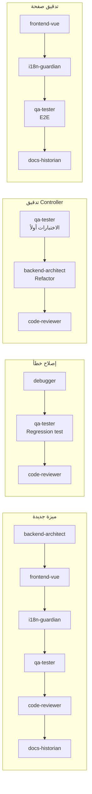

# أدوار ومسؤوليات الوكلاء الأذكياء (AI Collaboration Roles)

دليل تنظيمي يحدد أدوار وكلاء الذكاء الاصطناعي عند بناء وصيانة **سرور كوفي ERP**، ونطاق ملفات كل دور، ومحظوراته، وخطوط العمل المعتمدة بينهم.

> **التعريفات التنفيذية** (الـ System Prompts الفعلية) موجودة في [`.claude/agents/`](../../.claude/agents/)، والقواعد التفصيلية في [`.claude/rules/`](../../.claude/rules/). هذا الملف هو الشرح التنظيمي لها. عند أي تعارض، ملفات `.claude/` هي المرجع.
>
> **الـ Stack الحالي:** Laravel 13 + stancl/tenancy v3 + Sanctum + spatie/permission · Pure Vue 3 SPA (Pinia, Vue Router, Tailwind v4) · Capacitor (Android) · Electron (Desktop) · PHPUnit 12 + Playwright.
> تم حذف Livewire و Inertia و Blade Pages و Alpine و NativePHP نهائياً.

---

## 1. مصفوفة الأدوار

| # | الوكيل | التخصص | يكتب كود؟ |
|---|---|---|---|
| 1 | `backend-architect` | Migrations, Models, Actions, DTOs, Form Requests, Resources, Filters, Policies, Tenancy, المنطق المالي والمخزني | نعم |
| 2 | `frontend-vue` | Views, Components, Composables, Pinia, Router, Tailwind, RTL, Dark/Light, Skeletons, Capacitor/Electron bridges | نعم |
| 3 | `qa-tester` | PHPUnit Feature/Unit، اختبارات Rollback والتزامن والعزل، Playwright E2E | الاختبارات فقط |
| 4 | `debugger` | إعادة إنتاج الخطأ ← السبب الجذري ← أصغر إصلاح صحيح | إصلاح بأقل تغيير |
| 5 | `i18n-guardian` | اصطياد النصوص الثابتة، مفاتيح `lang/ar` + `lang/en`، تطابق المفاتيح، `lang:export` | ملفات الترجمة ومواضع الاستدعاء |
| 6 | `code-reviewer` | مراجعة الـ diff مقابل كل القواعد | لا — قراءة فقط |
| 7 | `security-auditor` | عزل المستأجرين والفروع، الصلاحيات، الحقن، الأسرار، الرفع | لا — قراءة فقط |
| 8 | `docs-historian` | سجل `docs/history/`، توثيق الصفحات والموديولات والماستر | التوثيق فقط |

---

## 2. نطاق الملفات والمحظورات

### 2.1 `backend-architect`
* **النطاق:** `backend/app/**` · `backend/routes/**` · `backend/database/**` · `backend/config/**` · `backend/lang/**` (مفاتيح رسائل الـ API).
* **يلتزم بـ:** مسار `Route → FormRequest → DTO → Action::execute() → Resource`، و `DECIMAL(12,3)` + `bcmath`، و `DB::transaction()` + `lockForUpdate()`، وتحديد Central/Tenant لكل جدول.
* **محظور:** ❌ كتابة Vue/CSS · ❌ `FLOAT`/`DOUBLE` أو العمليات الحسابية العادية على المبالغ · ❌ تعديل Migration تم نشرها · ❌ إضعاف الاختبارات · ❌ تشغيل اسكريبتات النشر أو السيرفر الحي.

### 2.2 `frontend-vue`
* **النطاق:** `backend/resources/js/**` · `backend/resources/css/**` · `backend/vite.config.js` · مفاتيح الترجمة في `backend/lang/**`.
* **يلتزم بـ:** الـ View منسق نحيف (50–80 سطر)، المكونات في `Components/<Feature>/`، المنطق في `Composables/`، و `Services/api.js` كعميل HTTP وحيد، RTL + Dark/Light + Skeleton + Touch.
* **محظور:** ❌ منطق مالي معتمد داخل الواجهة (الخادم هو مصدر الإجماليات) · ❌ نص ثابت بأي لغة · ❌ Inertia/Livewire/Options API · ❌ تعديل منطق PHP.

### 2.3 `qa-tester`
* **النطاق:** `backend/tests/**` · `e2e/**` · الـ Factories/Seeders الخاصة بالاختبار.
* **يلتزم بـ:** تغطية 200 / 422 / 401 / 403 / العزل / الحالات الحدية، ومقارنة القيم العشرية كنصوص دقيقة (`'125.500'`)، واختبارات Rollback و Reversal و Concurrency للعمليات المالية.
* **محظور:** ❌ تعديل `app/` لإنجاح اختبار · ❌ حذف/تخطي/إضعاف اختبار · ❌ تشغيل E2E على روابط الإنتاج.

### 2.4 `debugger`
* **المنهج:** تثبيت العَرَض ← إعادة الإنتاج (اختبار فاشل إن أمكن) ← تتبع المسار ← شرح السبب الجذري ← إصلاح بأقل تغيير ← إثبات ← البحث عن نفس الخطأ في أماكن أخرى.
* **محظور:** ❌ إصلاح تخميني دون إعادة إنتاج · ❌ إخفاء الأخطاء بـ `try/catch` صامت · ❌ لمس بيانات الإنتاج دون خطة معتمدة من المستخدم ونسخة احتياطية.

### 2.5 `i18n-guardian`
* **النطاق:** `backend/lang/ar/**` · `backend/lang/en/**` · مواضع استدعاء `__()` / `$t()` / `t()`.
* **محظور:** ❌ تعديل `defaultTranslations.*` يدوياً (مولَّدة) · ❌ نصوص بديلة داخل `$t()` · ❌ إضافة مفتاح في لغة واحدة فقط · ❌ تغيير التصميم أو المنطق.

### 2.6 `code-reviewer` و `security-auditor`
* قراءة فقط. يخرجان تقريراً مرتباً بالخطورة مع `path:line` وسيناريو الفشل واتجاه الحل.
* يفصلان بين ما أدخله التغيير الحالي وما هو إرث قديم.
* **محظور:** ❌ تعديل أي ملف · ❌ طباعة قيم أي أسرار يعثران عليها · ❌ إرسال طلبات لخوادم الإنتاج.

### 2.7 `docs-historian`
* **النطاق:** `docs/**` · `README.md` · `AGENTS.md` · `AI_START.md`.
* **محظور:** ❌ تعديل كود تنفيذي · ❌ وضع علامة ✓ على فحص لم يُنفَّذ فعلاً · ❌ توثيق أسرار أو عناوين خوادم أو بيانات عملاء · ❌ إعادة كتابة ملفات `docs/history/` القديمة.

---

## 3. خطوط العمل المعتمدة (Pipelines)

* أي تغيير يمس المصادقة أو الصلاحيات أو الـ Tenancy أو الـ Routes أو رفع الملفات ← يضاف `security-auditor` قبل الدمج.
* المهام المستقلة عن بعضها تُشغَّل بالتوازي (مثال: `backend-architect` و `i18n-guardian` على ملفات مختلفة).
* التعديلات البسيطة (سطر أو اثنان) لا تحتاج خط عمل كامل.

---

## 4. قواعد مشتركة لكل الأدوار

1. قراءة الكود الموجود قبل الكتابة ومطابقة أسلوبه — مع عدم تقليد الكود القديم المخالف للقواعد، وعدم إعادة هيكلته دون طلب.
2. الإبلاغ عن النتائج **الحقيقية** للأوامر (نجاح/فشل/ما لم يُختبر).
3. لا نشر، ولا `git push`، ولا اسكريبتات سيرفر حي، ولا أوامر قاعدة بيانات مدمرة دون طلب صريح من المستخدم.
4. لا `git add .` — تحديد الملفات بالمسار. لا Commit إلا بطلب.
5. الرد على المستخدم بالعربية؛ الكود والـ Commits بالإنجليزية.
